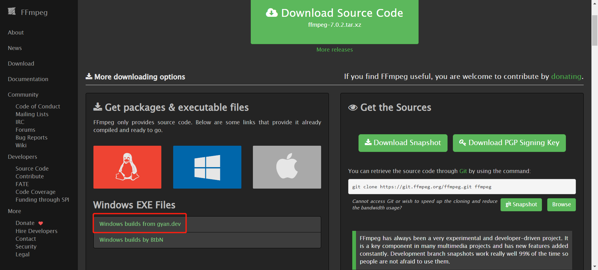
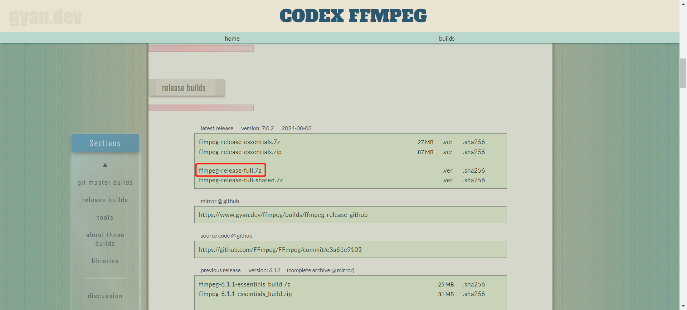
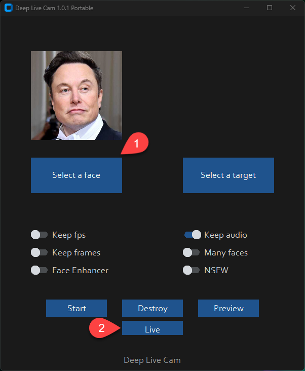

# 快速开始
## 1. 安装软件
### Python 3.10
最好使用 conda 虚拟环境。

### FFMEPG

一个开源多媒体处理工具包，处理视频、音频等。

[官网](https://ffmpeg.org/download.html)





下载后解压，将`bin`目录添加到环境变量`path`。

验证安装：`ffmpeg -version`。

### visual studio 2022 runtimes
[官网](https://visualstudio.microsoft.com/visual-cpp-build-tools/)

下载 C++ 相关工具即可。

## 2. 克隆仓库
```bash
git clone https://github.com/hacksider/Deep-Live-Cam.git
```

## 3. 下载模型
下载如下两个模型到 `models` 文件夹下。

[GFPGANv1.4](https://huggingface.co/hacksider/deep-live-cam/resolve/main/GFPGANv1.4.pth)

[inswapper_128_fp16.onnx](https://huggingface.co/hacksider/deep-live-cam/resolve/main/inswapper_128_fp16.onnx)

## 4. 安装依赖
```shell
pip install -r requirements.txt
```

## 5. GPU Cuda 加速
**1. 安装 Cuda**

深度学习笔记中有。

**2. 安装依赖**

```shell
pip uninstall onnxruntime onnxruntime-gpu
pip install onnxruntime-gpu==1.16.3
```

**3. 运行**
```shell
python run.py --execution-provider cuda

```

## 6. 使用及注意事项


图片名称不能为中文。


