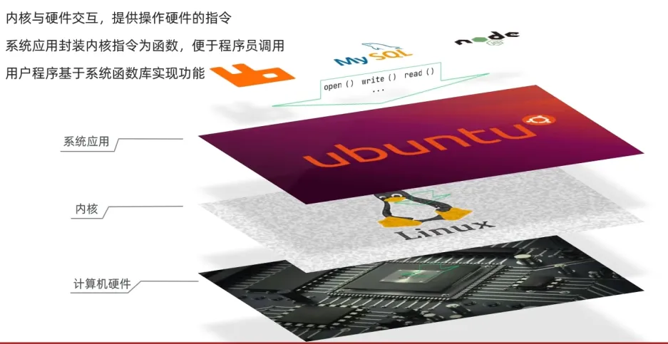
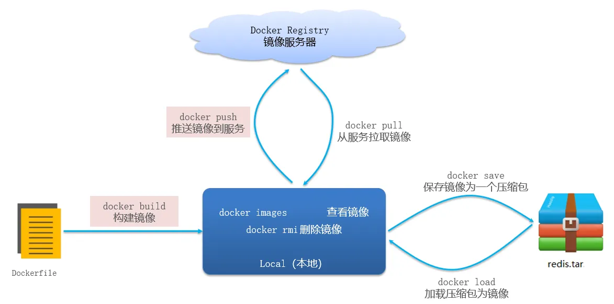
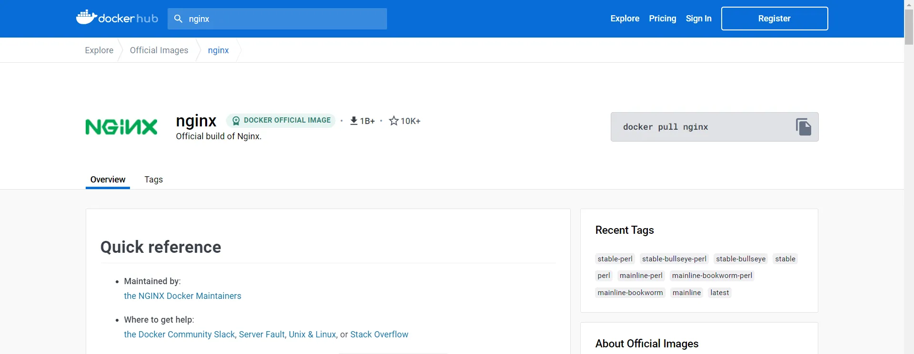
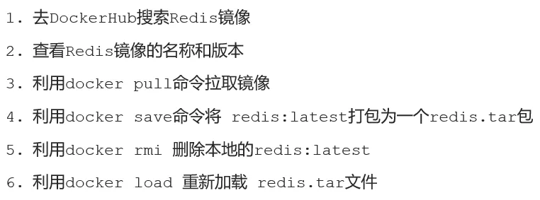
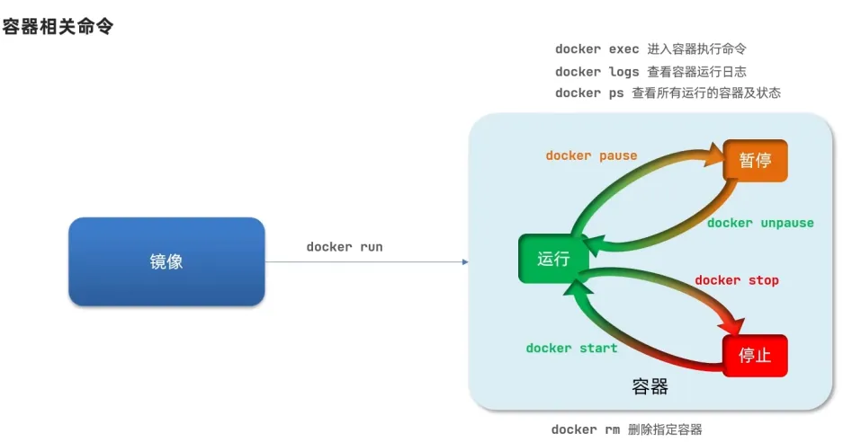
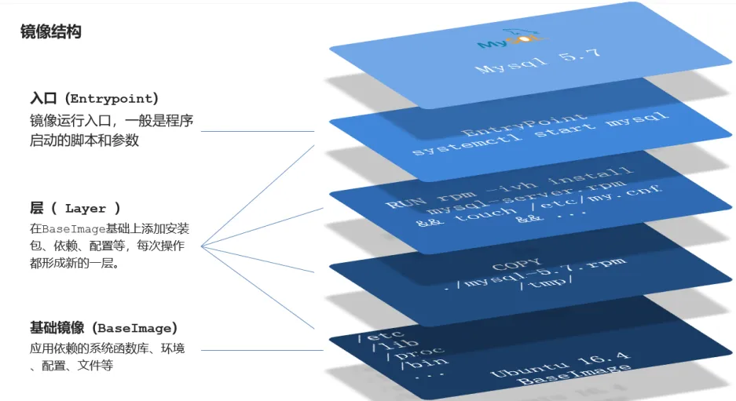

# Docker

## 1、Docker 介绍

大型项目组件较多，运行环境也较为复杂，部署时会碰到一些问题：

- 依赖关系复杂，容易出现兼容性问题
- 开发、测试、生产环境有差异

Docker 如何解决依赖的兼容问题的？

- 将应用的Libs（函数库）、Deps（依赖）、配置与应用一起打包
- 将每个应用放到一个隔离容器去运行，避免互相干扰

操作系统结构：

Docker是一个快速交付应用、运行应用的技术：

1. 可以将程序及其依赖、运行环境一起打包为一个镜像，可以迁移到任意 Linux 操作系统
2. 运行时利用沙箱机制形成隔离容器，各个应用互不干扰
3. 启动、移除都可以通过一行命令完成，方便快捷

## 2、Docker 与虚拟机

Docker 和虚拟机的差异：

1. docker 是一个系统进程，虚拟机是在操作系统中的操作系统；
2. docker 体积小、启动速度快、性能好，虚拟机体积大、启动速度慢、性能一般。

## 3、镜像和容器

镜像（Image）：Docker 将应用程序及其所需的依赖、函数库、环境、配置等文件打包在一起，称为镜像。
容器（Container）：镜像中的应用程序运行后形成的进程就是容器，只是 Docker 会给容器做隔离，对外不可见。
DockerHub：DockerHub 是一个 Docker 镜像的托管平台。这样的平台称为 Docker Registry。国内也有类似于 DockerHub 的公开服务，比如网易云镜像服务、阿里云镜像库等。
Docker 是一个 CS 架构的程序，由两部分组成：

- 服务端(server)：Docker 守护进程，负责处理 Docker 指令，管理镜像、容器等；
- 客户端(client)：通过命令或 RestAPI 向 Docker 服务端发送指令。可以在本地或远程向服务端发送。

## 4、安装 Docker

安装步骤

1. 卸载旧版本

```bash
yum remove docker \
                  docker-client \
                  docker-client-latest \
                  docker-common \
                  docker-latest \
                  docker-latest-logrotate \
                  docker-logrotate \
                  docker-selinux \
                  docker-engine-selinux \
                  docker-engine \
                  docker-ce
```

2. 安装 Docker

安装 yum 工具：

```bash
yum install -y yum-utils \
           device-mapper-persistent-data \
           lvm2 --skip-broken
```

更新本地镜像源：

```bash
yum-config-manager \
    --add-repo \
    https://mirrors.aliyun.com/docker-ce/linux/centos/docker-ce.repo
    
sed -i 's/download.docker.com/mirrors.aliyun.com\/docker-ce/g' /etc/yum.repos.d/docker-ce.repo

yum makecache fast
```

安装 Docker：

```bash
yum install -y docker-ce
```

3. 启动 Docker

Docker 应用需要用到各种端口，逐一去修改防火墙设置。这里直接关闭防火墙。

```bash
# 关闭
systemctl stop firewalld
# 禁止开机启动防火墙
systemctl disable firewalld
```

启动 Docker：

```bash
systemctl start docker  # 启动docker服务

systemctl stop docker  # 停止docker服务

systemctl restart docker  # 重启docker服务
```

查看 Docker 版本：

```bash
docker -v
```

4. 配置镜像加速

参考阿里云的镜像加速文档：
[阿里云登录 - 欢迎登录阿里云，安全稳定的云计算服务平台](https://cr.console.aliyun.com/cn-hangzhou/instances/mirrors)

## 5、Docker 基本操作

### (1) 镜像相关命令

镜像名称一般分两部分组成：`[repository]:[tag]`。在没有指定 tag 时，默认是 latest，代表最新版本的镜像。

获取帮助：

```bash
--help
```

#### 实际案例1：从 DockerHub 拉取一个 nginx 镜像并查看

1. 去镜像仓库查找镜像：[https://hub.docker.com/](https://hub.docker.com/)



2. 拉取镜像

```bash
docker pull nginx
```

3. 查看镜像

```bash
docker images
```

#### 实际案例2：将 nginx 镜像压缩为文件，再解压为镜像

1. 将镜像压缩为`.tar`文件

```bash
docker save -o nginx.tar nginx
```

2. 解压为镜像

```bash
docker load -i nginx.tar
```

#### 实际案例3：拉取一个 redis 镜像，执行上述操作



### (2) 容器相关命令



#### 实际案例1：创建运行一个 nginx 容器

```bash
docker run --name containerName -p 80:80 -d nginx
```

命令解读：

- `docker run`：创建并运行一个容器；
- `--name`：给容器起一个名字；
- `-p`：将宿主机端口与容器端口映射，冒号左侧是宿主机端口，右侧是容器端口；
- `-d`：后台运行容器；
- `nginx`：镜像名称，例如 nginx。

#### 实际案例2：进入Nginx容器，修改HTML文件内容，添加“传智教育欢迎您”

1. 进入容器

```bash
docker exec -it containerName bash
```

命令解读：

- `docker exec`：进入容器内部，执行一个命令；
- `-it`：给当前进入的容器创建一个标准输入、输出终端，允许我们与容器交互；
- `containerName`：要进入的容器的名称；
- `bash`：进入容器后执行的命令，bash 是一个 linux 终端交互命令。

2. 进入 nginx 的 HTML 所在目录`/usr/share/nginx/html`

```bash
cd /usr/share/nginx/html
```

3. 修改`index.html`的内容

不推荐修改容器内的文件内容。

#### 实际案例3：创建 redis 容器

1. 搜索并拉取 redis 镜像
2. 创建容器

```bash
docker run --name some-redis -p 6380:6379  -d redis redis-server --save 60 1 --loglevel warning
```

### (3) 数据卷命令

数据卷(volume)是一个虚拟目录，指向宿主机文件系统中的某个目录。
数据卷的作用：将容器与数据分离，解耦合，方便操作容器内数据，保证数据安全。
数据卷操作的基本语法如下：

```bash
docker volume [command]
```

`docker volume`命令是数据卷操作，根据命令后跟随的`command`来确定下一步的操作：

- `create`创建一个 volume
- `inspect`显示一个或多个 volume 的信息
- `ls`列出所有的 volume
- `prune`删除未使用的 volume
- `rm`删除一个或多个指定的 volume

运行容器时使用`-v`参数挂载数据卷。
`-v  volumeName: /targetContainerPath`

#### 实际案例1：创建并运行一个 MySQL 容器，将宿主机目录直接挂载到容器

提示：目录挂载与数据卷挂载的语法是类似的

- `-v [宿主机目录]:[容器内目录]`
- `-v [宿主机文件]:[容器内文件]`

```bash
docker run \
--name mysqlCon \
-e MYSQL_ROOT_PASSWORD=991118 \
-v /usr/local/mysql/conf/hmy.cnf:/etc/mysql/mysql.conf.d/hmy.cnf \
-v /usr/local/mysql/data:/var/lib/mysql \
-p 3306:3306 \
-d \
mysql:5.7.25 \
```

## 5、Dockfile 自定义镜像

### (1) 镜像结构



```bash
docker build -t javaweb:1.0
```

### (2) 镜像构建

Dockerfile 就是一个文本文件，其中包含一个个的指令(Instruction)，用指令来说明要执行什么操作来构建镜像。每一个指令都会形成一层 Layer。
常见指令如下：

Dockerfile 的第一行必须是`FROM`，从一个基础镜像来构建。基础镜像可以是基本操作系统，如 Ubuntu。也可以是其他人制作好的镜像。

## 6、DockCompose

### (1) DockCompose 作用

Docker Compose 可以基于 Compose 文件帮我们快速的部署分布式应用，而无需手动一个个创建和运行容器！
Compose 文件是一个文本文件，通过指令定义集群中的每个容器如何运行。

## 7、Docker 镜像仓库

镜像仓库（ Docker Registry）有公共的和私有的两种形式：
公共仓库：例如Docker官方的 Docker Hub，国内也有一些云服务商提供类似于 Docker Hub 的公开服务，比如[网易云镜像服务](https://c.163.com/hub)、[DaoCloud](https://hub.daocloud.io/)[镜像服务](https://hub.daocloud.io/)、[阿里云镜像服务](https://cr.console.aliyun.com/)等。
除了使用公开仓库外，用户还可以在本地搭建私有 Docker Registry。企业自己的镜像最好是采用私有 Docker Registry 来实现。
