# 一、布局

## 1、Flex 布局

### (1) 相关概念

Flexible Box 模型，通常被称为 flexbox，是一种一维的布局模型。
flexbox 有两根轴：主轴和交叉轴。主轴由`flex-direction`定义，另一根轴垂直于它。

#### 主轴与交叉轴

主轴由`flex-direction`指定。`flex-direction`可取 4 个值：

- `row`
- `row-reverse`

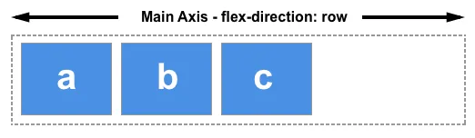

- `column`
- `column-reverse`

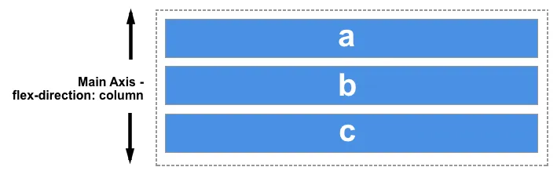

交叉轴垂直于主轴。

### (2) 创建 flex 容器

文档中采用了 flexbox 的区域就叫做 flex 容器。通过`display: flex`创建 flex 容器。完成这一步之后，容器中的**直系子元素**就会变为 flex 元素。所有 CSS 属性都会有一个初始值，所以 flex 容器中的所有 flex 元素都会有下列行为：

- 元素排列为一行 (`flex-direction`属性的初始值是`row`)。
- 元素从主轴的起始线开始。
- 元素不会在主维度方向拉伸，但是可以缩小。
- 元素被拉伸来填充交叉轴大小。
- `flex-basis`属性为`auto`，即元素大小尺寸。
- `flex-wrap`属性为`nowrap`，即不换行。

### (3) 使用`flex-wrap`换行

给属性`flex-wrap`添加一个属性值`wrap`实现多行效果。现在，如果您的项目太大而无法全部显示在一行中，则会换行显示。若将其设置为`nowrap`，这也是初始值，它们将会缩小以适应容器，因为它们使用的是允许缩小的初始 Flexbox 值。如果项目的子元素无法缩小，使用`nowrap`会导致溢出，或者缩小程度还不够小。
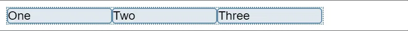
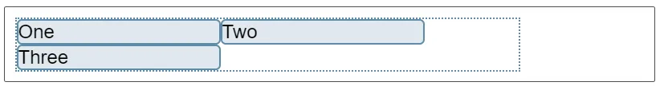
简写属性`flex-flow`=`flex-direction`, `flex-wrap`

```css
.box {
  display: flex;
  flex-flow: row wrap;
}
```

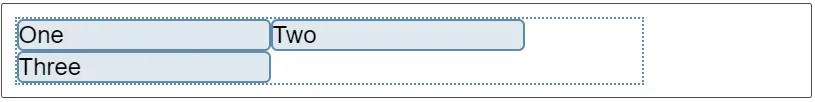

### (4) flex 元素大小控制

flex 元素的大小控制

- `flex-grow`
- `flex-shrink`
- `flex-basis`

这几个 flex 属性的作用其实就是改变了 flex 容器中的可用空间(available space)的行为。
`flex-basis`定义了该元素的空间大小（the size of that item in terms of the space），flex 容器里除了元素所占的空间以外的富余空间就是可用空间。该属性的默认值是`auto`。此时，浏览器会检测这个元素是否具有确定的尺寸。在上面的例子中，所有元素都设定了宽度为 100px，所以`flex-basis`的值为 100px。如果没有给元素设定尺寸，`flex-basis`的值采用元素内容的尺寸。这就解释了：我们给只要给 flex 元素的父元素声明`display: flex`，所有子元素就会排成一行，且自动分配小大以充分展示元素的内容。
`flex-grow`若被赋值为一个正整数，flex 元素会以`flex-basis`为基础，沿主轴方向增长尺寸。这会使该元素延展，并占据此方向轴上的可用空间。如果有其他元素也被允许延展，那么他们会各自占据可用空间的一部分。如果我们给上例中的所有元素设定`flex-grow`值为 1，容器中的可用空间会被这些元素平分。它们会延展以填满容器主轴方向上的空间。`flex-grow`属性可以按比例分配空间。如果第一个元素 `flex-grow`值为 2，其他元素值为 1，则第一个元素将占有 2/4（上例中，即为 200px 中的 100px）, 另外两个元素各占有 1/4（各 50px）。
`flex-grow`属性是处理 flex 元素在主轴上增加空间的问题，相反`flex-shrink`属性是处理 flex 元素收缩的问题。如果我们的容器中没有足够排列 flex 元素的空间，那么可以把 flex 元素`flex-shrink`属性设置为正整数来缩小它所占空间到`flex-basis`以下。与`flex-grow`属性一样，可以赋予不同的值来控制 flex 元素收缩的程度 —— 给`flex-shrink`属性赋予更大的数值可以比赋予小数值的同级元素收缩程度更大。
在计算 flex 元素收缩的大小时，它的最小尺寸也会被考虑进去，就是说实际上`flex-shrink`属性可能会和`flex-grow`属性表现的不一致。
flex 属性简写：`flex-grow`, `flex-shrink`, `flex-basis`
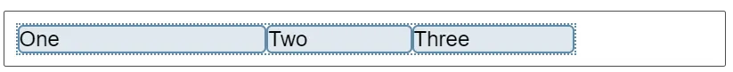

```css
.box {
  display: flex;
}

.one {
  flex: 2 1 auto;
}

.two {
  flex: 1 1 auto;
}

.three {
  flex: 1 1 auto;
}
```

预定义值

- `flex: initial`
- `flex: auto`
- `flex: none`
- `flex: <positive-number>`

`flex: initial`是把 flex 元素重置为 Flexbox 的初始值，它相当于`flex: 0 1 auto`。在这里`flex-grow`的值为 0，所以 flex 元素不会超过它们`flex-basis`的尺寸。`flex-shrink`的值为 1, 所以可以缩小 flex 元素来防止它们溢出。`flex-basis`的值为`auto`。Flex 元素尺寸可以是在主维度上设置的，也可以是根据内容自动得到的。
`flex: auto`等同于`flex: 1 1 auto`；和上面的`flex:initial`基本相同，但是这种情况下，flex 元素在需要的时候既可以拉伸也可以收缩。
`flex: none`可以把 flex 元素设置为不可伸缩。它和设置为`flex: 0 0 auto`是一样的。元素既不能拉伸或者收缩，但是元素会按具有`flex-basis: auto`属性的 flexbox 进行布局。
你在教程中常看到的`flex: 1`或者`flex: 2`等等。它相当于`flex: 1 1 0`或者`flex: 2 1 0`。元素可以在`flex-basis 为 0`的基础上伸缩。
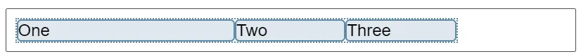

```css
.box {
  display: flex;
}

.one {
  flex: 2;
}

.two {
  flex: 1;
}

.three {
  flex: 1;
}
```

### (5) 元素间的对齐和空间分配

#### 交叉轴对齐`align-items`

`align-items`属性可以使元素在交叉轴方向对齐。
这个属性的初始值为`stretch`，因此 flex 元素会默认被拉伸到最高元素的高度。

- `stretch`
- `flex-start`
- `flex-end`
- `center`

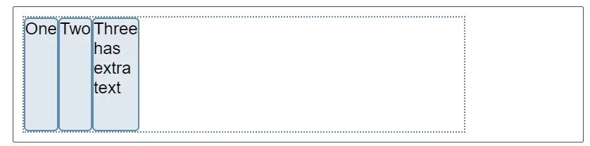
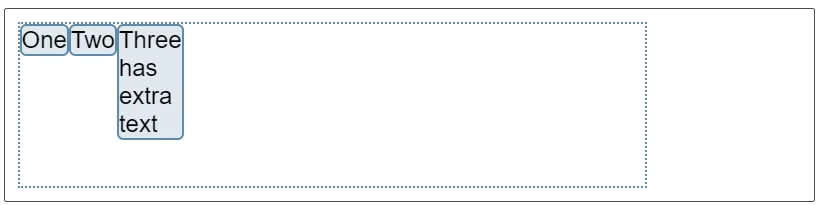
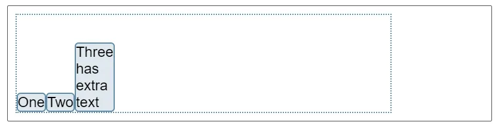
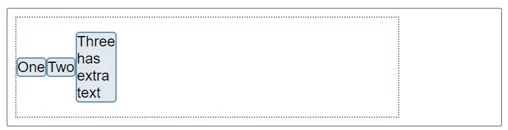

#### 主轴对齐`justify-content`

`justify-content`属性用来使元素在主轴方向上对齐

- `stretch`
- `flex-start`
- `flex-end`
- `center`
- `space-around`
- `space-between`

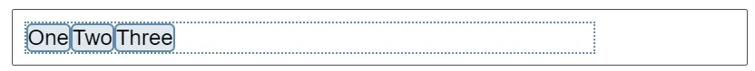
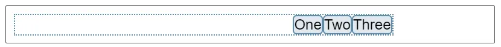
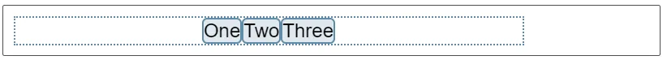
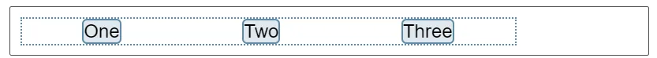
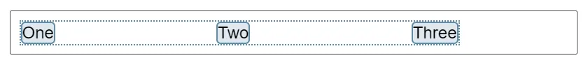

## 2、Grid 布局

[CSS Grid 网格布局教程 - 阮一峰的网络日志](https://www.ruanyifeng.com/blog/2019/03/grid-layout-tutorial.html)

