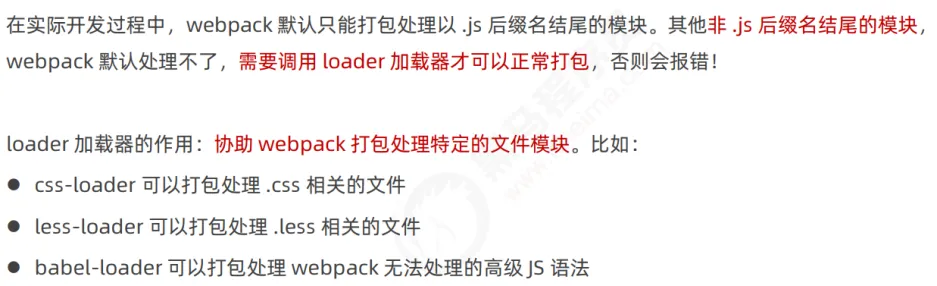

# 一、前端工程化与 webpack

## 1、前端工程化

**前端工程化特征**


**前端工程化**


**前端工程化解决方案：**


## 2、webpack 基本使用

### (1) webpack 介绍


### (2) 列表隔行变色项目

1. 新建空白项目，在文件夹中启用命令终端，输入命令：`npm init -y`，这样在项目中就初始化了包管理配置文件 `package.json`。
2. 新建 `src`源代码目录，并创建 `index.html`和 `index.js`文件

```html
<!DOCTYPE html>
<html lang="en">
<head>
    <meta charset="UTF-8">
    <title>Title</title>
</head>
<body>
    <ul>
        <li>这是第1个li</li>
        <li>这是第2个li</li>
        <li>这是第3个li</li>
        <li>这是第4个li</li>
        <li>这是第5个li</li>
        <li>这是第6个li</li>
        <li>这是第7个li</li>
        <li>这是第8个li</li>
        <li>这是第9个li</li>
        <li>这是第10个li</li>
    </ul>
</body>
</html>
```

3. 运行 `npm install jquery -S`，安装 jquery

> -S 等同于 --save，表示将包安置到 dependencies 下，开发与上线时的依赖。
> 

4. 在项目中安装 webpack

运行  `npm install webpack@5.42.1 webpack-cli@4.7.2 -D`

> -D 等同于 --save-dev，将包安置到 devDependencies 下，开发时的依赖。
> 

5. 配置 webpack

在项目根目录中，创建名为 `webpack.config.js` 的 webpack 配置文件，并初始化如下的基本配置：

```javascript
module.exports = {
  // 指定构建模式
  mode: "development"
}
```

在`package.json`的 scripts 节点下，新增 dev 脚本如下：

```javascript
"scripts": {
  "dev": "webpack"
}
```

在终端中运行 `npm run dev` 命令，启动 webpack 进行项目的打包构建。

> 如果成功，将显示如下信息：
> 

6. 引入 `main.js`

在 `index.html`中引入 `main.js` 取代引入 `index.js`

```html
<script src="../dist/main.js"></script>
```

## 3、webpack 相关配置

### (1) 可选模式

在 `webpack.config.js`中可以配置构建模式，有两种选择：

- `development`：开发模式，生成的 `main.js`不会进行压缩。
- `production`：生产模式，生成的 `main.js`会进行压缩。

### (2) `webpack.config.js`的作用

运行 webpack 之前，会首先读取 `webpack.config.js`中的配置。

### (3) webpack 默认约定


### (4) 自定义打包的入口与出口

```javascript
// 导入 node.js 中专门操作路径的模块
const path = require('path')

module.exports = {
  // 打包的入口，指定要处理的文件
  // __dirname 表示当前文件所在路径
  entry: path.join(__dirname, './src/index1.js'),
  // 打包的出口
  output: {
    // 存放的目录
    path: path.join(__dirname, 'dist'),
    // 生成的文件名
    filename: 'js/bundle.js'
  }
}
```

### (5) 打包完成后自动打开浏览器

在 `webpack.config.js`中，配置 `devServer`结点。

```javascript
devServer: {
    // 首次打包成功后，自动打开浏览器
    open: true,
    // 在 http 协议中，如果端口号是 80，则可以被省略
    port: 80,
    // 指定运行的主机地址
    host: '127.0.0.1'
}
```

## 4、webpack 插件

### (1) 插件的作用


### (2) `webpack-dev-server`

1. 安装

`npm install webpack-dev-server --save-dev`

2. 配置

修改 `package.json`-> `scripts`中的 `dev` 命令

```javascript
"scripts": {
  "dev": "webpack serve"
}
```

再次运行 `npm run dev`。

在浏览器中访问：http://localhost:8080。


停用服务：ctrl+c

> 出现问题：
> 访问 http://localhost:8080，出现 cannot get /
> 产生原因：
> 版本不兼容。
> 解决方案：
> 使用 ` npm install webpack-dev-server@3.11.2 -D`命令重新安装。


源代码中进行保存就会打包，因此 webpack-dev-server 插件生成的代码存放在内存中，无需频繁读写磁盘。生成代码访问路径在根目录而不是 dist 文件夹下。

### (3) html-webpack-plugin


**安装：**`npm install html-webpack-plugin@5.3.2 -D`
**配置**

```javascript
// 1. 导入 html-webpack-plugin 这个插件，得到插件的构造函数
const HtmlPlugin = require('html-webpack-plugin')
// 2. new 构造函数，创建插件的实例对象
const htmlPlugin = new HtmlPlugin({
  // 指定要复制哪个页面
  template: './src/index.html',
  // 指定复制出来的文件名和存放路径
  filename: './index.html'
})
module.exports = {
  // mode 代表 webpack 运行的模式，可选值有两个 development 和 production
  // 结论：开发时候一定要用 development，因为追求的是打包的速度，而不是体积；
  // 反过来，发布上线的时候一定能要用 production，因为上线追求的是体积小，而不是打包速度快！
  mode: 'development'
  // 3. 插件的数组，将来 webpack 在运行时，会加载并调用这些插件
  plugins: [htmlPlugin],
}
```

> 说明：
> 

## 5、webpack loader

### (1) webpack loader 概述



### (2) 打包处理 css 文件

在 `src/css`下新建 css 文件


在 `index1.js`中使用 ES6 语法引入 css 文件

```javascript
// 使用 ES6 导入 jquery
import $ from 'jquery'

import './css/index.css
```

**安装**
`npm i style-loader@3.0.0 css-loader@5.2.6 -D`
**配置**
在 `webpack.config.js`中，进行如下配置：

```javascript
module.exports = {
    // 所有第三方模块的匹配规则
    module: {
        rules: [
            // 定义了不同模块对应的 loader
            { test: /\.css$/, use: ['style-loader', 'css-loader'] },
        ]
    }
}
```

> 注：
> 

### (3) 打包处理 less 文件

新建 less 文件


在 `index1.js`中导入 less 文件

```javascript
import './css/index.less'
```

**安装**
`npm i less-loader@10.0.1 less@4.1.1 -D`
**配置**
在 `webpack.config.js`中配置

```javascript
module.exports = {
    // 所有第三方模块的匹配规则
    module: {
        rules: [
            // 处理 .less 文件的 loader
            { test: /\.less$/, use: ['style-loader', 'css-loader', 'less-loader'] },
        ]
    }
}
```

### (4)  打包处理样式表中与 url 路径相关的文件

图片的 base64 格式：


将图片转换为 base64 格式可以在一次请求中直接得到图片，对一些小图片这种方式较好。本节中的 loader 可以根据文件大小判断 src 属性使用引用还是 base64。

在 `index.html`添加图片

```javascript
<!DOCTYPE html>
<html lang="en">
<head>
    <meta charset="UTF-8">
    <title>Title</title>
    <script src="/js/bundle.js"></script>
</head>
<body>
    <ul>
        <li>这是第1个li</li>
        <li>这是第2个li</li>
        <li>这是第3个li</li>
        <li>这是第4个li</li>
        <li>这是第5个li</li>
        <li>这是第6个li</li>
        <li>这是第7个li</li>
        <li>这是第8个li</li>
        <li>这是第9个li</li>
        <li>这是第10个li</li>
    </ul>
    
</body>
</html>
```

在 `index1.js`中给 img 进行动态赋值

```javascript
// 导入图片
import logo from './images/logo.jpg'
// 给 img 标签的 src 动态赋值
$('.box').attr('src', logo)
```

**安装**
`npm i url-loader@4.1.1 file-loader@6.2.0 -D`
**配置**
在 `webpack.config.js`中进行配置

```javascript
module.exports = {
    // 所有第三方模块的匹配规则
    module: {
        rules: [
            // 处理图片文件的 loader
            // 如果需要调用的 loader 只有一个，则只传递一个字符串也行，如果有多个loader，则必须指定数组
            // 在配置 url-loader 的时候，多个参数之间，使用 & 符号进行分隔
            { test: /\.jpg|png|gif$/, use: 'url-loader?limit=470&outputPath=images' },
        ]
    }
}
```

### (5) 打包处理 js 文件中的高级语法

**安装**
`npm i babel-loader@8.2.2 @babel/core@7.14.6 @babel/plugin-proposal-decorators@7.14.5 -D`
**配置**
在 `webpack.config.js`中，设置规则

```javascript
module.exports = {
  module: {
    rules: [
      // 使用 babel-loader 处理高级的 JS 语法
      // 在配置 babel-loader 的时候，程序员只需要把自己的代码进行转换即可；一定要排除 node_modules 目录中的 JS 文件
      // 因为第三方包中的 JS 兼容性，不需要程序员关心
      { test: /\.js$/, use: 'babel-loader', exclude: /node_modules/ }
    ]
  }
}
```

在项目根目录下，创建名为 `babel.config.js`的配置文件

```javascript
module.exports = {
  // 声明 babel 可用的插件
  // 将来，webpack 在调用 babel-loader 的时候，会先加载 plugins 插件来使用
  plugins: [['@babel/plugin-proposal-decorators', { legacy: true }]]
}
```

## 6、打包发布


**新增打包脚本**
在 `package.json`的 `scripts`节点下，新增 build 命令：

```javascript
  "scripts": {
    "dev": "webpack serve",
    "build": "webpack --mode production"
  }
```

> `--mode production`可以覆盖 `webpack.config.js`中的 `mode: development`。

**将 JavaScript 文件统一放到 js 目录下**
在 `webpack.config.js`的 `output`节点下，进行如下配置：

```javascript
    output: {
        // 存放的目录
        path: path.join(__dirname, 'dist'),
        // 生成的文件名
        filename: 'js/bundle.js'
    }
```

**将图片统一放到 image 目录下**
在 `webpack.config.js`中进行如下配置：

```javascript
    // 所有第三方模块的匹配规则
    module: {
        rules: [
            // 定义了不同模块对应的 loader
            { test: /\.css$/, use: ['style-loader', 'css-loader'] },
            // 处理 .less 文件的 loader
            { test: /\.less$/, use: ['style-loader', 'css-loader', 'less-loader'] },
            // 处理图片文件的 loader
            // 如果需要调用的 loader 只有一个，则只传递一个字符串也行，如果有多个loader，则必须指定数组
            // 在配置 url-loader 的时候，多个参数之间，使用 & 符号进行分隔
            { test: /\.jpg|png|gif$/, use: 'url-loader?limit=470&outputPath=images' },
        ]
    }
```

**自动清理 dist 目录下的旧文件**
安装 `clean-webpack-plugin`
`npm install --save-dev clean-webpack-plugin`
在 `webpack.config.js`中进行如下配置：

```javascript
// 导入 clean-webpack-plugin 所需模块
const { CleanWebpackPlugin } = require('clean-webpack-plugin');

module.exports = {
    plugins: [htmlPlugin, new CleanWebpackPlugin()],
}
```

## 7、Source Map

### (1) Source Map 简介

应用背景：生成代码出错的位置和源代码出错的位置不是一一对应的。


### (2) 开发环境

开发环境下默认 Source Map 的问题：记录生成后代码的位置，导致报错代码行数和源代码行数不一致。
解决方案：
在 `webpack.config.js`中，进行如下设置

```javascript
module.exports = {
    // 在开发调试阶段，建议大家都把 devtool 的值设置为 eval-source-map
    // devtool: 'eval-source-map',
    
    // 指定构建模式
    mode: "development"
}
```

### (3) 生产环境


生产环境下，只指出源代码中报错位置，不暴露源码：

```javascript
module.exports = {
  // 在实际发布的时候，建议大家把 devtool 的值设置为 nosources-source-map 或直接关闭 SourceMap
  devtool: 'nosources-source-map'
}
```


### (4) 最佳实践


```javascript
module.exports = {
  // 在开发调试阶段，建议大家都把 devtool 的值设置为 eval-source-map
  devtool: 'eval-source-map',
  // 在实际发布的时候，建议大家把 devtool 的值设置为 nosources-source-map 或直接关闭 SourceMap
  devtool: 'nosources-source-map'
}
```

## 8、webpack 尾声


### (1) 拓展一：`**@**`**表示 src 目录**

在 `webpack.config.js`中进行配置：

```javascript
// 使用 Node.js 中的导出语法，向外导出一个 webpack 的配置对象
module.exports = {
  // 在开发调试阶段，建议大家都把 devtool 的值设置为 eval-source-map
  // devtool: 'eval-source-map',
  // 在实际发布的时候，建议大家把 devtool 的值设置为 nosources-source-map 或直接关闭 SourceMap
  devtool: 'nosources-source-map',
  // mode 代表 webpack 运行的模式，可选值有两个 development 和 production
  // 结论：开发时候一定要用 development，因为追求的是打包的速度，而不是体积；
  // 反过来，发布上线的时候一定能要用 production，因为上线追求的是体积小，而不是打包速度快！
  mode: 'development',
  // entry: '指定要处理哪个文件'
  entry: path.join(__dirname, './src/index1.js'),
  // 指定生成的文件要存放到哪里
  output: {
    // 存放的目录
    path: path.join(__dirname, 'dist'),
    // 生成的文件名
    filename: 'js/bundle.js'
  },
  // 3. 插件的数组，将来 webpack 在运行时，会加载并调用这些插件
  plugins: [htmlPlugin, new CleanWebpackPlugin()],
  devServer: {
    // 首次打包成功后，自动打开浏览器
    open: true,
    // 在 http 协议中，如果端口号是 80，则可以被省略
    port: 80,
    // 指定运行的主机地址
    host: '127.0.0.1'
  },
  module: {
    rules: [
      // 定义了不同模块对应的 loader
      { test: /\.css$/, use: ['style-loader', 'css-loader'] },
      // 处理 .less 文件的 loader
      { test: /\.less$/, use: ['style-loader', 'css-loader', 'less-loader'] },
      // 处理图片文件的 loader
      // 如果需要调用的 loader 只有一个，则只传递一个字符串也行，如果有多个loader，则必须指定数组
      // 在配置 url-loader 的时候，多个参数之间，使用 & 符号进行分隔
      { test: /\.jpg|png|gif$/, use: 'url-loader?limit=470&outputPath=images' },
      // 使用 babel-loader 处理高级的 JS 语法
      // 在配置 babel-loader 的时候，程序员只需要把自己的代码进行转换即可；一定要排除 node_modules 目录中的 JS 文件
      // 因为第三方包中的 JS 兼容性，不需要程序员关心
      { test: /\.js$/, use: 'babel-loader', exclude: /node_modules/ }
    ]
  },
  resolve: {
    alias: {
      // 告诉 webpack，程序员写的代码中，@ 符号表示 src 这一层目录
      '@': path.join(__dirname, './src/')
    }
  }
}
```

```javascript
// import msg from '../../msg'
import msg from '@/msg.js'

// 建议大家使用 @ 表示 src 源代码目录，从外往里查找；不要使用 ../ 从里往外查找
//     @/msg.js
```

### (2) 拓展二：在谷歌浏览器安装 vue-devtools 工具

[https://www.bilibili.com/video/BV1zq4y1p7gap=31&spm_id_from=pageDriver&vd_source=7a10078ee6a4ade802edf9f0f1e7ce20](https://www.bilibili.com/video/BV1zq4y1p7ga?p=31&spm_id_from=pageDriver&vd_source=7a10078ee6a4ade802edf9f0f1e7ce20)
