# 十、Vue3

## 1、Vue3 优势

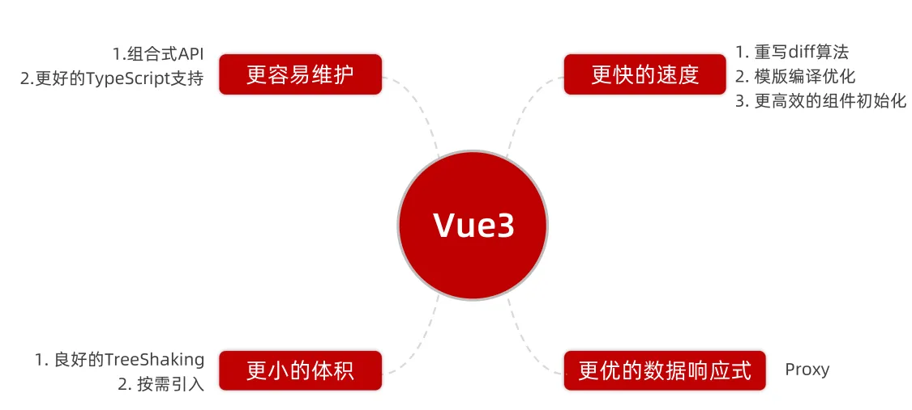

### (1) 组合式 API 与选项式 API

选项式 API：功能分布在各个选项中。

组合式 API：将同功能的内容进行集合式管理。

可以提供更方便的复用：
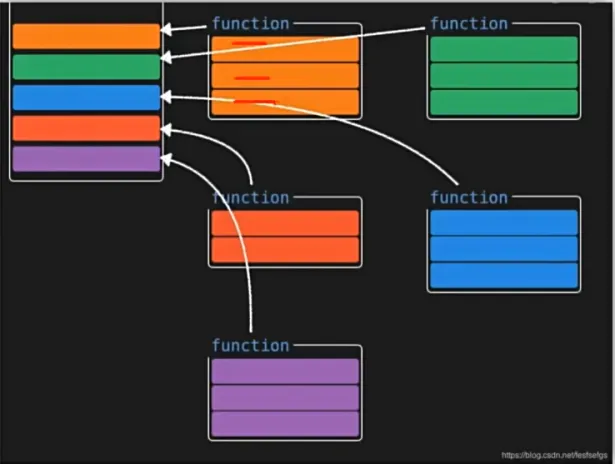

## 2、create-vue 搭建 vue3 项目


`vue-cli`底层采用`webpack`进行项目构建，`create-vue`底层采用`vite`进行项目构建。

### (1) 创建步骤

前置条件：`node`版本 16 以上 。`node -v`。
使用`npm init vue@latest`命令，会自动下载`create-vue`并创建项目。
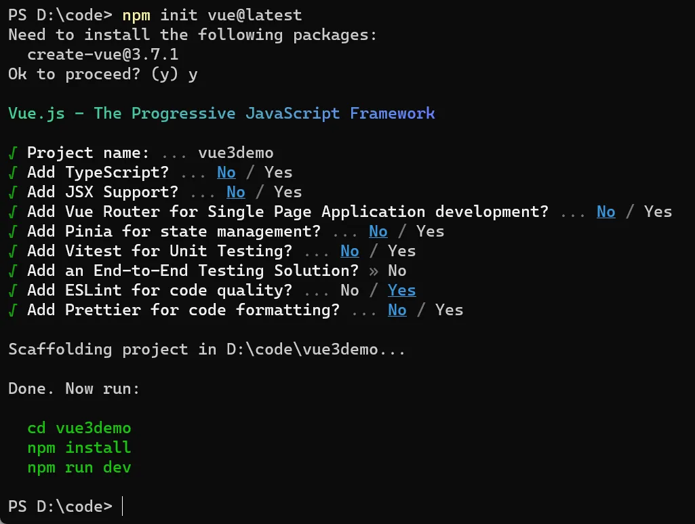
运行下述三个脚本，浏览器中出现如下界面：
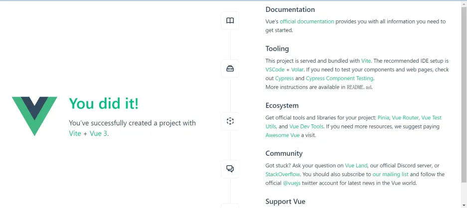
`Vite`使创建项目和启动项目速度加快。

### (2) 目录结构

创建项目的目录结构如下：

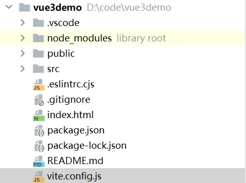

关键文件变化：

1. `vite.config.js`：项目的配置文件，基于`Vite`配置。

支持使用`@`表示`src`目录。

```vue
    alias: {
      '@': fileURLToPath(new URL('./src', import.meta.url))
    }
```

2. `package.json`：项目包文件。

可运行脚本使用了`vite`，vue 使用 3.x。

```json
{
  "name": "vue3demo",
  "version": "0.0.0",
  "private": true,
  "scripts": {
    "dev": "vite",
    "build": "vite build",
    "preview": "vite preview",
    "lint": "eslint . --ext .vue,.js,.jsx,.cjs,.mjs --fix --ignore-path .gitignore"
  },
  "dependencies": {
    "vue": "^3.3.4"
  },
  "devDependencies": {
    "@vitejs/plugin-vue": "^4.2.3",
    "eslint": "^8.39.0",
    "eslint-plugin-vue": "^9.11.0",
    "vite": "^4.3.9"
  }
}
```

3. `src/main.js`：入口文件。

```vue
import './assets/main.css'

import { createApp } from 'vue'
import App from './App.vue'

createApp(App).mount('#app')
```

在 vue3 中对实例的创建进行了规范化，例如`createApp()`、`createRouter()`和`createStore()`，保证实例创建的独立性。

> VS Code 中，vue2 使用的插件为 Vetur；vue3 使用的插件为 Volar。

4. `src/App.vue`：根组件

变化如下：

- `script`和`template`位置调换
- `template`不再要求唯一根元素
- `script`添加`setup`使用组合式 API

```vue
<!--加上 setup 允许在脚本中直接使用组合式 API-->
<script setup>
// 自定义组件直接导入使用即可
import HelloWorld from './components/HelloWorld.vue'
import TheWelcome from './components/TheWelcome.vue'
</script>

<template>
  <header>
    

    <div class="wrapper">
      <HelloWorld msg="You did it!" />
    </div>
  </header>

  <main>
    <TheWelcome />
  </main>
</template>

<style scoped>
header {
  line-height: 1.5;
}

.logo {
  display: block;
  margin: 0 auto 2rem;
}

@media (min-width: 1024px) {
  header {
    display: flex;
    place-items: center;
    padding-right: calc(var(--section-gap) / 2);
  }

  .logo {
    margin: 0 2rem 0 0;
  }

  header .wrapper {
    display: flex;
    place-items: flex-start;
    flex-wrap: wrap;
  }
}
</style>

```

## 3、组合式 API-`setup`选项

`setup`写法：

```vue
<script>
export default {
  setup() {
    console.log('setup 函数执行！')
  },
  beforeCreate() {
    console.log('beforeCreate 函数执行！')
  }
}
</script>

```

**注意**

1. `setup()`函数的执行时机在`beforeCreate()`之前。因此`setup()`函数中无法使用`this`指代 vue 实例。
2. `setup()`函数中`return`的函数与数据才能在`template`中使用，如下所示：

```vue
<script>
export default {
  setup() {
    const message = 'MotherFucker'

    const printMsg = (msg) => {
      console.log(msg)
    }

    return {
      message,
      printMsg
    }
  },
  beforeCreate() {
    console.log('beforeCreate 函数执行！')
  }
}
</script>
<template>
  <div>{{ message }}</div>
  <button @click="printMsg('哈哈')">打印</button>
</template>


```
所有数据和函数都`return`太麻烦，使用如下语法糖：


```vue
<script setup>
const message = 'Hello vue'
const printMsg = (msg) => {
  console.log(msg)
}
</script>
<template>
  <div>{{ message }}</div>
  <button @click="printMsg('哈哈')">打印</button>
</template>
```

**知识链接：`var`、`let`和`const`**
在 JavaScript 中，`const`、`let`和`var`是用于声明变量的关键字，它们有以下区别：

1. `var`: 是 ES5 及之前版本中声明变量的关键字。`var`声明的变量具有**函数作用域**，即变量**在声明所在的函数内部有效**。如果在函数内部使用的变量没有使用`var`声明，则该变量成为全局变量，具有全局作用域。

```vue
function example() {
  // x 具有函数作用域
  var x = 10;
  if (true) {
    // y 具有函数作用域，在 if 块外部也可以访问
    var y = 20;
    console.log(x); // 输出: 10
  }
  console.log(y); // 输出: 20
}
example();
console.log(x); // 报错，x 不在全局作用域内

```


2. `**let**`: 是 ES6 引入的**块级作用域**的变量声明关键字。使用`let`声明的变量具有块级作用域，即**变量在声明所在的块**（通常是由花括号包围的代码块）内有效。使用案例如下：

```vue
function example() {
  let x = 10;
  if (true) {
    let y = 20;
    console.log(x); // 输出: 10
  }
  console.log(y); // 报错，y 不在块级作用域内
}
example();
console.log(x); // 报错，x 不在全局作用域内

```


3. `const`: 也是 ES6 引入的关键字，用于声明常量。使用`const`声明的变量必须进行初始化，并且不能再被重新赋值。它也具有块级作用域。

```vue
function example() {
  const x = 10;
  if (true) {
    const y = 20;
    console.log(x); // 输出: 10
  }
  console.log(y); // 报错，y 不在块级作用域内
}
example();
console.log(x); // 报错，x 不在全局作用域内

const PI = 3.14;
PI = 3.14159; // 报错，常量不能被重新赋值

```

总结起来，`var`具有函数作用域、`let`具有块级作用域，并且可以重新赋值，而`const`也具有块级作用域，但声明的常量不能被重新赋值。建议在 ES6 及更高版本中尽可能使用`let`和`const`，避免使用`var`，因为它的作用域规则相对较为复杂。

## 4、组合式 API-`reactive`和`ref`函数

### (1) `reactive`

作用：接受对象，创建响应式对象。
使用步骤：

1. 导入`reactive`
2. 接收对象(复杂类型数据)，创建响应式对象

使用案例：

```vue
<script setup>
import { reactive } from "vue"
const state = reactive({
  count: 100
})
const add = () => {
  state.count++
}
</script>
<template>
  <div>{{ state.count }}</div>
  <button @click="add">+1</button>
</template>

```

### (2) `ref`

作用：接收简单类型或复杂类型，返回响应式对象。
使用步骤：

1. 导入`ref`
2. `ref()`接收简单或复杂类型，使用变量接收返回值

使用案例：

```vue
<script setup>
import { ref } from 'vue'
let count = ref(0)
console.log(count.value)
</script>
<template>
  <div>{{ count }}</div>
</template>
```

注意：

1. 在脚本中访问`ref()`对象的值，使用`对象.value`的方式；在`template`中，直接使用`对象`即可。

总结：创建响应式对象，统一使用`ref`即可。

## 5、组合式 API-`computed`

### (1) 使用步骤

1. 导入`computed()`
2. 语法：

```vue
const 计算属性 = computed(() => {
  return 计算结果
})
```

### (2) 使用案例

```vue
<script setup>
// 声明数据
import {computed, ref} from 'vue';

const list = ref([1, 2, 3, 4, 5, 6, 7, 8])

// 基于 list 派生计算属性
const computedList = computed(() => {
  return list.value.filter(item => item > 2)
})
// 或写成如下形式：
const computedList = computed(() => list.value.filter(item => item > 2))
</script>
<template>
  <div>原始数据：{{ list }}</div>
  <div>计算后的数据：{{ computedList }}</div>
</template>
```

最佳实践：

1. 计算属性中不应出现"副作用"，只进行计算，不要进行其他操作
2. 避免直接修改计算属性的值，计算属性的值应该根据其依赖的数据变化

## 6、组合式 API-`watch`

### (1) 使用步骤

1. 导入
2. 使用语法：

```vue
// 简单写法
// 监测单值
watch(监测值, (newValue, oldValue) => {
  
})
// 监测多值
watch([监测值1, 监测值2], ([新监测值1, 新监测值2], [旧监测值1, 旧监测值2]) => {
    
})
```

监测单值变化：

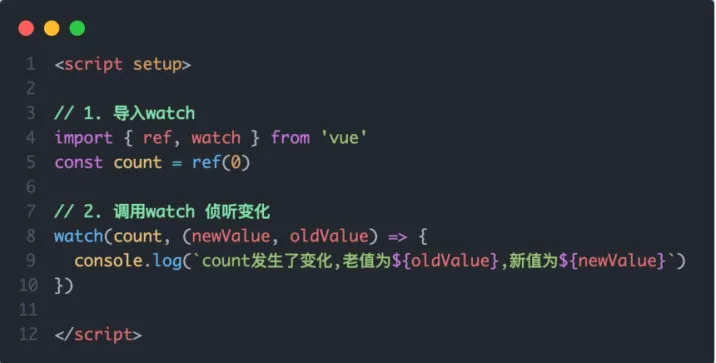

监测多值变化：

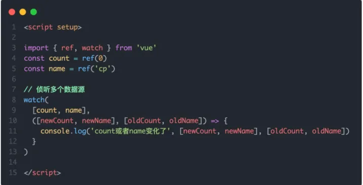

### (2) 使用案例

```vue
<script setup>
import { ref, watch } from 'vue';

// 侦听的数据：响应式
const nickName = ref('张三')
const changeName = () => {
  nickName.value = '李四'
}
// 侦听器
watch(nickName, (newValue, oldValue) => {
  console.log('名字改变：' + oldValue + '=>' + newValue)
})
</script>
<template>
  <div>{{ nickName }}</div>
  <button @click="changeName">改变名字</button>
</template>

```

### (3) `immediate`和`deep`

向第三个参数传入对象，包含`immediate: true`和`deep: true`

```vue
watch(nickName, (newValue, oldValue) => {
  console.log('名字改变：' + oldValue + '=>' + newValue)
}, {
  // 页面渲染好触发一次
  immediate: true,
  // 深度侦听，侦听对象内部属性变化
  deep: true
})
```

深度侦听对象的某一属性：
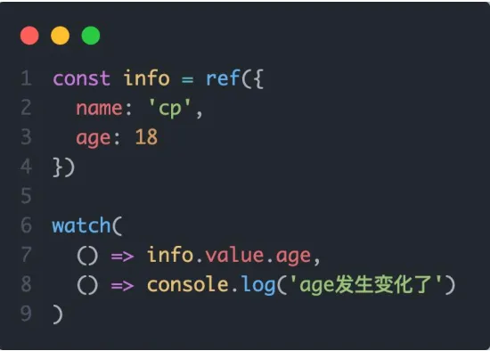

```vue
watch(() => ref复杂对象.value.属性, (newValue, oldValue) => {
}, {
  immediate: true,
  deep: true
})
```

注：`watch`侦听的对象必须为响应式对象。

## 7、组合式 API-生命周期函数

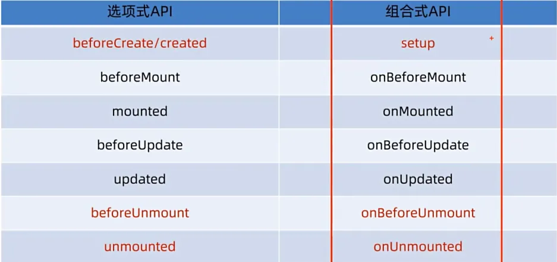

注意：

1. 原本`beforeCreated`和`created`中的逻辑放到`setup`中写，即调用接口返回数据都放到`<script setup>`中开放的代码中。

使用案例：

```vue
<script setup>
// 获取用户信息
import {onMounted} from "vue";

const getUserInfo = () => {
  setTimeout(() => {
    console.log('数据获取成功！')
  }, 200)
}
getUserInfo()

onMounted(() => {
  console.log('mounted!')
})
</script>
<template>

</template>

```

## 8、组合式 API-父子通信

### (1) 父->子

**基本步骤**

1. 子组件中定义`props`
2. 父组件在使用子组件时向`props`属性传值

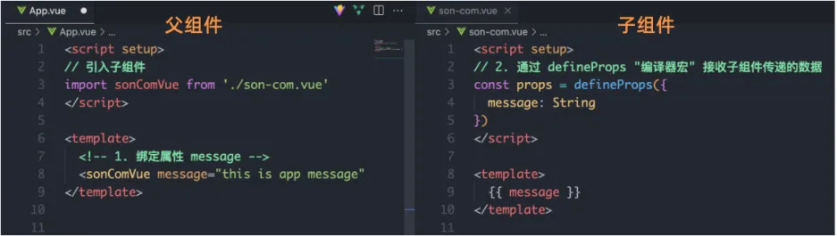
使用案例：

```vue
<script setup>
// 局部使用导入使用即可
import SonCom from '@/components/son-com.vue'
</script>
<template>
  <SonCom car="哈哈"></SonCom>
</template>

```

```vue
<script setup>
const props = defineProps({
  car: String
})
console.log(props.car)
</script>

<template>
  <div>{{ car }}</div>
</template>

<style scoped>

</style>
```

### (2) 子->父

**基本步骤**

1. 子组件在需要传值时，触发自定义事件
2. 父组件定义自定义事件发生时的处理函数

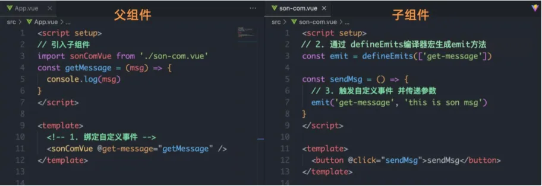

**使用案例**

```vue
<script setup>
const props = defineProps({
  car: String
})
console.log(props.car)
const emit = defineEmits(['get-message'])

const sendMsg = () => {
  emit('get-message', 'message from son')
}
</script>

<template>
  <div>{{ car }}</div>
  <button @click="sendMsg">向父组件发送消息</button>
</template>

<style scoped>

</style>
```

## 9、组合式 API-模板引用

### (1) 模板引用

在`setup`中无法使用`this.$ref.xxx`来引用组件实例或 DOM 对象，使用如下方式引用：

1. 生成响应式对象容器：调用`ref()`方法生成一个`ref`对象
2. 标签绑定：通过`ref`标识绑定`ref`对象到标签

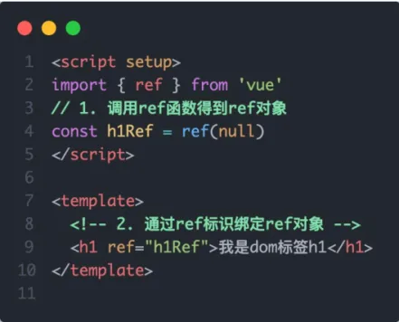

使用案例：

```vue
<script setup>
import { ref } from 'vue';

// 输入框
const input = ref(null)
// 按钮
const btn = ref(null)
// 输入框聚焦方法
const inputFocus = () => {
  input.value.focus()
}
</script>
<template>
  <input ref="input">
  <button ref="btn" @click="inputFocus">点击让输入框聚焦</button>
</template>

```

### (2) `defineExpose()`

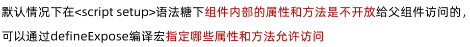
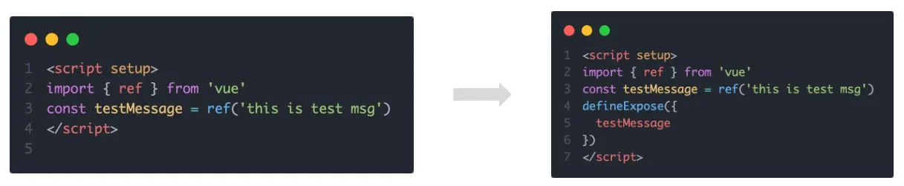


## 10、组合式 API-provide/inject

作用：顶层组件向任意底层组件传递数据和方法，实现**跨层组件通信**。
使用方法：

1. 顶层组件通过`provide`提供数据：`provice('key', 顶层组件中的数据)`
2. 底层组件通过`inject`获取数据：`const data = inject('key')`

使用案例：

```vue
<script setup>
import CenterCom from '@/components/center-com.vue'
import {provide, ref} from "vue";
// 顶层组件向底部组件发送数据
// 1. 传递普通数据
provide('hello', 'message from top')
// 2. 传递响应式数据
const count = ref(0)
provide('hehe', count)
// 3. 传递函数
provide('changeCount', (newCount) => {
  count.value = newCount
})

</script>
<template>
  <h1>我是顶层组件</h1>
  <center-com></center-com>
</template>


```

```vue
<script setup>
// 接收顶部组件传递的数据
import {inject} from "vue";

// 接收普通数据
const msg = inject('hello')
// 接收响应式数据
const count = inject('hehe')
// 接收函数，通常不会直接改动顶层组件的响应式数据，而是使用顶层组件传递的函数修改
const changeFn = inject('changeCount')
const changeCount = () => {
  changeFn(1000)
}
</script>
<template>
  <h2>我是中间组件 -- {{ msg }}</h2>
  <h2>响应式数据 -- {{ count }}</h2>
  <button @click="changeCount">改变 Count</button>
</template>

```

`provide/inject`可以传输响应式数据，并且所有组件共同维护这一份响应式数据。但响应式数据的修改会放到创建其的组件中，其余组件对其进行修改使用接口，不要直接改变。

## 11、vue 3.3 新特性-`defineOptions`

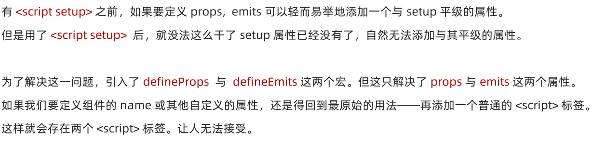
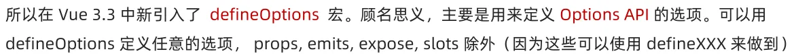
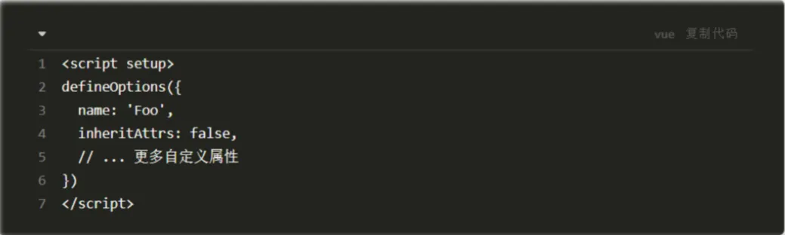
