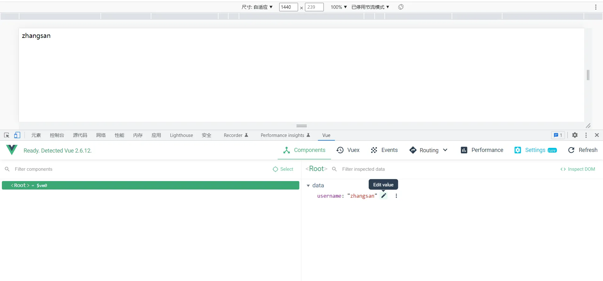
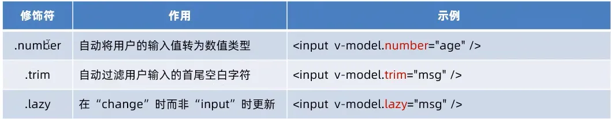

# 二、Vue 基础1

### 1、 Vue 简介

#### (1) Vue 特性

1. 数据驱动视图

数据的变化驱动视图的更新。


2. 双向数据绑定


#### (2) MVVM

MVVM(Model、View、ViewModel) 实现 **数据驱动视图 **和 **双向数据绑定 **的核心原理。


## 2、基本使用

### (1) 初体验案例


```vue
<!DOCTYPE html>
<html lang="en">
<head>
    <meta charset="UTF-8">
    <title>Title</title>
</head>
<body>
    <!--Vue 要操纵的 Dom 元素-->
    <div id="app">{{ username }}</div>

    <!--导入 Vue 库文件-->
    <script src="./lib/vue-2.6.12.js"></script>

    <script>
        const vm = new Vue({
            el: '#app',
            data: {
                username: 'zhangsan'
            }
        })
    </script>
</body>
</html>
```

### (2) MVVM


## 3、Vue 调试工具



## 4、Vue 语法

### (1) 指令


#### 1. 内容渲染指令 `v-text`、`{{}}`、`v-html`

辅助渲染 DOM 元素的文本内容。常用的内容渲染指令有三：

- v-text：完全的内容替换。
- {{}}：插值表达式，在指定地点进行内容替换。
- v-html：可以将绑定的文本当做 html 标签渲染。

```html
<!DOCTYPE html>
<html lang="en">
<head>
    <meta charset="UTF-8">
    <title>Title</title>
</head>
<body>
    <!--Vue 要操纵的 Dom 元素-->
    <div id="app">
        <p v-text="username"></p>
<!--        <p v-text="gender"></p>-->
        <p>性别：{{ gender }}</p>
    </div>

    <!--导入 Vue 库文件-->
    <script src="./lib/vue-2.6.12.js"></script>

    <script>
        const vm = new Vue({
            el: '#app',
            data: {
                username: 'zhangsan',
                gender: '男'
            }
        })
    </script>
</body>
</html>
```

#### 2. 属性绑定指令 `v-bind/:`

给 DOM 元素的属性绑定值。
直接在元素的属性前加 `:`即可。

```html
<!DOCTYPE html>
<html lang="en">
<head>
    <meta charset="UTF-8">
    <title>Title</title>
</head>
<body>
<!--Vue 要操纵的 Dom 元素-->
<div id="app">
    <input type="text" :placeholder="tips">
</div>

<!--导入 Vue 库文件-->
<script src="./lib/vue-2.6.12.js"></script>

<script>
    const vm = new Vue({
        el: '#app',
        data: {
            tips: '请输入姓名'
        }
    })
</script>
</body>
</html>
```

> 注：内容渲染指令 `{{}}`和 属性绑定指令内可以使用 js 表达式。

```html
<div>1 + 2 的结果是：{{ 1 + 2 }}</div>
<div>{{ tips }} 反转的结果是：{{ tips.split('').reverse().join('') }}</div>
<div :title="'box' + index">这是一个 div</div>
```

#### 3. 事件绑定指令 `v-on/@`


1. Vue 页面中 `this`等同于 `Vue`对象。
2. `v-on:`可以使用 `@`替换。

```html
<!DOCTYPE html>
<html lang="en" xmlns:v-on="http://www.w3.org/1999/xhtml">
<head>
    <meta charset="UTF-8">
    <title>Title</title>
</head>
<body>
  <!--Vue 要操纵的 Dom 元素-->
  <div id="app">
      <h3>当前 count 值：{{ count }}</h3>
      <hr>
      <button @click="add">加一</button>
  </div>
  
  <!--导入 Vue 库文件-->
  <script src="./lib/vue-2.6.12.js"></script>
  
  <script>
      const vm = new Vue({
          el: '#app',
          data: {
              count: 0
          },
          methods: {
              add() {
                  // console.log("ok");
                  this.count += 1;
              }
          }
      })
  </script>
</body>
</html>
```


1. 如果在绑定事件时没有传参，而在定义方法时有参数，这个参数是事件对象。
2. 可以在绑定时传入参数 `$event`

```html
<!DOCTYPE html>
<html lang="en" xmlns:v-on="http://www.w3.org/1999/xhtml">
<head>
  <meta charset="UTF-8">
  <title>Title</title>
</head>
<body>
<!--Vue 要操纵的 Dom 元素-->
<div id="app">
  <h3>当前 count 值：{{ count }}</h3>
  <hr>
  <button @click="add($event, 1)">加一</button>
</div>

<!--导入 Vue 库文件-->
<script src="./lib/vue-2.6.12.js"></script>

<script>
  const vm = new Vue({
    el: '#app',
    data: {
      count: 0
    },
    methods: {
      add(e, n) {
        // console.log("ok");
        this.count += n;
        console.log(e)
      }
    }
  })
</script>
</body>
</html>
```

可以使用事件修饰符在绑定事件同时修饰事件。


> 事件冒泡：
> 内外元素都绑定了同一事件，内元素事件触发后，外元素事件也会触发。

```html
<!DOCTYPE html>
<html lang="en">
<head>
    <meta charset="UTF-8">
    <title>Title</title>
</head>
<body>
    <!--Vue 要操纵的 Dom 元素-->
    <div id="app">
        <!--绑定单击事件并阻止默认行为-->
        <a href="http://www.baidu.com" @click.prevent="show">跳转</a>
    </div>

    <!--导入 Vue 库文件-->
    <script src="./lib/vue-2.6.12.js"></script>

    <script>
        const vm = new Vue({
            el: '#app',
            data: {

            },
            methods: {
                show() {
                    console.log("点击了超链接");
                }
            }
        })
    </script>
</body>
</html>
```

**按键修饰符**


```java
<!DOCTYPE html>
<html lang="en">
<head>
    <meta charset="UTF-8">
    <title>Title</title>
</head>
<body>
    <!--Vue 要操纵的 Dom 元素-->
    <div id="app">
        <input type="text" @keyup.esc="clearInput" @keyup.enter="submit">
    </div>

    <!--导入 Vue 库文件-->
    <script src="./lib/vue-2.6.12.js"></script>

    <script>
        const vm = new Vue({
            el: '#app',
            data: {
                username: 'zhangsan'
            },
            methods: {
                clearInput(e) {
                    console.log("按下了 ESC!");
                    e.target.value = '';
                },
                submit() {
                    alert("数据已提交！");
                }
            }
        })
    </script>
</body>
</html>
```

#### 4. 双向绑定指令 `v-model`


双向数据绑定：更改数据源，则表单中的数据会变化；更改表单，数据源中的数据也会变化。

数据驱动视图/单向数据绑定：更改数据源，视图跟着变化；更改视图中的数据，数据源不会跟着变化。

```java
<!DOCTYPE html>
<html lang="en">
<head>
    <meta charset="UTF-8">
    <title>Title</title>
</head>
<body>
<!--Vue 要操纵的 Dom 元素-->
<div id="app">
    <!--双向数据绑定-->
    <input type="text" v-model="username">
    <hr>
    <!--数据驱动视图-->
    <input type="text" :value="username">
</div>

<!--导入 Vue 库文件-->
<script src="./lib/vue-2.6.12.js"></script>

<script>
    const vm = new Vue({
        el: '#app',
        data: {
            username: 'zhangsan'
        }
    })
</script>
</body>
</html>
```

为方便对用户的输入内容进行处理，`v-model`也有修饰符。


```java
<!DOCTYPE html>
<html lang="en">
<head>
    <meta charset="UTF-8">
    <title>Title</title>
</head>
<body>
    <!--Vue 要操纵的 Dom 元素-->
    <div id="app">
        <input type="text" v-model.number="n1"> +
        <input type="text" v-model.number="n2"> =
        <span>{{ n1 + n2 }}</span>
        <hr>
        <input type="text" v-model.trim="username">
    </div>

<!--导入 Vue 库文件-->
<script src="./lib/vue-2.6.12.js"></script>

<script>
    const vm = new Vue({
        el: '#app',
        data: {
            n1: 1,
            n2: 2,
            username: ''
        }
    })
</script>
</body>
</html>
```

#### 5. 条件渲染指令 `v-if`和 `v-show`

按需控制 DOM 元素的显示与隐藏。

`v-show`与 `v-if`区别：

- `v-show`只是修改 `display:none`属性，如果要**频繁切换元素的显示与隐藏**，使用 `v-show`。
- `v-if`会直接增删 DOM 树，如果刚进入页面不需要展示某个元素，后续可能也不需要展示，使用 `v-if`更好。

`v-show`和 `v-if`属性值均可以直接添加布尔表达式。
实际开发中，直接使用 `v-if`就好。

`**v-if**`**配套指令**

```html
<!DOCTYPE html>
<html lang="en">
<head>
    <meta charset="UTF-8">
    <title>Title</title>
</head>
<body>
    <!--Vue 要操纵的 Dom 元素-->
    <div id="app">
        <div v-if="type == 'A'">优秀</div>
        <div v-else-if="type == 'B'">良好</div>
        <div v-else-if="type == 'C'">中等</div>
        <div v-else="type == 'D'">差</div>
    </div>

<!--导入 Vue 库文件-->
<script src="./lib/vue-2.6.12.js"></script>

<script>
    const vm = new Vue({
        el: '#app',
        data: {
            type: 'A'
        }
    })
</script>
</body>
</html>
```

#### 6. 列表渲染指令 `v-for`


需要循环生成什么 DOM 元素，就在什么元素上使用 `v-for`。

```html
<!DOCTYPE html>
<html lang="en">
<head>
    <meta charset="UTF-8">
    <title>Title</title>
    <link type="text/css" href="./lib/bootstrap.css">
</head>
<body>
    <!--Vue 要操纵的 Dom 元素-->
    <div id="app">
        <table class="table">
            <thead>
                <th>id</th>
                <th>name</th>
            </thead>
            <tbody>
                <tr v-for="item in list">
                    <td>{{ item.id }}</td>
                    <td>{{ item.name }}</td>
                </tr>
            </tbody>
        </table>
    </div>

<!--导入 Vue 库文件-->
<script src="./lib/vue-2.6.12.js"></script>

<script>
    const vm = new Vue({
        el: '#app',
        data: {
            list: [
                {
                    id: 1,
                    name: '宝骏'
                },
                {
                    id: 2,
                    name: '宝马'
                },
                {
                    id: 3,
                    name: '奔驰'
                }
            ]
        }
    })
</script>
</body>
</html>
```


```html
<tbody>
  <tr v-for="(item,index) in list">
    <td>{{ index }}</td>
    <td>{{ item.id }}</td>
    <td>{{ item.name }}</td>
  </tr>
</tbody>
```

使用 key 维护列表状态


### (2) 过滤器

在 Vue3 中已经砍掉。


> 注意点：
>
> 1. 过滤器一定要定义在 `filters`节点下，本质是一个函数
> 2. 过滤器要有返回值

```vue
<!DOCTYPE html>
<html lang="en">
<head>
    <meta charset="UTF-8">
    <title>Title</title>
</head>
<body>
    <!--Vue 要操纵的 Dom 元素-->
    <!--在差值表达式中调用过滤器-->
    <div id="app">{{ username | capitalize }}</div>

    <!--导入 Vue 库文件-->
    <script src="./lib/vue-2.6.12.js"></script>

    <script>
        const vm = new Vue({
            el: '#app',
            data: {
                username: 'zhangsan'
            },
            // 过滤器节点
            filters: {
                // 过滤器函数的参数是 "调用符|" 前面的参数
                capitalize(value) {
                    let firstCharacter = value.charAt(0).toUpperCase();
                    let other = value.slice(1);
                    return firstCharacter + other;
                }
            }
        })
    </script>
</body>
</html>
```

#### 1. 私有过滤器和全局过滤器


```vue
    // 使用 Vue.filter() 定义全局过滤器
    Vue.filter('capi', function (str) {
      const first = str.charAt(0).toUpperCase()
      const other = str.slice(1)
      return first + other + '~~~'
    })
```

```vue
<!DOCTYPE html>
<html lang="en">

<head>
  <meta charset="UTF-8">
  <meta http-equiv="X-UA-Compatible" content="IE=edge">
  <meta name="viewport" content="width=device-width, initial-scale=1.0">
  <title>Document</title>
</head>

<body>
  <div id="app">
    <p>message 的值是：{{ message | capi }}</p>
  </div>

  <div id="app2">
    <p>message 的值是：{{ message | capi }}</p>
  </div>

  <script src="./lib/vue-2.6.12.js"></script>
  <script>
    // 使用 Vue.filter() 定义全局过滤器
    Vue.filter('capi', function (str) {
      const first = str.charAt(0).toUpperCase()
      const other = str.slice(1)
      return first + other + '~~~'
    })

    const vm = new Vue({
      el: '#app',
      data: {
        message: 'hello vue.js'
      },
      // 过滤器函数，必须被定义到 filters 节点之下
      // 过滤器本质上是函数
      filters: {
        // 注意：过滤器函数形参中的 val，永远都是“管道符”前面的那个值
        capi(val) {
          // 字符串有 charAt 方法，这个方法接收索引值，表示从字符串中把索引对应的字符，获取出来
          // val.charAt(0)
          const first = val.charAt(0).toUpperCase()
          // 字符串的 slice 方法，可以截取字符串，从指定索引往后截取
          const other = val.slice(1)
          // 强调：过滤器中，一定要有一个返回值
          return first + other
        }
      }
    })

    // ----------------------------------

    const vm2 = new Vue({
      el: '#app2',
      data: {
        message: 'heima'
      }
    })
  </script>
</body>

</html>
```

**使用案例：利用 **`**dayjs**`**格式化时间**

```vue
<!DOCTYPE html>
<html lang="en">

<head>
  <meta charset="UTF-8">
  <meta http-equiv="X-UA-Compatible" content="IE=edge">
  <meta name="viewport" content="width=device-width, initial-scale=1.0">
  <title>品牌列表案例</title>
  <link rel="stylesheet" href="./lib/bootstrap.css">
  <link rel="stylesheet" href="./css/brandlist.css">
</head>

<body>

  <div id="app">
    <!-- 卡片区域 -->
    <div class="card">
      <div class="card-header">
        添加品牌
      </div>
      <div class="card-body">
        <!-- 添加品牌的表单区域 -->
        <!-- form 表单元素有 submit 事件 -->
        <form @submit.prevent="add">
          <div class="form-row align-items-center">
            <div class="col-auto">
              <div class="input-group mb-2">
                <div class="input-group-prepend">
                  <div class="input-group-text">品牌名称</div>
                </div>
                <input type="text" class="form-control" placeholder="请输入品牌名称" v-model.trim="brand">
              </div>
            </div>
            <div class="col-auto">
              <button type="submit" class="btn btn-primary mb-2">添加</button>
            </div>
          </div>
        </form>
      </div>
    </div>

    <!-- 表格区域 -->
    <table class="table table-bordered table-hover table-striped">
      <thead>
        <tr>
          <th scope="col">#</th>
          <th scope="col">品牌名称</th>
          <th scope="col">状态</th>
          <th scope="col">创建时间</th>
          <th scope="col">操作</th>
        </tr>
      </thead>
      <tbody>
        <tr v-for="item in list" :key="item.id">
          <td>{{ item.id }}</td>
          <td>{{ item.name }}</td>
          <td>
            <div class="custom-control custom-switch">
              <!-- 使用 v-model 实现双向数据绑定 -->
              <input type="checkbox" class="custom-control-input" :id="'cb' + item.id" v-model="item.status">
              <!-- 使用 v-if 结合 v-else 实现按需渲染 -->
              <label class="custom-control-label" :for="'cb' + item.id" v-if="item.status">已启用</label>
              <label class="custom-control-label" :for="'cb' + item.id" v-else>已禁用</label>
            </div>
          </td>
          <td>{{ item.time | dateFormat }}</td>
          <td>
            <a href="javascript:;" @click="remove(item.id)">删除</a>
          </td>
        </tr>
      </tbody>
    </table>
  </div>

  <!-- 只要导入了 dayjs 的库文件，在 window 全局，就可以使用 dayjs() 方法了 -->
  <script src="./lib/dayjs.min.js"></script>
  <script src="./lib/vue-2.6.12.js"></script>
  <script>
    // 声明格式化时间的全局过滤器
    Vue.filter('dateFormat', function (time) {
      // 1. 对 time 进行格式化处理，得到 YYYY-MM-DD HH:mm:ss
      // 2. 把 格式化的结果，return 出去

      // 直接调用 dayjs() 得到的是当前时间
      // dayjs(给定的日期时间) 得到指定的日期
      const dtStr = dayjs(time).format('YYYY-MM-DD HH:mm:ss')
      return dtStr
    })

    const vm = new Vue({
      el: '#app',
      data: {
        // 用户输入的品牌名称
        brand: '',
        // nextId 是下一个，可用的 id
        nextId: 4,
        // 品牌的列表数据
        list: [
          { id: 1, name: '宝马', status: true, time: new Date() },
          { id: 2, name: '奔驰', status: false, time: new Date() },
          { id: 3, name: '奥迪', status: true, time: new Date() },
        ],
      },
      methods: {
        // 点击链接，删除对应的品牌信息
        remove(id) {
          this.list = this.list.filter(item => item.id !== id)
        },
        // 阻止表单的默认提交行为之后，触发 add 方法
        add() {
          // 如果判断到 brand 的值为空字符串，则 return 出去
          if (this.brand === '') return alert('必须填写品牌名称！')

          // 如果没有被 return 出去，应该执行添加的逻辑
          // 1. 先把要添加的品牌对象，整理出来
          const obj = {
            id: this.nextId,
            name: this.brand,
            status: true,
            time: new Date()
          }
          // 2. 往 this.list 数组中 push 步骤 1 中得到的对象
          this.list.push(obj)
          // 3. 清空 this.brand；让 this.nextId 自增 +1
          this.brand = ''
          this.nextId++
        }
      },
    })
  </script>
</body>

</html>
```

#### 2. 连续调用多个过滤器


#### 3. 过滤器传参


