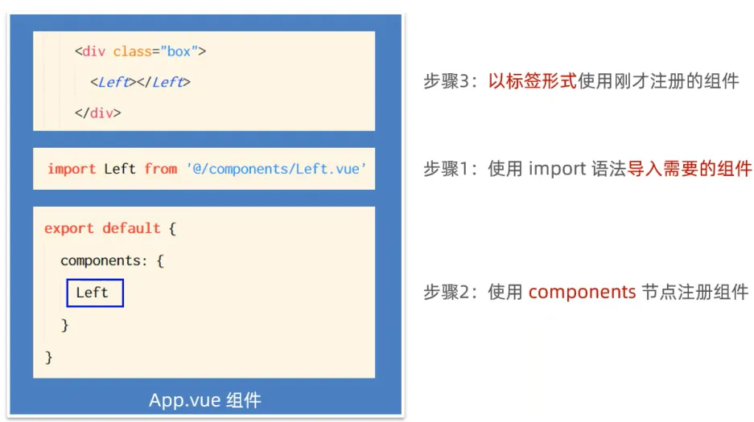

# 三、Vue 基础2

## 1、侦听器 watch

侦听**数据变化**，并在数据变化时进行相应操作。

### (1) 基本使用：方法格式侦听器

```vue
<!DOCTYPE html>
<html lang="en">
<head>
    <meta charset="UTF-8">
    <title>Title</title>
</head>
<body>
    <!--Vue 要操纵的 Dom 元素-->
    <div id="app">
        <input type="text" v-model="username">
    </div>

    <!--导入 Vue 库文件-->
    <script src="./lib/vue-2.6.12.js"></script>

    <script>
        const vm = new Vue({
            el: '#app',
            data: {
                username: 'zhangsan'
            },
            // 侦听器定义到 watch 节点下
            watch: {
                /**
                 * 监听 username 的变化
                 * @param newValue 变化后的值
                 * @param oldValue 变化前的值
                 */
                username(newValue, oldValue) {
                    console.log("username 值发生变化！");
                    console.log("旧值：" + oldValue + " 新值：" + newValue);
                }
            }
        })
    </script>
</body>
</html>
```

### (2) 使用案例：检测用户名是否可用


```vue
<!DOCTYPE html>
<html lang="en">
<head>
    <meta charset="UTF-8">
    <title>Title</title>
</head>
<body>
    <!--Vue 要操纵的 Dom 元素-->
    <div id="app">
        <input type="text" v-model="username">
        <span>{{ message }}</span>
    </div>

    <!--导入 Vue 库文件-->
    <script src="./lib/vue-2.6.12.js"></script>
    <script src="./lib/jquery-v3.6.0.js"></script>

    <script>
        const vm = new Vue({
            el: '#app',
            data: {
                username: '',
                message: ''
            },
            watch: {
                // 监听 username 的变化
                username(newValue) {
                    // 用户名为空不发送请求
                    if (newValue == '') {
                        return;
                    }
                    let that = this;
                    $.get('https://www.escook.cn/api/finduser/' + newValue, function (result) {
                        that.message = result.message;
                    })
                }
            }
        })
    </script>
</body>
</html>
```

### (3) `immediate`选项

使用对象格式监听器，添加 `immediate: true`选项，在页面加载完毕后，调用一次监听器。

```vue
<!DOCTYPE html>
<html lang="en">
<head>
    <meta charset="UTF-8">
    <title>Title</title>
</head>
<body>
    <!--Vue 要操纵的 Dom 元素-->
    <div id="app">
        <input type="text" v-model="username">
        <span>{{ message }}</span>
    </div>

    <!--导入 Vue 库文件-->
    <script src="./lib/vue-2.6.12.js"></script>
    <script src="./lib/jquery-v3.6.0.js"></script>

    <script>
        const vm = new Vue({
            el: '#app',
            data: {
                username: 'zhangsan',
                message: ''
            },
            watch: {
                username: {
                    // 监听到值变化时调用的函数
                    handler(newValue, oldValue) {
                        // 用户名为空不发送请求
                        if (newValue == '') {
                            return;
                        }
                        let that = this;
                        $.get('https://www.escook.cn/api/finduser/' + newValue, function (result) {
                            that.message = result.message;
                        })
                    },
                    // 页面初次渲染好，调用一次监听器
                    immediate: true
                }
            }
        })
    </script>
</body>
</html>
```

### (4) `deep`选项

使用对象格式的监听器，添加 `deep: true`选项后，可以侦听对象内部属性的变化。

```vue
<!DOCTYPE html>
<html lang="en">
<head>
    <meta charset="UTF-8">
    <title>Title</title>
</head>
<body>
<!--Vue 要操纵的 Dom 元素-->
<div id="app">
    <input type="text" v-model="info.username">
    <span>{{ message }}</span>
</div>

<!--导入 Vue 库文件-->
<script src="./lib/vue-2.6.12.js"></script>
<script src="./lib/jquery-v3.6.0.js"></script>

<script>
    const vm = new Vue({
        el: '#app',
        data: {
            info: {
                username: ''
            },
            message: ''
        },
        watch: {
            // 监听 username 的变化
            info: {
                handler(newValue) {
                    // 用户名为空不发送请求
                    if (newValue == '') {
                        return;
                    }
                    let that = this;
                    $.get('https://www.escook.cn/api/finduser/' + newValue, function (result) {
                        that.message = result.message;
                    })
                },
                // 监听对象内部属性的变化
                deep: true
            }
        }
    })
</script>
</body>
</html>
```

> 如果在 `handler()`方法中打印 `newValue`，结果如下：
> 

## 2、计算属性

计算属性是经**一系列计算**之后得到的**属性值**。

计算属性以**方法形式被定义**到 `computed`节点下，在使用时按照**属性的方式使用**。
**示例代码**

```vue
<!DOCTYPE html>
<html lang="en">

<head>
  <meta charset="UTF-8">
  <meta name="viewport" content="width=device-width, initial-scale=1.0">
  <meta http-equiv="X-UA-Compatible" content="ie=edge">
  <title>Document</title>
  <script src="./lib/vue-2.6.12.js"></script>
  <style>
    .box {
      width: 200px;
      height: 200px;
      border: 1px solid #ccc;
    }
  </style>
</head>

<body>
  <div id="app">
    <div>
      <span>R：</span>
      <input type="text" v-model.number="r">
    </div>
    <div>
      <span>G：</span>
      <input type="text" v-model.number="g">
    </div>
    <div>
      <span>B：</span>
      <input type="text" v-model.number="b">
    </div>
    <hr>

    <!-- 专门用户呈现颜色的 div 盒子 -->
    <!-- 在属性身上，: 代表  v-bind: 属性绑定 -->
    <!-- :style 代表动态绑定一个样式对象，它的值是一个 {  } 样式对象 -->
    <!-- 当前的样式对象中，只包含 backgroundColor 背景颜色 -->
    <div class="box" :style="{ backgroundColor: rgb }">
      {{ rgb }}
    </div>
    <button @click="show">按钮</button>
  </div>

  <script>
    // 创建 Vue 实例，得到 ViewModel
    var vm = new Vue({
      el: '#app',
      data: {
        // 红色
        r: 0,
        // 绿色
        g: 0,
        // 蓝色
        b: 0
      },
      methods: {
        // 点击按钮，在终端显示最新的颜色
        show() {
          console.log(this.rgb)
        }
      },
      computed: {
        rgb() {
          return `rgb(${this.r}, ${this.g}, ${this.b})`;
        }
      }
    });
  </script>
</body>

</html>
```

**计算属性的特点**


> 注：
>
> 1. `computed`中的计算属性不能和`data`中的属性同名；
> 2. 使用`computed`中的计算属性和使用`data`中的属性是一样的用法；
> 3. `computed`中计算属性内部的`this`依然指向的是Vue实例。

## 3、Axios

> axios 是一个专注于网络请求的库。

### (1) 基本使用

**发起 GET 请求**

```vue
<!DOCTYPE html>
<html lang="en">
<head>
    <meta charset="UTF-8">
    <title>Title</title>
</head>
<body>
    <script src="./lib/axios.js"></script>

    <script>
        // http://www.liulongbin.top:3006/api/getbooks

        // 调用 axois 方法的返回值是 Promise 对象
        const result = axios({
            method: 'GET',
            url: 'http://www.liulongbin.top:3006/api/getbooks',
            // url 传参，适用于 GET 请求
            params: {
                id: 1
            },
            // 适用于 POST 请求
            data: {}
        }).then(function (result) {
            console.log(result);
        })
    </script>
</body>
</html>
```

使用 axios 请求数据，会封装请求到的数据。

**发起 POST 请求**

```vue
<!DOCTYPE html>
<html lang="en">
<head>
    <meta charset="UTF-8">
    <title>Title</title>
</head>
<body>
    <script src="./lib/axios.js"></script>
    <script>
      axios({
        method: 'POST',
        url: 'http://www.liulongbin.top:3006/api/post',
        data: {
            name: 'zs',
            age: 20
        }
      }).then(function (result) {
          console.log(result);
      })
    </script>
</body>
</html>
```

以上代码可使用 `async+await`进行改造

```vue
<!DOCTYPE html>
<html lang="en">
<head>
    <meta charset="UTF-8">
    <title>Title</title>
</head>
<body>
    <button id="btnPost">发起POST请求</button>

    <script src="./lib/axios.js"></script>
    <script>
        document.querySelector('#btnPost').addEventListener('click', async function () {
            // 如果调用某个方法的返回值是 Promise 实例，则前面可以添加 await！
            // await 只能用在被 async “修饰”的方法中
            const { data } = await axios({
                method: 'POST',
                url: 'http://www.liulongbin.top:3006/api/post',
                data: {
                    name: 'zs',
                    age: 20
                }
            })

            console.log(data)
        })
    </script>
</body>
</html>
```

**解构赋值**

直接取出被封装的数据。

```vue
<!DOCTYPE html>
<html lang="en">
<head>
    <meta charset="UTF-8">
    <title>Title</title>
</head>
<body>
    <button id="btnPost">发起POST请求</button>
    <button id="btnGet">发起GET请求</button>

    <script src="./lib/axios.js"></script>
    <script>
        document.querySelector('#btnPost').addEventListener('click', async function () {
            // 如果调用某个方法的返回值是 Promise 实例，则前面可以添加 await！
            // await 只能用在被 async “修饰”的方法中
            // 在右侧得到的对象中只解构得到 data
            const { data } = await axios({
                method: 'POST',
                url: 'http://www.liulongbin.top:3006/api/post',
                data: {
                    name: 'zs',
                    age: 20
                }
            })

            console.log(data)
        })

        document.querySelector('#btnGet').addEventListener('click', async function () {
            // 解构赋值的时候，使用 : 进行重命名
            // 1. 调用 axios 之后，使用 async/await 进行简化
            // 2. 使用解构赋值，从 axios 封装的大对象中，把 data 属性解构出来
            // 3. 把解构出来的 data 属性，使用 冒号 进行重命名，一般都重命名为 { data: res }
            const { data: res } = await axios({
                method: 'GET',
                url: 'http://www.liulongbin.top:3006/api/getbooks'
            })

            console.log(res.data)
        })
    </script>
</body>
</html>
```

### (2) axios GET 和 POST

**使用格式**

```javascript
axios.get('url地址', {
  params: {

  }
})

axios.post('url', { /* POST 请求体数据 */ })
```

**使用案例**

```javascript
<!DOCTYPE html>
<html lang="en">
<head>
    <meta charset="UTF-8">
    <title>Title</title>
</head>
<body>
    <button id="btnGET">GET</button>
    <button id="btnPOST">POST</button>

    <script src="./lib/axios.js"></script>
    <script>
        document.querySelector('#btnGET').addEventListener('click', async function () {
            const {data: res} = await axios.get('http://www.liulongbin.top:3006/api/getbooks', {
                params: {
                    id: 1
                }
            });

            console.log(res.data);
        })

        document.querySelector('#btnPOST').addEventListener('click', async function () {
            // axios.post('url', { /* POST 请求体数据 */ })
            const { data: res } = await axios.post('http://www.liulongbin.top:3006/api/post', { name: 'zs', gender: '女' })
            console.log(res)
        })
    </script>
</body>
</html>
```

## 4、vue-cli

### (1) 单页面应用程序


### (2) vue-cli 简介


官网：[https://cli.vuejs.org/zh/](https://cli.vuejs.org/zh/)

### (3) 安装与使用

**安装**


`npm install -g @vue/cli`
检查安装：`vue --version`
**使用 vue-cli 创建项目**

1. `vue create 项目名称`
2. 选择预设


最好手动选择 features

3. 选择 features


4. 选择 vue 版本


5. 选择 css 预处理器

LESS

6. Babel、ESLint 配置

选择第一项 "放入专有的配置文件"。
`package.json`只需要记录依赖信息即可。


7. 是否将过去选择存为预设


创建成功后，显示如下：

项目创建成功后，使用 `npm run serve`运行项目，出现如下界面则成功：


### (4) vue-cli 创建的项目的目录结构


**`node_modules`**

存放第三方包。

**`public`**

**`favicon.ico`**

网站小图标。


`index.html`：唯一的 html 页面。

**`src`**


`assets`中存放了静态资源。

`components`：程序员封装的、可复用的组件都要放到该目录下。

`main.js`：项目的入口文件。

`App.vue`：项目的根组件。

### (5) Vue 项目运行流程


**`index.html`**

```html
<!DOCTYPE html>
<html lang="">
  <head>
    <meta charset="utf-8">
    <meta http-equiv="X-UA-Compatible" content="IE=edge">
    <meta name="viewport" content="width=device-width,initial-scale=1.0">
    <link rel="icon" href="<%= BASE_URL %>favicon.ico">
    <title><%= htmlWebpackPlugin.options.title %></title>
  </head>
  <body>
    <noscript>
      <strong>We're sorry but <%= htmlWebpackPlugin.options.title %> doesn't work properly without JavaScript enabled. Please enable it to continue.</strong>
    </noscript>
    <!--下面就是会被替换的指定区域-->
    <div id="app"></div>
    <!-- built files will be auto injected -->
  </body>
</html>
```

`**main.js**`

```javascript
// 导入 Vue 构造函数
import Vue from 'vue'
// 导入 App.vue
import App from './App.vue'

Vue.config.productionTip = false

new Vue({
  // 将 App.vue 渲染到 index.html
  render: h => h(App),
  // 和 el: '#app' 作用相同
}).$mount('#app')
```

`**App.vue**`

```vue
<template>
  <h1>Hello,Vue.</h1>
</template>
```

页面效果如下：


## 5、Vue 组件

### (1) 组件化开发


> 注意：
>
> 1. 在 template 中，只能有一个根结点。即一个大的 div。
> 2. 使用 less 语法：
>
> 

**示例**

```javascript
<template>
  <div id="pink">
    <h1>这是自定义的 Test Vue组件 -- {{ username }}</h1>
  </div>
</template>

<script>
  // 默认导出，固定写法
  export default {
    // 数据源
    // 组件中的 data 不能指向对象，必须指向函数
    data() {
      // return 对象中可以定义数据
      return {
        username: '张三'
      }
    }
  }
</script>

<style>
  #pink {
    background-color: pink
  }
</style>
```

**组件中定义各种结点**

```javascript
<template>
  <div id="pink">
    <h1>这是自定义的 Test Vue组件 -- {{ username }}</h1>
    <button @click="changeName">改变名字</button>
  </div>
</template>

<script>
  // 默认导出，固定写法
  export default {
    // 数据源
    // 组件中的 data 不能指向对象，必须指向函数
    data() {
      // return 对象中可以定义数据
      return {
        username: '张三'
      }
    },
    methods: {
      changeName() {
        // 这里的 this 表示组件的实例
        this.username = '李四'
      }
    },
    // 当前组件侦听器
    watch: {

    },
    // 当前组件计算属性
    computed: {

    },
    // 当前组件过滤器
    filters: {

    }
  }
</script>

<style>
  #pink {
    background-color: pink
  }
</style>
```

### (2) 组件之间的父子关系


### (3) 使用组件步骤——私有组件


通过 `components`注册的子组件是私有子组件。

### (4) 注册全局组件


### (5) 组件的 `props`


**`Count.vue`**

```vue
<template>
  <div>
    <h3>这里是 count 组件</h3>
    <p>count 的值为：{{ init_count }}</p>
    <button @click="add">加一</button>
  </div>
</template>

<script>
export default {
  // props 是自定义属性，在使用该组件时，可以向自定义属性中传值
  // props 是一个数组
  props: ['init_count'],
  data() {
    return {
      count: 0
    }
  },
  methods: {
    add() {
      this.count += 1;
    }
  }
}
</script>

<style lang="less"></style>
```

**`Left.vue`**

```vue
<template>
  <div class="left-container">
    <h3>Left 组件</h3>
    <hr />

    <!--这样表示传入字符串9-->
    <MyCount init_count="9"></MyCount>
    <!--这样表示传入数值9-->
    <MyCount :init_count="9"></MyCount>
  </div>
</template>

<script>
export default {}
</script>

<style lang="less" scoped>
.left-container {
  padding: 0 20px 20px;
  background-color: orange;
  min-height: 250px;
  flex: 1;
}

h3 {
  color: red;
}

// h5[data-v-3c83f0b7]
// [data-v-3c83f0b7] h5

// 当使用第三方组件库的时候，如果有修改第三方组件默认样式的需求，需要用到 /deep/
/deep/ h5 {
  color: pink;
}
</style>
```

`props`是只读的，最好不要直接修改 `props`中的值。
最好转存到变量中，再进行修改。

```vue
<template>
  <div>
    <h3>这里是 count 组件</h3>
    <p>count 的值为：{{ count }}</p>
    <button @click="add">加一</button>
  </div>
</template>

<script>
export default {
  // props 是自定义属性，在使用该组件时，可以向自定义属性中传值
  // props 是一个数组
  props: ['init_count'],
  data() {
    return {
      // 将 props 的值转存到 data 中
      count: this.init_count
    }
  },
  methods: {
    add() {
      this.count += 1;
    }
  }
}
</script>

<style lang="less"></style>
```

通过以上例子也可以看出，`props`需要一个默认值。

```vue
<template>
  <div>
    <h3>这里是 count 组件</h3>
    <p>count 的值为：{{ count }}</p>
    <button @click="add">加一</button>
  </div>
</template>

<script>
export default {
  // props 是自定义属性，在使用该组件时，可以向自定义属性中传值
  // props 是一个数组
  // props: ['init_count'],
  props: {
    init_count: {
      // 默认值 0，在使用组件未传值时生效
      default: 0
    }
  },
  data() {
    return {
      // 将 props 的值转存到 data 中
      count: this.init_count
    }
  },
  methods: {
    add() {
      this.count += 1;
    }
  }
}
</script>

<style lang="less"></style>
```

除了默认值，`props`也需要 `type`指定传参类型。

```vue
<template>
  <div>
    <h3>这里是 count 组件</h3>
    <p>count 的值为：{{ count }}</p>
    <button @click="add">加一</button>
  </div>
</template>

<script>
export default {
  // props 是自定义属性，在使用该组件时，可以向自定义属性中传值
  // props 是一个数组
  // props: ['init_count'],
  props: {
    init_count: {
      // 默认值 0，在使用组件未传值时生效
      default: 0,
      // 参数类型
      type: Number
    }
  },
  data() {
    return {
      // 将 props 的值转存到 data 中
      count: this.init_count
    }
  },
  methods: {
    add() {
      this.count += 1;
    }
  }
}
</script>

<style lang="less"></style>
```

`props`还可以有 `required`属性，表示该 `prop`必须传值。


### (6) 组件之间的样式冲突


#### 1. 冲突解决核心原理


```vue
<template>
  <div class="left-container">
    <h3 left-h3>Left 组件</h3>
    <hr />

    <MyCount :init_count="9"></MyCount>
  </div>
</template>

<script>
export default {}
</script>

<style lang="less">
.left-container {
  padding: 0 20px 20px;
  background-color: orange;
  min-height: 250px;
  flex: 1;
}

h3[left-h3] {
  color: red;
}

// h5[data-v-3c83f0b7]
// [data-v-3c83f0b7] h5

// 当使用第三方组件库的时候，如果有修改第三方组件默认样式的需求，需要用到 /deep/
/deep/ h5 {
  color: pink;
}
</style>
```

#### 2. Vue 提供的解决方案

在 `style`标签中加入 `scoped`属性，自动给组件各个 DOM 元素添加`data-v-hash值`属性，并在样式中添加属性选择器`[data-v-hash]`。

```vue
<template>
  <div class="left-container">
    <h3>Left 组件</h3>
    <hr />

    <MyCount :init_count="9"></MyCount>
  </div>
</template>

<script>
export default {}
</script>

<style lang="less" scoped>
.left-container {
  padding: 0 20px 20px;
  background-color: orange;
  min-height: 250px;
  flex: 1;
}

h3 {
  color: red;
}

// h5[data-v-3c83f0b7]
// [data-v-3c83f0b7] h5

// 当使用第三方组件库的时候，如果有修改第三方组件默认样式的需求，需要用到 /deep/
/deep/ h5 {
  color: pink;
}
</style>
```


#### 3. 样式穿透

选择器前添加 `/deep`，最终会先生成属性选择器。

```vue
// h5[data-v-3c83f0b7]
// [data-v-3c83f0b7] h5

// 当使用第三方组件库的时候，如果有修改第三方组件默认样式的需求，需要用到 /deep/
/deep/ h5 {
  color: pink;
}
</style>
```
