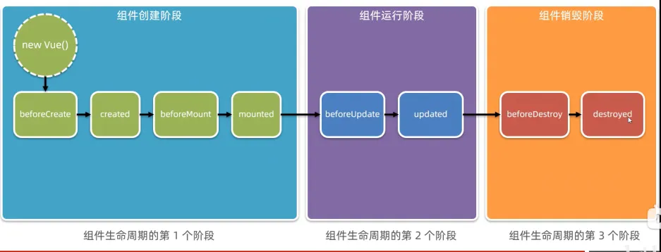
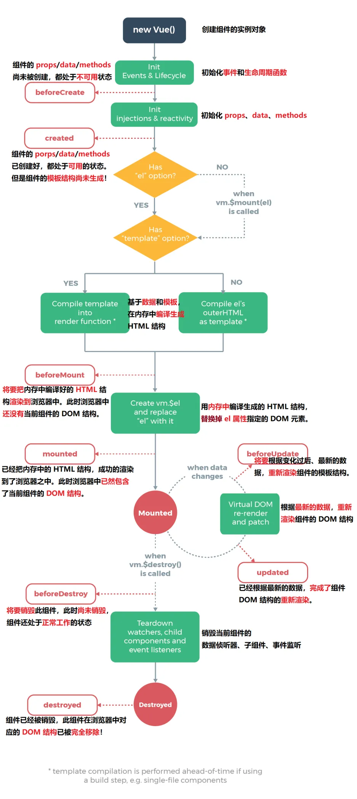
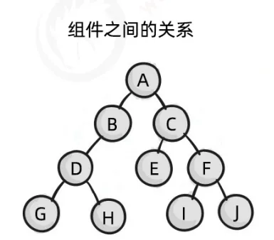
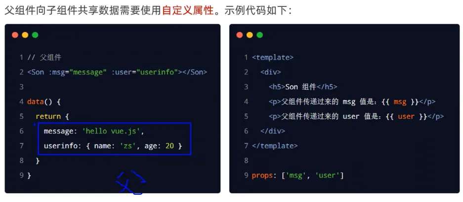
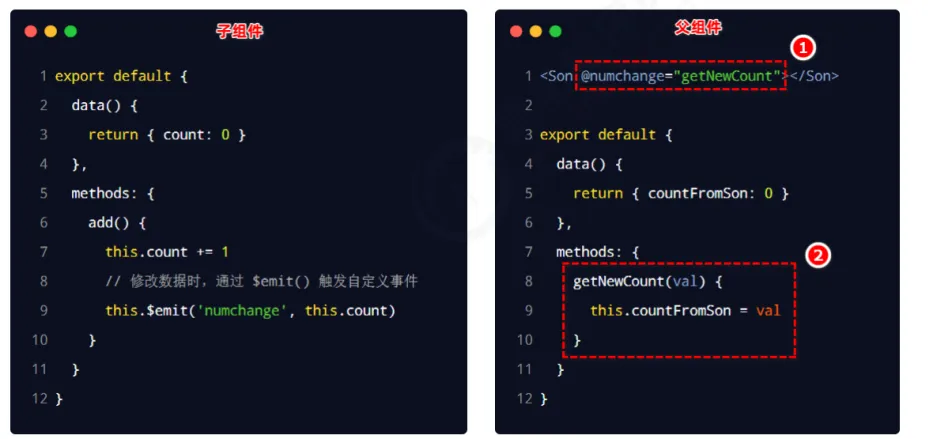
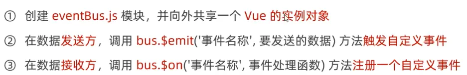
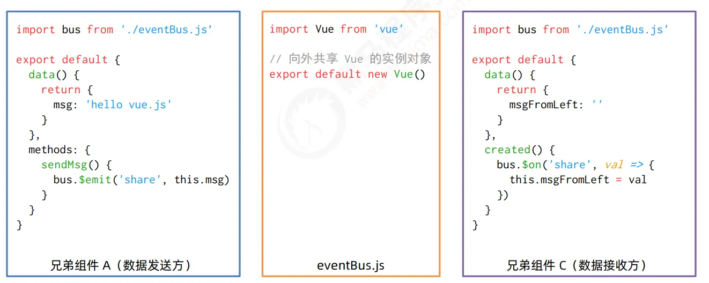
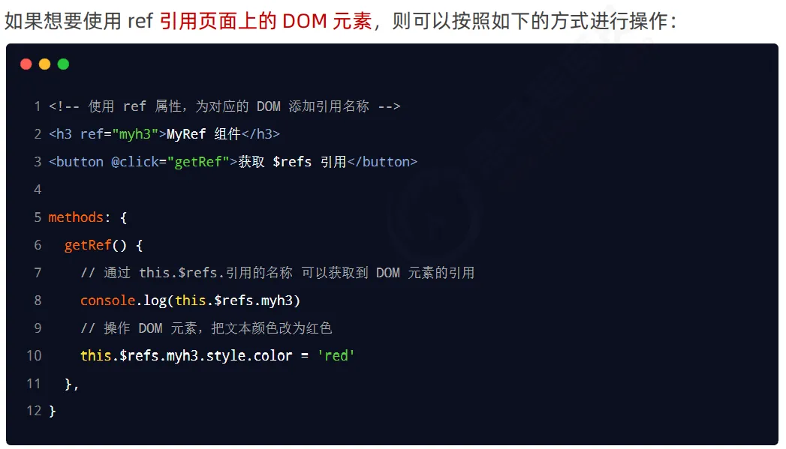
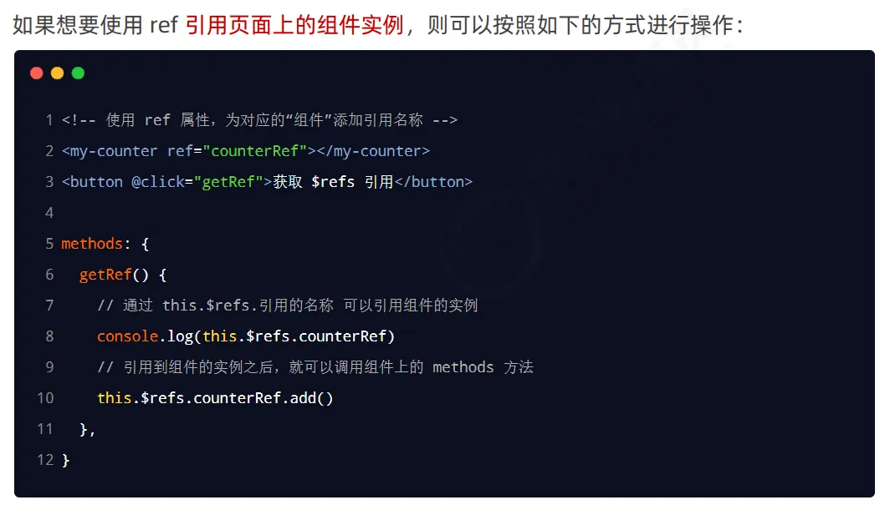
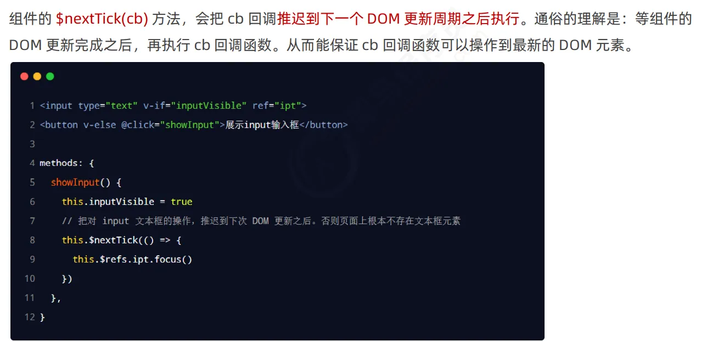

# 四、生命周期&数据共享

## 1、组件的声明周期

### (1) 生命周期与生命周期函数


### (2) 生命周期函数分类



下面这张图
`created`常用，在这个阶段发起 ajax 请求获取数据，并将请求到的数据转存到 data 中。
操作组件的 DOM，最早在 `mounted`阶段。
为操作数据更新之后最新的 DOM，应在 `updated`阶段进行操作。



> `beforeDestroy()`阶段释放 Vue 以外的资源，如清除定时器、延时器。

## 2、组件之间的数据共享

### (1) 组件之间的关系

最常见的关系：兄弟关系、父子关系。


### (2) 父子组件之间数据共享

**父 --> 子**
使用自定义属性 `props`将父组件中的数据传给子组件。


```vue
<template>
  <div class="left-container">
    <h3>Left 组件</h3>
    <hr />
    <MyCount :init_count="9"></MyCount>
    <p>userInfo：{{userInfo}}</p>
    <button @click="transferSonInfo">传输数据到父组件</button>
    <button @click="transferLeftInfo">传输数据到右组件</button>
  </div>
</template>

<script>
import bus from './eventBus'
export default {
  props: ['userInfo'],
  data() {
    return {
      sonInfo: 'lisi',
      leftInfo: '左边的信息'
    }
  },
  methods: {
    transferSonInfo() {
      // 触发自定义事件
      this.$emit('transferSonInfo', this.sonInfo);
    },
    transferLeftInfo() {
      bus.$emit('share', this.leftInfo);
    }
  }
}
</script>

<style lang="less" scoped>
.left-container {
  padding: 0 20px 20px;
  background-color: orange;
  min-height: 250px;
  flex: 1;
}

h3 {
  color: red;
}

// h5[data-v-3c83f0b7]
// [data-v-3c83f0b7] h5

// 当使用第三方组件库的时候，如果有修改第三方组件默认样式的需求，需要用到 /deep/
/deep/ h5 {
  color: pink;
}
</style>
```

```vue
<template>
  <div class="app-container">
    <h1>App 根组件</h1>
    <p>{{ sonInfo }}</p>

    <button @click="flag = !flag">Toggle Flag</button>
    <Test info="你好" v-if="flag"></Test>

    <hr />

    <div class="box">
      <!-- 渲染 Left 组件和 Right 组件 -->
      <!-- 3. 以标签形式，使用注册好的组件 -->
      <Left :user-info="userInfo" @transferSonInfo="getSonInfo"></Left>
      <Right></Right>
    </div>
  </div>
</template>

<script>
// 1. 导入需要使用的 .vue 组件
import Left from '@/components/Left.vue'
import Right from '@/components/Right.vue'
import Test from '@/components/Test.vue'

export default {
  data() {
    return {
      flag: true,
      userInfo: {
        name: 'zs',
        age: 24
      },
      sonInfo: ''
    }
  },
  // 2. 注册组件
  components: {
    Left,
    Right,
    Test
  },
  methods: {
    getSonInfo(val) {
      this.sonInfo = val;
    }
  }
}
</script>

<style lang="less">
.app-container {
  padding: 1px 20px 20px;
  background-color: #efefef;
}
.box {
  display: flex;
}
</style>
```

**子 --> 父**
使用自定义事件。



```vue
<template>
  <div class="left-container">
    <h3>Left 组件</h3>
    <hr />
    <MyCount :init_count="9"></MyCount>
    <p>userInfo：{{userInfo}}</p>
    <button @click="transferSonInfo">传输数据到父组件</button>
    <button @click="transferLeftInfo">传输数据到右组件</button>
  </div>
</template>

<script>
import bus from './eventBus'
export default {
  props: ['userInfo'],
  data() {
    return {
      sonInfo: 'lisi',
      leftInfo: '左边的信息'
    }
  },
  methods: {
    transferSonInfo() {
      // 触发自定义事件
      this.$emit('transferSonInfo', this.sonInfo);
    },
    transferLeftInfo() {
      bus.$emit('share', this.leftInfo);
    }
  }
}
</script>

<style lang="less" scoped>
.left-container {
  padding: 0 20px 20px;
  background-color: orange;
  min-height: 250px;
  flex: 1;
}

h3 {
  color: red;
}

// h5[data-v-3c83f0b7]
// [data-v-3c83f0b7] h5

// 当使用第三方组件库的时候，如果有修改第三方组件默认样式的需求，需要用到 /deep/
/deep/ h5 {
  color: pink;
}
</style>
```

```vue
<template>
  <div class="app-container">
    <h1>App 根组件</h1>
    <p>{{ sonInfo }}</p>

    <button @click="flag = !flag">Toggle Flag</button>
    <Test info="你好" v-if="flag"></Test>

    <hr />

    <div class="box">
      <!-- 渲染 Left 组件和 Right 组件 -->
      <!-- 3. 以标签形式，使用注册好的组件 -->
      <Left :user-info="userInfo" @transferSonInfo="getSonInfo"></Left>
      <Right></Right>
    </div>
  </div>
</template>

<script>
// 1. 导入需要使用的 .vue 组件
import Left from '@/components/Left.vue'
import Right from '@/components/Right.vue'
import Test from '@/components/Test.vue'

export default {
  data() {
    return {
      flag: true,
      userInfo: {
        name: 'zs',
        age: 24
      },
      sonInfo: ''
    }
  },
  // 2. 注册组件
  components: {
    Left,
    Right,
    Test
  },
  methods: {
    getSonInfo(val) {
      this.sonInfo = val;
    }
  }
}
</script>

<style lang="less">
.app-container {
  padding: 1px 20px 20px;
  background-color: #efefef;
}
.box {
  display: flex;
}
</style>
```

### (3) 兄弟组件之间的数据共享




```vue
<template>
  <div class="left-container">
    <h3>Left 组件</h3>
    <hr />
    <MyCount :init_count="9"></MyCount>
    <p>userInfo：{{userInfo}}</p>
    <button @click="transferSonInfo">传输数据到父组件</button>
    <button @click="transferLeftInfo">传输数据到右组件</button>
  </div>
</template>

<script>
import bus from './eventBus'
export default {
  props: ['userInfo'],
  data() {
    return {
      sonInfo: 'lisi',
      leftInfo: '左边的信息'
    }
  },
  methods: {
    transferSonInfo() {
      // 触发自定义事件
      this.$emit('transferSonInfo', this.sonInfo);
    },
    transferLeftInfo() {
      bus.$emit('share', this.leftInfo);
    }
  }
}
</script>

<style lang="less" scoped>
.left-container {
  padding: 0 20px 20px;
  background-color: orange;
  min-height: 250px;
  flex: 1;
}

h3 {
  color: red;
}

// h5[data-v-3c83f0b7]
// [data-v-3c83f0b7] h5

// 当使用第三方组件库的时候，如果有修改第三方组件默认样式的需求，需要用到 /deep/
/deep/ h5 {
  color: pink;
}
</style>
```

```vue
import Vue from 'vue'

export default new Vue()
```

```vue
<template>
  <div class="right-container">
    <h3>Right 组件</h3>
    <p>{{msgFromLeft}}</p>
    <hr/>

    <MyCount :init_count="9"></MyCount>
  </div>
</template>

<script>
import bus from './eventBus'
export default {
  data() {
    return {
      msgFromLeft: ''
    }
  },
  created() {
    bus.$on('share', val => {
      this.msgFromLeft = val;
    })
  }
}
</script>

<style lang="less">
.right-container {
  padding: 0 20px 20px;
  background-color: lightskyblue;
  min-height: 250px;
  flex: 1;
}
</style>
```

## 3、ref 引用

在 Vue 项目中，强烈不建议安装和使用 jQuery，因为操作 DOM 的需求并不多。

### 3.1 操作 DOM 元素



```vue
<template>
  <div class="left-container">
    <h3 ref="myh3">Left 组件</h3>
    <hr />
    <MyCount :init_count="9"></MyCount>
    <p>userInfo：{{userInfo}}</p>
    <button @click="transferSonInfo">传输数据到父组件</button>
    <button @click="transferLeftInfo">传输数据到右组件</button>
    <button @click="geth3">获取h3</button>
  </div>
</template>

<script>
import bus from './eventBus'
export default {
  props: ['userInfo'],
  data() {
    return {
      sonInfo: 'lisi',
      leftInfo: '左边的信息'
    }
  },
  methods: {
    transferSonInfo() {
      // 触发自定义事件
      this.$emit('transferSonInfo', this.sonInfo);
    },
    transferLeftInfo() {
      bus.$emit('share', this.leftInfo);
    },
    geth3() {
      console.log(this.$refs.myh3);
    }
  }
}
</script>

<style lang="less" scoped>
.left-container {
  padding: 0 20px 20px;
  background-color: orange;
  min-height: 250px;
  flex: 1;
}

h3 {
  color: red;
}

// h5[data-v-3c83f0b7]
// [data-v-3c83f0b7] h5

// 当使用第三方组件库的时候，如果有修改第三方组件默认样式的需求，需要用到 /deep/
/deep/ h5 {
  color: pink;
}
</style>
```

### 3.2 操作组件实例



### 3.3 `$nextTick()`方法

延迟代码执行直到 DOM 重新渲染。


## 4、补充——数组方法

`**forEach((item, index) => {})**`
遍历数组中所有元素，无法提前终止。

```javascript
const arr = ['vue', 'js', 'java', 'bb'];
// 循环遍历数组中的所有元素
// 缺点是无法终止循环
arr.forEach((item, index) => {
  console.log(item);
})
```

`**some((item, index) => {})**`
遍历数组中所有元素，并在满足某种条件时提前终止。

```javascript
// 可以通过 return true 提前终止循环
arr.some((item, index) => {
  console.log(index);
  if (item == 'java') {
    return true;
  }
})
```

`**every((item, index) => {})**`
遍历数组中所有元素，判断所有元素是否都满足某个条件，若所有元素都满足条件，返回 `true`，否则返回 `false`。

```javascript
const arr = [
  {
    name: '西瓜',
    price: 13,
    status: true
  },
  {
    name: '西瓜',
    price: 13,
    status: true
  },
  {
    name: '西瓜',
    price: 13,
    status: true
  }
];
const res = arr.every((item) => item.status);
console.log(res);
```

`**filter((item, index) => {})**`
对数组进行过滤，得到新数组。

```javascript
const arr = [
  {
    name: '西瓜',
    price: 13,
    status: true,
    count: 1
  },
  {
    name: '西瓜',
    price: 13,
    status: false,
    count: 2
  },
  {
    name: '西瓜',
    price: 13,
    status: true,
    count: 3
  }
];
console.log(arr.filter(item => item.status));
```

`**reduce((累加的结果, 当前循环项) => {}, 初始值)**`
遍历数组，进行累加。

```javascript
const arr = [
  {
    name: '西瓜',
    price: 13,
    status: true,
    count: 1
  },
  {
    name: '西瓜',
    price: 13,
    status: false,
    count: 2
  },
  {
    name: '西瓜',
    price: 13,
    status: true,
    count: 3
  }
];
res = arr.filter(item => item.status).reduce((totalPrice, item) => {
  // 箭头函数中的返回值将作为下一次循环累加的已知结果
  return totalPrice += item.price * item.count
}, 0)
```
