# 五、动态组件、插槽和自定义指令

## 1、动态组件

### (1) 动态组件简介

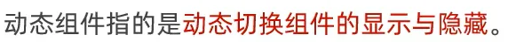
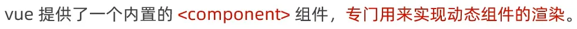
`<componet>`相当于一个组件占位符，更改 `is`属性便可以更改组件。
基本使用：

```vue
<template>
  <div class="app-container">
    <h1>App 根组件</h1>
    <hr />

    <div class="box">
      <!-- 渲染 Left 组件和 Right 组件 -->
      <component :is="comName"></component>
    </div>
  </div>
</template>

<script>
// 1.导入所需组件
import Left from "./components/Left.vue";
import Right from "@/components/Right.vue";

export default {
  data() {
    return {
      comName: 'Left'
    }
  },
  // 2.注册所需组件
  components: {
    Left,
    Right
  }
}
</script>

<style lang="less">
.app-container {
  padding: 1px 20px 20px;
  background-color: #efefef;
}
.box {
  display: flex;
}
</style>
```

使用案例2：使用按钮切换组件的显示与隐藏
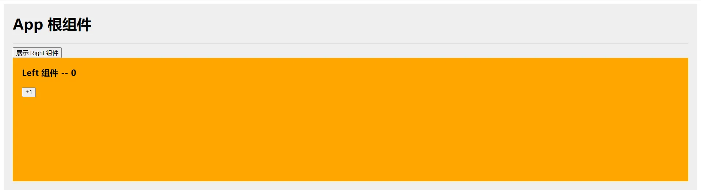

```vue
<template>
  <div class="app-container">
    <h1>App 根组件</h1>
    <hr />
    <!--组件展示按钮，当显示左组件，显示展示右组件按钮-->
    <button v-if="!showLeft" @click="showLeftCom">展示 Left 组件</button>
    <button v-if="showLeft" @click="showRightCom">展示 Right 组件</button>

    <div class="box">
      <!-- 渲染 Left 组件和 Right 组件 -->
      <component :is="comName"></component>
    </div>
  </div>
</template>

<script>
// 1.导入所需组件
import Left from "./components/Left.vue";
import Right from "@/components/Right.vue";

export default {
  data() {
    return {
      comName: 'Left',
      // 是否展示 Left 组件，1表示是，0表示否
      showLeft: 1
    }
  },
  // 2.注册所需组件
  components: {
    Left,
    Right
  },
  methods: {
    // 显示 Left 组件
    showLeftCom() {
      this.comName = 'Left';
      this.showLeft = 1;
    },
    // 显示 Right 组件
    showRightCom() {
      this.comName = 'Right';
      this.showLeft = 0;
    }
  }
}
</script>

<style lang="less">
.app-container {
  padding: 1px 20px 20px;
  background-color: #efefef;
}
.box {
  display: flex;
}
</style>
```

组件从 Left 切换到 Right，Left 组件会被销毁，其更改不会被保存。如果希望被隐藏的组件不会被销毁，可以使用 `<keep-alive>`。

### (2) keep-alive 标签

**基本使用**

```vue
      <keep-alive>
        <!-- 渲染 Left 组件和 Right 组件 -->
        <component :is="comName"></component>
      </keep-alive>
```

组件会被缓存，而不是被销毁。

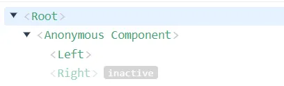

`<keep-alive>`**对应生命周期函数**

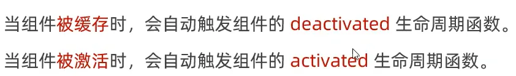

```vue
<template>
  <div class="left-container">
    <h3>Left 组件 -- {{ count }}</h3>
    <button @click="add">+1</button>
  </div>
</template>

<script>
export default {
  data() {
    return {
      count: 0
    }
  },
  methods: {
    add() {
      this.count += 1;
    }
  },
  deactivated() {
    console.log('Left 组件被缓存！');
  },
  activated() {
    console.log('Left 组件被激活！')
  }
}
</script>

<style lang="less">
.left-container {
  padding: 0 20px 20px;
  background-color: orange;
  min-height: 250px;
  flex: 1;
}
</style>

```

`keep-alive`标签的`include`和`exclude`属性
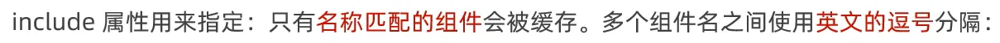
不能有空格。

```vue
<keep-alive include="Left,Right">
  <!-- 渲染 Left 组件和 Right 组件 -->
  <component :is="comName"></component>
</keep-alive>
```

`include`和 `exclude`属性只能使用其中一个。

## 2、插槽

### (1) 插槽简介

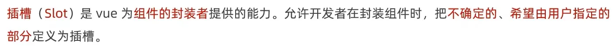
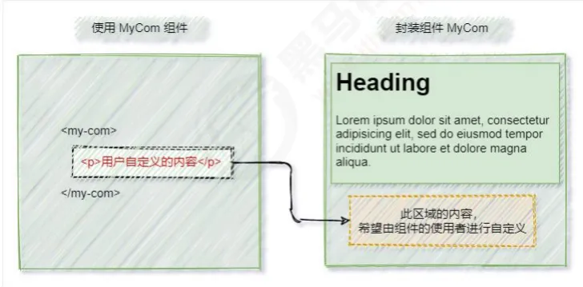
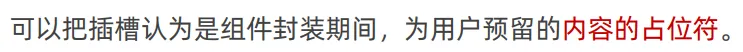
基本使用：

```vue
<template>
  <div class="left-container">
    <h3>Left 组件 -- {{ count }}</h3>
    <button @click="add">+1</button>
    <!--这是一个插槽，组件使用者可以将各种标签插入到该插槽中-->
    <slot></slot>
  </div>
</template>

<script>
export default {
  data() {
    return {
      count: 0
    }
  },
  methods: {
    add() {
      this.count += 1;
    }
  },
  deactivated() {
    console.log('Left 组件被缓存！');
  },
  activated() {
    console.log('Left 组件被激活！')
  }
}
</script>

<style lang="less">
.left-container {
  padding: 0 20px 20px;
  background-color: orange;
  min-height: 250px;
  flex: 1;
}
</style>
```

```vue
<template>
  <div class="app-container">
    <h1>App 根组件</h1>
    <hr />
    <!--组件展示按钮，当显示左组件，显示展示右组件按钮-->
    <button v-if="!showLeft" @click="showLeftCom">展示 Left 组件</button>
    <button v-if="showLeft" @click="showRightCom">展示 Right 组件</button>

    <div class="box">
      <keep-alive include="Left,Right">
        <!-- 渲染 Left 组件和 Right 组件 -->
        <component :is="comName"></component>
      </keep-alive>
    </div>
    <Left>
      <p>我是一个 p 标签</p>
    </Left>
  </div>
</template>

<script>
// 1.导入所需组件
import Left from "./components/Left.vue";
import Right from "@/components/Right.vue";

export default {
  data() {
    return {
      comName: 'Left',
      // 是否展示 Left 组件，1表示是，0表示否
      showLeft: 1
    }
  },
  // 2.注册所需组件
  components: {
    Left,
    Right
  },
  methods: {
    // 显示 Left 组件
    showLeftCom() {
      this.comName = 'Left';
      this.showLeft = 1;
    },
    // 显示 Right 组件
    showRightCom() {
      this.comName = 'Right';
      this.showLeft = 0;
    }
  }
}
</script>

<style lang="less">
.app-container {
  padding: 1px 20px 20px;
  background-color: #efefef;
}
.box {
  display: flex;
}
</style>
```

每个插槽都必须有名称，默认名称为 `default`。
如果需要指定插槽名称，使用如下：

```vue
<slot name="default"></slot>
```

```vue
<Left>
  <template v-slot:default>
  	<p>我是一个 p 标签</p>
	</template>
</Left>
```

> `<template>`标签只起到包裹的作用，不会被渲染成任何元素。

`v-slot:`可以简写为 `#`。

```vue
<Left>
  <template #default>
  	<p>我是一个 p 标签</p>
	</template>
</Left>
```

可以为插槽指定默认内容。

```vue
<slot name="default">
  <h3>这是插槽的默认内容</h3>
</slot>
```

### (2) 具名插槽

一个组件定义了多个插槽，需要给每个插槽设置名称以进行区分。

```vue
<template>
  <div class="left-container">
    <h3>Left 组件 -- {{ count }}</h3>
    <button @click="add">+1</button>
    <!--这是一个插槽，组件使用者可以将各种标签插入到该插槽中-->
    <slot name="title">
      <h3>这是插槽的默认标题</h3>
    </slot>
    <slot name="footer">
      <h3>这是插槽的默认页脚</h3>
    </slot>
  </div>
</template>
```

```vue
<Left>
  <template #title>
    <h3>标题</h3>
  </template>
</Left>
```

### (3) 作用域插槽

封装组件时，可以为插槽添加自定义属性值，供调用时使用。

```vue
<template>
  <div class="left-container">
    <h3>Left 组件 -- {{ count }}</h3>
    <button @click="add">+1</button>
    <!--这是一个插槽，组件使用者可以将各种标签插入到该插槽中-->
    <slot name="title" msg="给你俩窝窝">
      <h3>这是插槽的默认标题</h3>
    </slot>
    <slot name="footer">
      <h3>这是插槽的默认页脚</h3>
    </slot>
  </div>
</template>
```

```vue
<Left>
  <template #title="scope">
    <h3>标题 --- {{ scope.msg }}</h3>
  </template>
</Left>
```

## 3、自定义指令

### (1) 简介

自定义指令分类

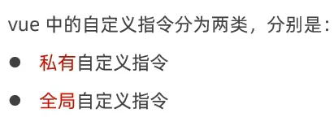

**基本使用**

自定义指令结点和 `data()`、`methods`等平级。

```vue
// 私有自定义指令结点
directives: {
  // 自定义指令 color，指向一个配置对象
  color: {
    // 给元素绑定指令，便会触发 band 函数
    // el 是绑定指令的 DOM 元素
    bind(el) {
      el.style.color = 'red';
    }
  }
}
```

```vue
<h1 v-color>App 根组件</h1>
```

**自定义指令也可以传值**

```vue
<h1 v-color="color">App 根组件</h1>
```

```vue
  data() {
    return {
      comName: 'Left',
      // 是否展示 Left 组件，1表示是，0表示否
      showLeft: 1,
      color: 'blue'
    }
  },
  // 私有自定义指令结点
  directives: {
    // 自定义指令 color，指向一个配置对象
    color: {
      // 给元素绑定指令，便会触发 band 函数
      // el 是绑定指令的 DOM 元素
      bind(el, binding) {
        el.style.color = binding.value;
        console.log(binding);
      }
    }
  }
```

**小案例：点击按钮，使标题变色**

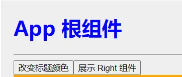

出现问题：只绑定单击事件修改 `color`值并不会让标题变色。
原因：元素只会绑定指令一次，`bind`函数也会只触发一次，改变 `color`值并不会触发 `bind`函数。
解决方案：使用 `update()`函数，在数据更新时触发 `bind()`函数。

```vue
  directives: {
    // 自定义指令 color，指向一个配置对象
    color: {
      // 给元素绑定指令，便会触发 band 函数
      // el 是绑定指令的 DOM 元素
      bind(el, binding) {
        el.style.color = binding.value;
        console.log(binding);
      },
      // 在数据更新时会触发
      update(el, binding) {
        el.style.color = binding.value;
        console.log(binding);
      }
    }
  },
```

上述代码可简写为：

```vue
  directives: {
    color(el, binding) {
      el.style.color = binding.value;
    }
  }
```

### (2) 全局自定义指令

在 `main.js`中声明全局自定义指令。

```javascript
// 定义全局自定义指令
Vue.directive('color', {
  bind(el, binding) {
    el.style.color = binding.value;
  },
  update(el, binding) {
    el.style.color = binding.value;
  }
})
```

**`main.js`小提示**

`Vue.config.productionTip = false`表示无法在控制台看到如下提示：
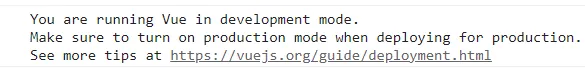

