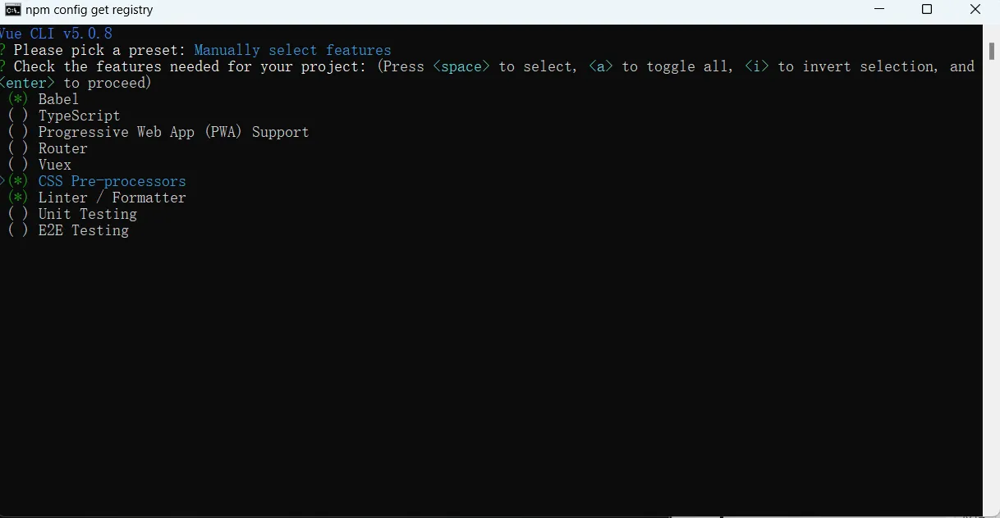
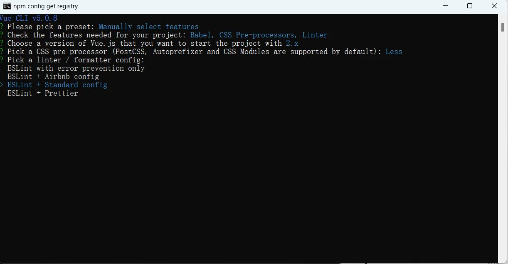
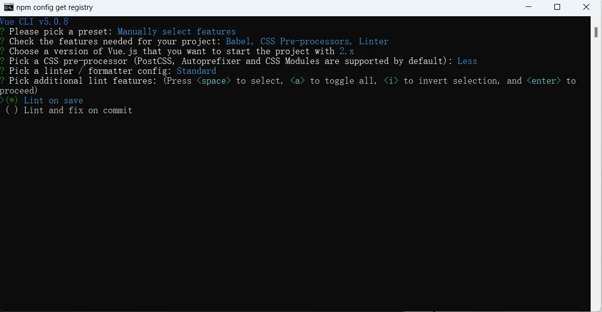
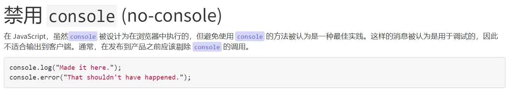
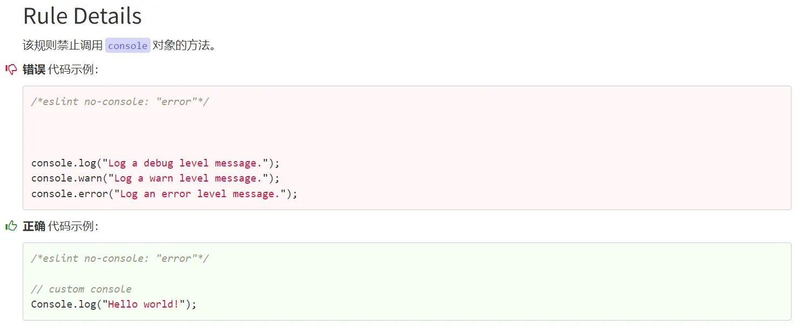

# 六、ESLint

ESLint 是 js 代码检查工具，用来规范代码。

## 1、创建带有 ESLint 的项目





## 2、ESLint 规则

```javascript
module.exports = {
  root: true,
  env: {
    node: true
  },
  extends: [
    'plugin:vue/essential',
    '@vue/standard'
  ],
  parserOptions: {
    parser: '@babel/eslint-parser'
  },
  rules: {
    // process.env.NODE_ENV 可以获取当前打包模式，当打包模式为 production，会发出警告
    'no-console': process.env.NODE_ENV === 'production' ? 'warn' : 'off',
    // 在 js 代码中，使用 debugger 打断点
    'no-debugger': process.env.NODE_ENV === 'production' ? 'warn' : 'off'
  }
}
```

> `no-console`
> 
> 

## 3、标准模式下的约束

1. 不能有多余空行
2. 不能有多余空格
3. 文件结尾使用空行
4. 使用单引号
5. 对象的属性和值之间使用空格
6. 对象或属性的结尾，不允许出现多余逗号
7. 使用注释 `//`或 `/**/`后加空格
8. 缩进要一致
9. `import`必须出现在顶部
10. 不能出现从未使用的变量
11. 方法形参和方法名之间要有空格

在 `.eslintrc.js`中规则结点下可以禁用该规则：`'space-before-function-paren': ['error', 'never']`
