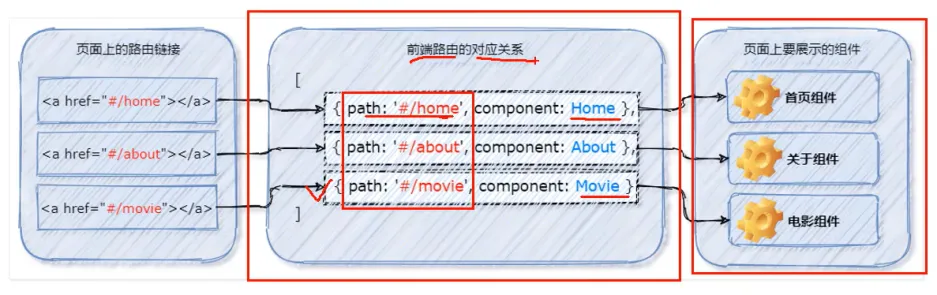
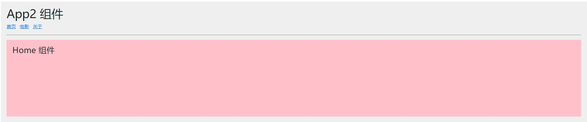
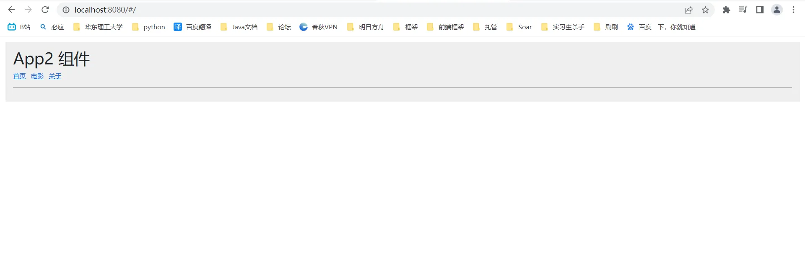
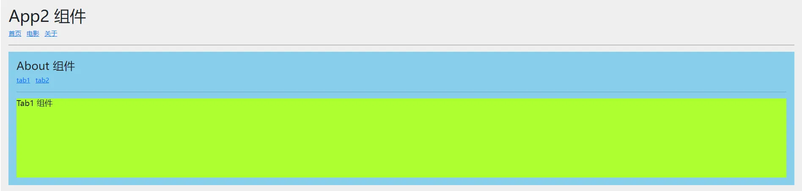
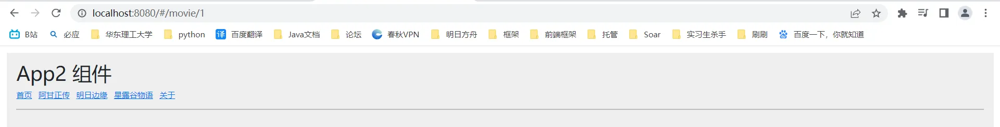
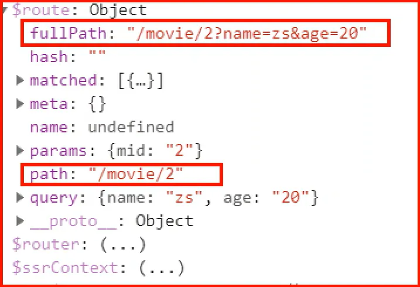
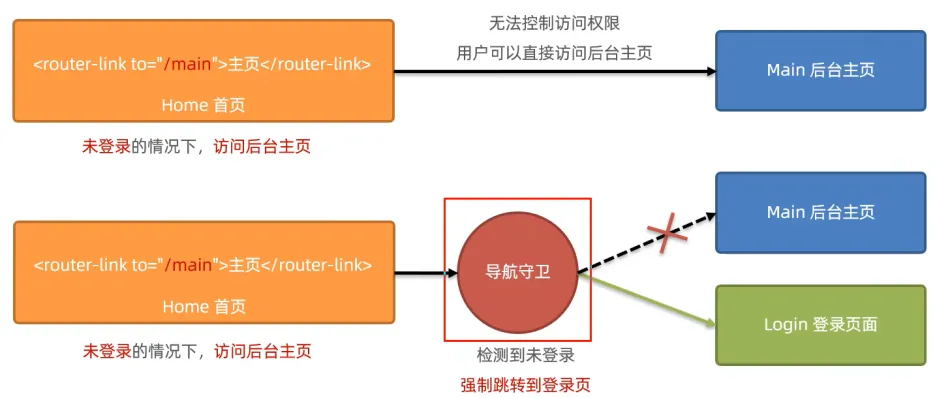
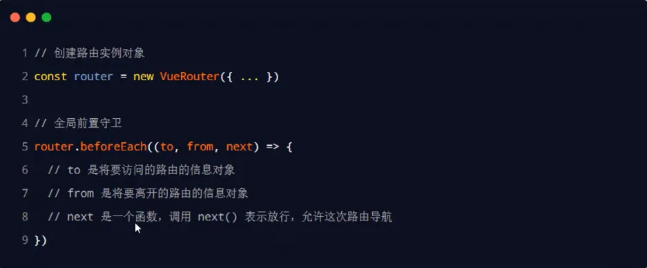

# 七、路由

## 1、前端路由简介

### (1) 概念

路由(router)就是**哈希地址地址和组件**之间的对应关系。单页面应用程序(SPA)中，全部内容在一个页面中展示，展示内容根据地址栏上的路由信息改变。


`#/home`就是一个哈希地址。

### (2) 工作方式

前端路由的工作流程如下：

1. 用户点击路由链接
2. 地址栏哈希地址发生变化
3. 前端路由监听哈希地址变化
4. 前端路由将哈希地址对应的组件渲染到浏览器



## 2、vue-router 基本使用

Vue-router 是 Vue 官方给出的前端路由解决方案，只能使用在 Vue 项目中。

### (1) vue-router 的安装与配置

今后使用 vue-cli 可以自动配置 vue-router，这个过程了解即可。

1. **安装 vue-router**

仅供 Vue 2.0 使用
`npm i vue-router@3.5.2`

2. **在项目中创建路由模块**

在 `src/router`文件夹下，创建 `index.js`文件

```javascript
// 当前项目的路由模块
// 1.导入 Vue 和 vue-router
import Vue from 'vue'
import VueRouter from 'vue-router'

// 2.向 Vue 添加 vue-router 插件
Vue.use(VueRouter)

// 3.创建 vue-router 实例
const router = new VueRouter()

// 4.共享实例对象
export default router
```

3. **导入并挂载路由模块**

在 `main.js`中挂载 `router`实例对象

```javascript
import Vue from 'vue'
import App from './App.vue'
// 导入路由模块
// 在进行模块化导入时，导入的是一个文件夹，默认导入该文件夹下名为 index.js 的文件
// import router from "@/router/index.js"
import router from "@/router";

// 导入 bootstrap 样式
import 'bootstrap/dist/css/bootstrap.min.css'
// 全局样式
import '@/assets/global.css'

Vue.config.productionTip = false

new Vue({
  render: h => h(App),
  // router 实例对象挂载
  // router: router
  router
}).$mount('#app')
```

### (2) 使用小案例



点击链接按需显示组件。

**实现步骤**

在根组件中放入三个路由链接：

```html
<a href="#/home">首页</a>
<a href="#/movie">电影</a>
<a href="#/about">关于</a>
```

路由链接可以改变哈希地址，vue-router 实例可以监听哈希地址的变化，哈希地址和组件的映射需要在 `/src/router/index.js`中定义：

```javascript
// 当前项目的路由模块
// 1.导入 Vue 和 vue-router
import Vue from 'vue'
import VueRouter from 'vue-router'
// 导入所需组件
import Home from "@/components/Home.vue";
import Movie from "@/components/Movie.vue";
import About from "@/components/About.vue";

// 2.向 Vue 添加 vue-router 插件
Vue.use(VueRouter)

// 3.创建 vue-router 实例
const router = new VueRouter({
  // 定义路由规则：哈希地址和组件之间的对应关系
  routes: [
    {path: '/home', component: Home},
    {path: '/movie', component: Movie},
    {path: '/about', component: About}
  ]
})

// 4.共享实例对象
export default router
```

在根组件中使用 `<router-view>`组件占位，按需渲染组件。

```html
<template>
  <div class="app-container">
    <h1>App2 组件</h1>
    <a href="#/home">首页</a>
    <a href="#/movie">电影</a>
    <a href="#/about">关于</a>

    <hr />
    <!--占位符-->
    <router-view></router-view>

  </div>
</template>
```

**改进**

vue-router 也提供了替代 a 链接的 `<router-link>`标签。

```html
<router-link to="/home">首页</router-link>
<router-link to="/movie">电影</router-link>
<router-link to="/about">关于</router-link>
```

## 3、路由重定向

路由重定向：当用户访问地址 A，强制跳转到地址 C，从而显示特定组件。

> 使用案例：
> 当访问项目根目录，什么组件都不显示。希望访问根目录时，直接跳转到哈希地址为 `#/home`。
> 

在 `src/router/index.js`中添加重定向的路由规则：

```javascript
// 当前项目的路由模块
// 1.导入 Vue 和 vue-router
import Vue from 'vue'
import VueRouter from 'vue-router'
// 导入所需组件
import Home from "@/components/Home.vue";
import Movie from "@/components/Movie.vue";
import About from "@/components/About.vue";

// 2.向 Vue 添加 vue-router 插件
Vue.use(VueRouter)

// 3.创建 vue-router 实例
const router = new VueRouter({
  // 定义路由：哈希地址和组件之间的对应关系
  routes: [
    // 当访问哈希地址为 #/ 时，重定向到哈希地址为 #/home
    {path: '/', redirect: '/home'},
    {path: '/home', component: Home},
    {path: '/movie', component: Movie},
    {path: '/about', component: About}
  ]
})

// 4.共享实例对象
export default router
```

## 4、嵌套路由

点击路由连接显示组件，若该组件也是通过路由方式呈现，就是嵌套路由。

**使用案例**



About 组件也使用路由方式呈现。

**使用步骤**

在 About 组件中放置路由连接和占位符

```html
<!--路由链接-->
<router-link to="/about/tab1">tab1</router-link>
<router-link to="/about/tab2">tab2</router-link>
<hr>
<router-view></router-view>
```

在 `index.js`中声明路由规则，这些路由规则都是 about 的子路由规则，使用 `children`结点放置这些规则。

```javascript
// 当前项目的路由模块
// 1.导入 Vue 和 vue-router
import Vue from 'vue'
import VueRouter from 'vue-router'
// 导入所需组件
import Home from "@/components/Home.vue";
import Movie from "@/components/Movie.vue";
import About from "@/components/About.vue";
import Tab1 from "@/components/tabs/Tab1.vue";
import Tab2 from "@/components/tabs/Tab2.vue";

// 2.向 Vue 添加 vue-router 插件
Vue.use(VueRouter)

// 3.创建 vue-router 实例
const router = new VueRouter({
  // 定义路由：哈希地址和组件之间的对应关系
  routes: [
    // 当访问哈希地址为 #/ 时，重定向到哈希地址为 #/home
    {path: '/', redirect: '/home'},
    {path: '/home', component: Home},
    {path: '/movie', component: Movie},
    {
      path: '/about',
      component: About,
      redirect: 'about/tab1',
      children: [
        {path: 'tab1', component: Tab1},
        {path: 'tab2', component: Tab2}
      ]
    }
  ]
})

// 4.共享实例对象
export default router
```

**默认子路由**
以上代码 `routes`也可以这样写：

```javascript
routes: [
  // 当访问哈希地址为 #/ 时，重定向到哈希地址为 #/home
  {path: '/', redirect: '/home'},
  {path: '/home', component: Home},
  {path: '/movie', component: Movie},
  {
    path: '/about',
    component: About,
    children: [
      {path: 'tab1', component: Tab1},
      {path: 'tab2', component: Tab2},
      {path: '', component: Tab1}
    ]
  }
]
```

上述代码表示哈希地址为 `#/about`时，自动展示组件 Tab1。

## 5、动态路由

动态路由：将哈希地址可变的部分定义为参数，从而提高复用性。

**使用案例**

哈希地址可以在路径中传参，并被组件接收。



**实现步骤**

路由链接

```html
<router-link to="/movie/1">阿甘正传</router-link>
<router-link to="/movie/2">明日边缘</router-link>
<router-link to="/movie/3">星露谷物语</router-link>
<router-link to="/about">关于</router-link>
```

路由规则
使用 `:`匹配可变参数

```javascript
// 当前项目的路由模块
// 1.导入 Vue 和 vue-router
import Vue from 'vue'
import VueRouter from 'vue-router'
// 导入所需组件
import Home from "@/components/Home.vue";
import Movie from "@/components/Movie.vue";
import About from "@/components/About.vue";
import Tab1 from "@/components/tabs/Tab1.vue";
import Tab2 from "@/components/tabs/Tab2.vue";

// 2.向 Vue 添加 vue-router 插件
Vue.use(VueRouter)

// 3.创建 vue-router 实例
const router = new VueRouter({
  // 定义路由：哈希地址和组件之间的对应关系
  routes: [
    // 当访问哈希地址为 #/ 时，重定向到哈希地址为 #/home
    {path: '/', redirect: '/home'},
    {path: '/home', component: Home},
    {path: '/movie/:id', component: Movie},
    {
      path: '/about',
      component: About,
      children: [
        {path: 'tab1', component: Tab1},
        {path: 'tab2', component: Tab2},
        {path: '', component: Tab1}
      ]
    }
  ]
})

// 4.共享实例对象
export default router
```

在组件中，使用 `this.$route.params.xxx`来访问参数

```html
<template>
  <div class="movie-container">
    <h3>Movie 组件 -- {{ this.$route.params.id }}</h3>
  </div>
</template>
```

> `this.route`是路由的参数对象，`this.router`是路由的导航对象。

以上代码比较复杂，还有一种解决方案。
为某条路由规则开启传参：

```javascript
// 当前项目的路由模块
// 1.导入 Vue 和 vue-router
import Vue from 'vue'
import VueRouter from 'vue-router'
// 导入所需组件
import Home from "@/components/Home.vue";
import Movie from "@/components/Movie.vue";
import About from "@/components/About.vue";
import Tab1 from "@/components/tabs/Tab1.vue";
import Tab2 from "@/components/tabs/Tab2.vue";

// 2.向 Vue 添加 vue-router 插件
Vue.use(VueRouter)

// 3.创建 vue-router 实例
const router = new VueRouter({
  // 定义路由：哈希地址和组件之间的对应关系
  routes: [
    // 当访问哈希地址为 #/ 时，重定向到哈希地址为 #/home
    {path: '/', redirect: '/home'},
    {path: '/home', component: Home},
    {path: '/movie/:id', component: Movie, props: true},
    {
      path: '/about',
      component: About,
      children: [
        {path: 'tab1', component: Tab1},
        {path: 'tab2', component: Tab2},
        {path: '', component: Tab1}
      ]
    }
  ]
})

// 4.共享实例对象
export default router
```

在对应组件中，声明该参数作为组件的参数

```vue
<template>
  <div class="movie-container">
    <h3>Movie 组件 -- {{ this.$route.params.id }} -- {{ id }}</h3>
  </div>
</template>

<script>
  export default {
    name: 'Movie',
    props: ['id']
  }
</script>

<style lang="less" scoped>
  .movie-container {
    min-height: 200px;
    background-color: lightsalmon;
    padding: 15px;
  }
</style>
```

> 补充：
>
> 1. 路径参数与查询参数
>
> `/movie/2`中的 2 属于路径参数，使用 `this.$route.params.xxx`来获取。
> `movie/2?name=zs&age=20`中的 zs 属于查询参数，使用 `this.$route.query.xxx`来获取。
>
> 2. `fullPath`和 `path`
>
> 

## 6、声明式导航&编程式导航

声明式导航：点击链接实现导航，如 `<a>` 链接和 `<router-link>`链接。
编程式导航：调用 API 实现导航。
声明式导航只能使用链接标签跳转，编程式导航让任何具有单击事件的元素称为导航按钮，更加灵活。

### (1) vue-router 中的编程式导航 API

1. `this.$router.push('hash 地址')`

跳转到指定地址，并增加一条历史记录。

```vue
<template>
  <div class="home-container">
    <h3>Home 组件</h3>
    <hr>
      <button @click="goToAGan">跳转到阿甘正传</button>
    </div>
</template>

<script>
  export default {
    name: 'Home',
    methods: {
      goToAGan() {
        this.$router.push('/movie/1');
      }
    }
  }
</script>

<style lang="less" scoped>
  .home-container {
    min-height: 200px;
    background-color: pink;
    padding: 15px;
  }
</style>
```

2. `this.$router.replace('hash 地址')`

跳转到指定的哈希地址，并替换当前历史记录。

3. `this.$router.go(数值n)`

在浏览历史中前进和后退。
前进一层：`this.$router.forward()`
后退一层：`this.$router.back()`

## 7、导航守卫

导航守卫可以控制路由的访问权限。


### (1) 全局前置守卫

在导航跳转之前，进行访问权限控制。
前置守卫回调的三个参数：


```javascript
// 导航守卫
router.beforeEach(function (to, from, next) {
  // to 表示将要访问的路由信息
  // from 表示将要离开的路由信息
  // next 表示放行
  next()
})
```

`next()`函数有三种使用方式：

- `next()`：放行
- `next('/login')`：跳转到其他页面
- `next(false)`：不允许放行

**使用案例**

```vue
// 当前项目的路由模块
// 1.导入 Vue 和 vue-router
import Vue from 'vue'
import VueRouter from 'vue-router'
// 导入所需组件
import Home from "@/components/Home.vue";
import Movie from "@/components/Movie.vue";
import About from "@/components/About.vue";
import Tab1 from "@/components/tabs/Tab1.vue";
import Tab2 from "@/components/tabs/Tab2.vue";
import Login from '@/components/Login.vue';
import Main from '@/components/Main.vue'

// 2.向 Vue 添加 vue-router 插件
Vue.use(VueRouter)

// 3.创建 vue-router 实例
const router = new VueRouter({
    // 定义路由：哈希地址和组件之间的对应关系
    routes: [
        // 当访问哈希地址为 #/ 时，重定向到哈希地址为 #/home
        {path: '/', redirect: '/home'},
        {path: '/home', component: Home},
        {path: '/movie/:id', component: Movie, props: true},
        {
            path: '/about',
            component: About,
            children: [
                {path: 'tab1', component: Tab1},
                {path: 'tab2', component: Tab2},
                {path: '', component: Tab1}
            ]
        },
        { path: '/login', component: Login},
        { path: '/main', component: Main}
    ]
})

// 导航守卫
router.beforeEach(function (to, from, next) {
    // to 表示将要访问的路由信息
    // from 表示将要离开的路由信息
    // next 表示放行
    if (to.path === '/main') { // 若要访问后台管理界面，进行权限控制
        const token = localStorage.getItem('token')
        if (token) { // 有 token 直接放行
            next()
        } else { // 否则跳转到登录页
            next('/login')
        }
    } else { // 直接放行
        next()
    }
})

// 4.共享实例对象
export default router
```
