# 八、其他

## 1、ES6 模块化

统一的、浏览器端和服务器端通用的模块化规范。

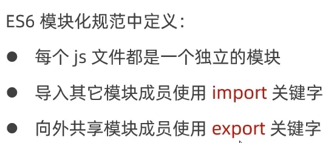

主要包含三种用法：

1. 默认导出与默认导入
2. 按需导出与按需导入
3. 直接导入并执行模块中的代码

**总结**

默认导出只能导出一个，导入时可使用任意名称接收；

按需导出可以导出多个，导入时使用名称进行解构。

### (1) 默认导入与导出

#### 默认导出

语法：`export default 成员`

> 在每个模块中，只允许使用一个 `export default`

```javascript
let n1 = 10
function show() {}

export default {
    n1,
    show
}
```

#### 默认导入

语法：`import 接收名称 from '模块标识符'`

```javascript
import idiot from './1_默认导出.js'

console.log(idiot)
```

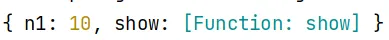

### (2) 按需导入与导出

#### 按需导出

语法：`export 成员`

```javascript
export let n1 = 'aaa'
export function show() {}
```

#### 按需导入

语法：`import {n1} from '模块标识符'`

```javascript
import { n1, show } from './3_按需导出.js'

console.log(n1)
console.log(show)
```

> 按需导出与按需导入注意事项：
> 

### (3) 直接导入并执行模块中的代码

```javascript
import './5_直接执行模块代码.js'
```

## 2、Promise
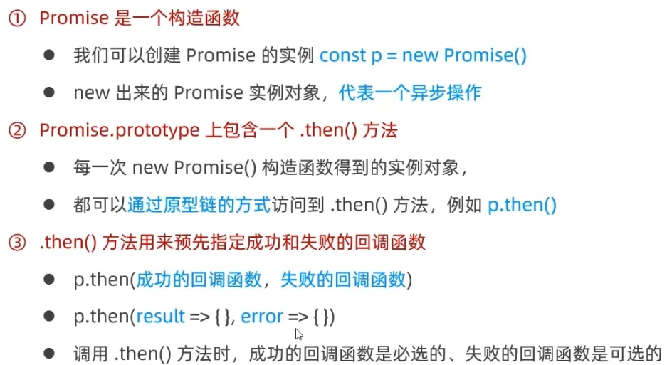
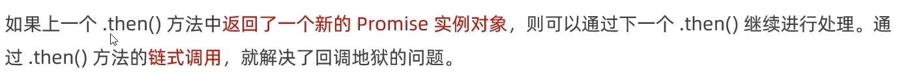
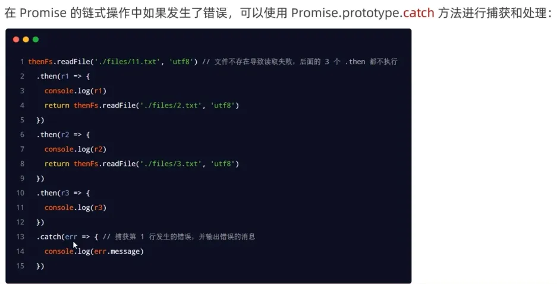
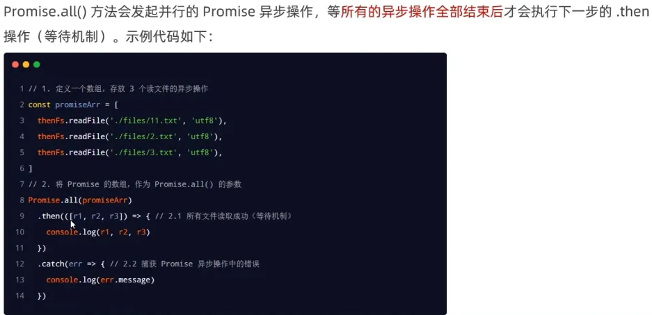
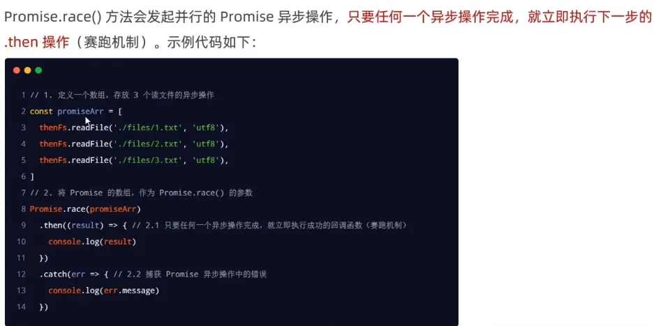

## 3、`async`和`await`

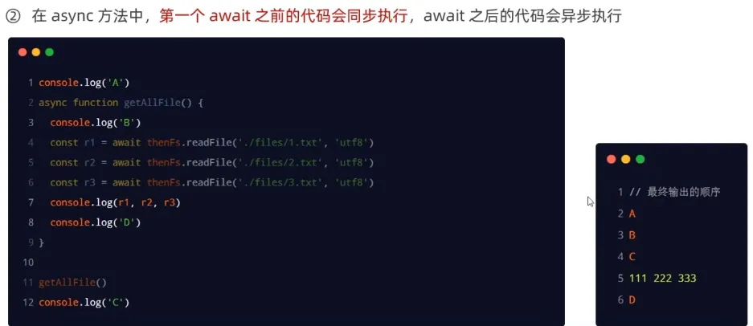

## 4、EventLoop
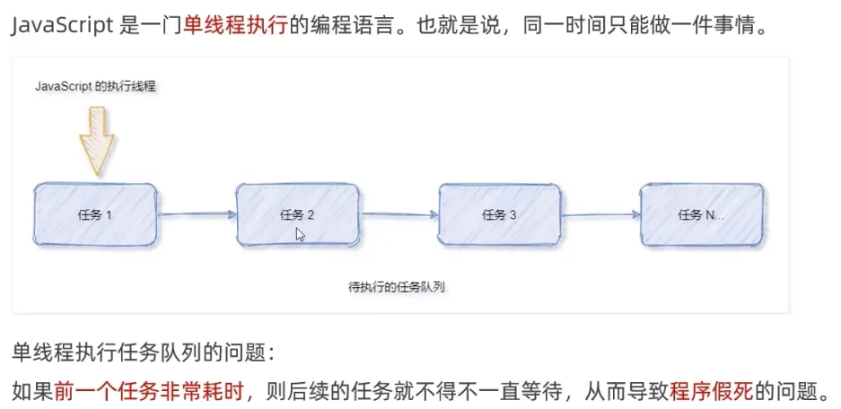
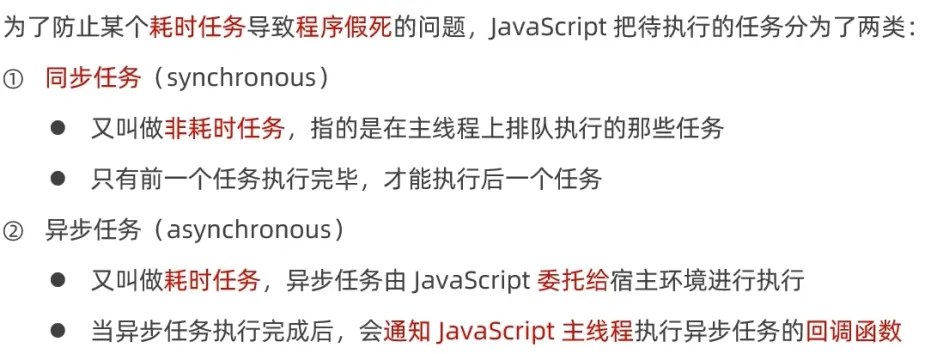
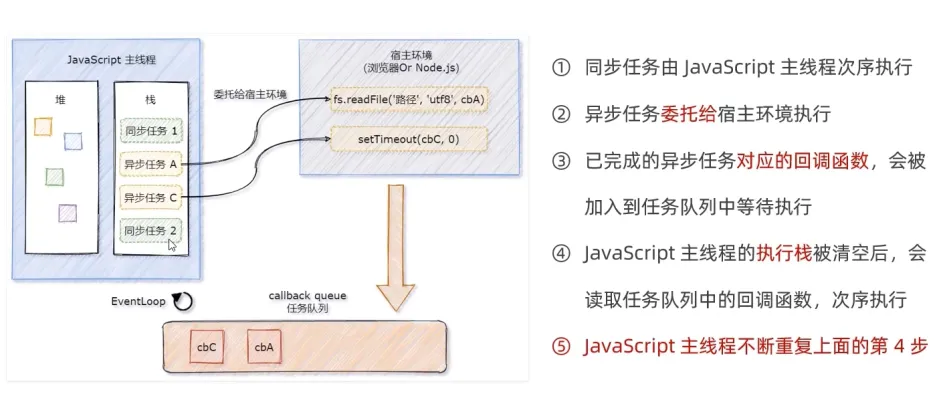
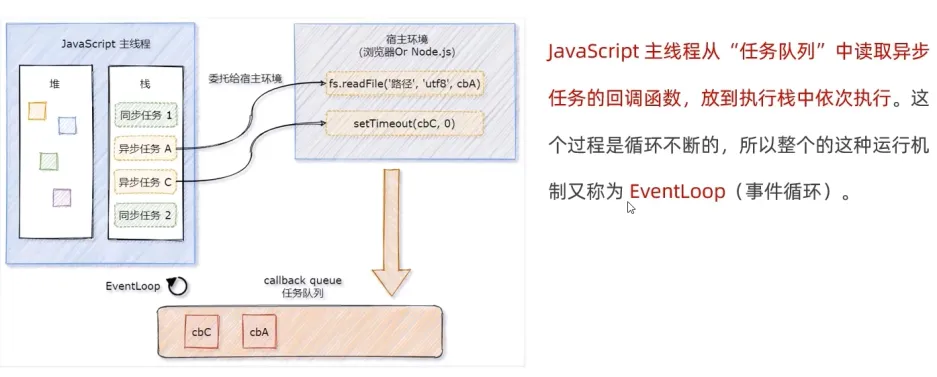

## 5、宏任务与微任务
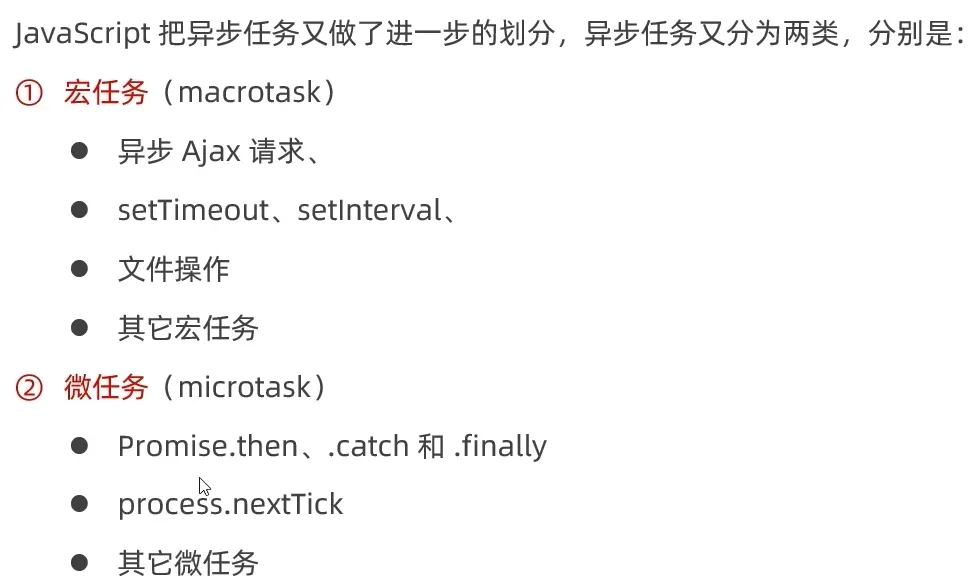
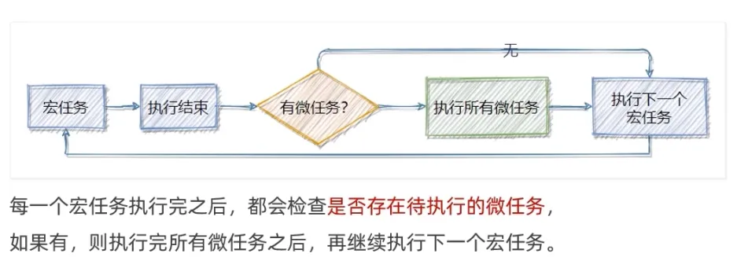
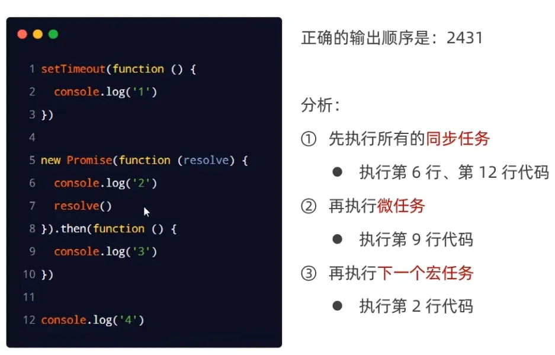
