# 五、`Vuex`

## 1、介绍

`vuex`是 vue 的一个状态(数据)管理工具，帮助我们管理 vue 通用的数据(多组件共享的数据)。

例如，个人信息只需要维护一份，使用组件通信机制太麻烦。

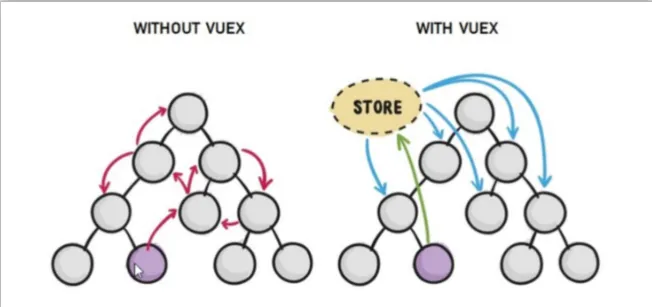
使用`vuex`可以：

- 集中管理数据
- 响应式变化

## 2、`state`：数据/状态

`state`提供唯一的公共数据源，所有共享数据需要放到`store`中的`state`。

### (1) 数据定义

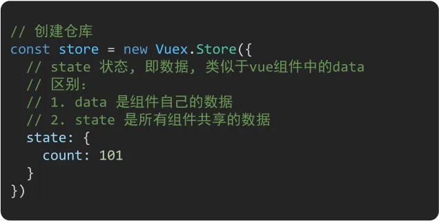

### (2) 数据使用

#### 通过`store`直接访问

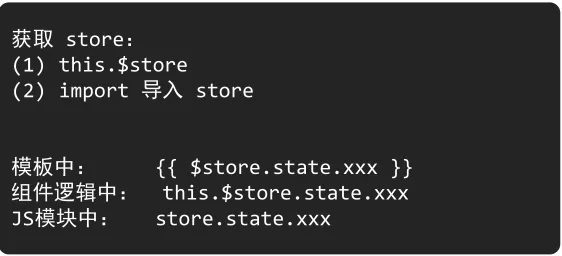

#### 通过辅助函数`mapState`

`mapState`可以帮助将`store`中的数据自动映射到组件的**计算属性**中。

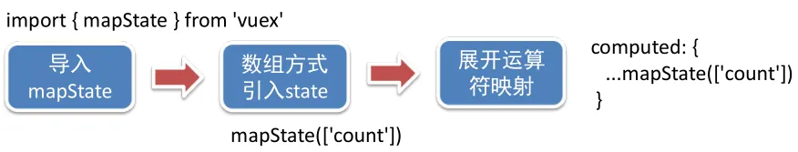

## 3、`mutations`数据/状态转变

用于修改`state`中的数据。

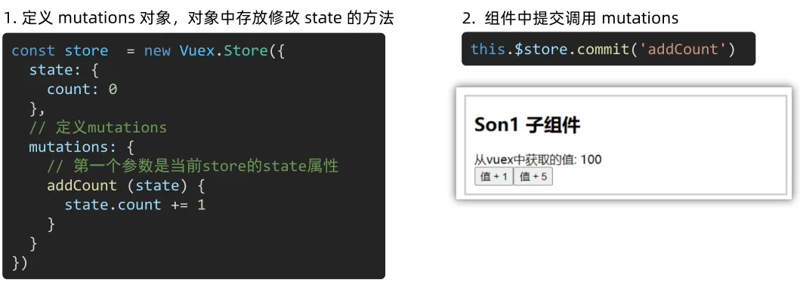

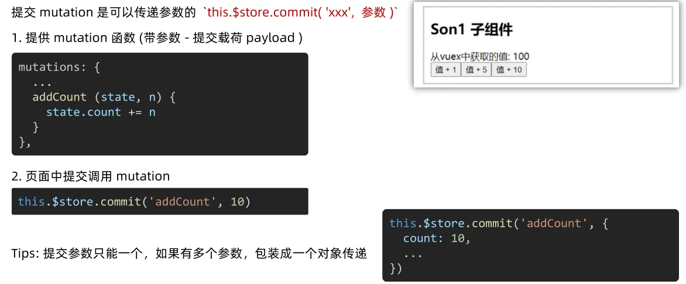

辅助函数`mapMutations`：将`mutations`中的方法提取出来，映射到组件的`methods`中。

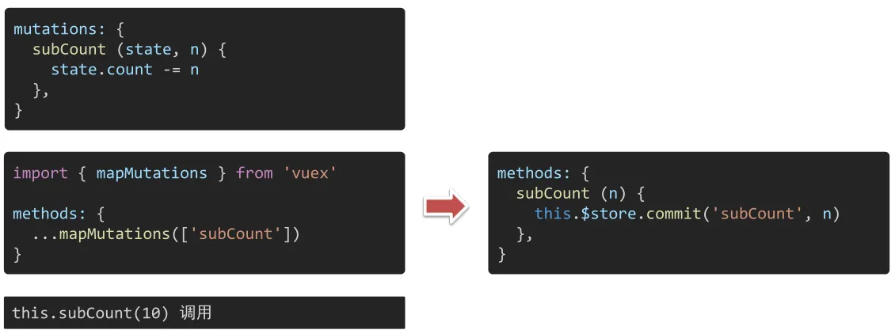

**知识链接：js 中的 `...`**

在 JavaScript 中，"..."表示剩余参数（Rest Parameters）或扩展操作符（Spread Operator）。

1. 剩余参数（Rest Parameters）：当在函数定义中使用`...`时，它表示接受任意数量的参数，并将它们作为数组存储在变量中。这样可以处理不确定数量的函数参数。

使用案例如下：

```vue
// 计算所有数字之和
function sum(...numbers) {
  let total = 0;
  for (let number of numbers) {
    total += number;
  }
  return total;
}

console.log(sum(1, 2, 3, 4)); // 输出: 10

```

> 2. 扩展操作符（Spread Operator）：当在函数调用或数组/对象字面量中使用`...`时，它可以将数组或对象展开为单独的值。这在创建新的数组、合并数组或传递多个参数时非常有用。
>
> 使用案例如下：

```vue
// 创建新数组
const array1 = [1, 2, 3];
const array2 = [...array1, 4, 5, 6];
console.log(array2); // 输出: [1, 2, 3, 4, 5, 6]

// 合并数组
const array3 = [7, 8, 9];
const mergedArray = [...array1, ...array3];
console.log(mergedArray); // 输出: [1, 2, 3, 7, 8, 9]

// 函数调用中的参数传递
function greet(name, age) {
  console.log(`Hello ${name}! You are ${age} years old.`);
}

const person = ['Alice', 25];
greet(...person); // 输出: Hello Alice! You are 25 years old.

```

## 4、`actions`：异步操作

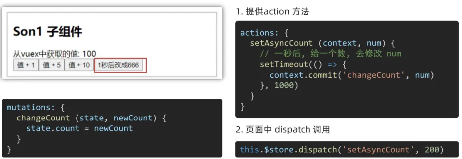

使用`mapActions`辅助函数将`actions`中的方法提取出来，映射到组件`methods`中。

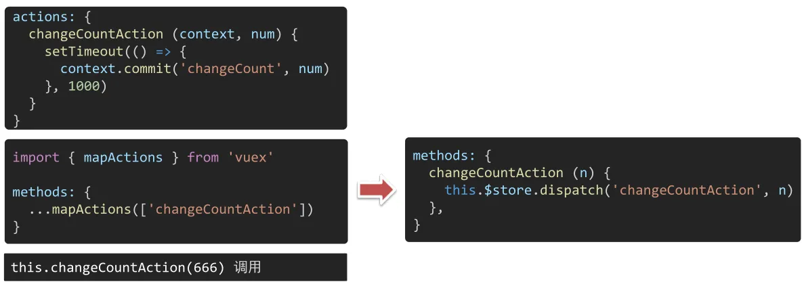

**知识链接：JS 中的箭头函数**

在 JavaScript 中，箭头函数（Arrow Functions）是一种简化函数表达式的语法形式。箭头函数提供了一种更简洁的方式来定义函数，并且在某些情况下可以改变函数内部的`this`的行为。
箭头函数的语法形式如下：


```vue
(param1, param2, ..., paramN) => {
  // 函数体
}

```

箭头函数的特点如下：

1. 简洁的语法：箭头函数使用箭头(`=>`)来表示函数，省略了`function`关键字和函数体中的`return`关键字（如果函数体只有一行表达式）。
2. 隐式返回：如果函数体只有一条表达式，箭头函数会自动将该表达式的结果作为返回值，例如：

```vue
// 传统函数表达式
const add = function(a, b) {
  return a + b;
};

// 箭头函数
const add = (a, b) => a + b;

```

3. 没有自己的`**this**`：箭头函数没有自己的`this`值，它会继承外部作用域的`this`值。这意味着箭头函数内部的`this`与外部作用域的`this`是相同的，不会因为函数的调用方式而改变。

总的来说，箭头函数提供了一种简洁的语法形式来定义函数，并且在处理函数作用域和`this`值时具有特殊的行为。但请注意，箭头函数并不适用于所有场景，特别是在需要动态绑定`this`的情况下，传统函数表达式仍然是更好的选择。

## 5、`getters`：vuex 中的计算属性

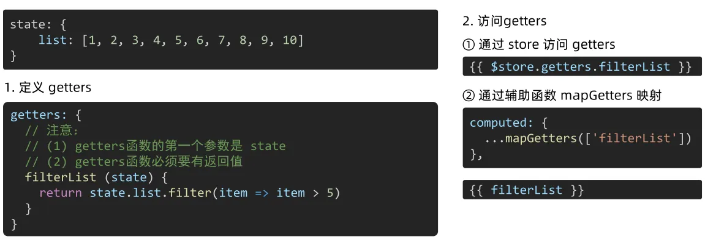

## 6、模块化

在`store`中使用单一`state`会很庞大：

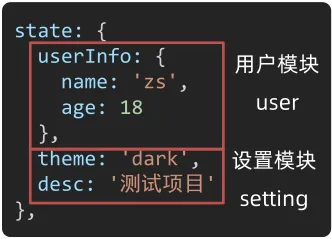

将`state`中的结点进行模块化拆分：
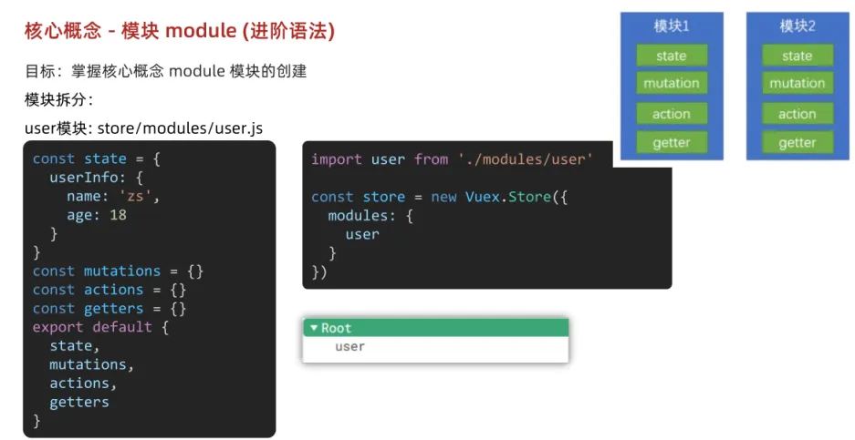
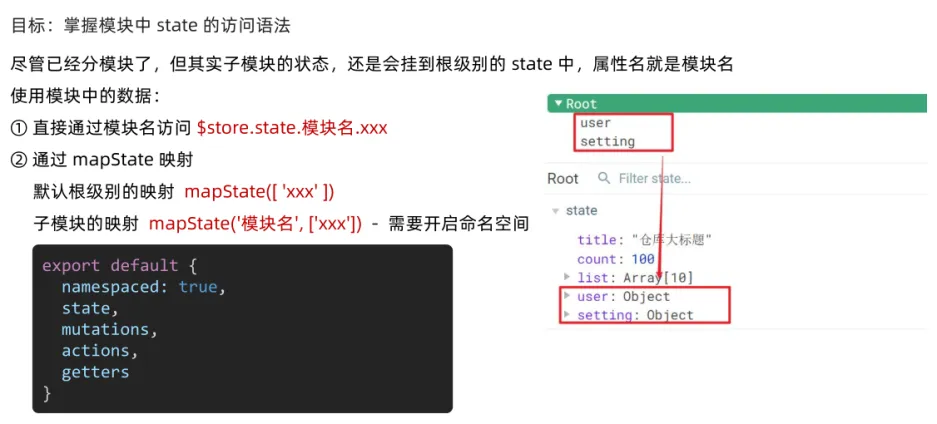
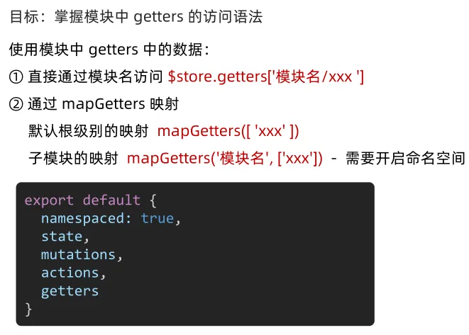
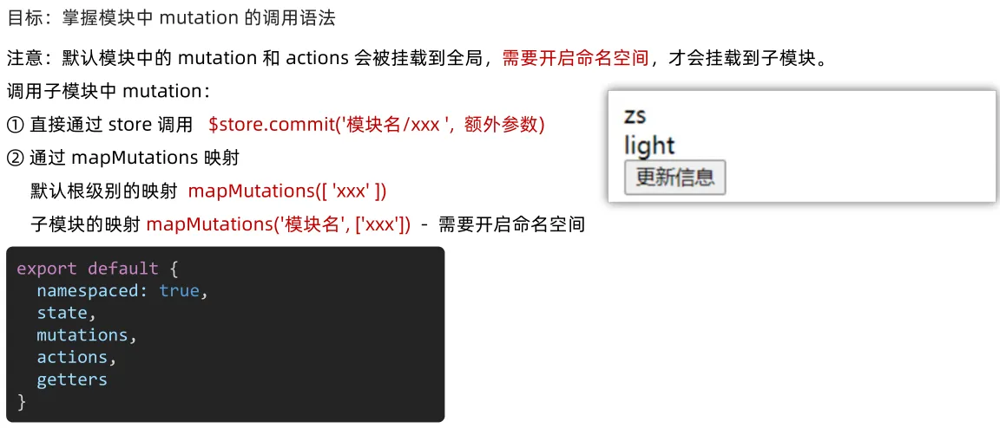
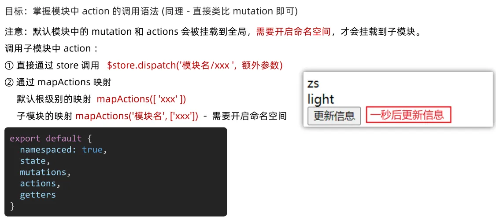

