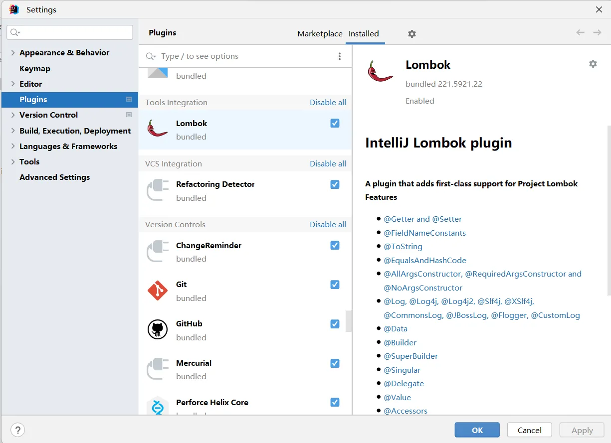
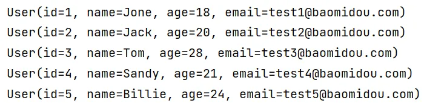

# 一、Mybatis-plus 入门案例

官网：https://baomidou.com/

## 1、数据库

**创建数据库和表**

```sql
CREATE DATABASE `mybatis_plus` /*!40100 DEFAULT CHARACTER SET utf8mb4 */;
use `mybatis_plus`;
CREATE TABLE `user` (
  `id` bigint(20) NOT NULL COMMENT '主键ID',
  `name` varchar(30) DEFAULT NULL COMMENT '姓名',
  `age` int(11) DEFAULT NULL COMMENT '年龄',
  `email` varchar(50) DEFAULT NULL COMMENT '邮箱',
  PRIMARY KEY (`id`)
) ENGINE=InnoDB DEFAULT CHARSET=utf8;
```

**添加数据**

```sql
INSERT INTO user (id, name, age, email) VALUES
(1, 'Jone', 18, 'test1@baomidou.com'),
(2, 'Jack', 20, 'test2@baomidou.com'),
(3, 'Tom', 28, 'test3@baomidou.com'),
(4, 'Sandy', 21, 'test4@baomidou.com'),
(5, 'Billie', 24, 'test5@baomidou.com');
```

## 2、创建 SpringBoot 工程

**创建 SpringBoot 工程，添加依赖如下**

> **注：一定要使用 SpringBoot 整合 Mybatis-plus 框架。**

```xml
<?xml version="1.0" encoding="UTF-8"?>
<project xmlns="http://maven.apache.org/POM/4.0.0" xmlns:xsi="http://www.w3.org/2001/XMLSchema-instance"
         xsi:schemaLocation="http://maven.apache.org/POM/4.0.0 https://maven.apache.org/xsd/maven-4.0.0.xsd">
    <modelVersion>4.0.0</modelVersion>
    <parent>
        <groupId>org.springframework.boot</groupId>
        <artifactId>spring-boot-starter-parent</artifactId>
        <version>2.7.7</version>
        <relativePath/> <!-- lookup parent from repository -->
    </parent>
    <groupId>com.zzy</groupId>
    <artifactId>introduction</artifactId>
    <version>0.0.1-SNAPSHOT</version>
    <name>Mybatis-001-introduction</name>
    <description>Mybatis-001-introduction</description>
    <properties>
        <java.version>1.8</java.version>
    </properties>
    <dependencies>
        <dependency>
            <groupId>org.springframework.boot</groupId>
            <artifactId>spring-boot-starter</artifactId>
        </dependency>

        <dependency>
            <groupId>org.springframework.boot</groupId>
            <artifactId>spring-boot-starter-test</artifactId>
            <scope>test</scope>
        </dependency>

        <dependency>
            <groupId>com.baomidou</groupId>
            <artifactId>mybatis-plus-boot-starter</artifactId>
            <version>3.5.2</version>
        </dependency>
      
        <dependency>
            <groupId>org.projectlombok</groupId>
            <artifactId>lombok</artifactId>
            <optional>true</optional>
        </dependency>

        <dependency>
            <groupId>mysql</groupId>
            <artifactId>mysql-connector-java</artifactId>
        </dependency>
    </dependencies>

    <build>
        <plugins>
            <plugin>
                <groupId>org.springframework.boot</groupId>
                <artifactId>spring-boot-maven-plugin</artifactId>
            </plugin>
        </plugins>
    </build>

</project>
```

**安装 Lombok 插件**


## 3、编写代码

**配置 **`**application.yml**`
配置数据源

```yaml
spring:
  # 配置数据源信息
  datasource:
    # 配置连接数据库信息
    driver-class-name: com.mysql.cj.jdbc.Driver
    url: jdbc:mysql://localhost:3306/mybatis_plus?serverTimezone=GMT%2B8&characterEncoding=utf-8&useSSL=false
    username: root
    password: 991118
```

**配置启动类**
在启动类中添加 `@MapperScan`注解，扫描 Mapper 包。

```java
package com.zzy.introduction;

import org.mybatis.spring.annotation.MapperScan;
import org.springframework.boot.SpringApplication;
import org.springframework.boot.autoconfigure.SpringBootApplication;

@MapperScan("com.zzy.introduction.mapper")
@SpringBootApplication
public class Mybatis001IntroductionApplication {

    public static void main(String[] args) {
        SpringApplication.run(Mybatis001IntroductionApplication.class, args);
    }

}
```

**添加实体类**

```java
@NoArgsConstructor // 无参构造
@AllArgsConstructor // 所有参数的构造方法
@Getter
@Setter
@EqualsAndHashCode
public class User {
    private Long id;
    private String name;
    private Integer age;
    private String email;
}
```

> 以上所有注解等价于 `@Data`注解。

```java
@Data
public class User {
    private Long id;
    private String name;
    private Integer age;
    private String email;
}
```

**添加 mapper**

> `BaseMapper` 是 MyBatis-Plus 提供的模板 mapper，其中包含了基本的 CRUD 方法，泛型为操作的实体类型。

```java
@Repository
public interface UserMapper extends BaseMapper<User> {
}
```

**测试**

```java
@SpringBootTest
public class UserMapperTest {
    @Autowired
    private UserMapper userMapper;

    @Test
    public void testSelectList() {
        //selectList()根据MP内置的条件构造器查询一个list集合，null表示没有条件，即查询所有
        userMapper.selectList(null).forEach(System.out::println);
    }
}
```

测试结果：



**添加日志，查看生成的 SQL 语句**

```yaml
# 配置MyBatis日志
mybatis-plus:
  configuration:
    log-impl: org.apache.ibatis.logging.stdout.StdOutImpl
```
