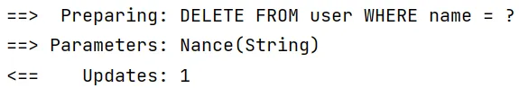

# 二、Mybatis-plus 中的 CRUD

## 1、源码以及注释

```java
public interface BaseMapper<T> extends Mapper<T> {

    /**
     * 插入一条记录
     *
     * @param entity 实体对象
     */
    int insert(T entity);

    /**
     * 根据 ID 删除
     *
     * @param id 主键ID
     */
    int deleteById(Serializable id);

    /**
     * 根据实体(ID)删除
     *
     * @param entity 实体对象
     * @since 3.4.4
     */
    int deleteById(T entity);

    /**
     * 根据 columnMap 条件，删除记录
     *
     * @param columnMap 表字段 map 对象
     */
    int deleteByMap(@Param(Constants.COLUMN_MAP) Map<String, Object> columnMap);

    /**
     * 根据 entity 条件，删除记录
     *
     * @param queryWrapper 实体对象封装操作类（可以为 null,里面的 entity 用于生成 where 语句）
     */
    int delete(@Param(Constants.WRAPPER) Wrapper<T> queryWrapper);

    /**
     * 删除（根据ID或实体 批量删除）
     *
     * @param idList 主键ID列表或实体列表(不能为 null 以及 empty)
     */
    int deleteBatchIds(@Param(Constants.COLL) Collection<?> idList);

    /**
     * 根据 ID 修改
     *
     * @param entity 实体对象
     */
    int updateById(@Param(Constants.ENTITY) T entity);

    /**
     * 根据 whereEntity 条件，更新记录
     *
     * @param entity        实体对象 (set 条件值,可以为 null)
     * @param updateWrapper 实体对象封装操作类（可以为 null,里面的 entity 用于生成 where 语句）
     */
    int update(@Param(Constants.ENTITY) T entity, @Param(Constants.WRAPPER) Wrapper<T> updateWrapper);

    /**
     * 根据 ID 查询
     *
     * @param id 主键ID
     */
    T selectById(Serializable id);

    /**
     * 查询（根据ID 批量查询）
     *
     * @param idList 主键ID列表(不能为 null 以及 empty)
     */
    List<T> selectBatchIds(@Param(Constants.COLL) Collection<? extends Serializable> idList);

    /**
     * 查询（根据 columnMap 条件）
     *
     * @param columnMap 表字段 map 对象
     */
    List<T> selectByMap(@Param(Constants.COLUMN_MAP) Map<String, Object> columnMap);

    /**
     * 根据 entity 条件，查询一条记录
     * <p>查询一条记录，例如 qw.last("limit 1") 限制取一条记录, 注意：多条数据会报异常</p>
     *
     * @param queryWrapper 实体对象封装操作类（可以为 null）
     */
    default T selectOne(@Param(Constants.WRAPPER) Wrapper<T> queryWrapper) {
        List<T> ts = this.selectList(queryWrapper);
        if (CollectionUtils.isNotEmpty(ts)) {
            if (ts.size() != 1) {
                throw ExceptionUtils.mpe("One record is expected, but the query result is multiple records");
            }
            return ts.get(0);
        }
        return null;
    }

    /**
     * 根据 Wrapper 条件，判断是否存在记录
     *
     * @param queryWrapper 实体对象封装操作类
     * @return 是否存在记录
     */
    default boolean exists(Wrapper<T> queryWrapper) {
        Long count = this.selectCount(queryWrapper);
        return null != count && count > 0;
    }

    /**
     * 根据 Wrapper 条件，查询总记录数
     *
     * @param queryWrapper 实体对象封装操作类（可以为 null）
     */
    Long selectCount(@Param(Constants.WRAPPER) Wrapper<T> queryWrapper);

    /**
     * 根据 entity 条件，查询全部记录
     *
     * @param queryWrapper 实体对象封装操作类（可以为 null）
     */
    List<T> selectList(@Param(Constants.WRAPPER) Wrapper<T> queryWrapper);

    /**
     * 根据 Wrapper 条件，查询全部记录
     *
     * @param queryWrapper 实体对象封装操作类（可以为 null）
     */
    List<Map<String, Object>> selectMaps(@Param(Constants.WRAPPER) Wrapper<T> queryWrapper);

    /**
     * 根据 Wrapper 条件，查询全部记录
     * <p>注意： 只返回第一个字段的值</p>
     *
     * @param queryWrapper 实体对象封装操作类（可以为 null）
     */
    List<Object> selectObjs(@Param(Constants.WRAPPER) Wrapper<T> queryWrapper);

    /**
     * 根据 entity 条件，查询全部记录（并翻页）
     *
     * @param page         分页查询条件（可以为 RowBounds.DEFAULT）
     * @param queryWrapper 实体对象封装操作类（可以为 null）
     */
    <P extends IPage<T>> P selectPage(P page, @Param(Constants.WRAPPER) Wrapper<T> queryWrapper);

    /**
     * 根据 Wrapper 条件，查询全部记录（并翻页）
     *
     * @param page         分页查询条件
     * @param queryWrapper 实体对象封装操作类
     */
    <P extends IPage<Map<String, Object>>> P selectMapsPage(P page, @Param(Constants.WRAPPER) Wrapper<T> queryWrapper);
}
```

## 2、测试

### (1) 插入

```java
@Test
public void testInsert() {
    User user = new User();
    user.setId(6L);
    user.setName("Nance");
    user.setAge(25);
    user.setEmail("test6@baomidou.com");
    int insert = userMapper.insert(user);
    System.out.println(insert);
}
```

> 如果不对主键 id 进行控制，Mybatis-plus 会使用雪花算法生成主键。
> 本次插入生成主键值为：1607705014293975041

### (2) 删除

**通过主键删除**

```java
    @Test
    public void testDeleteById() {
        int count = userMapper.deleteById(1607705014293975041L);
        System.out.println("受影响的行数为：" + count);
    }
```

**通过批量主键删除**

```java
    @Test
    public void testDeleteBatchIds() {
        List<Long> ids = new ArrayList<>();
        ids.add(1607912229495799809L);
        ids.add(1607912274102210562L);
        int count = userMapper.deleteBatchIds(ids);
        System.out.println("受影响的行数为：" + count);
    }
```

生成的 SQL 语句：


**通过 map 删除**

```java
    @Test
    public void testDeleteByMap() {
        Map<String, Object> map = new HashMap<>();
        map.put("name", "Nance");
        int count = userMapper.deleteByMap(map);
        System.out.println("受影响的行数为：" + count);
    }
```

生成的 SQL 语句：



### (3) 修改

**通过主键更新**

```java
    @Test
    public void testUpdateById() {
        User user = new User();
        user.setId(1607914460379025410L);
        user.setName("Nance");
        user.setAge(24);

        int count = userMapper.updateById(user);
        System.out.println("受影响的行数为：" + count);
    }
```

生成的 SQL 语句：


> 实体对象中没有设置的属性不会进行更新。

### (4) 查询

**通过主键查询**

```java
    @Test
    public void testSelectById() {
        User user = userMapper.selectById(1607914460379025410L);
        System.out.println(user);
    }
```

生成的 SQL 语句：


**通过多主键查询**

```java
    @Test
    public void testSelectBatchIds() {
        List<Long> idList = new ArrayList<>();
        idList.add(1L);
        idList.add(2L);
        List<User> users = userMapper.selectBatchIds(idList);
        for (User user : users) {
            System.out.println(user);
        }
    }
```

生成的 SQL 语句：


**通过 map 查询**

```java
@Test
public void testSelectByMap(){
	//通过map条件查询用户信息
	//SELECT id,name,age,email FROM user WHERE name = ? AND age = ?
	Map<String, Object> map = new HashMap<>();
	map.put("age", 22);
	map.put("name", "admin");
	List<User> list = userMapper.selectByMap(map);
	list.forEach(System.out::println);
}

```

**查询所有数据**

```java
    @Test
    public void testSelectList1() {
        //查询所有用户信息
        //SELECT id,name,age,email FROM user
        List<User> list = userMapper.selectList(null);
        list.forEach(System.out::println);
    }
```

## 3、自定义功能

如果 Mybatis-plus 提供的单表查询不能满足需求，可以像 Mybatis 一样在 mapper 映射文件中写 SQL 语句。mapper 映射文件默认地址：


## 4、通用 Service

### (1) 构建方法

> 通用 Service CRUD 封装 `IService` 接口，进一步封装 CRUD 采用 `get` 查询单行 `remove` 删除 `list` 查询集合 `page` 分页 前缀命名方式区分 Mapper 层避免混淆

`ServiceImpl`实现了 `IService`接口。
使用如下方式构建 Service 结构：


Service 接口：

```java
public interface UserService extends IService<User> {
}
```

Service 实现类：

```java
@Service
public class UserServiceImpl extends ServiceImpl<UserMapper, User> implements UserService {
}
```

**使用测试**

```java
@SpringBootTest
public class UserServiceTest {
    @Autowired
    private UserService userService;

    @Test
    public void testList() {
        List<User> list = userService.list();
        for (User user : list) {
            System.out.println(user);
        }
    }
}
```

测试结果：


### (2) 常用 API


