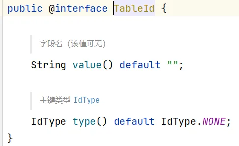
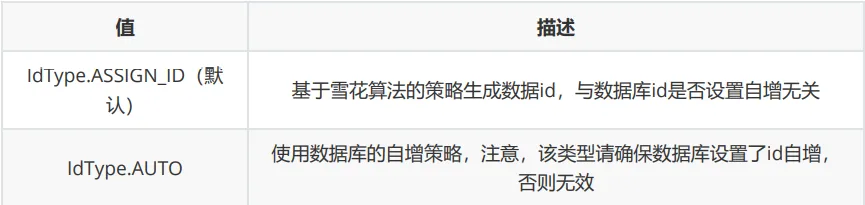
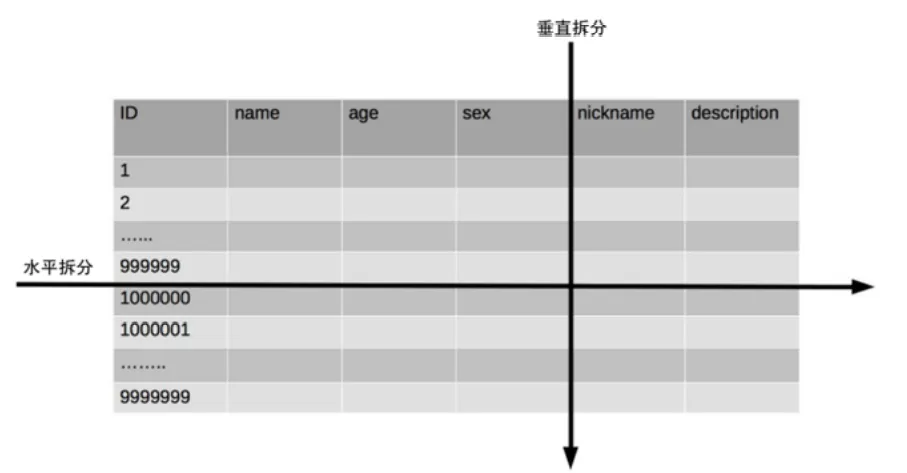
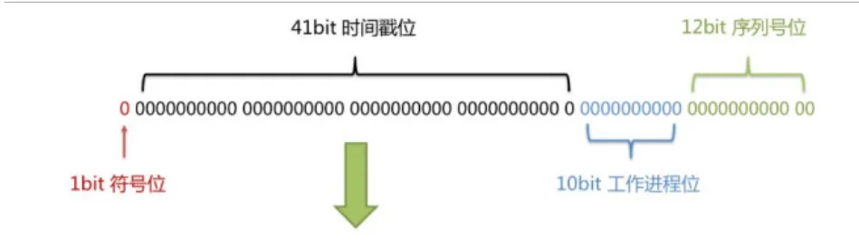
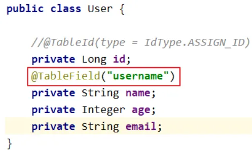
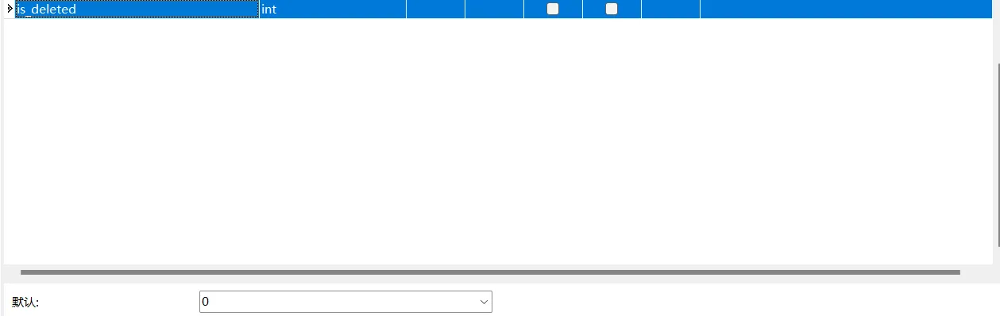
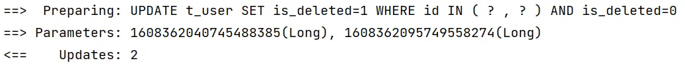
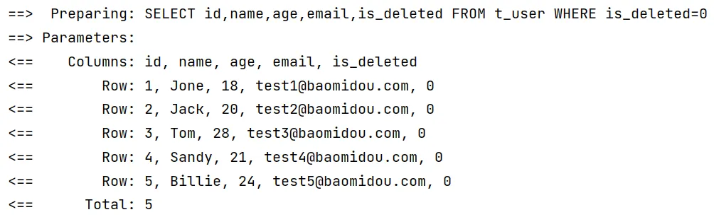

# 三、常用注解

## 1、`@TableName`

> Mybatis-plus 在默认情况下，将实体类和表名按驼峰命名规则进行对应。如果表名有前缀，则需要手动进行配置。

```java
@Data
@TableName("t_user")
public class User {
    private Long id;
    private String name;
    private Integer age;
    private String email;
}
```

> 如果大量表名都是一样的前缀，可以进行全局配置。

```yaml
mybatis-plus:
	global-config:
    db-config:
      table-prefix: t_
```

## 2、`@TableId`

> Mybatis-plus 使用雪花算法生成主键 id，如果表的主键不是 id，需要在实体类中进行指定。这样便可以以雪花算法生成主键。

```yaml
@Data
public class User {
    @TableId
    private Long id;
    private String name;
    private Integer age;
    private String email;
}
```

该注解还有两个属性：



1. **value**

基本上不会使用。如果实体类属性和字段无法使用驼峰命名规则对应，使用 `value`属性进行对应。

2. **type**

设置主键生成策略，常用的主键生成策略如下：



```java
@Data
public class User {
    @TableId(type = IdType.AUTO)
    private Long id;
    private String name;
    private Integer age;
    private String email;
}
```

如果需要进行全局配置：

```yaml
mybatis-plus:
  global-config:
    db-config:
      id-type: auto
```

> 雪花算法
> 背景：数据规模不断增长，需要扩展数据库。扩展数据库的三种方式：业务分库、主从复制和数据库分表。
> 如果对单表进行差分，可以使用垂直分表和水平分表。
> 
> 垂直分表将不常用的字段拆分到别的表中。
> 水平分表更加复杂，处理全局唯一的主键是一个复杂问题。雪花算法就是 Twitter 公司公布的分布式主键生成算法，它能够保证不同表的主键的不重复性，以及相同表的主键的有序性。  
> 
> 优点： 整体上按照时间自增排序，并且整个分布式系统内不会产生ID碰撞，并且效率较高。

## 3、`@TableFiled`

> 如果实体类属性使用驼峰命名风格，数据库字段使用下划线命名风格，Mybatis-plus 可以自动进行对应，无需额外配置。
> 如果属性和字段不按上述方式进行对应，则需要在属性上添加 `@TableFiled`注解。



此注解基本不会使用。

## 4、`@TableLogic`

> 物理删除：将记录从数据库中删除。
> 逻辑删除：将记录的 "已删除" 字段置为 1。
> 使用逻辑删除可以进行数据恢复。

**使用逻辑删除的步骤**

1. **表中添加 "已删除" 字段，将其默认值设置为 0**



2. **在实体类添加 "已删除" 属性，添加 `@TableLogic`注解**

```java
@Data
public class User {
    private Long id;
    private String name;
    private Integer age;
    private String email;
    @TableLogic
    private Integer isDeleted;
}
```

**测试**
进行删除时，将不会使用 delete，而是 update。



进行查询时，附带 `is_deleted=0`条件。


