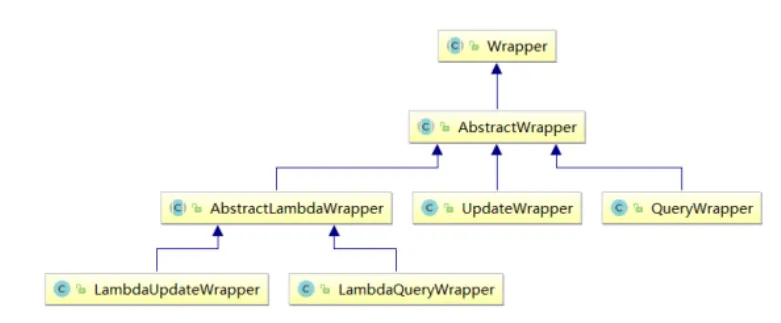
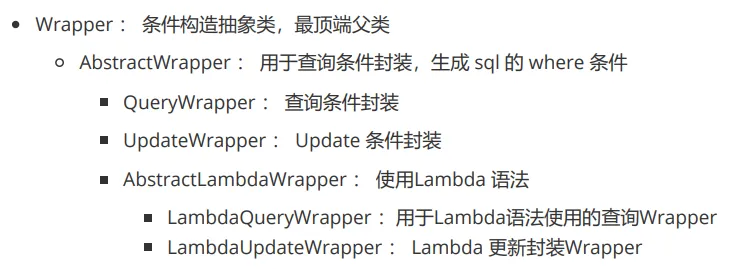
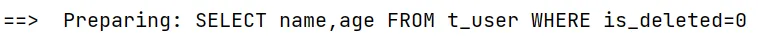
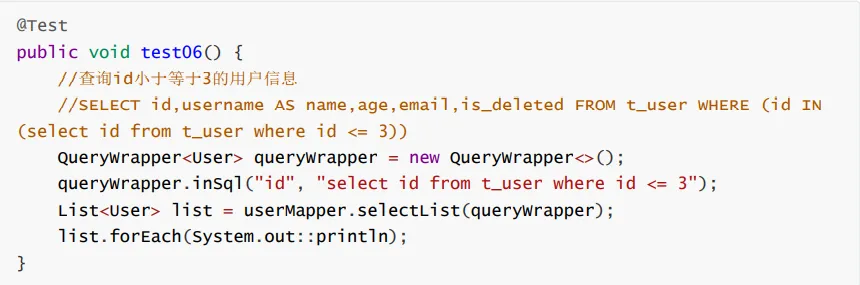
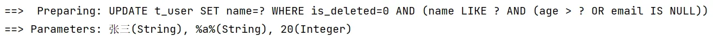
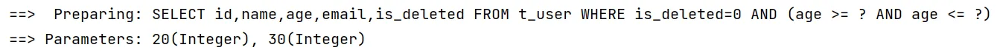
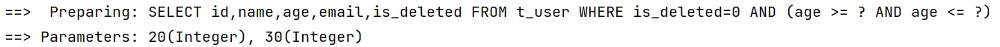
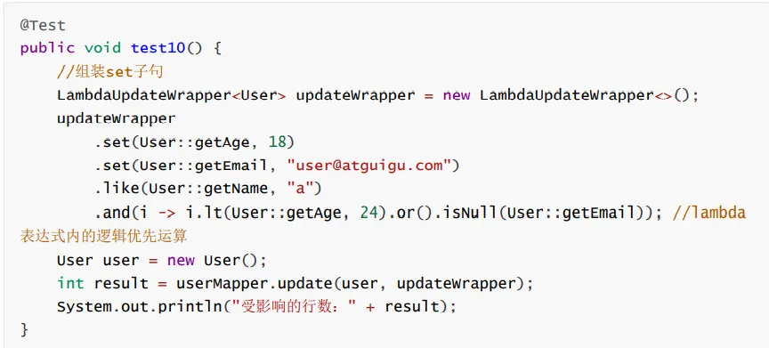

# 四、条件构造器

条件构造器`Wrapper`的作用是封装查询条件。
继承关系图如下：



## 1、`QueryWrapper`

> 查询条件：`like`, `between`, `isNotNull`, `isNull`
> 排序：`OrderByDesc`, `OrderByAsc`
> 优先级：`and(i -> i.)`
> 选择字段：`select`
> 子查询：`insql`

### (1) 组装查询条件

```java
    @Test
    public void testSelectList() {
        QueryWrapper<User> queryWrapper = new QueryWrapper<>();
        // 名字中含有a并且年龄在20-30岁之间并且邮箱不为空
        queryWrapper.like("name", "a")
                .between("age", 20, 30)
                .isNotNull("email");
        List<User> users = userMapper.selectList(queryWrapper);
        for (User user : users) {
            System.out.println(user);
        }
    }
```

生成的 SQL 语句：

```
==>  Preparing: SELECT id,name,age,email,is_deleted FROM t_user WHERE is_deleted=0 AND (name LIKE ? AND age BETWEEN ? AND ? AND email IS NOT NULL)
==> Parameters: %a%(String), 20(Integer), 30(Integer)
```

### (2) 组装排序条件

```java
    @Test
    public void testOrder() {
        QueryWrapper<User> queryWrapper = new QueryWrapper<>();
        // 按年龄降序，按id升序查询
        queryWrapper.orderByDesc("age")
                .orderByAsc("id");
        List<User> users = userMapper.selectList(queryWrapper);
        for (User user : users) {
            System.out.println(user);
        }
    }
```

生成的 SQL 语句：

```
==>  Preparing: SELECT id,name,age,email,is_deleted FROM t_user WHERE is_deleted=0 ORDER BY age DESC,id ASC
```

### (3) 条件优先级

> 在括号内填入整个条件。

```java
    @Test
    public void testConditionPriority() {
        QueryWrapper<User> queryWrapper = new QueryWrapper<>();
        // 查询用户名含有a并且（年龄大于20或邮箱为null）的用户
        queryWrapper.like("name", "a")
                .and(i->i.gt("age", 20).or().isNull("email"));
        List<User> users = userMapper.selectList(queryWrapper);
        users.forEach(System.out::println);
    }
```

生成的 SQL 语句：

```
==>  Preparing: SELECT id,name,age,email,is_deleted FROM t_user WHERE is_deleted=0 AND (name LIKE ? AND (age > ? OR email IS NULL))
```

### (4) 字段选择

```java
    @Test
    public void testSelect() {
        QueryWrapper<User> queryWrapper = new QueryWrapper<>();
        // 查询所有记录，但只查看 name 和 age 字段
        queryWrapper.select("name", "age");
        List<User> users = userMapper.selectList(queryWrapper);
        users.forEach(System.out::println);
    }
```

生成的 SQL 语句：


### (5) 子查询

使用案例：


## 2、`UpdateWrapper`

使用 `UpdateWrapper`可以设置修改条件以及修改字段。

```java
    @Test
    public void testUpdateWrapper() {
        UpdateWrapper<User> updateWrapper = new UpdateWrapper<>();
        // 修改用户名含有a并且（年龄大于20或邮箱为null）的用户，将用户名修改为 张三
        updateWrapper.like("name", "a")
                .and(i -> i.gt("age", 20).or().isNull("email"))
                .set("name", "张三");
        int count = userMapper.update(null, updateWrapper);
        System.out.println("修改的记录数为：" + count);
    }
```

生成的 SQL 语句：


## 3、真实开发环境中条件拼接

> 使用 `condition`进行条件拼接。

```java
    @Test
    public void testCondition() {
        // 浏览器传来的数据
        String contain = "";
        Integer ageLow = 20;
        Integer ageHigh = 30;

        QueryWrapper<User> queryWrapper = new QueryWrapper<>();
        queryWrapper.like(StringUtils.isNotBlank(contain), "name", contain)
                .ge(ageLow!=null, "age", ageLow)
                .le(ageHigh!=null, "age", ageHigh);
        List<User> users = userMapper.selectList(queryWrapper);
        users.forEach(System.out::println);
    }
```

生成的 SQL 语句：


## 4、Lambda 条件构造器

> Lambda 条件构造器创新点在于：使用实体类属性。
> 表达式直接依照提示使用即可。

```java
    @Test
    public void testLambdaQueryWrapper() {
        // 浏览器传来的数据
        String contain = "";
        Integer ageLow = 20;
        Integer ageHigh = 30;

        LambdaQueryWrapper<User> lambdaQueryWrapper = new LambdaQueryWrapper<>();
        lambdaQueryWrapper.like(StringUtils.isNotBlank(contain), User::getName, contain)
                .ge(ageLow != null, User::getAge, ageLow)
                .le(ageHigh != null, User::getAge, ageHigh);
        List<User> users = userMapper.selectList(lambdaQueryWrapper);
        users.forEach(System.out::println);
    }
```

生成的 SQL 语句：


> 和使用 `QueryWrapper`没有区别。


