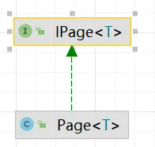
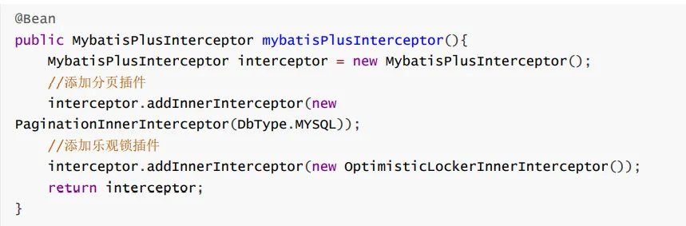
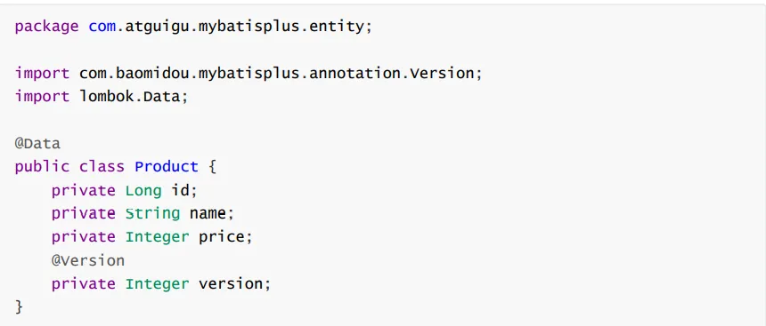

# 五、插件

## 1、分页插件

### (1) 基本使用

**创建 Mybatis-plus 配置类**

> 添加分页拦截器

```java
@Configuration
// SpringBoot 配置类中无需此注解
@MapperScan("com.zzy.introduction.mapper")
public class MybatisPlusConfig {

    @Bean
    public MybatisPlusInterceptor mybatisPlusInterceptor() {
        MybatisPlusInterceptor interceptor = new MybatisPlusInterceptor();
        interceptor.addInnerInterceptor(new PaginationInnerInterceptor(DbType.MYSQL));
        return interceptor;
    }
}
```

**使用测试**

```java
    @Test
    public void testPagePlugin() {
        //设置分页参数
        Page<User> page = new Page<>(1, 2);
        userMapper.selectPage(page, null);
        //获取当前页数据
        List<User> list = page.getRecords();
        list.forEach(System.out::println);
        System.out.println("当前页：" + page.getCurrent());
        System.out.println("每页显示的条数：" + page.getSize());
        System.out.println("总记录数：" + page.getTotal());
        System.out.println("总页数：" + page.getPages());
        System.out.println("是否有上一页：" + page.hasPrevious());
        System.out.println("是否有下一页：" + page.hasNext());

    }
```

### (2) 自定义 SQL 中使用分页插件

**Mapper 接口**

> `IPage`和 `Page`的实现关系如下：
> 
> 
> 
> 因此返回值为 `Ipage`类型。

```java
@Repository
public interface UserMapper extends BaseMapper<User> {
    IPage<User> selectPageDiy(@Param("page") Page<User> page, @Param("age") Integer age);
}
```

**Mapper 映射文件**

```xml
<select id="selectPageDiy" resultType="User">
  select * from t_user where age > #{age}
</select>
```

> 由于使用了类型别名，需要在 application.yml 中设置别名包。

```yaml
mybatis-plus:
  configuration:
    log-impl: org.apache.ibatis.logging.stdout.StdOutImpl
  global-config:
    db-config:
      table-prefix: t_
  type-aliases-package: com.zzy.introduction.pojo
```

**使用测试**

```java
    @Test
    public void testPageDiy() {
        //设置分页参数
        Page<User> page = new Page<>(1, 2);
        userMapper.selectPageDiy(page, 20);
        //获取当前页数据
        List<User> list = page.getRecords();
        list.forEach(System.out::println);
        System.out.println("当前页：" + page.getCurrent());
        System.out.println("每页显示的条数：" + page.getSize());
        System.out.println("总记录数：" + page.getTotal());
        System.out.println("总页数：" + page.getPages());
        System.out.println("是否有上一页：" + page.hasPrevious());
        System.out.println("是否有下一页：" + page.hasNext());
    }
```

## 2、乐观锁

> 乐观锁与悲观锁
> 悲观锁：同一时刻只能有一人操作数据库。
> 乐观锁：基于版本号对数据库操作顺序进行控制，根据版本号判断现在是否可以修改数据。
> 乐观锁使用步骤：
>
> 1. 查询数据库得到版本号
> 2. 根据得到的版本号生成更新的 SQL 语句

### 使用步骤

**配置类中添加乐观锁拦截器**

**表中添加 version 字段**

**实体类添加 version 属性并添加 `@version`注解**


