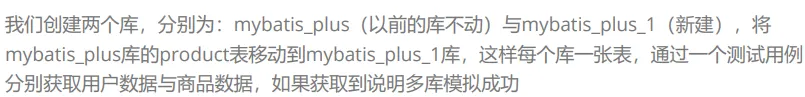

# 八、多数据源

> 多数据源的使用场景：纯粹多库、读写分离、一主多从、混合模式等等。

## 使用测试



### 1、数据库

> 创建数据库和表

```sql
CREATE DATABASE `mybatis_plus_1` /*!40100 DEFAULT CHARACTER SET utf8mb4 */;
use `mybatis_plus_1`;
CREATE TABLE t_product
(
  id BIGINT(20) NOT NULL COMMENT '主键ID',
  name VARCHAR(30) NULL DEFAULT NULL COMMENT '商品名称',
  price INT(11) DEFAULT 0 COMMENT '价格',
  version INT(11) DEFAULT 0 COMMENT '乐观锁版本号',
  PRIMARY KEY (id)
);
```

> 添加测试数据

```sql
INSERT INTO product (id, NAME, price) VALUES (1, '外星人笔记本', 100);
```

### 2、依赖引入

> Mybatis-plus 多数据源依赖

```xml
<dependency>
  <groupId>com.baomidou</groupId>
  <artifactId>dynamic-datasource-spring-boot-starter</artifactId>
  <version>3.5.2</version>
</dependency>
```

### 3、配置多数据源

> 在 application.yml 中配置多数据源信息

```yaml
spring:
  # 配置数据源信息
  datasource:
    dynamic:
      # 设置默认的数据源或者数据源组,默认值即为master
      primary: master
      # 严格匹配数据源,默认false.true未匹配到指定数据源时抛异常,false使用默认数据源
      strict: false
      datasource:
        master:
          url: jdbc:mysql://localhost:3306/mybatis_plus?characterEncoding=utf-8&useSSL=false
          driver-class-name: com.mysql.cj.jdbc.Driver
          username: root
          password: 991118
        slave_1:
          url: jdbc:mysql://localhost:3306/mybatis_plus_1?characterEncoding=utf-8&useSSL=false
          driver-class-name: com.mysql.cj.jdbc.Driver
          username: root
          password: 991118
```

### 4、创建用户 Service 和商品 Service

> UserService 操作 master 数据源

```java
@DS("master") // 指定操作 master 数据源
@Service
public class UserServiceImpl extends ServiceImpl<UserMapper, User> implements UserService {
}
```

> ProductService 操作 slave_1 数据源

```java
@DS("slave_1") // 指定操作 slave_1 数据源
@Service
public class ProductServiceImpl extends ServiceImpl<ProductMapper, Product> implements ProductService {
}
```
