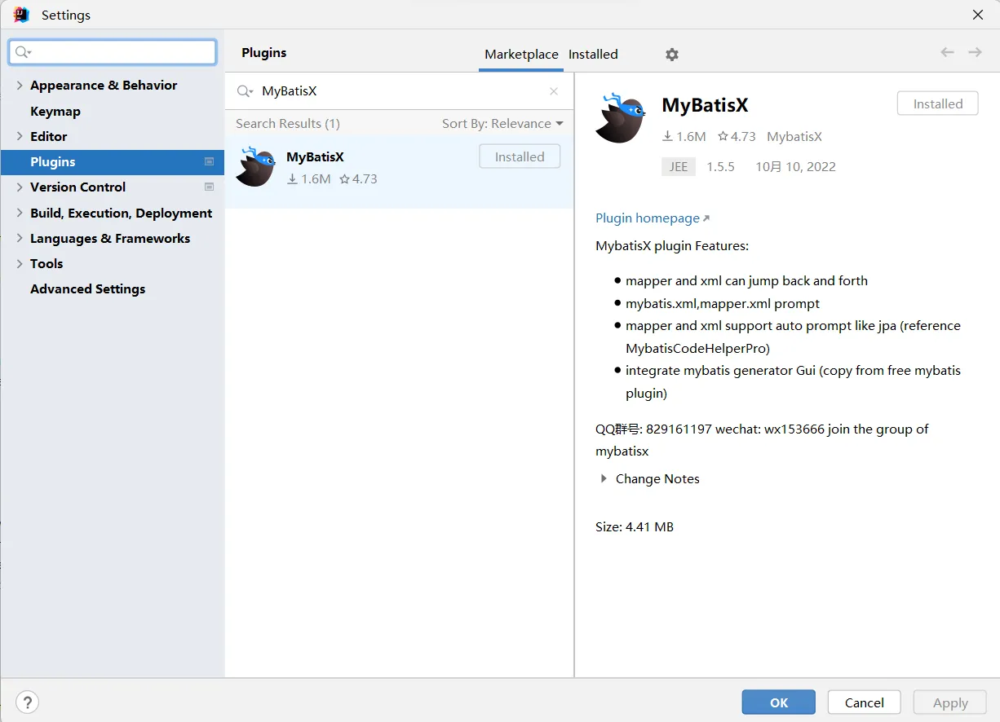
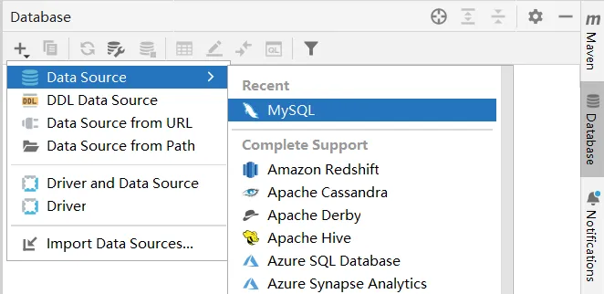
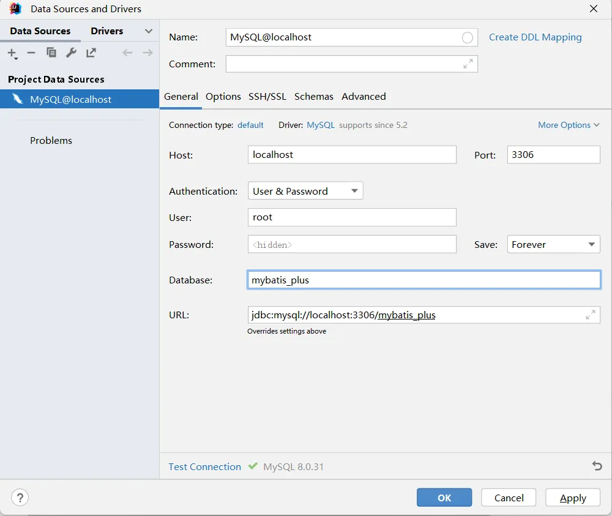
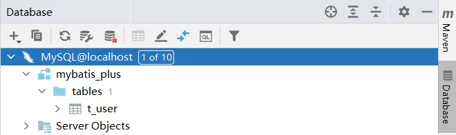
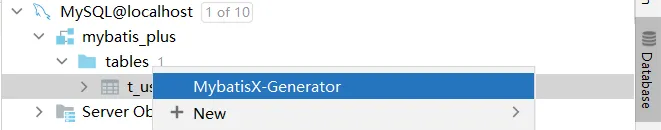
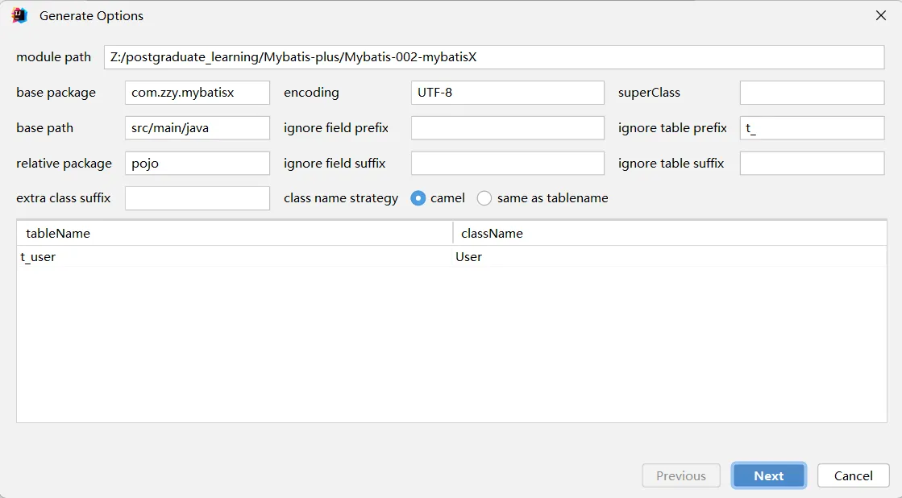
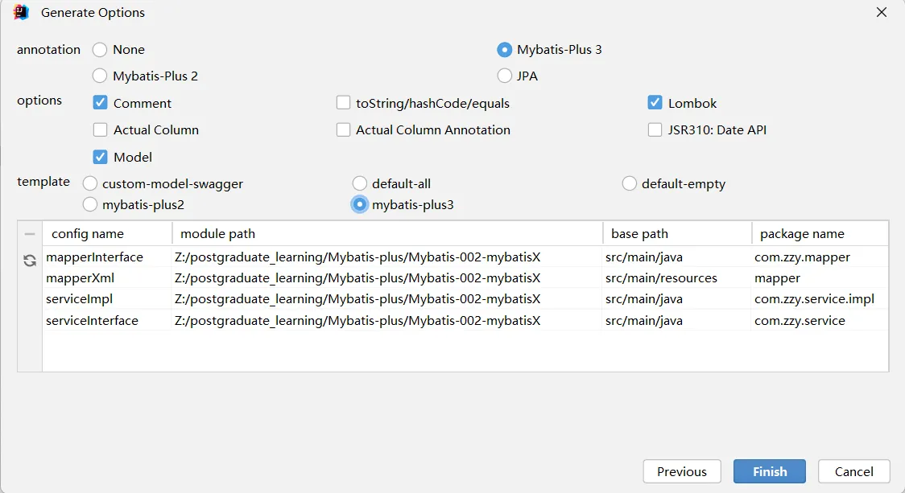
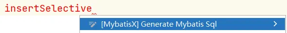

# 九、MybatisX 插件



## 1、使用 MybatisX 生成代码

> 使用 MybatisX 生成 mapper 接口、mapper 映射文件、Service 和实体类。

**在 IDEA 中配置数据源**



配置成功后，显示如下：



**使用代码生成器**




生成完毕后，再根据需求进行修改。

## 2、使用 MybatisX 生成 CRUD

在 mapper 接口中添加方法时，MybatisX 会提示一些方法，使用这些方法可以自动生成 mapper 映射文件。


生成的 SQL 如下：

```xml
<insert id="insertSelective">
  insert into t_user
  <trim prefix="(" suffix=")" suffixOverrides=",">
    <if test="id != null">id,</if>
    <if test="name != null">name,</if>
    <if test="age != null">age,</if>
    <if test="email != null">email,</if>
    <if test="isDeleted != null">is_deleted,</if>
    <if test="sex != null">sex,</if>
  </trim>
  values
  <trim prefix="(" suffix=")" suffixOverrides=",">
    <if test="id != null">#{id,jdbcType=BIGINT},</if>
    <if test="name != null">#{name,jdbcType=VARCHAR},</if>
    <if test="age != null">#{age,jdbcType=INTEGER},</if>
    <if test="email != null">#{email,jdbcType=VARCHAR},</if>
    <if test="isDeleted != null">#{isDeleted,jdbcType=INTEGER},</if>
    <if test="sex != null">#{sex,jdbcType=INTEGER},</if>
  </trim>
</insert>
```
