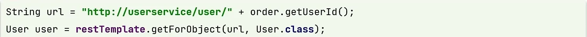
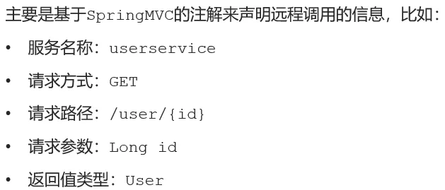
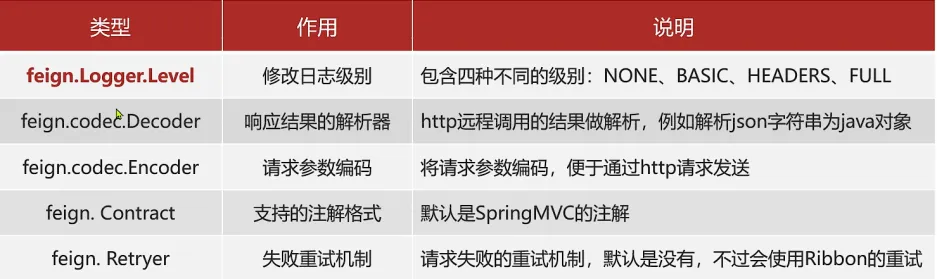
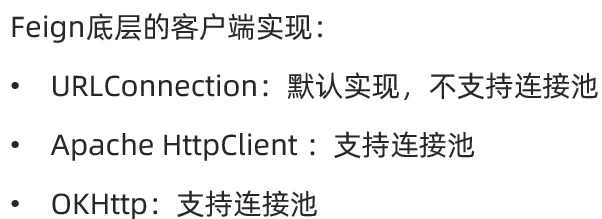
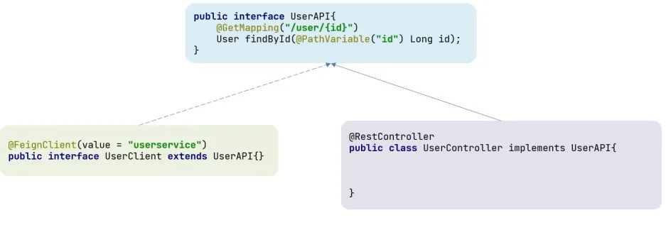
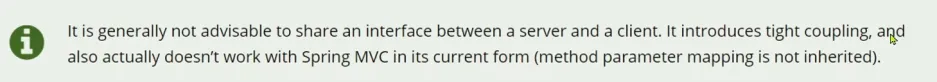
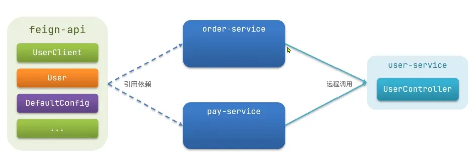

# HTTP 客户端 Feign

使用`RestTemplate`发起远程调用代码如下：

有如下问题：

- url 硬编码到代码中，难以维护

Feign 是一个声明式 HTTP 客户端，解决 HTTP 请求发送的问题。

## 1、使用 Feign 客户端

使用步骤

1. 引入依赖

```xml
<!--feign客户端依赖-->
<dependency>
  <groupId>org.springframework.cloud</groupId>
  <artifactId>spring-cloud-starter-openfeign</artifactId>
</dependency>
```

2. 在启动类添加`@EnableFeignClients`注解

```java
@MapperScan("cn.itcast.order.mapper")
@EnableFeignClients
@SpringBootApplication
public class OrderApplication {
    public static void main(String[] args) {
        SpringApplication.run(OrderApplication.class, args);
    }
}
```

3. 编写 Feign 客户端



```java
@FeignClient("userService")
public interface UserClient {
    @GetMapping("/user/{id}")
    User findById(@PathVariable("id") Long id);
}
```

4. 在代码中使用

```java
@Service
public class OrderService {

    @Autowired
    private OrderMapper orderMapper;

    @Autowired
    private UserClient userClient;

    public Order queryOrderById(Long orderId) {
        // 1.查询订单
        Order order = orderMapper.findById(orderId);

        // 使用 userClient 发起 http 请求
        User user = userClient.findById(order.getUserId());

        // 3.封装user到Order
        order.setUser(user);
        // 4.返回
        return order;
    }
}
```

## 2、自定义 Feign 的配置

可修改的配置如下：

在`application.yml`中进行配置。
全局生效：

```yaml
# 设置 Feign 日志级别
feign:
  client:
    config:
      default:
        loggerLevel: FULL
```

单个微服务生效：

```yaml
# 设置 Feign 日志级别
feign:
  client:
    config:
      userService:
        loggerLevel: Basic
```

## 3、Feign 性能优化



Feign 性能优化主要包括：

- 使用连接池代替默认的`URLConnection`
- 日志级别为`BASIC`或`NONE`

使用`HttpClient`步骤：

1. 引入依赖

```xml
<!--引入HttpClient依赖-->
<dependency>
  <groupId>io.github.openfeign</groupId>
  <artifactId>feign-httpclient</artifactId>
</dependency>
```

2. 配置连接池

```yaml
feign:
  client:
    config:
      userService:
        loggerLevel: Basic
  httpclient:
    enabled: true # 启用 HttpClient
    max-connections: 200 # 最大连接数
    max-connections-per-route: 50 # 单个路径的最大连接数
```

## 4、Feign 最佳实践

### (1) 最佳实践1[继承]

消费者的 FeignClient 和提供者的 Controller 定义统一的父接口作为标准。



### (2) 最佳实践2[抽取]

将 FeignClient 抽取为独立模块，并且把接口有关的 Pojo、默认的 Feign 配置都放到这个模块中，提供给所有消费者使用。

抽取最佳实践的实现：

1. 创建一个 module，命名为 feign-api，然后引入 feign 的 starter 依赖

```xml
<dependency>
  <groupId>org.springframework.cloud</groupId>
  <artifactId>spring-cloud-starter-openfeign</artifactId>
</dependency>
```

2. order-service 中编写的`UserClient`、`User`、`DefaultFeignConfiguration`都复制到 feign-api 项目中
3. 在 order-service 中引入 feign-api 的依赖

```xml
<!--引入feign的统一api-->
<dependency>
  <groupId>cn.itcast.demo</groupId>
  <artifactId>feign-api</artifactId>
  <version>1.0</version>
</dependency>
```

4. 修改 order-service 中的所有与上述三个组件有关的 import 部分，改成导入 feign-api 中的包
5. `UserClient`注入问题

```java
@MapperScan("cn.itcast.order.mapper")
@EnableFeignClients(clients = {UserClient.class})
@SpringBootApplication
public class OrderApplication {
    public static void main(String[] args) {
        SpringApplication.run(OrderApplication.class, args);
    }
}
```
