# 分布式搜索

## 1、ElasticSearch 介绍

### (1) ES 和 ELK

Elasticsearch 是一款非常强大的开源搜索引擎，可以帮助我们从海量数据中快速找到需要的内容。
Elasticsearch 结合 kibana、Logstash、Beats，也就是 Elastic stack（ELK）。被广泛应用在日志数据分析、实时监控等领域。
Elasticsearch 是 elastic stack 的核心，负责存储、搜索、分析数据。
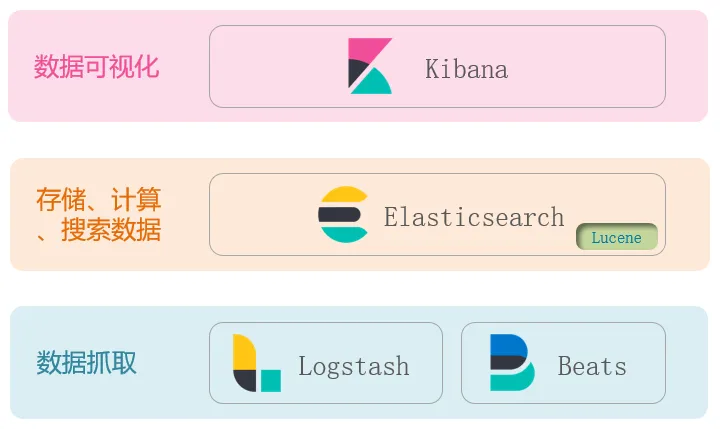

### (2) 倒排索引

相关概念：

- 文档(document)：每条记录就是一个文档。
- 词条(term)：文档按语义分成的词语。

正向索引：传统数据库(MySQL)采用，基于文档 id 创建索引。查询词条时必须先找到文档，而后判断是否包含词条。

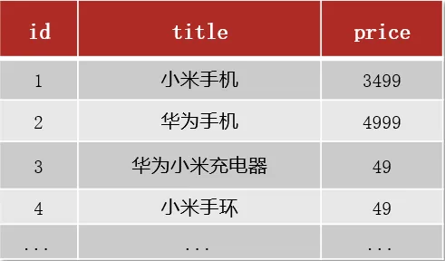

倒排索引：对文档内容分词，对词条创建索引，并记录词条所在文档的信息。查询时先根据词条查询到文档 id，而后获取到文档。

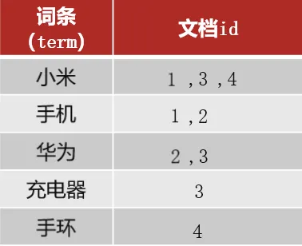

### (3) MySQL 与 ES

概念对比
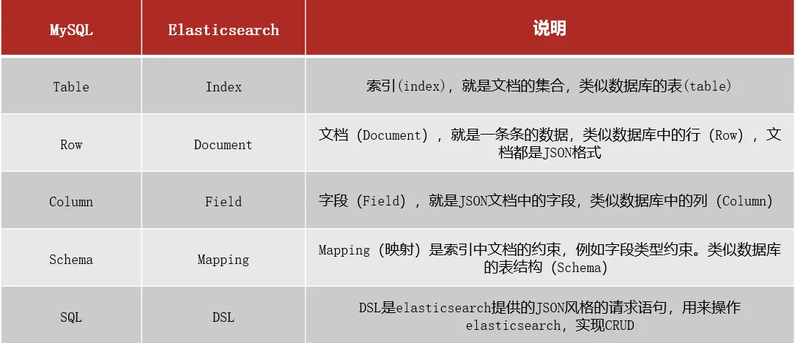
MySQL 更擅长事务类型操作，可以确保数据的安全和一致性；
Elasticsearch 擅长海量数据的搜索、分析、计算。


### (4) 安装 ES、kibana

因为还需要部署 kibana 容器，因此需要让 es 和 kibana 容器互联。这里先创建一个网络：

```bash
docker network create es-net
```

#### 安装 ES

拉取镜像：

```bash
docker pull elasticsearch:7.12.1
```

创建容器

```java
docker run -d \
	--name es \
    -e "ES_JAVA_OPTS=-Xms512m -Xmx512m" \
    -e "discovery.type=single-node" \
    -v es-data:/usr/share/elasticsearch/data \
    -v es-plugins:/usr/share/elasticsearch/plugins \
    --privileged \
    --network es-net \
    -p 9200:9200 \
    -p 9300:9300 \
elasticsearch:7.12.1
```

命令解释：

- -e "cluster.name=es-docker-cluster"：设置集群名称
- -e "http.host=0.0.0.0"：监听的地址，可以外网访问
- -e "ES_JAVA_OPTS=-Xms512m -Xmx512m"：内存大小
- -e "discovery.type=single-node"：非集群模式
- -v es-data:/usr/share/elasticsearch/data：挂载逻辑卷，绑定es的数据目录
- -v es-logs:/usr/share/elasticsearch/logs：挂载逻辑卷，绑定es的日志目录
- -v es-plugins:/usr/share/elasticsearch/plugins：挂载逻辑卷，绑定es的插件目录
- --privileged：授予逻辑卷访问权
- --network es-net ：加入一个名为es-net的网络中
- -p 9200:9200：端口映射配置

在浏览器中输入：http://ip:9200 即可看到 elasticsearch 的响应结果：
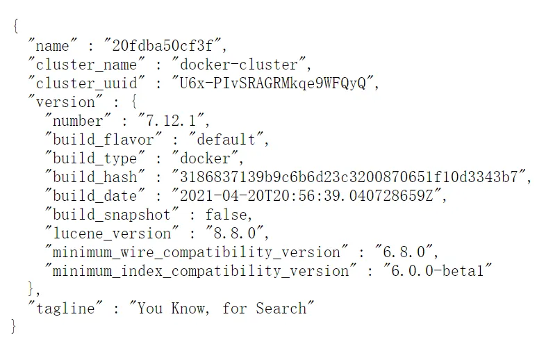

#### 安装 Kibana

拉取镜像：

```bash
docker pull kibana:7.12.1
```

创建并启动容器：

```bash
docker run -d \
--name kibana \
-e ELASTICSEARCH_HOSTS=http://es:9200 \
--network=es-net \
-p 5601:5601  \
kibana:7.12.1
```

- `--network es-net` ：加入一个名为es-net的网络中，与elasticsearch在同一个网络中
- `-e ELASTICSEARCH_HOSTS=http://es:9200"`：设置elasticsearch的地址，因为kibana已经与elasticsearch在一个网络，因此可以用容器名直接访问elasticsearch
- `-p 5601:5601`：端口映射配置

kibana 启动一般比较慢，需要多等待一会，可以通过命令：

```bash
docker logs -f kibana
```

查看运行日志，当查看到下面的日志，说明成功：
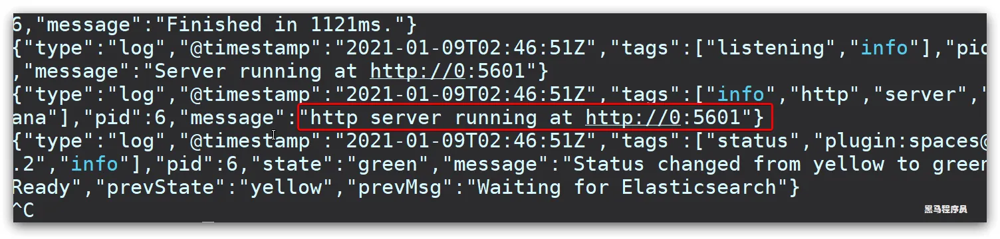
访问浏览器：http://192.168.18.129:5601，出现如下界面：


#### 安装 ik 分词器

ES 默认分词对中文不友好。

1. 查看数据卷目录

安装插件需要知道elasticsearch的plugins目录位置，而我们用了数据卷挂载，因此需要查看elasticsearch的数据卷目录，通过下面命令查看：

```bash
docker volume inspect es-plugins
```

显示结果：

```bash
[
    {
        "CreatedAt": "2022-05-06T10:06:34+08:00",
        "Driver": "local",
        "Labels": null,
        "Mountpoint": "/var/lib/docker/volumes/es-plugins/_data",
        "Name": "es-plugins",
        "Options": null,
        "Scope": "local"
    }
]
```

2. 解压分词器安装包

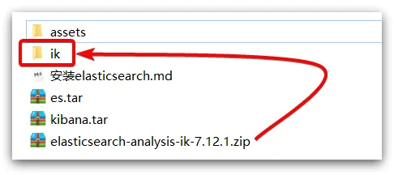

3. 上传到 es 容器的插件数据卷中

也就是`/var/lib/docker/volumes/es-plugins/_data`：
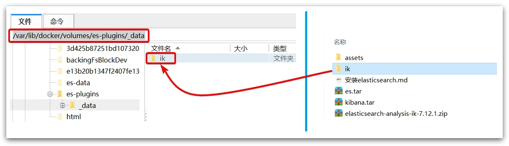

4. 重启容器

```bash
# 4、重启容器
docker restart es

# 查看es日志
docker logs -f es
```

IK分词器包含两种模式：

-  `ik_smart`：最少切分
-  `ik_max_word`：最细切分

使用测试如下：

```json
POST /_analyze
{
  "analyzer": "ik_smart",
  "text": "任何邪恶终将绳之以法！"
}
```

```json
{
  "tokens" : [
    {
      "token" : "任何",
      "start_offset" : 0,
      "end_offset" : 2,
      "type" : "CN_WORD",
      "position" : 0
    },
    {
      "token" : "邪恶",
      "start_offset" : 2,
      "end_offset" : 4,
      "type" : "CN_WORD",
      "position" : 1
    },
    {
      "token" : "终将",
      "start_offset" : 4,
      "end_offset" : 6,
      "type" : "CN_WORD",
      "position" : 2
    },
    {
      "token" : "绳之以法",
      "start_offset" : 6,
      "end_offset" : 10,
      "type" : "CN_WORD",
      "position" : 3
    }
  ]
}
```

### (5) IK 分词器配置

可以向 IK 分词器中添加或删除词汇。
要拓展 IK 分词器的词库，只需要修改一个 IK 分词器目录中的 config 目录中的`IkAnalyzer.cfg.xml`文件：

```xml
<?xml version="1.0" encoding="UTF-8"?>
<!DOCTYPE properties SYSTEM "http://java.sun.com/dtd/properties.dtd">
<properties>
  <comment>IK Analyzer 扩展配置</comment>
  <!--用户可以在这里配置自己的扩展字典 -->
  <entry key="ext_dict">ext.dic</entry>
  <!--用户可以在这里配置自己的扩展停止词字典-->
  <entry key="ext_stopwords">stopword.dic</entry>
  <!--用户可以在这里配置远程扩展字典 -->
  <!-- <entry key="remote_ext_dict">words_location</entry> -->
  <!--用户可以在这里配置远程扩展停止词字典-->
  <!-- <entry key="remote_ext_stopwords">words_location</entry> -->
</properties>
```

在名为`ext.dic`的文件中，添加想要拓展的词语即可。
在名为`stopword.dic`的文件中，添加想要删除的词语即可。

## 2、索引库(表)操作

### (1) Mapping

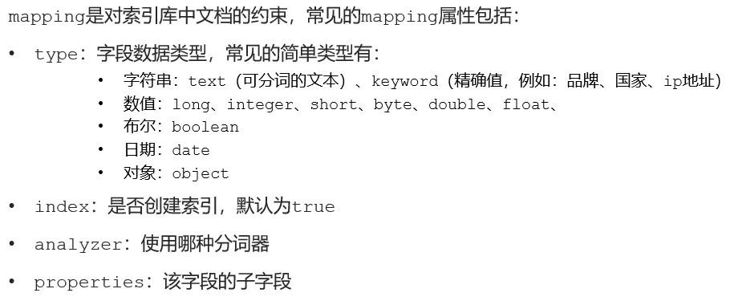

### (2) 增删改查

#### 增

ES 中通过 Restful 请求操作索引库、文档。请求内容用 DSL 语句来表示。创建索引库和 mapping 的 DSL 示例代码如下：

```json
PUT /zzy
{
  "mappings": {
    "properties": {
      "info": {
        "type": "text",
        "analyzer": "ik_smart"
      },
      "email": {
        "type": "keyword",
        "index": false
      },
      "name": {
        "properties": {
          "firstName": {
            "type": "keyword"
          },
          "lastName": {
            "type": "keyword"
          }
        }
      }
    }
  }
}
```

#### 查

```json
GET /zzy
```

#### 删

```json
DELETE /zzy
```

#### 改

索引库和 mapping 一旦创建无法修改，只能增加字段，使用案例：

```json
PUT /zzy/_mapping
{
  "properties": {
    "age": {
      "type": "integer"
    }
  }
}
```

## 3、文档(记录)操作

### (1) 增删改查

#### 增

新增文档的 DSL 语法如下：

```json
POST /索引库名/_doc/文档id
{
    "字段1": "值1",
    "字段2": "值2",
    "字段3": {
        "子属性1": "值3",
        "子属性2": "值4"
    },
    // ...
}
```

使用案例：

```json
POST /zzy/_doc/1
{
  "age": 24,
  "email": "Xiabeize@qq.com",
  "info": "下北泽最臭的田所",
  "name": {
    "firstName": "浩二",
    "lastName": "田所"
  }
}
```

#### 查

查询文档语法：

```json
GET /索引库名/_doc/文档id 
```

使用案例：

```json
GET /zzy/_doc/1
```

#### 删

删除文档语法：

```json
DELETE /索引库名/_doc/文档id 
```

使用案例：

```json
DELETE /zzy/_doc/1
```

#### 改

全量修改

```json
# 语法
PUT /索引库名/_doc/文档id
{
    "字段1": "值1",
    "字段2": "值2",
    // ... 略
}

# 使用案例
PUT /zzy/_doc/1
{
  "age": 25,
  "email": "Xiabeize@qq.com",
  "info": "下北泽最臭的田所",
  "name": {
    "firstName": "浩二",
    "lastName": "田所"
  }
}
```

增量修改

```json
# 语法
POST /索引库名/_update/文档id
{
    "doc": {
         "字段名": "新的值",
    }
}

# 使用案例
POST /zzy/_update/1
{
  "doc": {
    "email": "24211@163.com"
  }
}
```

## 4、RestClient 操作索引库

ES 官方提供了各种不同语言的客户端，用来操作 ES。这些客户端的本质就是组装 DSL 语句，通过 http 请求发送给 ES。

### (1) 依赖引入与测试代码

引入依赖：

```xml
<!--es依赖-->
<dependency>
  <groupId>org.elasticsearch.client</groupId>
  <artifactId>elasticsearch-rest-high-level-client</artifactId>
</dependency>
```

需要覆盖默认的 ES 版本：

```xml
<properties>
  <java.version>1.8</java.version>
  <elasticsearch.version>7.12.1</elasticsearch.version>
</properties>
```

测试代码：

```java
@SpringBootTest
class HotelDemoApplicationTests {

    private RestHighLevelClient client;

    @Test
    public void testInit() {
        System.out.println(client);
    }

    @BeforeEach
    void setUp() {
        client = new RestHighLevelClient(RestClient.builder(
                HttpHost.create("http://192.168.18.129:9200")
        ));
    }

    @AfterEach
    void tearDown() throws IOException {
        client.close();
    }
}
```

### (2) 创建索引库

```java
    // 创建索引库
    @Test
    public void createIndex() throws IOException {
        // 创建请求对象 -- PUT
        CreateIndexRequest request = new CreateIndexRequest("hotel");

        // 请求参数
        request.source(MAPPING_TEMPLATE, XContentType.JSON);

        // 发起请求
        client.indices().create(request, RequestOptions.DEFAULT);
    }
```

### (3) 删除索引库

```java
    // 删除索引库
    @Test
    public void deleteIndex() throws IOException {
        // 创建请求对象 -- DELETE
        DeleteIndexRequest request = new DeleteIndexRequest("hotel");

        // 发起请求
        client.indices().delete(request, RequestOptions.DEFAULT);
    }
```

### (4) 判断索引库是否存在

```java
    // 判断索引库是否存在
    @Test
    public void indexExist() throws IOException {
        // 创建请求对象
        GetIndexRequest request = new GetIndexRequest("hotel");

        // 发起请求
        boolean exists = client.indices().exists(request, RequestOptions.DEFAULT);

        System.out.println(exists);
    }
```

## 5、RestClient 操作文档

### (1) 新建文档

```java
@SpringBootTest
public class ElasticsearchDocumentTest {
    private RestHighLevelClient client;

    @Resource
    private IHotelService hotelService;

    // 新建文档
    @Test
    public void addDocument() throws IOException {
        // 请求数据库中某条数据
        Hotel hotel = hotelService.getById(36934L);
        HotelDoc hotelDoc = new HotelDoc(hotel);

        // 创建请求
        IndexRequest request = new IndexRequest("hotel").id("36934");

        // 请求参数
        request.source(JSON.toJSONString(hotelDoc), XContentType.JSON);

        // 发送请求
        client.index(request, RequestOptions.DEFAULT);
    }

    @BeforeEach
    void setUp() {
        client = new RestHighLevelClient(RestClient.builder(
                HttpHost.create("http://192.168.18.129:9200")
        ));
    }

    @AfterEach
    void tearDown() throws IOException {
        client.close();
    }
}
```

### (2) 查询文档

```java
    // 查询文档
    @Test
    public void getDocumentById() throws IOException {
        // 创建请求
        GetRequest request = new GetRequest("hotel").id("36934");

        // 发起请求
        GetResponse response = client.get(request, RequestOptions.DEFAULT);

        // 反序列化为对象
        String json = response.getSourceAsString();
        HotelDoc hotelDoc = JSON.parseObject(json, HotelDoc.class);

        System.out.println(hotelDoc);
    }
```

### (3) 更新文档

增量修改

```java
    // 修改文档
    @Test
    public void testUpdateDocument() throws IOException {
        // 创建请求
        UpdateRequest request = new UpdateRequest("hotel", "36934");

        // 设置请求参数
        request.doc(
                "brand", "八天酒店"
        );

        // 发送请求
        client.update(request, RequestOptions.DEFAULT);
    }
```

### (4) 删除文档

```java
    // 删除文档
    @Test
    public void deleteDocument() throws IOException {
        // 创建请求
        DeleteRequest request = new DeleteRequest("hotel", "36934");

        // 发起请求
        client.delete(request, RequestOptions.DEFAULT);
    }
```

### (5) 批量导入文档

```java
    // 批量导入文档
    @Test
    public void testBulk() throws IOException {
        // 查询酒店数据
        List<Hotel> hotelList = hotelService.list();

        // 创建批量导入请求
        BulkRequest bulkRequest = new BulkRequest();

        // 向批量导入请求中添加请求
        for (Hotel hotel : hotelList) {
            HotelDoc hotelDoc = new HotelDoc(hotel);
            bulkRequest.add(new IndexRequest("hotel").id(hotelDoc.getId().toString()).source(JSON.toJSONString(hotelDoc), XContentType.JSON));
        }

        // 发送请求
        client.bulk(bulkRequest, RequestOptions.DEFAULT);
    }
```

## 6、DSL 查询文档

### (1) DSL 查询分类


查询基本语法：
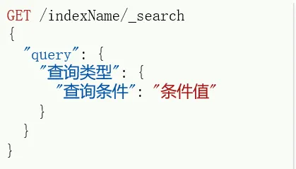

```json
GET /hotel/_search
{
  "query": {
    "match_all": {}
  }
}
```

### (2) 全文检索查询

全文检索查询会对用户输入内容进行分词，然后去倒排索引库检索。分为 match 查询和 match_all 查询。
#### match

单个字段。

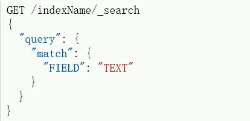

使用案例：

```json
# 全文检索
GET /hotel/_search
{
  "query": {
    "match": {
      "all": "如家"
    }
  }
}
```

#### multi_match

多个字段。

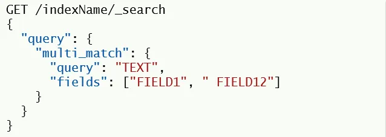

推荐将多个字段 copy 到一个字段，使用 match 查询。

### (3) 精确查询

精确查询一般是查找 keyword、数值、日期、boolean 等类型字段。所以**不会对搜索条件分词**。常见的有：

- term：根据词条精确值查询
- range：根据值的范围查询

#### term 查询

```json
// term查询
GET /indexName/_search
{
  "query": {
    "term": {
      "FIELD": {
        "value": "VALUE"
      }
    }
  }
}
```

```json
# term 精确查询
GET /hotel/_search
{
  "query": {
    "term": {
      "city": {
        "value": "上海"
      }
    }
  }
}
```

#### range 查询

```json
// range查询
GET /indexName/_search
{
  "query": {
    "range": {
      "FIELD": {
        "gte": 10,
        "lte": 20
      }
    }
  }
}
```

```json
# range 精确查询
GET /hotel/_search
{
  "query": {
    "range": {
      "price": {
        "gte": 100,
        "lte": 200
      }
    }
  }
}
```

### (4) 地理查询

根据经纬度进行查询。

#### `geo_bounding_box`

查询`geo_point`值落在某个矩形范围的所有文档。

```json
// geo_bounding_box查询
GET /indexName/_search
{
  "query": {
    "geo_bounding_box": {
      "FIELD": {
        "top_left": {
          "lat": 31.1,
          "lon": 121.5
        },
        "bottom_right": {
          "lat": 30.9,
          "lon": 121.7
        }
      }
    }
  }
}
```

#### `geo_distance`

查询到指定中心点小于某个距离值的所有文档。

```json
// geo_distance 查询
GET /indexName/_search
{
  "query": {
    "geo_distance": {
      "distance": "15km",
      "FIELD": "31.21,121.5"
    }
  }
}
```

```json
# 地理查询
GET /hotel/_search
{
  "query": {
    "geo_distance": {
      "distance": "10km",
      "location": "22.550183, 114.120771"
    }
  }
}
```

### (5) 复合查询

#### 算分函数查询

当我们利用 match 查询时，文档结果会根据与搜索词条的关联度打分（_score），返回结果时按照分值降序排列。
词条在文档中出现的频率越高，越"鹤立鸡群"，关联度评分越高。
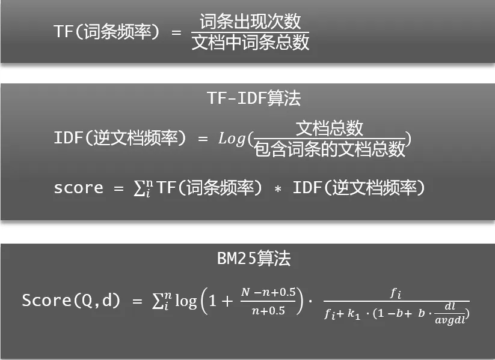

使用语法

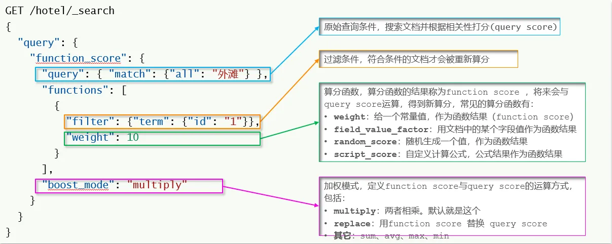

使用案例：提高如家酒店的相关性算法

```json
# 提高如家酒店的相关性算分
GET /hotel/_search
{
  "query": {
    "function_score": {
      "query": {
        "term": {
          "city": {
            "value": "上海"
          }
        }
      },
      "functions": [
        {
          "filter": {
            "term": {
              "brand": "如家"
            }
          },
          "weight": 10
        }
      ],
      "boost_mode": "sum"
    }
  }
}
```

#### 布尔查询

布尔查询是一个或多个查询子句的组合。子查询的组合方式有：

- `must`：必须匹配每个子查询，类似“与”
- `should`：选择性匹配子查询，类似“或”
- `must_not`：必须不匹配，不参与算分，类似“非”
- `filter`：必须匹配，不参与算分

语法

```json
GET /hotel/_search
{
  "query": {
    "bool": {
      "must": [
        {"term": {"city": "上海" }}
      ],
      "should": [
        {"term": {"brand": "皇冠假日" }},
        {"term": {"brand": "华美达" }}
      ],
      "must_not": [
        { "range": { "price": { "lte": 500 } }}
      ],
      "filter": [
        { "range": {"score": { "gte": 45 } }}
      ]
    }
  }
}
```

使用案例


```json
# 布尔查询
GET /hotel/_search
{
  "query": {
    "bool": {
      "must": [
        {
          "term": {
            "city": {
              "value": "上海"
            }
          }
        }
      ],
      "must_not": [
        {
          "range": {
            "price": {
              "lte": 500
            }
          }
        }
      ],
      "filter": [
        {
          "geo_distance": {
            "distance": "10km",
            "location": "31.21, 121.5"
          }
        }
      ]
    }
  }
}
```

### (6) 排序

Elasticsearch 支持对搜索结果排序，默认是根据相关度算分（`_score`）来排序。可以排序字段类型有：keyword 类型、数值类型、地理坐标类型、日期类型等。

#### 非地理坐标排序

```json
GET /indexName/_search
{
  "query": {
    "match_all": {}
  },
  "sort": [
    {
      "FIELD": "desc"  // 排序字段和排序方式ASC、DESC
    }
  ]
}
```

使用案例：


```json
# 非地理坐标排序
GET /hotel/_search
{
  "query": {
    "match_all": {}
  },
  "sort": [
    {
      "score": {
        "order": "desc"
      },
      "price": {
        "order": "asc"
      }
    }
  ]
}
```

#### 地理坐标排序

语法：

```json
GET /indexName/_search
{
  "query": {
    "match_all": {}
  },
  "sort": [
    {
      "_geo_distance" : {
          "FIELD" : "纬度，经度",
          "order" : "asc",
          "unit" : "km"
      }
    }
  ]
}
```

使用案例：

```json
# 地理坐标排序
GET /hotel/_search
{
  "query": {
    "match_all": {}
  },
  "sort": [
    {
      "_geo_distance": {
        "location": {
          "lat": 29.881672,
          "lon": 121.905888
        },
        "order": "asc",
        "unit": "km"
      }
    }
  ]
}
```

### (7) 分页

#### 基本使用

Elasticsearch 默认情况下只返回 Top10 的数据。而如果要查询更多数据就需要修改分页参数了。通过修改`from`、`size`参数来控制要返回的分页结果：

```json
GET /hotel/_search
{
  "query": {
    "match_all": {}
  },
  "from": 990, // 分页开始的位置，默认为0
  "size": 10, // 期望获取的文档总数
  "sort": [
    {"price": "asc"}
  ]
}

```

使用案例：

```json
# 分页查询
GET /hotel/_search
{
  "query": {
    "match_all": {}
  },
  "from": 191,
  "size": 10
}
```

#### 深度分页问题

ES 是分布式的，所以会面临深度分页问题。例如按 price 排序后，获取 from = 990，size =10 的数据：

1. 在每个数据分片上都排序并查询前 1000 条文档；
2. 将所有节点的结果聚合，在内存中重新排序选出前 1000 条文档
3. 从这 1000 条中，选取从 990 开始的 10 条文档

如果搜索页数过深，或者结果集（from + size）越大，对内存和 CPU 的消耗也越高。因此 ES 设定结果集查询的上限是10000。
针对深度分页，ES提供了解决方案`search after`，分页时需要排序，原理是从上一次的排序值开始，查询下一页数据。官方推荐使用的方式。
分页对比
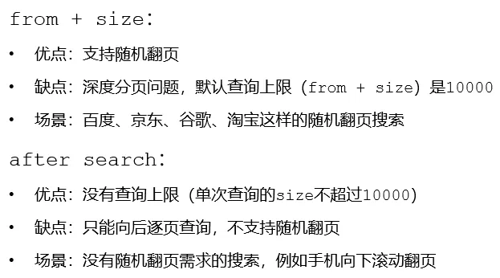

### (8) 高亮

高亮就是在搜索结果中把搜索关键字突出显示。
原理：

1. 将搜索结果中的关键字用标签(通常是`<em />`)标记出来
2. 在页面中给标签添加 css 样式

语法：

```json
GET /hotel/_search
{
  "query": {
    "match": {
      "FIELD": "TEXT"
    }
  },
  "highlight": {
    "fields": { // 指定要高亮的字段
      "FIELD": {
        "pre_tags": "<em>",  // 用来标记高亮字段的前置标签
        "post_tags": "</em>" // 用来标记高亮字段的后置标签
      }
    }
  }
}
```

使用案例：

```json
# 高亮查询
GET /hotel/_search
{
  "query": {
    "match": {
      "all": "如家"
    }
  },
  "highlight": {
    "fields": {
      "name": {
        "require_field_match": "false"
      }
    }
  }
}
```

## 7、RestClient 查询文档

### (1) 入门案例：查询所有


```java
    // 搜索全部
    @Test
    public void testMatchAll() throws IOException {
        // 创建请求
        SearchRequest request = new SearchRequest("hotel");

        // 请求参数
        request.source().query(QueryBuilders.matchAllQuery());

        // 发送请求
        SearchResponse response = client.search(request, RequestOptions.DEFAULT);

        // 解析结果
        SearchHits hits = response.getHits();

        // 结果条数
        long resultCount = hits.getTotalHits().value;
        System.out.println("结果条数：" + resultCount);

        // 每一个文档
        for (SearchHit hit : hits.getHits()) {
            String json = hit.getSourceAsString();
            System.out.println(json);
        }
    }
```

### (2) 全文检索查询

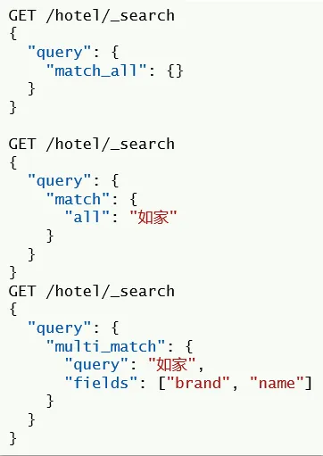

```java
    // 全文检索查询
    @Test
    public void testMatch() throws IOException {
        // 创建请求
        SearchRequest request = new SearchRequest("hotel");

        // 请求参数
        // 单字段查询
//        request.source().query(QueryBuilders.matchQuery("all", "如家"));
        // 多字段查询
        request.source().query(QueryBuilders.multiMatchQuery("如家", "brand", "name"));

        // 发送请求
        SearchResponse response = client.search(request, RequestOptions.DEFAULT);

        // 解析结果
        SearchHits hits = response.getHits();

        // 结果条数
        long resultCount = hits.getTotalHits().value;
        System.out.println("结果条数：" + resultCount);

        // 每一个文档
        for (SearchHit hit : hits.getHits()) {
            String json = hit.getSourceAsString();
            System.out.println(json);
        }
    }
```

### (3) 精确查询

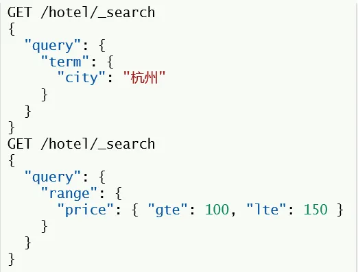

```java
    // 精确查询
    @Test
    public void testTermQuery() throws IOException {
        // 创建请求
        SearchRequest request = new SearchRequest("hotel");

        // 请求参数
        // term 查询
//        request.source().query(QueryBuilders.termQuery("brand", "如家"));
        // range 查询
        request.source().query(QueryBuilders.rangeQuery("price").gte(100).lte(500));

        // 发送请求
        SearchResponse response = client.search(request, RequestOptions.DEFAULT);

        // 处理请求
        handleResponse(response);
    }
```

### (4) 复合查询——布尔查询

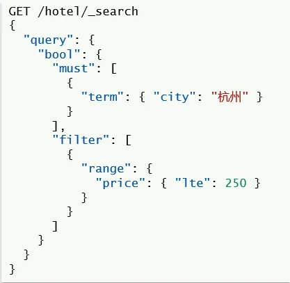

```java
    // 复合查询——bool
    @Test
    public void testBool() throws IOException {
        // 创建请求
        SearchRequest request = new SearchRequest("hotel");

        // 请求参数
        // 创建布尔查询
         BoolQueryBuilder boolQuery = QueryBuilders.boolQuery();
        // 添加must条件
         boolQuery.must(QueryBuilders.termQuery("city", "杭州"));
        // 添加filter条件
         boolQuery.filter(QueryBuilders.rangeQuery("price").lte(250));
         request.source().query(boolQuery);

        // 发送请求
        SearchResponse response = client.search(request, RequestOptions.DEFAULT);

        // 处理请求
        handleResponse(response);
    }
```

### (5) 排序、分页

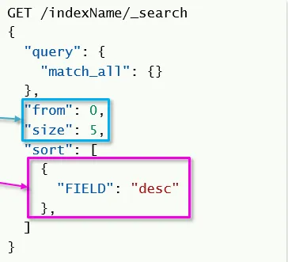

```java
    // 排序与分页
    @Test
    public void testPage() throws IOException {
        // 创建请求
        SearchRequest request = new SearchRequest("hotel");

        // 请求参数
        request.source().query(QueryBuilders.matchAllQuery());

        // 排序参数
        request.source().sort("price", SortOrder.DESC);

        // 分页参数
        request.source().from(0).size(5);

        // 发送请求
        SearchResponse response = client.search(request, RequestOptions.DEFAULT);

        // 解析结果
        handleResponse(response);
    }
```

### (6) 高亮


```java
    // 高亮
    @Test
    public void testHighlight() throws IOException {
        // 创建请求
        SearchRequest request = new SearchRequest("hotel");

        // 请求参数
        request.source().query(QueryBuilders.matchQuery("all", "如家"));

        // 设置高亮
        request.source().highlighter(new HighlightBuilder().field("name").requireFieldMatch(false));

        // 发送请求
        SearchResponse response = client.search(request, RequestOptions.DEFAULT);

        // 解析结果
        handleResponse(response);
    }

    private void handleResponse(SearchResponse response) {
        // 解析结果
        SearchHits hits = response.getHits();

        // 结果条数
        long resultCount = hits.getTotalHits().value;
        System.out.println("结果条数：" + resultCount);

        // 每一个文档
        for (SearchHit hit : hits.getHits()) {
            String json = hit.getSourceAsString();
            HotelDoc hotelDoc = JSON.parseObject(json, HotelDoc.class);
            // 获取 highlight
            Map<String, HighlightField> highlightFields = hit.getHighlightFields();
            if (!CollectionUtils.isEmpty(highlightFields)) {
                HighlightField highlightField = highlightFields.get("name");
                if (highlightField != null) {
                    String name = highlightField.getFragments()[0].string();
                    hotelDoc.setName(name);
                }
            }
            System.out.println(hotelDoc);
        }
    }
```

## 8、ES 提高

### (1) 数据聚合

#### 数据聚合分类

聚合（aggregations）可以实现对文档数据的统计、分析、运算。聚合常见的有三类：

1. 桶（Bucket）聚合：用来对文档做分组

- TermAggregation：按照文档字段值分组
- Date Histogram：按照日期阶梯分组，例如一周为一组，或者一月为一组

2. 度量（Metric）聚合：用以计算一些值，比如：最大值、最小值、平均值等

- Avg：求平均值
- Max：求最大值
- Min：求最小值
- Stats：同时求max、min、avg、sum等

3. 管道（pipeline）聚合：其它聚合的结果为基础做聚合

参与聚合的字段类型必须是：

1. keyword
2. 数值
3. 日期
4. 布尔

#### DSL 实现 bucket 聚合

使用案例：根据酒店名称做聚合。

```java
# 数据聚合
GET /hotel/_search
{
  "size": 0,
  "aggs": {
    "brandAgg": {
      "terms": {
        "field": "brand",
        "size": 20
      }
    }
  }
}

# 数据聚合 -- 带有查询
GET /hotel/_search
{
  "size": 0,
  "query": {
    "range": {
      "price": {
        "lte": 300
      }
    }
  }, 
  "aggs": {
    "brandAgg": {
      "terms": {
        "field": "brand",
        "size": 20
      }
    }
  }
}
```

#### DSL 实现 matrics 聚合

```java
# 数据聚合 -- 度量聚合
GET /hotel/_search
{
  "size": 0,
  "aggs": {
    "brandAgg": {
      "terms": {
        "field": "brand",
        "size": 10
      },
      "aggs": {
        "priceStat": {
          "stats": {
            "field": "price"
          }
        }
      }
    }
  }
}
```

#### RestClient 实现聚合

```java
    @Test
    public void test01() throws IOException {
        // 创建请求
        SearchRequest request = new SearchRequest("hotel");

        // DSL
        request.source().size(0);
        request.source().aggregation(AggregationBuilders
                .terms("brand_agg")
                .field("brand")
                .size(20));

        // 发送请求
        SearchResponse response = client.search(request, RequestOptions.DEFAULT);

        // 解析结果
        resolveResponse(response);
    }

    // 结果解析
    private void resolveResponse(SearchResponse response) {
        // 解析聚合结果
        Aggregations aggregations = response.getAggregations();
        // 根据名称获取聚合结果
        Terms brandTerms = aggregations.get("brand_agg");
        // 获取桶
        List<? extends Terms.Bucket> buckets = brandTerms.getBuckets();
        // 遍历
        for (Terms.Bucket bucket : buckets) {
            // 获取key，也就是品牌信息
            String brandName = bucket.getKeyAsString();
            System.out.println(brandName);
        }
    }
```

### (2) 自动补全

自动补全的原理是对文档进行拼音分词。使用拼音分词的`analyzer`。

#### 安装

和 ik 分词器一样安装，使用测试：

```java
POST /_analyze
{
  "text": ["天天吃八碗"],
  "analyzer": "pinyin"
}
```

```java
{
  "tokens" : [
    {
      "token" : "tian",
      "start_offset" : 0,
      "end_offset" : 0,
      "type" : "word",
      "position" : 0
    },
    {
      "token" : "ttcbw",
      "start_offset" : 0,
      "end_offset" : 0,
      "type" : "word",
      "position" : 0
    },
    {
      "token" : "tian",
      "start_offset" : 0,
      "end_offset" : 0,
      "type" : "word",
      "position" : 1
    },
    {
      "token" : "chi",
      "start_offset" : 0,
      "end_offset" : 0,
      "type" : "word",
      "position" : 2
    },
    {
      "token" : "ba",
      "start_offset" : 0,
      "end_offset" : 0,
      "type" : "word",
      "position" : 3
    },
    {
      "token" : "wan",
      "start_offset" : 0,
      "end_offset" : 0,
      "type" : "word",
      "position" : 4
    }
  ]
}
```

#### 自定义分词器

ElasticSearch 中分词器（analyzer）的组成包含三部分：

1. `character filters`：在`tokenizer`之前对文本进行处理。例如删除字符、替换字符；
2. `tokenizer`：将文本按照一定的规则切割成词条（term）。例如 keyword，就是不分词；还有 ik_smart；
3. `tokenizer filter`：将 tokenizer 输出的词条做进一步处理。例如大小写转换、同义词处理、拼音处理等。

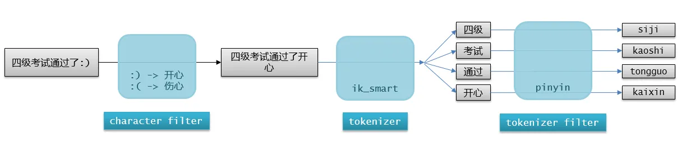
创建索引库时，通过`settings`来配置自定义分词器：

```json
// 自定义拼音分词器
PUT /test
{
  "settings": {
    "analysis": {
      "analyzer": { 
        "my_analyzer": { 
          "tokenizer": "ik_max_word",
          "filter": "py"
        }
      },
      "filter": {
        "py": { 
          "type": "pinyin",
          "keep_full_pinyin": false,
          "keep_joined_full_pinyin": true,
          "keep_original": true,
          "limit_first_letter_length": 16,
          "remove_duplicated_term": true,
          "none_chinese_pinyin_tokenize": false
        }
      }
    }
  }
}
```

拼音分词器适合在创建倒排索引的时候使用，但不能在搜索的时候使用。否则在输入文字时会匹配拼音相同的无关文字。

```json
PUT /test
{
  "settings": {
    "analysis": {
      "analyzer": { 
        "my_analyzer": { 
          "tokenizer": "ik_max_word",
          "filter": "py"
        }
      },
      "filter": {
        "py": { 
          "type": "pinyin",
          "keep_full_pinyin": false,
          "keep_joined_full_pinyin": true,
          "keep_original": true,
          "limit_first_letter_length": 16,
          "remove_duplicated_term": true,
          "none_chinese_pinyin_tokenize": false
        }
      }
    }
  },
  "mappings": {
    "properties": {
      "name": {
        "type": "text",
        "analyzer": "my_analyzer",
        "search_analyzer": "ik_smart"
      }
    }
  }
}
```

使用测试：

```json
POST /test/_doc/1
{
  "id": 1,
  "name": "狮子"
}

POST /test/_doc/2
{
  "id": 2,
  "name": "虱子"
}

GET /test/_search
{
  "query": {
    "match": {
      "name": "掉入狮子笼咋办"
    }
  }
}
```

#### completion suggester 查询

**DSL 实现**
Elasticsearch 提供了 CompletionSuggester 查询来实现自动补全功能。这个查询会匹配以用户输入内容开头的词条并返回。为了提高补全查询的效率，对于文档中字段的类型有一些约束：

- 参与补全查询的字段必须是 completion 类型
- 字段的内容一般是用来补全的多个词条形成的数组

```json
PUT /test2
{
  "mappings": {
    "properties": {
      "title":{
        "type": "completion"
      }
    }
  }
}

# 测试数据
POST test2/_doc
{
  "title": ["Sony", "WH-1000XM3"]
}

POST test2/_doc
{
  "title": ["SK-II", "PITERA"]
}

POST test2/_doc
{
  "title": ["Nintendo", "switch"]
}
```

```json
// 自动补全查询
POST /test/_search
{
  "suggest": {
    "title_suggest": {
      "text": "s", // 关键字
      "completion": {
        "field": "title", // 补全字段
        "skip_duplicates": true, // 跳过重复的
        "size": 10 // 获取前10条结果
      }
    }
  }
}
```

**RestAPI**

```java
    // 自动补全查询测试
    @Test
    public void testAutofill() throws IOException {
        // 1.准备请求
        SearchRequest request = new SearchRequest("test2");
        // 2.请求参数
        request.source().suggest(new SuggestBuilder().addSuggestion("mySuggestion",
                SuggestBuilders
                        .completionSuggestion("title")
                        .prefix("s")
                        .skipDuplicates(true)
                        .size(10)));
        // 3.发送请求
        SearchResponse response = client.search(request, RequestOptions.DEFAULT);
        // 4.处理结果
        Suggest suggest = response.getSuggest();
        // 4.1.根据名称获取补全结果
        CompletionSuggestion suggestion = suggest.getSuggestion("mySuggestion");
        // 4.2.获取options并遍历
        for (CompletionSuggestion.Entry.Option option : suggestion.getOptions()) {
            // 4.3.获取一个option中的text，也就是补全的词条
            String text = option.getText().string();
            System.out.println(text);
        }
    }
```

