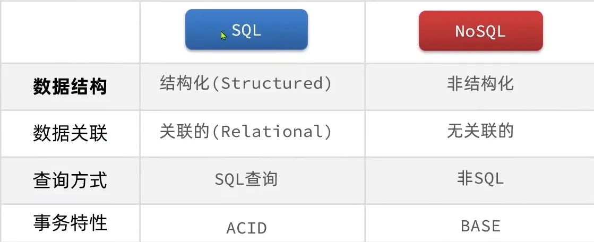
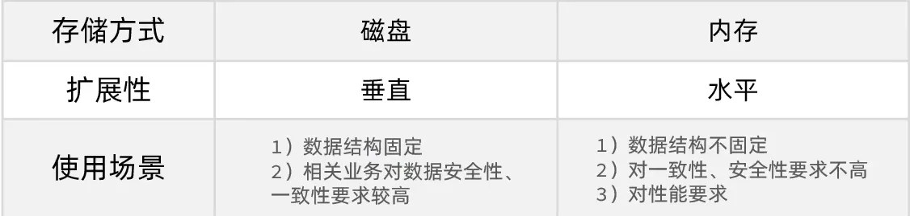
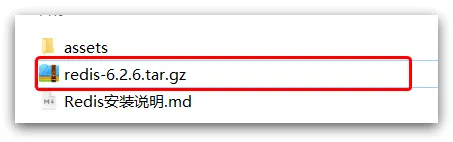
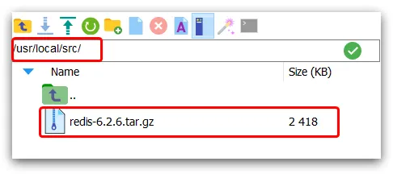
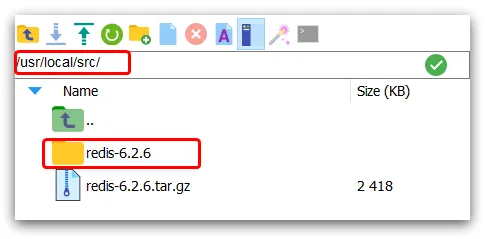
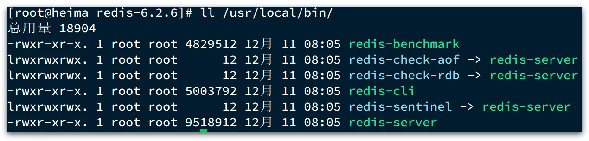
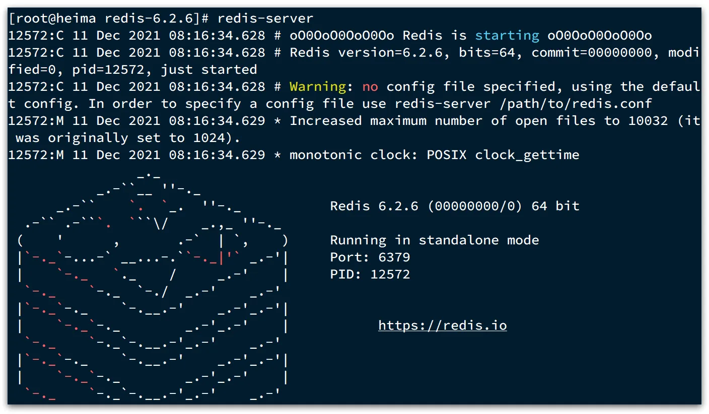
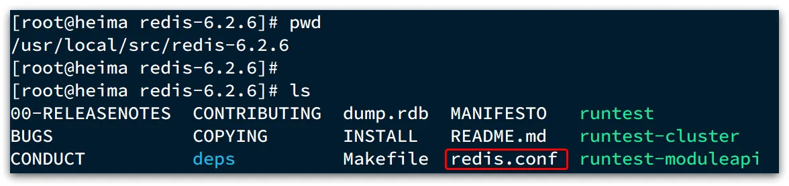
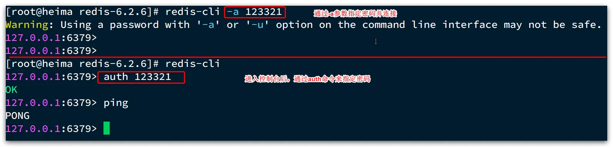

# 一、简介与入门

## 1、SQL 与 NoSQL




## 2、Redis

Redis(Remote Dictionary Server, 远程词典服务器)：是一个基于内存的键值型 NoSQL 数据库。


## 3、安装 Redis

大多数企业都是基于Linux服务器来部署项目，而且Redis官方也没有提供Windows版本的安装包。

### (1) 单机安装 Redis

#### 1. 安装Redis依赖

Redis是基于C语言编写的，因此首先需要安装Redis所需要的gcc依赖：

```shell
yum install -y gcc tcl
```

#### 2. 上传安装包并解压

然后将课前资料提供的Redis安装包上传到虚拟机的任意目录：



例如，我放到了/usr/local/src 目录：



解压缩：

```shell
tar -zvxf redis-6.2.6.tar.gz
```

解压后：


进入redis目录：

```shell
cd redis-6.2.6
```

运行编译命令：

```shell
make && make install
```

如果没有出错，应该就安装成功了。
默认的安装路径是在 `/usr/local/bin`目录下：



该目录以及默认配置到环境变量，因此可以在任意目录下运行这些命令。其中：

- redis-cli：是redis提供的命令行客户端
- redis-server：是redis的服务端启动脚本
- redis-sentinel：是redis的哨兵启动脚本

#### 3. 启动

**默认启动**
任意目录下，输入：

```shell
redis-server
```



此为前台启动。
**指定配置启动**
修改Redis配置文件，就在我们之前解压的redis安装包下（/usr/local/src/redis-6.2.6），名字叫`redis.conf`：



我们先将这个配置文件备份一份：
`cp redis.conf redis.conf.bck`
然后修改redis.conf文件中的一些配置：

```shell
# 允许访问的地址，默认是127.0.0.1，会导致只能在本地访问。修改为0.0.0.0则可以在任意IP访问，生产环境不要设置为0.0.0.0
bind 0.0.0.0
# 守护进程，修改为yes后即可后台运行
daemonize yes 
# 密码，设置后访问Redis必须输入密码
requirepass 123321
```

Redis的其它常见配置：

```shell
# 监听的端口
port 6379
# 工作目录，默认是当前目录，也就是运行redis-server时的命令，日志、持久化等文件会保存在这个目录
dir .
# 数据库数量，设置为1，代表只使用1个库，默认有16个库，编号0~15
databases 1
# 设置redis能够使用的最大内存
maxmemory 512mb
# 日志文件，默认为空，不记录日志，可以指定日志文件名
logfile "redis.log"
```

启动Redis：

```shell
# 进入redis安装目录 
cd /usr/local/src/redis-6.2.6
# 启动
redis-server redis.conf
```

停止服务：

```shell
# 利用redis-cli来执行 shutdown 命令，即可停止 Redis 服务，
# 因为之前配置了密码，因此需要通过 -u 来指定密码
redis-cli -u 123321 shutdown
```

**开机自启**

我们也可以通过配置来实现开机自启。
首先，新建一个系统服务文件：

```shell
vi /etc/systemd/system/redis.service
```

内容如下：

```nginx
[Unit]
Description=redis-server
After=network.target

[Service]
Type=forking
ExecStart=/usr/local/bin/redis-server /usr/local/src/redis-6.2.6/redis.conf
PrivateTmp=true

[Install]
WantedBy=multi-user.target
```

然后重载系统服务：

```shell
systemctl daemon-reload
```

现在，我们可以用下面这组命令来操作redis了：

```shell
# 启动
systemctl start redis
# 停止
systemctl stop redis
# 重启
systemctl restart redis
# 查看状态
systemctl status redis
```

执行下面的命令，可以让redis开机自启：

```shell
systemctl enable redis
```

### (2) Redis 客户端

**命令行客户端**

Redis安装完成后就自带了命令行客户端：redis-cli，使用方式如下：

```shell
redis-cli [options] [commonds]
```

其中常见的options有：

- `-h 127.0.0.1`：指定要连接的redis节点的IP地址，默认是127.0.0.1
- `-p 6379`：指定要连接的redis节点的端口，默认是6379
- `-a 123321`：指定redis的访问密码

其中的commonds就是Redis的操作命令，例如：

- `ping`：与redis服务端做心跳测试，服务端正常会返回`pong`

不指定commond时，会进入`redis-cli`的交互控制台：



**图形化 Redis 客户端**

在下面这个仓库可以找到安装包：[https://github.com/lework/RedisDesktopManager-Windows/releases](https://github.com/lework/RedisDesktopManager-Windows/releases)
首先需要开放 6379 端口。
