# 二、Redis 常见命令

## 1、Redis 数据结构

Redis 是一个 key-value 型数据库，key 值一般为 String，value 类型多样。
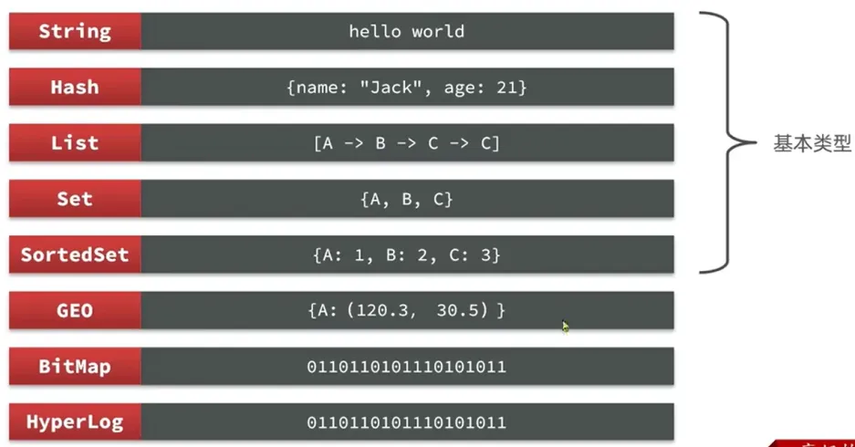

## 2、Redis 通用命令

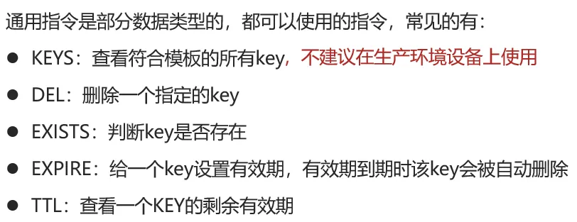

## 3、String 类型

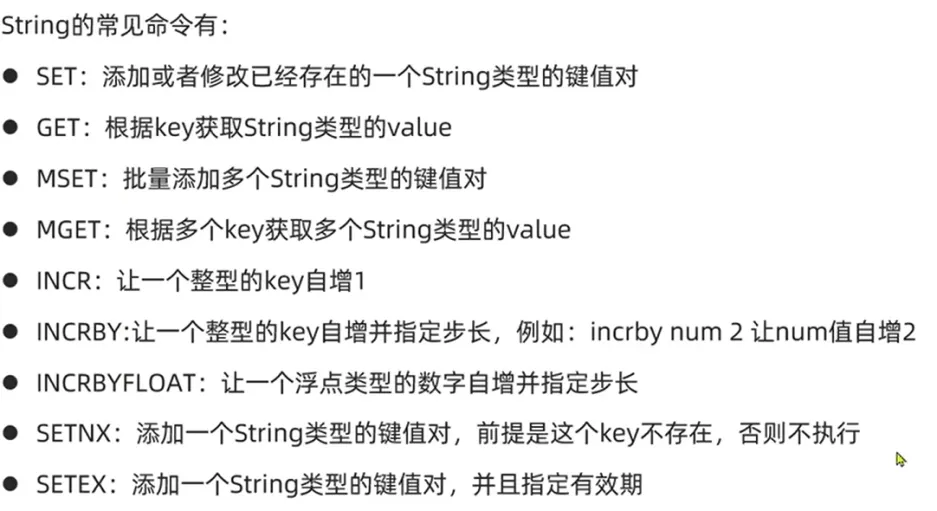

key 的层级结构

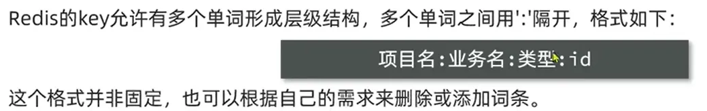

## 4、Hash 类型

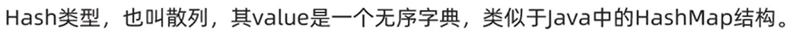
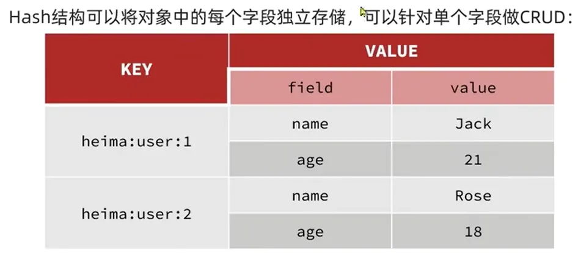
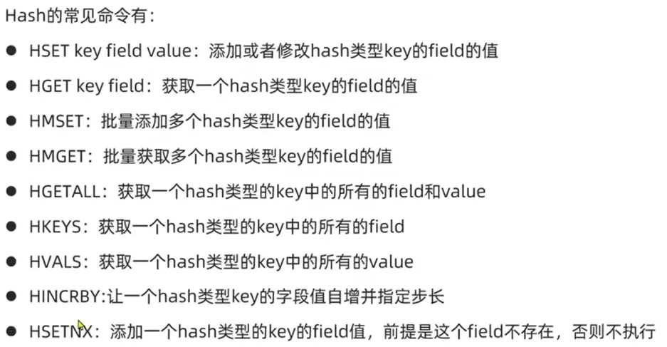

## 5、List 类型

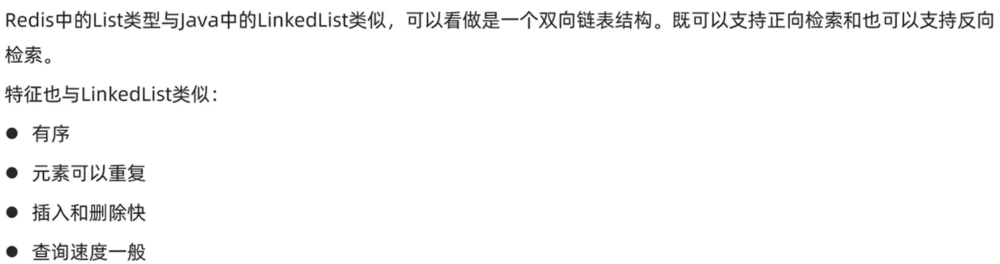
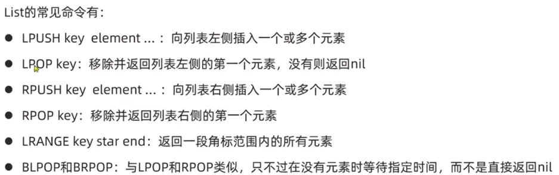

## 6、Set 类型

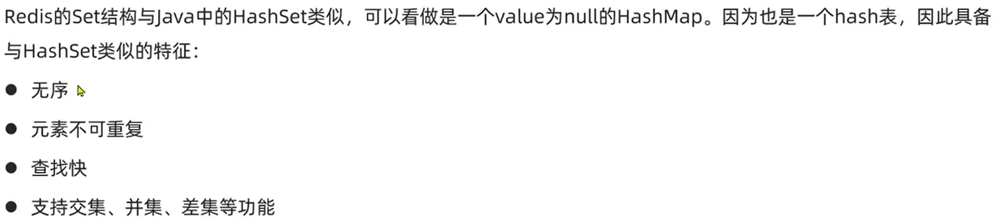
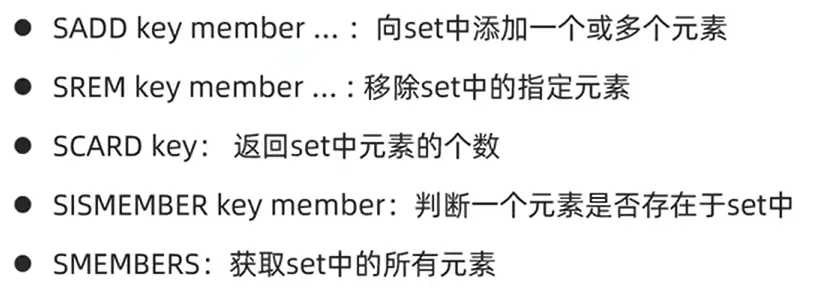
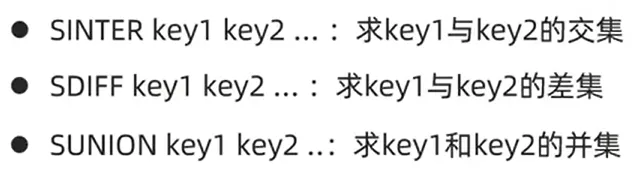

## 7、Sorted Set 类型

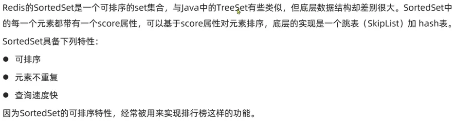
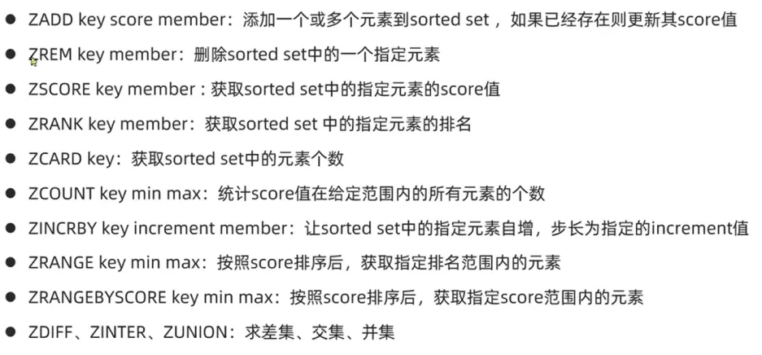
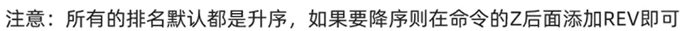
