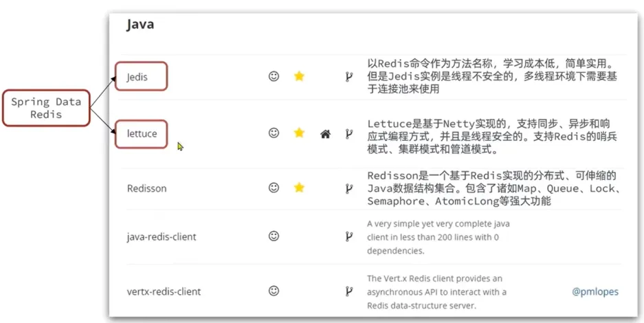
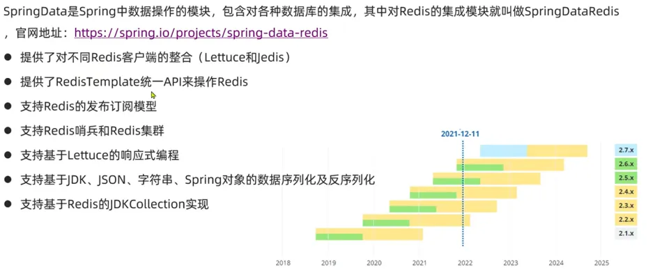
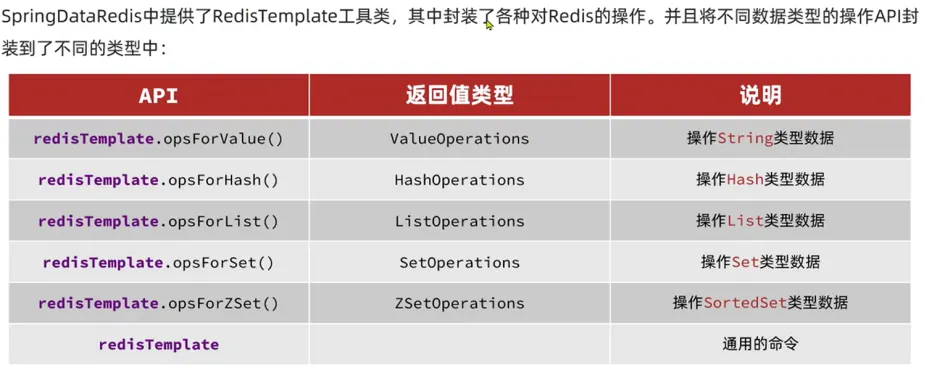
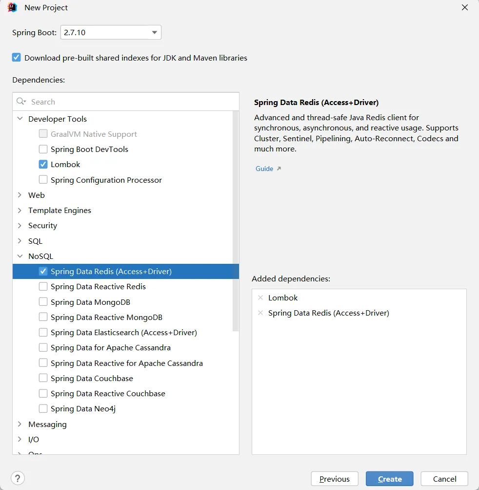
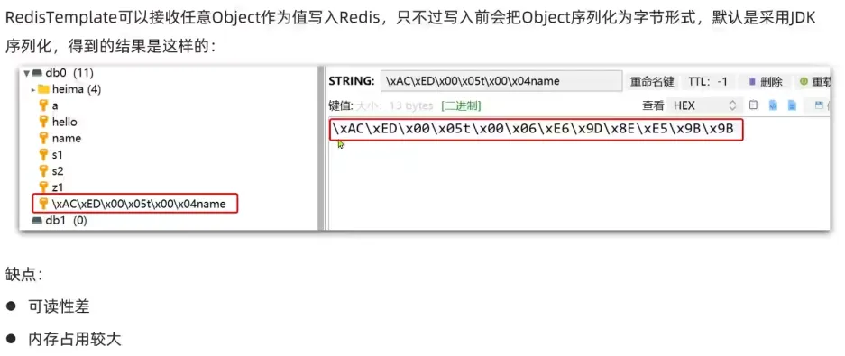

# 三、Redis 的 Java 客户端



## 1、Jedis

### (1) 快速入门

**引入依赖**

```xml
<!--Jedis 依赖-->
<dependency>
  <groupId>redis.clients</groupId>
  <artifactId>jedis</artifactId>
  <version>4.3.0</version>
</dependency>
```

**测试代码**

```java
    @Test
    public void testJedis() {
        // 连接 Redis
        jedis = new Jedis("192.168.88.130", 6379); // 指定 IP 地址端口号
        jedis.auth("991118"); // 指定密码
        jedis.select(0); // 选择库

        // 测试使用
        String result = jedis.set("jedistest", "ok");
        System.out.println(result);
        String jedistest = jedis.get("jedistest");
        System.out.println(jedistest);

        // 关闭连接
        if (jedis != null) {
            jedis.close();
        }
    }
```

### (2) Jedis 连接池

连接池代码

```java
public class JedisConnectionFactory {
    private static final JedisPool jedisPool;

    static {
        // 配置连接池
        JedisPoolConfig poolConfig = new JedisPoolConfig();
        // 最大连接数
        poolConfig.setMaxTotal(8);
        // 最大空闲连接
        poolConfig.setMaxIdle(8);
        // 最小空闲连接
        poolConfig.setMinIdle(0);
        // 没有空闲连接等待时长
        poolConfig.setMaxWaitMillis(1000);
        //创建连接池对象
        jedisPool = new JedisPool(poolConfig, "192.168.88.130",6379,1000,"991118");
    }

    public static Jedis getJedis(){
        return jedisPool.getResource();
    }
}
```

使用测试

```java
    @Test
    public void testJedis() {
        // 连接 Redis
        this.jedis = JedisConnectionFactory.getJedis();

        // 测试使用
        String name = this.jedis.get("name");
        System.out.println(name);

        // 关闭连接
        if (this.jedis != null) {
            this.jedis.close();
        }
    }
```

## 2、SpringDataRedis




### (1) 快速入门


**引入依赖**

```xml
<!--redis 依赖-->
<dependency>
  <groupId>org.springframework.boot</groupId>
  <artifactId>spring-boot-starter-data-redis</artifactId>
</dependency>
<!--连接池依赖-->
<dependency>
  <groupId>org.apache.commons</groupId>
  <artifactId>commons-pool2</artifactId>
</dependency>
```

**在`application.yml`中进行配置**

```yaml
spring:
  redis:
    host: 192.168.88.130
    port: 6379
    password: 991118
    lettuce:
      pool:
        max-active: 8  #最大连接
        max-idle: 8   #最大空闲连接
        min-idle: 0   #最小空闲连接
        max-wait: 100ms #连接等待时间
    database: 0
```

**使用测试**

```java
@SpringBootTest
class SpringDataRedisDemoApplicationTests {

    @Resource
    private RedisTemplate redisTemplate;

    @Test
    void testString() {
        redisTemplate.opsForValue().set("name", "zhangsan");

        // 获取string数据
        Object name = redisTemplate.opsForValue().get("name");
        System.out.println(name);
    }

}
```

### (2) SpringData 的序列化



可以自定义 `RedisTemplate`的序列化方式，配置比较复杂。也可以使用 `StringRedisTemplate`，该 `RedisTemplate`统一使用 String 序列化器，只能存储 String 类型的 key 和 value。如果需要存取 java 对象，手动完成序列化和反序列化。

```java
@SpringBootTest
class SpringDataRedisDemoApplicationTests {

    @Autowired
    private StringRedisTemplate stringRedisTemplate;

    @Test
    void testString() {
        stringRedisTemplate.opsForValue().set("name", "小亮");

        // 获取string数据
        Object name = stringRedisTemplate.opsForValue().get("name");
        System.out.println(name);
    }

    @Test
    void testObject() {
        // 创建对象
        User user = new User();
        user.setName("虎哥");
        user.setAge(21);

        // 手动序列化
        String userJson = JSON.toJSONString(user);

        // 写入数据
        stringRedisTemplate.opsForValue().set("user:200", userJson);

        // 读取数据
        User userGet = JSON.parseObject(stringRedisTemplate.opsForValue().get("user:200"), User.class);

        System.out.println(userGet);
    }

}
```
