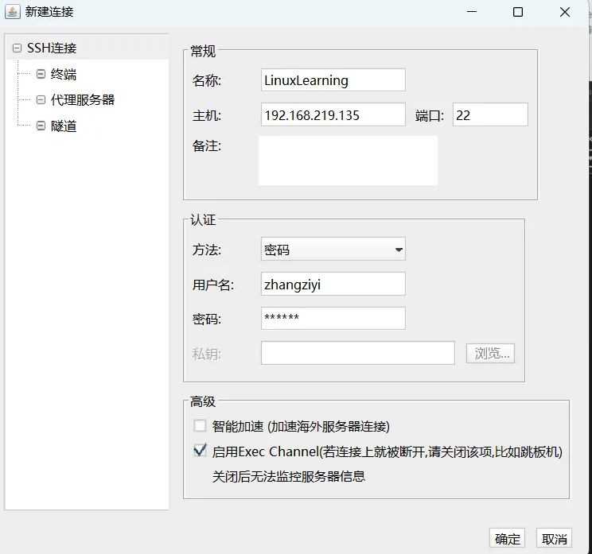
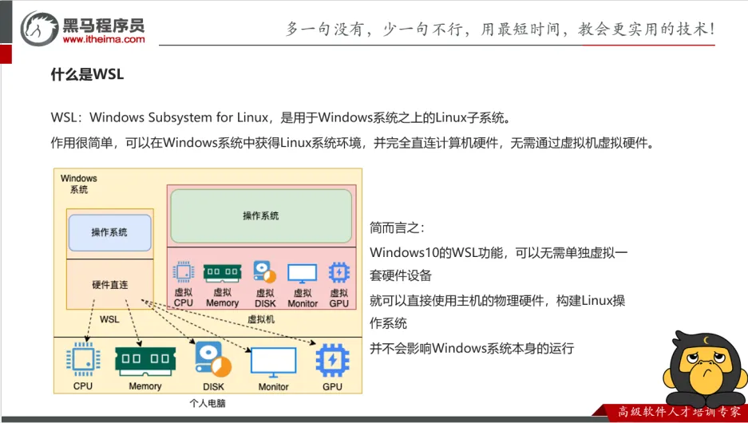
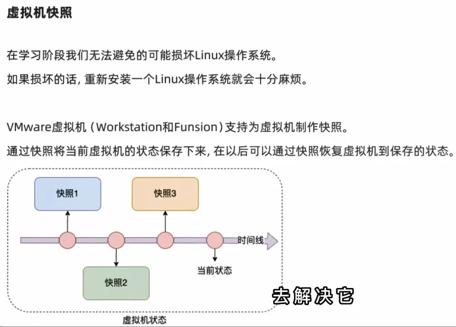
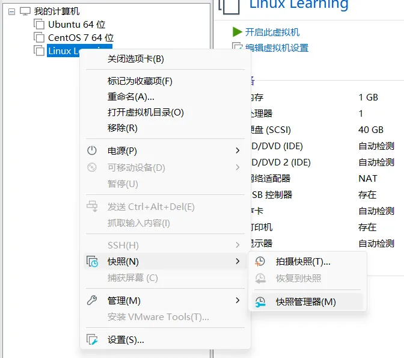

# 一、Linux 简介

## 1、Linux 发行版

Linux 内核是开源免费的，封装内核+系统级程序便构成了发行版。
知名发行版如下：

## 2、FinalShell

可以使用 FinalShell 远程连接 Linux 系统。
下载地址：[http://www.hostbuf.com/downloads/finalshell_install.exe](http://www.hostbuf.com/downloads/finalshell_install.exe)

**连接步骤**

1. 解锁 CentOs 并打开终端
2. 在终端中输入 `ifconfig`，查看虚拟机 IP 地址
3. 输入连接设置

## 3、WSL

## 4、虚拟机快照

创建快照

