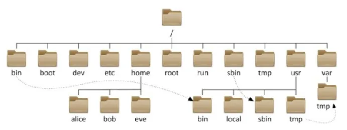
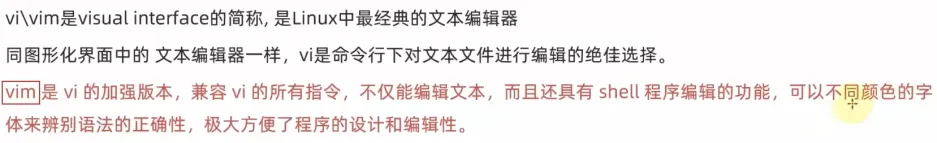
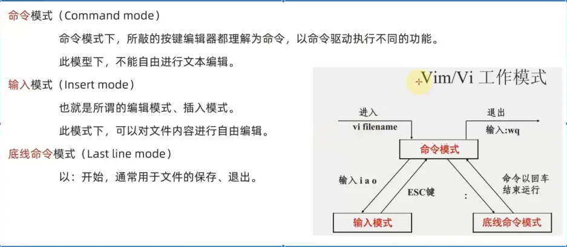
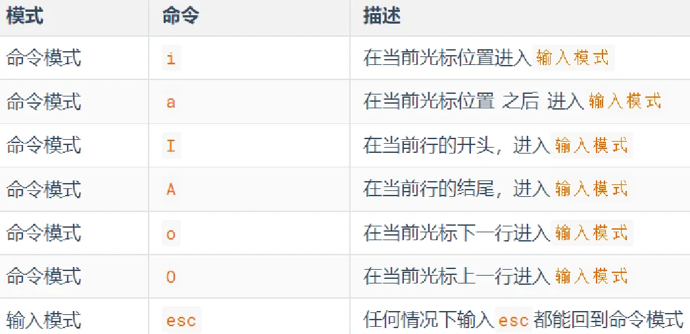
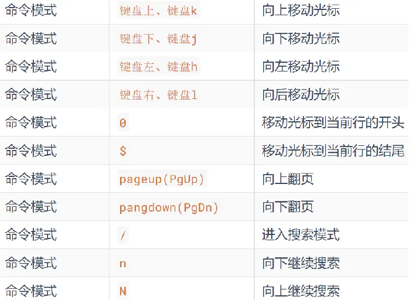
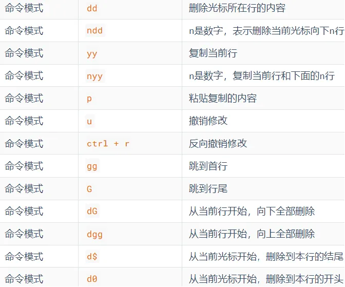
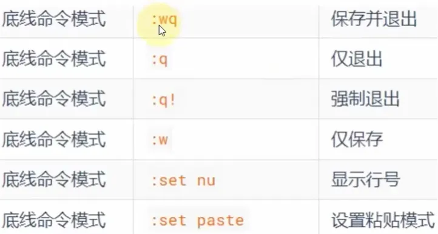

# 二、Linux 基础命令

快捷键

`Ctrl + l`：清屏

## 1、Linux 目录结构

Linux 系统没有盘符的概念，只有一个根目录 `/`。

例如：`/usr/tmp`，开头斜杠表示根目录，后面斜杠表示层级关系。

## 2、Linux 命令入门

### (1) Linux 命令基础格式

Linux 命令通用格式：`command [-options] [parameter]`

- `command`：命令
- `-options`：命令选项，控制命令的行为细节
- `parameter`：命令参数，对命令指向目标进行控制

### (2) ls

英文：List
功能：列出文件夹信息
语法：`ls [-l -h -a] [Linux 路径]`

- Linux 路径：被查看的文件夹，不提供表示查看当前工作目录
- `-l`：以列表形式查看，显示更多细节
- `-h`：配合 `-l`，以更加人性化的方式显示文件大小
- `-a`：显示隐藏文件
  :::info
  工作目录与 HOME 目录
  
  :::

## 3、目录切换命令：`cd`/`pwd`

### (1) cd

英文：Change Directory
功能：切换工作目录
语法：`cd [工作目录]`

- 工作目录不提供会切换到默认工作目录，即当前登录用户的 HOME 目录

特殊路径符：`~`表示当前用户的 HOME 目录。

### (2) pwd

英文：Print Working Directory
功能：打印当前工作目录
语法：`pwd`

## 4、创建目录指令：`mkdir`

英文：Make Directory
功能：创建新文件夹
语法：`mkdir [-p] 路径`

- `-p`：自动创建不存在的父目录

> 注：创建文件夹需要权限。

## 5、文件操作命令

### (1) 创建文件：touch

功能：创建文件
语法：`touch Linux路径`

### (2) 查看文件：cat

功能：查看文件
语法：`cat Linux路径`

### (3) 查看文件：more

功能：分页显示文件内容
语法：`more Linux路径`

### (4) 复制文件：cp

英文：copy
功能：复制文件/文件夹
语法：`cp [-r] 源 目标`

- `-r`：复制文件夹时使用，表示递归

### (5) 移动文件/文件夹：mv

英文：move
功能：移动文件/文件夹
语法：`mv 源 目标`

### (6) 删除文件/文件夹：rm

英文：remove
功能：删除文件/文件夹
语法：`rm [-r -f] 删除文件1 删除文件2...`

- `-r`：在删除文件夹时使用，表示递归
- `-f`：强制删除(不会弹出提示确认信息)

> rm 命令支持通配符 `*`，表示零个或多个，用来做模糊匹配。

> 在超级管理员状态，rm 是一个危险的指令，如下命令，不要使用：
> `rm -rf /`
> 相当于在 Windows 系统中格式化了 C 盘

## 6、查找命令

### (1) 查找命令：which

功能：查看命令存放的位置
语法：`which 命令`

### (2) 查找文件：find

功能：搜索指定文件
**按文件名查找**
语法：`find 起始路径 -name "被查找文件名"`

- 起始路径不填表示从当前路径查找

> 也可以使用通配符 `*`。

**按文件大小查找**
语法：`find 起始路径 -size +/-n[kMG]`

- `+/-`表示大于/小于
- n 表示大小数字
- kMG 表示大小单位，k 表示 KB，M 表示 MB，G 表示 GB

## 7、grep、wc 和管道符

### (1) grep

功能：从文件中通过关键字过滤文件行
语法：`grep [-n] 关键字 文件路径`

- `-n`：在结果中显示匹配行的行号
- 文件路径：被统计的文件，可作为**内容输入端口**

### (2) wc

功能：对文件行数、字数等做数量统计
语法：`wc [-c -m -l -w] 文件路径`

- `-c`：统计 bytes 数量
- `-m`：统计字符数量
- `-l`：统计行数
- `-w`：统计单词数量
- 文件路径：被统计的文件，可作为**内容输入端口**

### (3) 管道符

`|`将左侧命令的结果作为右侧命令的输入。
例：`cat test.txt | wc -w`

## 8、echo、tail 和重定向符

### (1) echo

功能：在命令行内输出指定内容
格式：`echo "输出内容"`

> 使用反引号 ` 包裹的内容将作为命令执行。

### (2) 重定向符

作用是将符号左边的结果，输出到右边指定的文件中去，包括 `>`和 `>>`。
`>`：覆盖输出
`>>`：追加输出

### (3) tail

功能：查看文件尾部内容
语法：`tail [-f -num] Linux路径`

- `-f`：持续跟踪
- `-num`：查看尾部多少行，默认 10 行

## 9、vi/vim 编辑器

### (1) 简介

vi/vim 有三种工作模式：
其中，命令模式是中转站。

### (2) 使用

**基本使用流程**

1. 使用 `vim 文件`进入编辑器命令模式。
2. 在命令模式下，按下 i 键便进入输入模式。
3. 输入完成，按 ESC 返回命令模式。
4. 命令模式下，按 : 进入底线命令模式。
5. 在底线命令模式下，输入 `wq`后回车，保存并退出。

**命令模式常用快捷键**

**底线命令模式常用快捷键**

