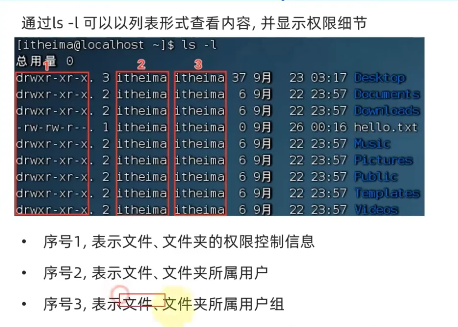

# 三、Linux 权限

普通用户权限，在其 Home 目录内是不受限的。

## 1、切换用户与返回：`su`和 `exit`

英文：Switch User
语法：`su [-] 用户名`

- `-`：切换的同时加载环境变量
- 用户名不填默认 root

## 2、临时切换 root 执行某条命令：`sudo`

语法：`sudo 其他命令`
并不是所用普通用户都有使用 `sudo`的权限，需要给普通用户配置 `sudo`认证。

**认证步骤**

1. 切换到 root 用户，输入 `visudo`；
2. 在文件最后一行添加 `用户名 ALL=(ALL)	NOPASSWD: ALL`；
3. 保存并退出。

## 3、用户与用户组

### (1) 用户组管理

**添加用户组**

语法：`groupadd 用户组名`

**删除用户组**

语法：`groupdel 用户组名`

### (2) 用户管理

**创建用户**

语法：`useradd [-g -d] 用户名`

- `-g`：指定用户组，不指定默认创建用户同名组
- `-d`：指定用户 Home 路径，默认 `/home/用户名/`

**删除用户**

语法：`userdel [-r] 用户名`

- `-r`：表示删除 home/用户名 目录

**查看用户所在组**

语法：`id [用户名]`

- 不填用户名表示查看当前用户

**修改用户所属组**

功能：将用户添加到用户组
语法：`usermod -aG 用户组 用户名`

**查看系统中的用户**
语法：`getent passwd`

呈现结果

**查看系统中的组**

语法：`getent group`

## 4、权限控制信息

## 5、修改权限控制：`chmod/chown`

### (1) `chomod`

权限信息是可以修改的，只有文件/文件夹所属用户和 root 用户可以修改权限信息。
语法：`chomod [-R] 权限 文件/文件夹`

- `-R`：对文件夹内的全部内容应用相同操作

权限的数字序号：

常用权限：7(rwx)、5(r-x)、1(--x)

### (2) `chown`

功能：修改文件/文件夹所属用户和用户组

> 此命令只能 root 用户使用。

语法：`chown [-R] [用户] [:] [用户组] 文件或文件夹`
使用案例：

