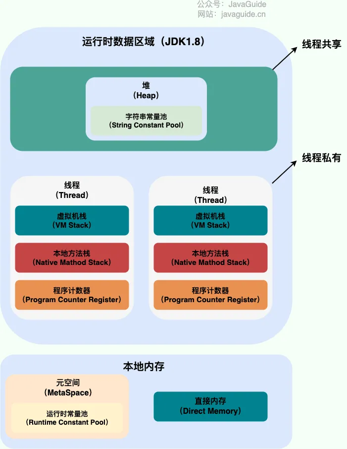
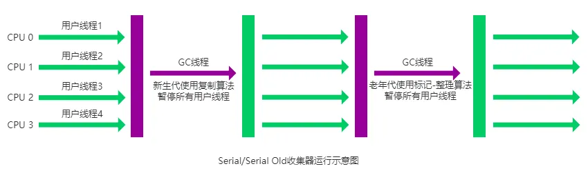
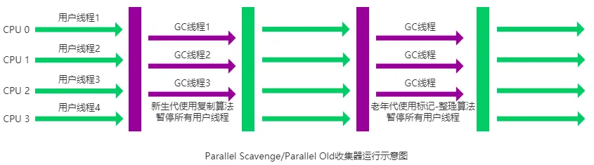

# Java

## Java 创建线程有哪几种方式？

Java 创建线程有两类方式：直接创建和利用线程池创建。

在直接创建中，首先，需要创建一个类，这个类继承 `Thread`类，重写 `run()`方法或者实现 `Runnable`接口，实现 `run()`方法。然后，创建这个类的实例，调用 `start()`方法，就可以创建线程。

在利用线程池创建中，首先需要创建线程池，然后向线程池提交任务，线程池会在恰当时机启动线程执行任务。

## Java 线程池有哪几个参数
Java 线程池主要有 6 个参数，分别对线程池、工作队列等进行配置。包括 `corePoolSize`核心线程数、`maximumPoolSize`最大线程数、`keepAliveTime`线程存活时间、`workQueue`工作队列、`threadFactory`线程工厂和 `handler`饱和策略。

核心线程数是线程池中始终保持活跃的线程数，这些线程即使空闲也不会被回收。

最大线程数是线程池允许的最大线程数。当队列已满，线程池允许创建超过核心线程数的线程，直到达到最大线程数。

线程存活时间是超过核心线程数的多余线程的存活时间。超过这个时间，多余线程将被回收。

工作队列是搭配线程池使用的存放任务的队列。可以根据需求，选择不同特性的工作队列，例如有无界、有无优先级。

线程工厂可以指定新线程创建的逻辑。

饱和策略是指当队列已满并且线程数量到达最大线程数时，采用的策略，例如抛出异常、使用调用者线程执行、抛弃最新的任务、抛弃最老的任务等。

## 线程池的实现方式

Java 中线程池实现包括两部分：阻塞队列和线程池。
向线程池提交任务后，首先查看当前线程数是否小于核心线程数，是则创建新线程完成任务；
若当前线程数大于等于核心线程数，将任务提交到阻塞队列；
若阻塞队列已满，查看当前线程数是否小于最大线程数，若小于，则创建线程执行该任务；
若当前线程数已达到了最大线程数，就执行饱和策略。

## 线程池核心线程数如何设置

可以根据任务性质设置核心线程数。

记 CPU 核心数为 `N`。

对于计算密集型任务，可将核心线程数设置为 `N+1`。

对于 IO 密集型任务，可将核心线程数设置为 `2N`。

核心线程数设置过小，大量任务堆积在阻塞队列导致 OOM；核心线程数设置过大，导致大量线程并发，增大切换开销。

## SpringBoot 自动装配
是什么？怎么实现的？如何使用？

SpringBoot 自动装配简单而言就是自动将第三方组件的 Bean 装配到容器中，而无需手动进行配置。

SpringBoot 在启动时，会扫描第三方 jar 包中的 `META-INF/spring.factories`，这个文件中包含了很多个类，根据类定义将 bean 添加到容器中。

SpringBoot 自动装配是默认开启的，在 SpringBoot 启动类，通常有 `@SpringBootApplication`注解，这个注解由三个注解组合而成：`@Configuration`、`@ComponentScan`和 `@EnableAutoConfiguration`，第三个注解就是启用自动装配。

## Java 中的引用类型

Java 中对象的引用类型包括强引用、软引用、弱引用和虚引用，垃圾回收过程针对不同引用类型，会有不同行为。

强引用是最常使用的引用类型，指向的对象不会被回收；
对于软引用指向的对象，当内存空间不足时会进行回收，软引用可以用于实现缓存；
对于弱引用指向的对象，无论内存空间充足与否，都会被回收；
虚引用是最弱的一种引用，无法通过虚引用获取对象，虚引用的作用是标记对象被回收的过程。

## `ArrayList`和 `LinkedList`有什么区别？

`ArrayList`底层使用数组存储元素，`LinkedList`底层使用双向链表存储元素。
因此，`ArrayList`支持高效随机访问，`LinkedList`随机访问效率较低；
`ArrayList`在中间插入、删除元素效率较低，`LinkedList`在任何地方插入、删除元素效率都很高。
总而言之，如果涉及频繁插入删除操作，使用 `LinkedList`；如果涉及频繁随机访问，可以使用 `ArrayList`。

## Spring Bean 的生命周期

Spring Bean 的生命周期主要分为五个阶段：实例化、属性设置、初始化、使用、销毁。

实例化阶段使用无参构造方法创建这个 Bean 实例。

属性设置阶段会注入 Bean 的属性。例如使用 `@Autowire`注解或 `@Resource`注解注入。

初始化阶段属性注入完毕，可以实现 `InitializingBean`接口，或使用 `@PostContruct`注解在初始化时执行自己的逻辑。

销毁阶段，可以实现 `DisposableBean`或 `@PreDestory`注解在销毁前执行自己的逻辑。

## Spring AOP
是什么？如何使用？原理是什么？

AOP 是 Spring 的核心概念之一。 AOP 是面向切面编程，它的作用是将与业务流程无关、但被大量业务流程共享的非业务模块（例如事务管理、日志输出、权限控制）提取出来，降低程序耦合度。

Spring AOP 使用方式是定义一个切面，并选择方法作为切点，对切点织入通知，实现功能增强。

Spring AOP 是基于动态代理的，所谓动态代理，是指代理类并不是在编写代码阶段显式写出，而是在编译时，动态生成代理类的字节码，包括 JDK 动态代理和 CGLIB 动态代理。
JDK 动态代理基于反射机制，适用于实现了接口的被代理类。
CGLIB 动态代理基于字节码操作，通过生成被代理类的子类进行代理。

Spring AOP 已经集成了 AspectJ，这是基于字节码操作的、最完整的 AOP 框架。

## Spring IoC
是什么？怎么使用？原理是什么？

Spring IoC 是 Spring 的核心概念之一，IoC 是控制反转，对象之间的依赖和对象的生命周期都由容器管理，而不是由程序员手动管理，这种方式降低了对象之间的耦合度、提高了代码的可维护性。
Spring 通过依赖注入的方式实现控制反转。
在使用 Spring 时，只需要进行配置，容器就可以管理对象之间的依赖与对象的生命周期。

## Spring 常用的注解
使用 SpringBoot 构建 Web 后端，常用的注解包括：

`@RequestMapping`定义了如何处理 HTTP 请求。

`@RestController`结合了 `@Controller`和 `@ResponseBody`，用于定义 RESTful 风格的控制器。

`@Autowire`和 `@Resource`注解用于依赖注入。

`@Service`标识了一个 Service 层 Bean。

`@Repository`标识了一个 Dao 层 Bean。

`@Transactional`是声明式事务管理注解。

## `@Transactional`注解失效的场景

`@Transactional`是使用 Spring AOP 实现的，其基本原理是生成一个包含编程式事务处理的代理类来执行相应的方法。因此 `@Transactional`注解失效场景可分为两大类：第一类是底层实现原理本身带来的限制，第二类是使用不当导致失效。

第一类失效场景包括：

1. 无注解方法调用有注解方法，外部调用无注解方法。这会导致不使用代理类执行相应方法，从而失效。
2. 注解方法非 `public`修饰，这也是底层实现原理的限制

第二类失效场景包括：

1. `@Transactional`有一个关键属性 `rollBackFor`，这个属性标识了出现哪些异常时进行回滚。若此属性为默认值，默认行为是出现 `Unchecked Exception`时进行回滚。如果出现其他类型异常则不会回滚。
2. 如果异常被捕获，没有抛出，也会导致失效
3. 如果数据库不支持事务，注解也会失效

## 堆和栈的区别
堆和栈是针对内存的不同使用需求开辟的具有不同特性的内存空间。

堆为了满足动态分配、动态回收的需求；
栈为了满足方法调用的需求，调用方法时压栈，方法返回时弹栈。

## Java 内存结构是怎样的？

由于 Java 支持多线程， JVM 在运行 Java 程序时会将其管理的内存划分为若干区域。包括线程共享区域和线程私有区域。

线程私有区域包括程序计数器、Java 虚拟机栈和本地方法栈。

1. 程序计数器

简单来说，程序计数器 PC 指向字节码的某一行，字节码解释器通过程序计数器来依次执行指令，对代码解释执行。
多线程情况下，PC 用于指向当前线程执行的位置，从而进行线程切换。
程序计数器随着线程创建而创建，随着线程结束而消亡。

2. Java 虚拟机栈

所有的 Java 方法调用都是通过 Java 虚拟机栈来实现的。
每进行一次方法调用，都会生成一个栈帧压栈，栈帧包括局部变量表、操作数栈、方法返回地址等。

线程公共区域包括堆和方法区。

1. 堆

存放对象实例。堆是垃圾回收器管理的主要区域。堆中包含字符串常量池，这个区域可以复用字符串，避免字符串的重复创建。

2. 方法区

方法区主要用来存放 Class 对象。在 JDK8 中，方法区的实现是本地内存中的 MetaSpace。

## `synchronized`关键字底层原理
`synchronized` 底层使用到了 Java 对象头和监视器锁。

首先，Java 中的每个对象都有一个对象头，对象头保存了对象的运行时数据，例如锁信息、hashcode、GC 信息等。

每一个对象都有一个监视器锁，当线程进入同步方法或同步代码块时，会首先尝试获取对象的监视器锁。如果锁已被其他线程持有，则会根据锁状态进入 CAS 自旋或阻塞状态，直至锁被释放。

根据线程竞争的激烈程度，锁会升级。
可以分为无锁、偏向锁、轻量级锁和重量级锁。
无锁表示没有线程持有对象锁。
偏向锁会偏向于第一次获取锁的线程，在这个线程再次获取锁时，可以直接得到，不需要进行 CAS 操作。
当偏向锁被其他线程竞争时，会升级为轻量级锁，轻量级锁会使用 CAS 操作来获取锁。
当轻量级锁竞争激烈时会升级为重量级锁，重量级锁使用操作系统的互斥锁实现，获取锁失败的线程进入阻塞状态。

总而言之，`synchronized` 关键字使用到对象头和监视器锁实现。

## 垃圾回收机制

### 垃圾回收机制概述
Java 垃圾回收机制是一种针对堆内存中的对象自动分配内存、回收内存的机制。
Java 将堆内存分为了新生代和老年代，其中新生代包括 Eden 区和两个 Survivor 区。大多数对象在 Eden 区中分配，如果 Eden 区已满，则对新生代发起一次垃圾回收，回收新生代中已经死亡的对象，而对于存活的对象，Eden 区中的对象会晋升到 Survivor 区，而 Survivor 中的对象年龄会增加，当其年龄超过阈值，则进入老年代；而数组这种大对象直接存入老年代。

### 对象死亡判断

对象是否死亡，使用可达性分析算法进行判断。这个算法的思想是通过一系列 GC ROOTS 作为起点，通过引用链搜索对象，通过这些引用链不可达的对象就是死亡对象。
这些 GC ROOTS 是保证存活状态的对象，例如类静态字段指向的对象。

### 垃圾回收算法

Java 常见的垃圾回收算法包括：标记-清除、标记-整理、复制和分代收集算法。

#### 标记-清除

首先标记出所有可达的对象，然后将不可达的对象清除。

**缺点：效率不高；产生大量内存碎片。**

#### 标记-整理

首先标记所有存活的对象，然后将他们整理到堆的一端，然后清除掉边界外的内存。

**优点：解决了标记-清除算法内存碎片问题。**

**缺点：整理过程耗时。**

#### 复制

将内存分为两部分，每次只使用其中一块，当一块用完时，将存活的对象复制到另一块，清除这一块。

**优点：比标记-整理算法效率高。**

**缺点：内存消耗加倍。**

#### 分代收集算法

将内存分为新生代、老年代等，针对不同年代的特点采用不同的垃圾回收算法。

### Java 垃圾收集器

JDK8 之前的默认垃圾收集器是 Parallel GC，JDK9 之后的默认垃圾收集器是 G1 GC。

#### Serial 收集器

使用单线程完成垃圾回收工作，并且执行垃圾回收时，停止所有工作线程。

新生代使用复制算法，老年代使用标记-整理算法。

Serial 收集器实现简单，开销低，很适合单核或小堆内存环境。

#### Parallel 收集器

Serial 收集器的多线程版本，注重吞吐量，即 CPU 用于执行用户代码的时间与 CPU 执行代码的总时间。

在 JDK8 中默认使用 Parallel 收集器，新生代使用复制算法，老年代使用标记-整理算法。

#### CMS 收集器

Concurrent Mark Sweep，并发标记清除。

算法流程：首先暂停所有工作线程，拍摄堆快照，获取 GC ROOTS；同时运行工作线程和 GC 线程，进行对象可达性分析；再次暂停所有工作线程，拍摄堆快照，更新可达性；同时开启工作线程和 GC 线程，启动清除工作。

缺点：标记-清除算法会产生大量内存碎片。因此它在 JDK9 中标记为过时，在 JDK14 中被清除。

#### G1 收集器

G1 收集器是一款面向服务器的垃圾收集器，主要针对多核、大容量内存的机器。将 Java 作为后端时，非常适合使用 G1 收集器。JDK9 之后，默认的垃圾回收器就是 G1 收集器。

G1 收集器中，将堆内存划分为了若干区域，并非给每一代都分配连续的内存空间。

算法流程：首先暂停所有工作线程，拍摄堆快照，获取 GC ROOTS；同时运行工作线程和 GC 线程，进行可达性分析；再次暂停所有工作线程，拍摄堆快照，更新可达性；同时开启工作线程和 GC 线程，启动清除工作，这个清除工作，就是根据用户提供的预测时间，对回收价值最大的 Region 进行垃圾回收。

G1 收集器使用复制算法，有效解决了内存碎片问题。

## Java 内存泄漏
Java 内存泄漏是指堆内存不断堆积，导致内存耗尽。
虽然 Java 有垃圾回收机制，但垃圾回收机制针对的是不再被引用的对象，当对象已不再使用，但仍然被引用，这些对象最终就会导致内存泄漏。

导致内存泄漏的原因包括：静态集合类、没有关闭资源、线程池等。一般而言，出现内存泄漏都是我们的代码逻辑出现了问题。

避免内存泄漏的最佳实践包括：

1. 及时释放资源
2. 使用软引用或弱引用指向可能长期不使用的对象
3. 避免使用静态集合持有短生命周期对象

## ThreadLocal 的原理

ThreadLocal 类型的变量在每个线程中都有独特的副本。
其实现原理是在每个 `Thread`类中都有一个 `ThreadLocalMap`，这个 `ThreadLocalMap`是一个哈希表，哈希表的键是 `ThreadLocal`对象的引用，值是线程独有的变量值副本。可以使用 `ThreadLocal`的 `set()`和 `get()`方法修改获取变量值副本。
`ThrealLocalMap`对 `ThreadLocal`对象的引用是弱引用，如果 `ThreadLocal`对象被回收，但 `ThreadLocalMap`值对象未被回收，那么就无法通过键获取变量值，导致内存泄漏问题。
为防止 `ThreadLocal`导致内存泄漏问题，可以在不使用 `ThreadLocal`变量时，使用 `remove()`方法显式将值也一并删除。

## Java 异常体系

Java 中异常包括 Exception 和 Error。Exception 指那些程序可以处理的异常，可以使用 `catch`进行捕获；Error 指那些程序无法处理的错误，例如 `StackOverFlowError`，出现这些错误时，JVM 一般会将线程终止。
Exception 包括 Unchecked Exception 和 Checked Exception，Checked Exception 需要使用 `try catch`显式地进行处理，否则无法通过编译，IO 相关的异常就是 Checked Exception；Unchecked Exception 一般是运行阶段出现的异常，`RuntimeException`及其子类均为 Unchecked Exception，常见的包括空指针异常、`ArrayIndexOutOfBoundException`等。

