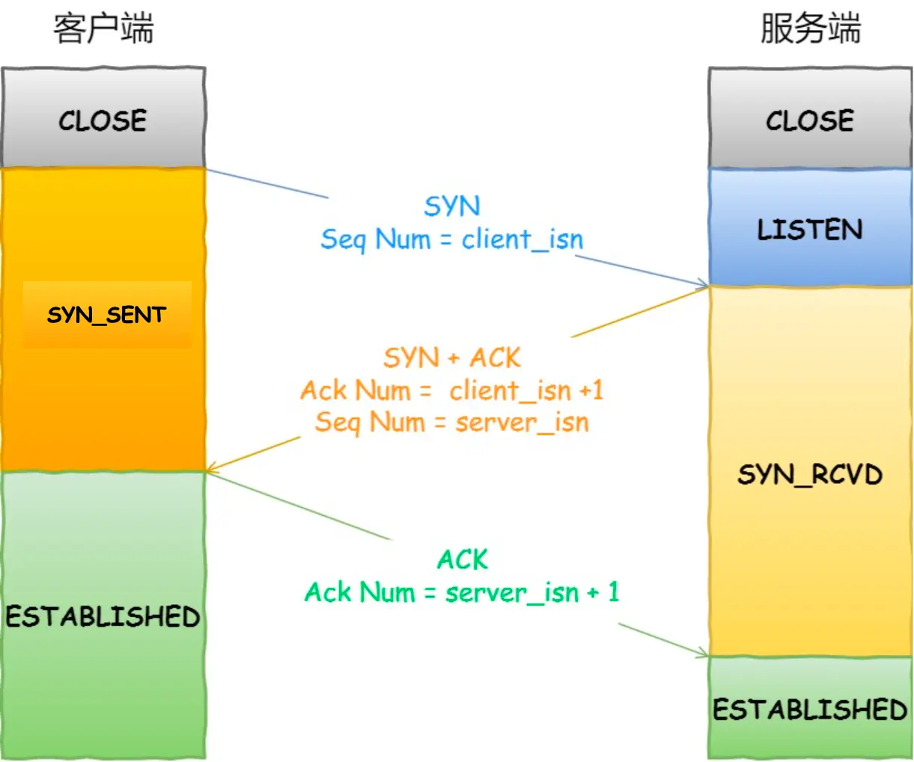
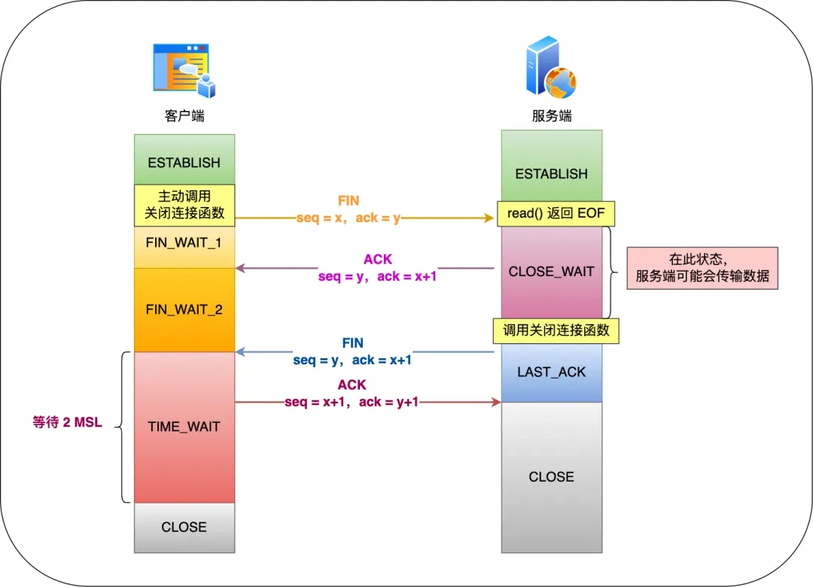

# 3. 传输层
## TCP 头部有哪些重要属性？
TCP 头部重要属性包括源端口号、目的端口号、序列号、确认号和标志位等。

## TCP 三次握手过程是怎样的？
一开始，双端都处于连接关闭状态。

然后，服务端主动监听某个端口，进入监听状态。

接着，客户端主动发起连接请求，发送同步包给服务端，自身进入 Syn_sent 状态。

服务端接收到同步包后，向客户端发送应答+同步包，自身进入 syn_recv 状态。

客户端接收到应答+同步包后，向服务端发送应答包，自身进入 established 状态。

服务端接收到应答包，自身进入 established 状态。

自此，TCP 三次握手过程完成。

## TCP 为什么需要三次握手过程？
TCP 使用三次握手过程建立连接主要原因有两点：防止历史连接初始化连接和保证连接双方都有收发能力。

首先，使用三次握手过程，客户端可以及时发现错误的历史连接并主动关闭。

其次，经过 TCP 握手过程，双方均成功收发了一次数据，保证了双方的收发能力，同步了序列号。

## TCP 三次握手，报文丢失会发生什么？
应答报文不会主动重传，某报文丢失，一定是请求报文重传。

## TCP 三次握手过程中，服务端收到 SYN 报文后，在回复 SYN+ACK 之前，做了什么事？
服务端收到 SYN 报文后，会将该连接添加到半连接队列。
当服务端收到 ACK 报文后，会将该连接从半连接队列中取出，添加到 accept 队列。

## SYN 攻击是什么？
SYN 攻击是指，当服务端收到大量 SYN 报文，半连接队列很快被占满，无法处理新的连接。

为应对 SYN 攻击，可以使用 syn_cookie。
当半连接队列已满时，新 SYN 报文抵达，服务端会计算一个 cookie，并通过 SYN+ACK 报文回送客户端。
当收到 ACK 报文，就通过 cookie 检查合法性，如果合法，则直接将连接添加到 accept 队列，直接跳过了半连接队列。

## TCP 四次挥手过程是怎样的？
假设客户端是主动关闭连接的一方。

首先，客户端向服务端发送 FIN 报文，自身进入 FIN_WAIT_1 状态；
服务端接收到 FIN 报文后，自身进入 CLOSE_WAIT 状态，并发送 ACK 报文；
客户端接收到 ACK 报文后，自身进入 FIN_WAIT_2 状态；
当服务端数据传输完毕，发送 FIN 报文，自身进入 LAST_ACK 状态；
客户端接收到报文后，发送 ACK 报文，自身进入 TIME_WAIT 状态，等待 2MSL 后进入关闭状态，MSL 是报文最大生存时间；
服务端接收到 ACK 报文后，自身进入关闭状态。

## 为什么 TIME_WAIT 状态时长是 2MSL？
主动关闭方发送 ACK 报文后，会进入 TIME_WAIT 状态。
当最后的 ACK 报文丢失，被动关闭方会重传 FIN 报文，主动关闭方会重传 ACK 报文，TIME_WAIT 状态时长是 2MSL，
这样可以允许一次 ACK 报文重传。

## 服务端出现大量 TIME_WAIT 原因有哪些？
服务端出现大量 TIME_WAIT 说明服务端主动关闭了大量 TCP 连接。

产生此现象的一个原因是没有使用 HTTP 长连接，导致每进行一次 HTTP 请求-响应，都会建立并关闭连接。

## TCP 为什么可靠？
TCP 使用了序列号、确认号、超时重传、流量控制和拥塞控制等机制保证了可靠性。

每个 TCP 报文都有序列号，并通过确认号进行确认。
长时间收不到确认，就会触发超时重传。
同时，TCP 使用流量控制与拥塞控制根据收发双方的能力和网络拥塞情况来动态调整数据传输速率。

## 什么是 TCP 粘包问题？
TCP 是基于字节流的，应用层需要自行处理数据的重组与分段。

常见的处理粘包问题的方法包括：
1. 使用特殊字符分界，例如像 HTTP 一样使用空格、换行符等进行分界
2. 自定义消息格式，例如使用前四个字节表示消息长度，后面表示数据
