# 一、微服务介绍

## 1、单体项目和微服务项目

微服务架构图：


### (1) 单体项目

单体项目：业务的所有功能在一个项目中开发，打成一个包部署。
优点：架构简单，部署成本低。
缺点：耦合度高。

### (2) 分布式架构

分布式架构：根据业务功能对系统进行拆分，每个业务模块作为独立项目开发，称为一个服务。
优点：降低服务耦合。

### (3) 微服务

微服务是一种经过良好架构设计的分布式架构方案，如 SpringCloud 和阿里巴巴的 Dubbo。其特征如下：

微服务实现技术对比


### (4) SpringCloud

SpringCloud 集成了各种微服务功能组件，并基于 SpringBoot 实现了这些组件的自动装配。

SpringCloud 和 SpringBoot 有兼容关系：


## 2、服务拆分与远程调用

### (1) 提供者与消费者

服务提供者：提供接口的。
服务消费者：使用接口的。

## 3、Eureka 注册中心

服务调用出现的问题：访问地址硬编码到代码中。


### (1) Eureka 的作用


### (2) 搭建 Eureka

#### 引入依赖

引入 Eureka 服务端依赖。

```xml
<!--eureka服务端-->
<dependency>
  <groupId>org.springframework.cloud</groupId>
  <artifactId>spring-cloud-starter-netflix-eureka-server</artifactId>
</dependency>
```

#### 创建启动类


```java
// 将 SpringBoot 应用程序标记为 Eureka 服务器
@EnableEurekaServer
@SpringBootApplication
public class EurekaApplication {
    public static void main(String[] args) {
        SpringApplication.run(EurekaApplication.class, args);
    }
}
```

#### 添加配置项

Eureka 服务本身也被注册为微服务。

```yaml
server:
  port: 10086 # 服务端口
# 进行服务注册
spring:
  application:
    name: eurekaserver # eureka的服务名称
eureka:
  client:
    service-url:  # eureka的地址信息
      defaultZone: http://127.0.0.1:10086/eureka
```

访问`http://localhost:10086`显示如下界面：


### (3) 服务注册

#### 引入依赖

引入 Eureka 客户端依赖：

```xml
<!--eureka客户端依赖-->
<dependency>
  <groupId>org.springframework.cloud</groupId>
  <artifactId>spring-cloud-starter-netflix-eureka-client</artifactId>
</dependency>
```

#### 添加配置信息

添加注册名称和 eureka server 地址。

```yaml
spring:
  application:
    name: userService # eureka的服务名称
eureka:
  client:
    service-url:  # eureka的地址信息
      defaultZone: http://127.0.0.1:10086/eureka
```

成功添加后显示如下：


### (4) 服务发现

启动两个`UserService`服务：

`-Dserver.port=8082`


#### 修改请求url

将请求 url 中的`ip:port`改为服务名：

```java
    public Order queryOrderById(Long orderId) {
        // 1.查询订单
        Order order = orderMapper.findById(orderId);
        // 2.利用RestTemplate发起http请求，查询用户
        // 2.1.url路径
        String url = "http://userservice/user/" + order.getUserId();
        // 2.2.发送http请求，实现远程调用
        User user = restTemplate.getForObject(url, User.class);
        // 3.封装user到Order
        order.setUser(user);
        // 4.返回
        return order;
    }
```

#### 负载均衡

向`RestTemplate`bean 添加`@LoadBalanced`注解，实现负载均衡。

```java
    /**
     * 创建RestTemplate并注入Spring容器
     */
    @Bean
    @LoadBalanced
    public RestTemplate restTemplate() {
        return new RestTemplate();
    }
```

## 4、Ribbon 负载均衡

### (1) 负载均衡流程


### (2) 负载均衡策略


默认规则`ZoneAvoidanceRule`。
常见的负载均衡策略：

修改负载均衡策略有两种方式：

1. 代码方式——全局修改

将某个规则实例注册为 bean，这样调用所有服务的负载均衡都使用这个规则。

```java
    @Bean
    public IRule randomRule() {
        return new RandomRule();
    }
```

2. 配置方式——针对某个服务

```yaml
userService:
  ribbon:
    NFLoadBalancerRuleClassName: com.netflix.loadbalancer.RandomRule  # 负载均衡规则
```

### (3) 饥饿加载


```yaml
ribbon:
  eager-load:
    enabled: true # 开启饥饿加载
    clients: # 饥饿加载服务名称
    	# - 表示一组配置
      - userService
```

第一次访问服务时间大幅度缩减。

## 5、Nacos 注册中心

### (1) 安装 Nacos

Windows 安装 Nacos
前往 release 页面：
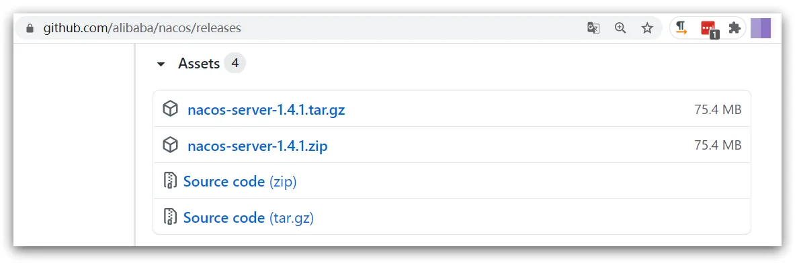
[Tags · alibaba/nacos](https://github.com/alibaba/nacos/tags?after=2.0.1)
解压到非中文路径目录
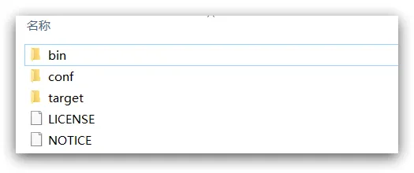

目录说明：

- bin：启动脚本
- conf：配置文件

Nacos 的默认端口是 8848，如果你电脑上的其它进程占用了 8848 端口，请先尝试关闭该进程。
如果无法关闭占用 8848 端口的进程，也可以进入 nacos 的 conf 目录，修改配置文件中的端口：
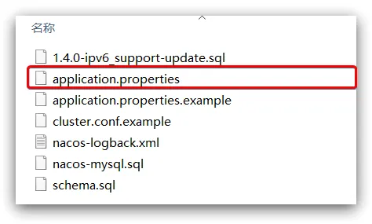

修改其中的内容：

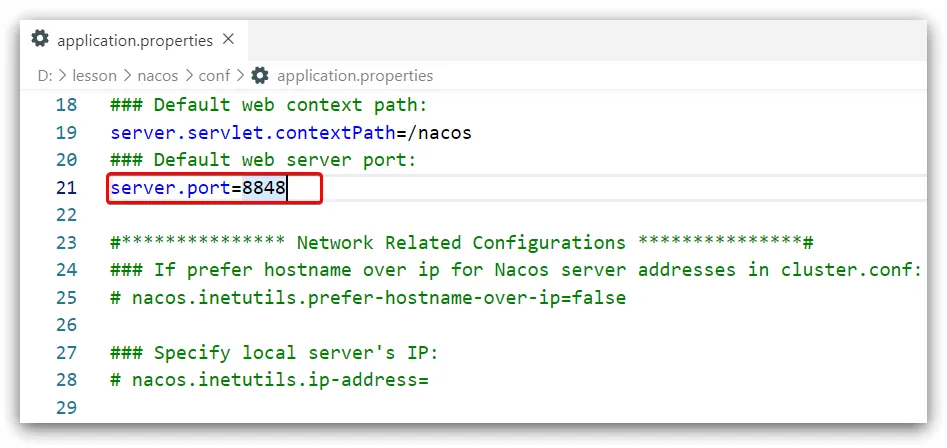

进入bin目录，结构如下：

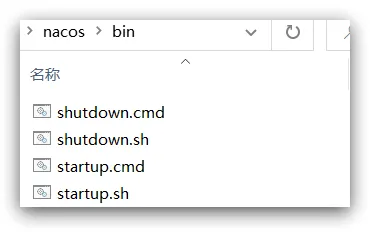

执行命令：

```bash
startup.cmd -m standalone
```

在浏览器输入地址访问，默认的账号和密码都是 nacos。

### (2) 服务注册

#### 添加依赖

在父工程中添加`nacos`依赖：

```xml
<!--nacos的管理依赖-->
<dependency>
  <groupId>com.alibaba.cloud</groupId>
  <artifactId>spring-cloud-alibaba-dependencies</artifactId>
  <version>2.2.5.RELEASE</version>
  <type>pom</type>
  <scope>import</scope>
</dependency>
```

在子工程中添加`nacos`客户端依赖：

```xml
<!-- nacos客户端依赖包 -->
<dependency>
  <groupId>com.alibaba.cloud</groupId>
  <artifactId>spring-cloud-starter-alibaba-nacos-discovery</artifactId>
</dependency>
```

#### 注册服务

在`application.yml`中注册服务：

```yaml
spring:
  application:
    name: userService # eureka的服务名称
  cloud:
    nacos:
      server-addr: localhost:8850
```

> Nacos 中服务是区分大小写的。

如下表示注册成功：
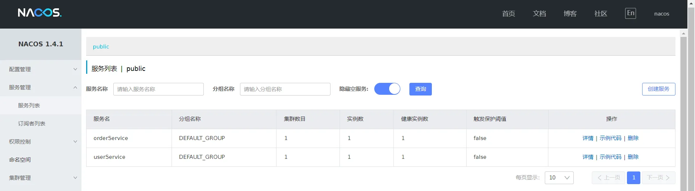

### (3) Nacos 服务分级存储模型

服务 -- 集群 -- 实例 的分级存储模型：
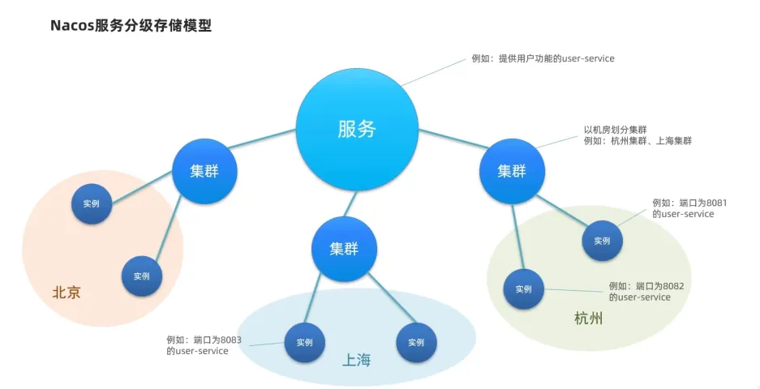
将某个实例划分到某个集群：

```yaml
spring:
  application:
    name: userService # eureka的服务名称
  cloud:
    nacos:
      server-addr: localhost:8850
      discovery:
        cluster-name: SH
```

如下所示：
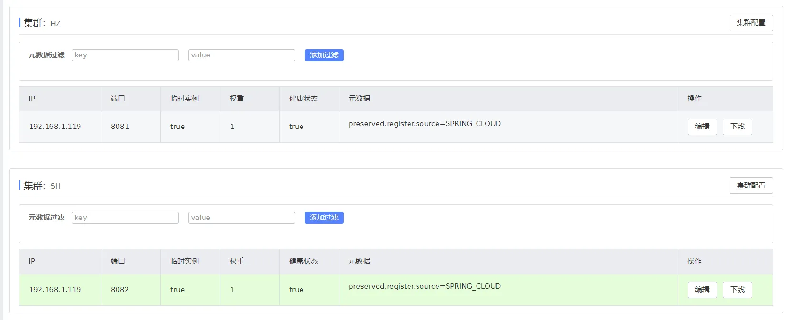

### (4) 负载均衡

#### 集群优先

配置优先选择相同集群的实例：

```yaml
spring:
  application:
    name: orderService
  cloud:
    nacos:
      server-addr: localhost:8850 # nacos服务地址
      discovery:
        cluster-name: SH
userService:
  ribbon:
    NFLoadBalancerRuleClassName: com.alibaba.cloud.nacos.ribbon.NacosRule   # 负载均衡规则
```

该规则相同集群优先，而后随机。

#### 基于权重


点击"编辑"
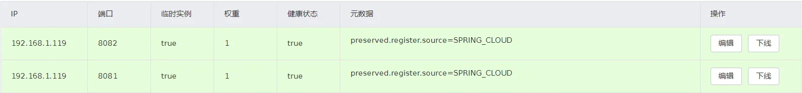

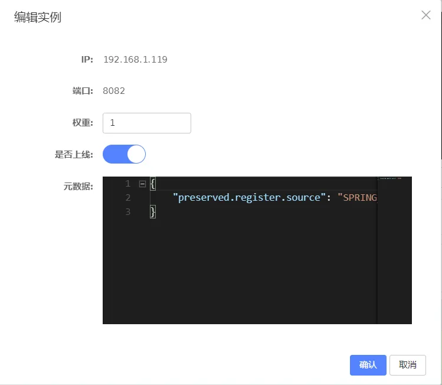

实例的权重值0~1。

### (5) 环境隔离 - namespace

不同 namespace 下的服务相互不可见。
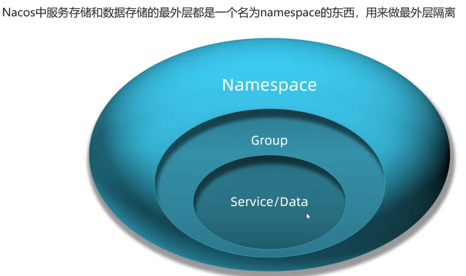
在 Nacos 界面新建命名空间。
在代码中修改服务的命名空间：

```yaml
spring:
  application:
    name: orderService
  cloud:
    nacos:
      server-addr: localhost:8850 # nacos服务地址
      discovery:
        cluster-name: SH
        namespace: 5423a422-7bb4-4284-afc8-fdee987b1bd1
```

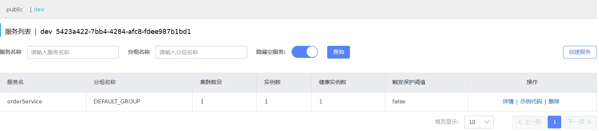

### (6) Eureka 和 Nacos 对比

Nacos 中实例分为临时实例和非临时实例。
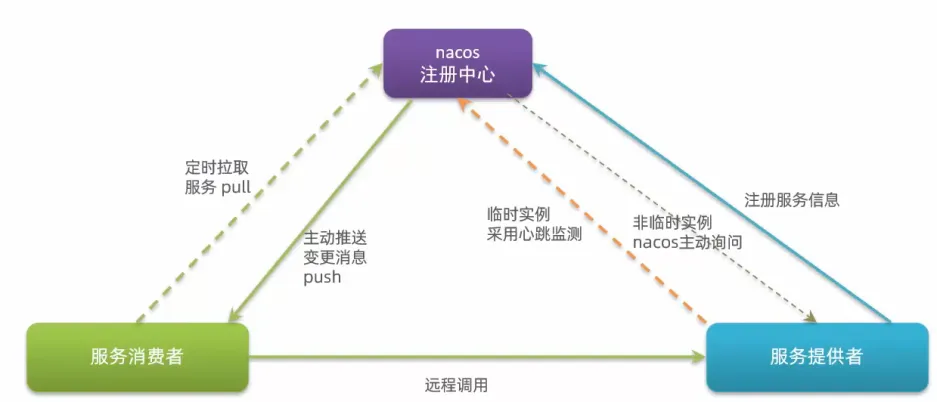
配置一个非临时实例：

```yaml
spring:
  application:
    name: orderService
  cloud:
    nacos:
      server-addr: localhost:8850 # nacos服务地址
      discovery:
        cluster-name: SH
        namespace: 5423a422-7bb4-4284-afc8-fdee987b1bd1
        ephemeral: false # 是否临时实例
```

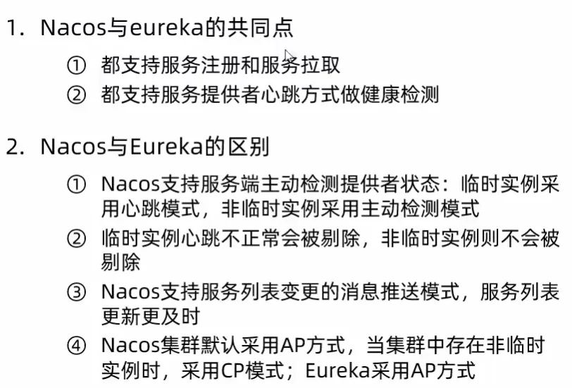

## 6、Nacos 配置管理

### (1) 统一配置管理

- 配置更改热更新

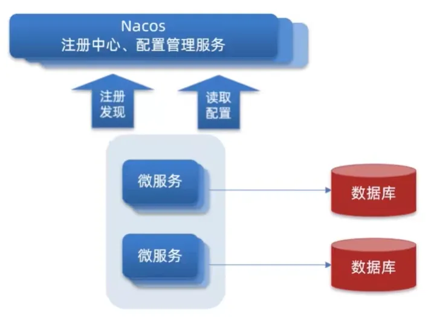
Nacos 中有配置管理菜单项：

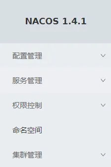

#### 新建配置

只需要将有热更新需求的配置放置于此处。
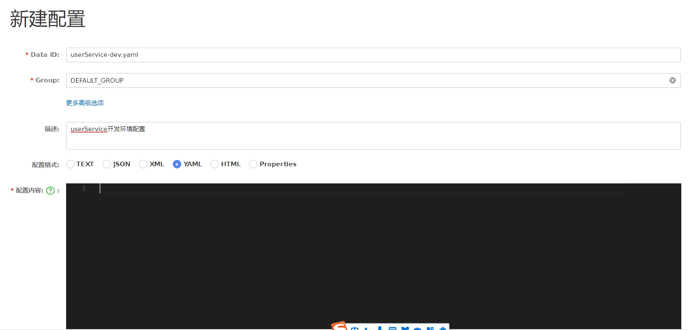

#### 配置拉取

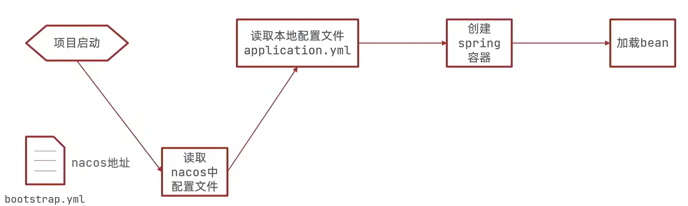
步骤

1. 添加 Nacos 配置管理依赖

```xml
<!--nacos的配置管理依赖-->
<dependency>
  <groupId>com.alibaba.cloud</groupId>
  <artifactId>spring-cloud-starter-alibaba-nacos-config</artifactId>
</dependency>
```

2. 在`resource`目录下添加一个`bootstrap.yml`文件，此文件为引导文件，优先级高于`application.yml`：

```yaml
spring:
  application:
    name: userservice
  profiles:
    active: dev # 环境
  cloud:
    nacos:
      server-addr: localhost:8850 # nacos地址
      discovery:
        cluster-name: SH
      config:
        file-extension: yaml # 文件后缀名
```

#### 配置热更新

创建类，添加`@ConfigurationProperties(prefix = "pattern")`注解，将配置转化为对象：

```java
@Data
@Component
@ConfigurationProperties(prefix = "pattern")
public class PatternProperties {
    private String dateformat;
}
```

使用测试：

```java
@Slf4j
@RestController
@RequestMapping("/user")
public class UserController {

    @Autowired
    private UserService userService;

//     @Value("${pattern.dateformat}")
//     private String dateformat;

    @Autowired
    private PatternProperties properties;

    @GetMapping("prop")
    public PatternProperties properties(){
        return properties;
    }

    @GetMapping("now")
    public String now(){
        return LocalDateTime.now().format(DateTimeFormatter.ofPattern(properties.getDateformat()));
    }
}
```

#### 多环境配置共享

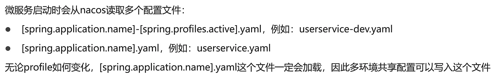
多环境配置优先级如下：
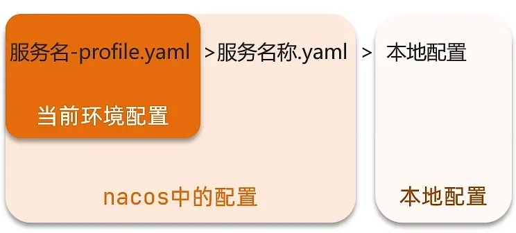
