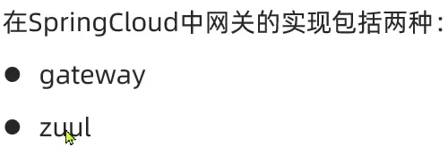
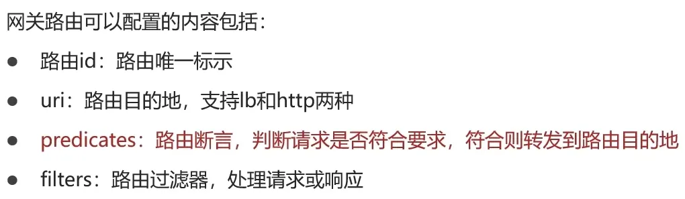
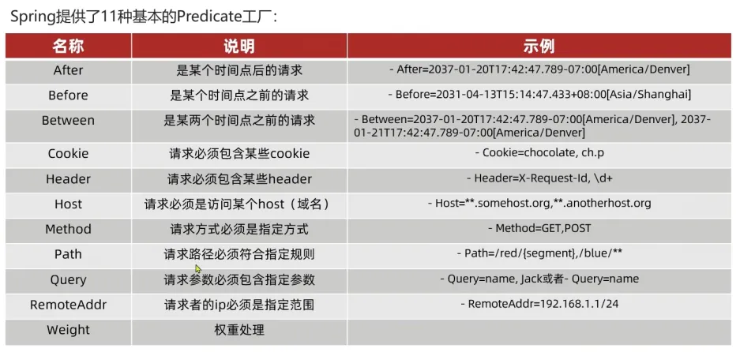
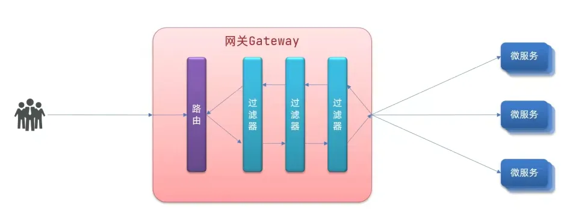
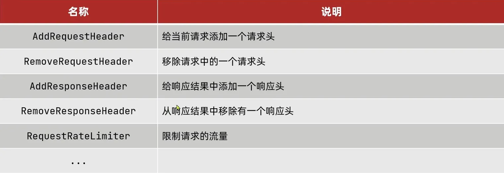
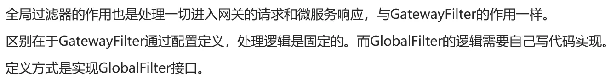
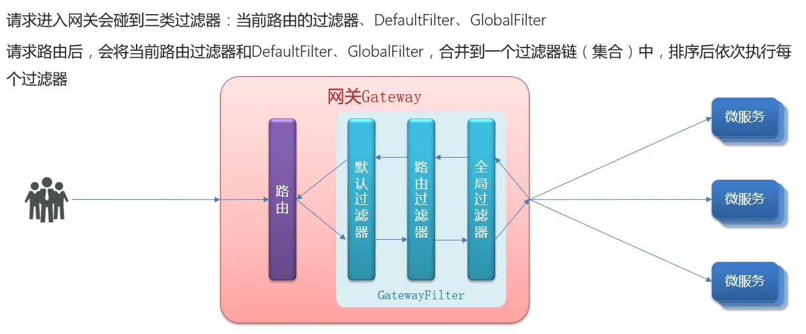
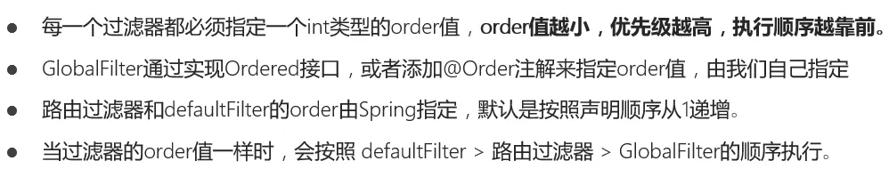
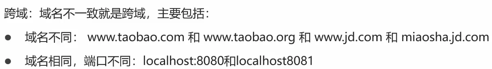

# 二、统一网关 Gateway

## 1、网关的作用

- 身份认证和校验
- **服务路由(最基本作用)**、负载均衡
- 请求限流

## 2、网关的技术实现




## 3、快速入门

搭建步骤：

1. 创建新的 module，引入`SpringCloudGateway`的依赖和`nacos`的服务发现依赖

```xml
<!--nacos服务注册发现依赖-->
<dependency>
  <groupId>com.alibaba.cloud</groupId>
  <artifactId>spring-cloud-starter-alibaba-nacos-discovery</artifactId>
</dependency>
<!--网关gateway依赖-->
<dependency>
  <groupId>org.springframework.cloud</groupId>
  <artifactId>spring-cloud-starter-gateway</artifactId>
</dependency>
```

2. 编写路由配置即 nacos 地址

```yaml
server:
  port: 10010
spring:
  application:
    name: gateway
  cloud:
    nacos:
      server-addr: localhost:8850 # nacos地址
    gateway:
      routes:
        - id: user-service # 路由标示，必须唯一
          uri: lb://userService # 路由的目标地址
          predicates: # 路由断言，判断请求是否符合规则
            - Path=/user/** # 路径断言，判断路径是否是以/user开头，如果是则符合
        - id: order-service
          uri: lb://orderService
          predicates:
            - Path=/order/**
```

上述两步即可完成搭建。

## 4、路由断言工厂 Route Predicate Factory




## 5、路由过滤器 GatewayFilter

可对进入网关的请求和微服务返回的响应做处理。

Spring 提供的路由过滤器工厂：

使用案例：

1. **给单个路由添加请求头**

```yaml
server:
  port: 10010
logging:
  level:
    cn.itcast: debug
  pattern:
    dateformat: MM-dd HH:mm:ss:SSS
spring:
  application:
    name: gateway
  cloud:
    nacos:
      server-addr: localhost:8850 # nacos地址
    gateway:
      routes:
        - id: user-service # 路由标示，必须唯一
          uri: lb://userService # 路由的目标地址
          predicates: # 路由断言，判断请求是否符合规则
            - Path=/user/** # 路径断言，判断路径是否是以/user开头，如果是则符合
          # 单个微服务过滤器
          filters:
            - AddRequestHeader=Truth,Zhang Ziyi is awesome!
        - id: order-service
          uri: lb://orderService
          predicates:
            - Path=/order/**
```

2. **给所有路由添加请求头**

```yaml
server:
  port: 10010
logging:
  level:
    cn.itcast: debug
  pattern:
    dateformat: MM-dd HH:mm:ss:SSS
spring:
  application:
    name: gateway
  cloud:
    nacos:
      server-addr: localhost:8850 # nacos地址
    gateway:
      routes:
        - id: user-service # 路由标示，必须唯一
          uri: lb://userService # 路由的目标地址
          predicates: # 路由断言，判断请求是否符合规则
            - Path=/user/** # 路径断言，判断路径是否是以/user开头，如果是则符合
        - id: order-service
          uri: lb://orderService
          predicates:
            - Path=/order/**
      # 全局过滤器
      default-filters:
        # 添加请求头
        - AddRequestHeader=Truth,Zhang Ziyi is awesome!
```

## 6、全局过滤器 Global Filter

 
全局过滤器示例代码：

只有路径中带有`authorization=admin`的请求才会被放行。

```java
package cn.itcast.gateway;

@Order(-1)
@Component
public class AuthorizeFilter implements GlobalFilter {
    @Override
    public Mono<Void> filter(ServerWebExchange exchange, GatewayFilterChain chain) {
        // 1.获取请求参数
        ServerHttpRequest request = exchange.getRequest();
        MultiValueMap<String, String> params = request.getQueryParams();
        // 2.获取参数中的 authorization 参数
        String auth = params.getFirst("authorization");
        // 3.判断参数值是否等于 admin
        if ("admin".equals(auth)) {
            // 4.是，放行
            return chain.filter(exchange);
        }
        // 5.否，拦截
        // 5.1.设置状态码
        exchange.getResponse().setStatusCode(HttpStatus.UNAUTHORIZED);
        // 5.2.拦截请求
        return exchange.getResponse().setComplete();
    }
}

```

## 7、过滤器执行顺序



## 8、跨域问题




```yaml
spring:
  cloud:
    gateway:
      globalcors: # 全局的跨域处理
        add-to-simple-url-handler-mapping: true # 解决options请求被拦截问题
        corsConfigurations:
          '[/**]':
            allowedOrigins: # 允许哪些网站的跨域请求
              - "http://localhost:8090"
              - "http://www.leyou.com"
            allowedMethods: # 允许的跨域ajax的请求方式
              - "GET"
              - "POST"
              - "DELETE"
              - "PUT"
              - "OPTIONS"
            allowedHeaders: "*" # 允许在请求中携带的头信息
            allowCredentials: true # 是否允许携带cookie
            maxAge: 360000 # 这次跨域检测的有效期
```
