# 三、服务异步通讯

## 1、MQ 介绍

### (1) 同步调用与异步调用

同步调用：调用其他微服务后，等待其他微服务完成才会进行后续操作。例如，使用 Feign 调用其他微服务。
优点：

- 时效性较强，可以立即得到结果

缺点：

- 耦合度高

添加新需求后，需要更改原来的代码；
调用链中的一个微服务失效，链上的全部微服务失效，级联失败。

- 性能下降、资源浪费

调用微服务者阻塞等待，业务的响应时间是调用链中所有微服务响应时间之和。
异步调用：常见的一个实现是事件驱动模式。微服务消费者发布事件到经纪人 broker，微服务提供者订阅事件。
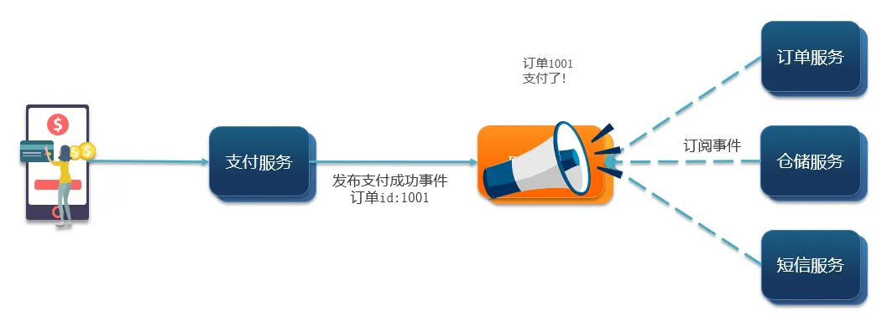
优点：

- 解耦

添加新需求，可能不需要改动太多代码，发布事件即可；
没有调用链。

- 性能提升，吞吐量提高
- 流量削峰

由 broker 承担大流量而不是微服务承担巨大流量
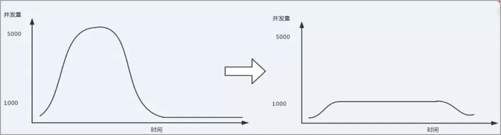
缺点：

- 依赖于 broker 的可靠性、安全性和吞吐能力
- 业务流程追踪管理复杂

### (2) 消息队列 MQ(Message Queue)

消息队列(MQ)就是 broker。常见的 MQ 实现如下：
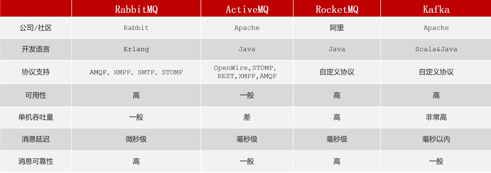
RabbitMQ 优势在于高可用性、消息延迟小、消息可靠性高，在不需要定制协议、吞吐量要求不那么高的情况下，RabbitMQ 是较好的选择。

## 2、RabbitMQ 入门

RabbitMQ 是基于 Erlang 语言开发的开源消息通信**中间件**。

### (1) RabbitMQ 安装

使用 Docker 在 Centos7 安装。

1. 镜像拉取

```bash
docker pull rabbitmq:3-management
```

2. 运行容器

```bash
docker run \
 -e RABBITMQ_DEFAULT_USER=zhangziyi \
 -e RABBITMQ_DEFAULT_PASS=991118 \
 --name mq \
 --hostname mq1 \
 -p 15672:15672 \
 -p 5672:5672 \
 -d \
 rabbitmq:3-management
```

在浏览器访问`http://ip:15672`，登录后：
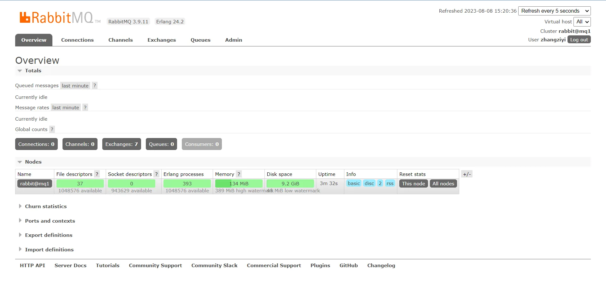

### (2) RabbitMQ 结构

消息发布者 Publisher 通过管道 Channel 将消息发送给 broker，消息由 exchange 路由到队列 queue，消息的订阅者 consumer 从 queue 中获取消息。
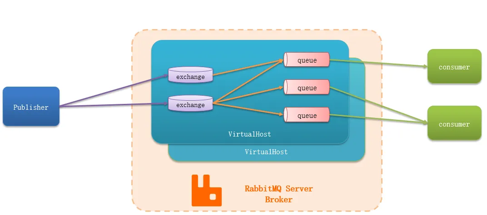

### (3) 消息模型

#### 五个 demo

MQ 的官方文档中给出了 5 个 MQ 的 Demo 示例，对应了几种不同的用法：

1. 基本消息队列（BasicQueue）

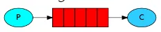

2. 工作消息队列（WorkQueue）

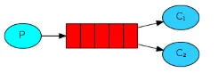

3. 发布订阅（Publish、Subscribe），又根据交换机类型不同分为三种：

- Fanout Exchange：广播

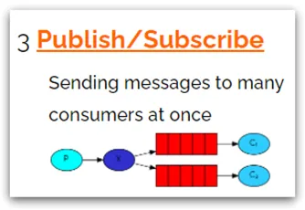

- Direct Exchange：路由

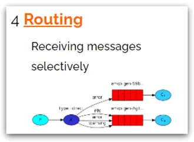

- Topic Exchange：主题

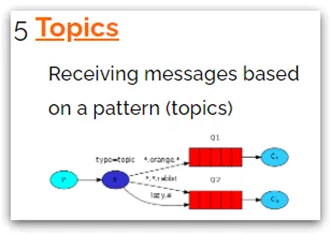

#### Hello World 案例

消息发布者 Publisher
流程：建立连接、创建 Channel、创建队列、发送消息、关闭通道、关闭连接。

```java
package cn.itcast.mq.helloworld;

import com.rabbitmq.client.Channel;
import com.rabbitmq.client.Connection;
import com.rabbitmq.client.ConnectionFactory;
import org.junit.Test;

import java.io.IOException;
import java.util.concurrent.TimeoutException;

public class PublisherTest {
    @Test
    public void testSendMessage() throws IOException, TimeoutException {
        // 1.建立连接
        ConnectionFactory factory = new ConnectionFactory();
        // 1.1.设置连接参数，分别是：主机名、端口号、vhost、用户名、密码
        factory.setHost("192.168.18.129");
        factory.setPort(5672);
        factory.setVirtualHost("/");
        factory.setUsername("zhangziyi");
        factory.setPassword("991118");
        // 1.2.建立连接
        Connection connection = factory.newConnection();

        // 2.创建通道Channel
        Channel channel = connection.createChannel();

        // 3.创建队列
        String queueName = "simple.queue";
        channel.queueDeclare(queueName, false, false, false, null);

        // 4.发送消息
        String message = "hello, rabbitmq!";
        channel.basicPublish("", queueName, null, message.getBytes());
        System.out.println("发送消息成功：【" + message + "】");

        // 5.关闭通道和连接
        channel.close();
        connection.close();
    }
}
```

消息消费者 Consumer
流程：建立连接、建立通道、建立队列、订阅消息。程序并不会立即执行完毕，而是等待有消息时执行回调函数`handleDelivery()`。

```java
package cn.itcast.mq.helloworld;

import com.rabbitmq.client.*;

import java.io.IOException;
import java.util.concurrent.TimeoutException;

public class ConsumerTest {

    public static void main(String[] args) throws IOException, TimeoutException {
        // 1.建立连接
        ConnectionFactory factory = new ConnectionFactory();
        // 1.1.设置连接参数，分别是：主机名、端口号、vhost、用户名、密码
        factory.setHost("192.168.18.129");
        factory.setPort(5672);
        factory.setVirtualHost("/");
        factory.setUsername("zhangziyi");
        factory.setPassword("991118");
        // 1.2.建立连接
        Connection connection = factory.newConnection();

        // 2.创建通道Channel
        Channel channel = connection.createChannel();

        // 3.创建队列
        String queueName = "simple.queue";
        channel.queueDeclare(queueName, false, false, false, null);

        // 4.订阅消息
        channel.basicConsume(queueName, true, new DefaultConsumer(channel){
            @Override
            public void handleDelivery(String consumerTag, Envelope envelope,
                                       AMQP.BasicProperties properties, byte[] body) throws IOException {
                // 5.处理消息
                String message = new String(body);
                System.out.println("接收到消息：【" + message + "】");
            }
        });
        System.out.println("等待接收消息。。。。");
    }
}

```

## 3、SpringAMQP

AMQP(Advanced Message Queue Protocol)：高级消息队列协议，用于在应用程序之间传递业务消息的开放标准。该协议与语言和平台无关，更符合微服务中独立性的要求。
Spring AMQP 是基于 AMQP 协议定义的一套 API 规范，提供了模板来发送和接收消息。包含两部分，其中 spring-amqp 是基础抽象，spring-rabbit 是底层的默认实现。

### (1) 基本消息队列


实现步骤：

1. 引入 AMQP 依赖

在父工程中引入该依赖

```xml
<!--AMQP依赖，包含RabbitMQ-->
<dependency>
  <groupId>org.springframework.boot</groupId>
  <artifactId>spring-boot-starter-amqp</artifactId>
</dependency>
```

2. 消息发布

在消息发布者中添加 RabbitMQ 连接信息：

```yaml
spring:
  rabbitmq:
    host: 192.168.18.129
    port: 5672
    virtual-host: /
    username: zhangziyi
    password: 991118
```

发布消息：

```java
@RunWith(SpringRunner.class)
@SpringBootTest
public class SpringAMQPTest {
    @Resource
    private RabbitTemplate rabbitTemplate;

    @Test
    public void testPublishMessage() {
        String message = "你好，我是张子亿！";
        String queueName = "simple.queue";
        rabbitTemplate.convertAndSend(queueName, message);
    }
}
```

3. 消息订阅

消息订阅者添加 RabbitMQ 连接信息，与发布者相同。
创建 bean，监听队列消息并规定回调方法。

```java
package cn.itcast.mq.listener;

import org.springframework.amqp.rabbit.annotation.RabbitListener;
import org.springframework.stereotype.Component;

@Component
public class SpringRabbitListener {
    @RabbitListener(queues = "simple.queue")
    public void listenSimpleQueue(String msg) {
        System.out.println("监听到消息！");
        System.out.println(msg);
    }
}
```

> 注：RabbitMQ 消息阅后即焚，没有消息回溯功能。

### (2) 工作队列

工作队列，和基本队列大体一致，不同之处在于有多个消费者。可以提升消息处理速度，避免队列消息堆积。
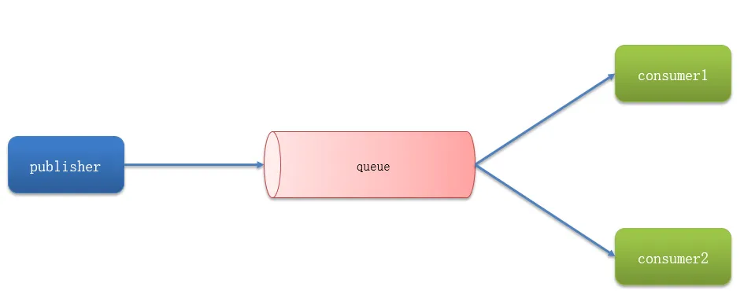
实现步骤：

1. Publisher 在 1s 内推送 50 条消息

```java
    @Test
    public void testWorkQueueSendMessage() throws InterruptedException {
        String message = "你好，我是张子亿，今天可能会加班！重复：";
        String queueName = "simple.queue";
        for (int i = 1; i <= 50; i++) {
            rabbitTemplate.convertAndSend(queueName, message + i);
            Thread.sleep(20);
        }
    }
```

> 注：Spring AMQP 不会自动创建队列，需要在浏览器中手动创建队列。

2. 两个 Consumer 合作接收消息

```java
@Component
public class SpringRabbitListener {
    @RabbitListener(queues = "simple.queue")
    public void listenWorkQueue1(String msg) throws InterruptedException {
        System.out.println("消费者1监听到消息！" + msg);
        Thread.sleep(20);
    }

    @RabbitListener(queues = "simple.queue")
    public void listenWorkQueue2(String msg) throws InterruptedException {
        System.err.println("消费者2监听到消息！" + msg);
        Thread.sleep(200);
    }
}
```

消息队列有预取(prefetch)机制，会将消息提前存放到已存在 Consumer 的 Channel 中，这会导致处理消息能力不同的 Consumer 处理相同数量的消息。

3. 配置 prefetch

```yaml
spring:
  rabbitmq:
    listener:
      simple:
        prefetch: 1
```

预取设置为 1，消息处理能力强的消费者将处理更多消息。

### (3) 发布(Publish)、订阅(Subscribe)

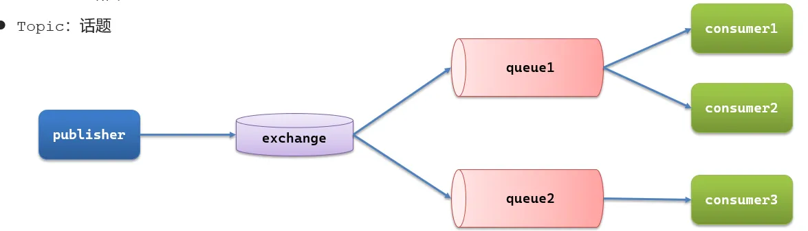
发布、订阅模型中加入了交换机(exchange)，消息发布者不再关心队列，会将消息发送至交换机，交换机将消息投递到队列。根据 exchange 类型的不同，分为：

- Fanout：广播
- Direct：路由
- Topic：话题

> 注：交换机是无法缓存消息的，如果路由失效，消息会丢失。

#### Fanout 广播

Fanout Exchange 会将消息广播到每一个与其绑定的队列中。
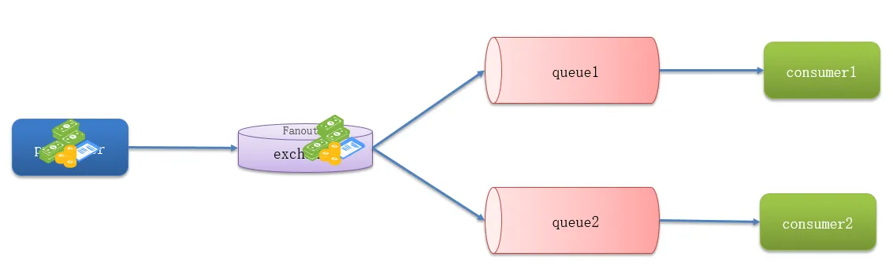
实现步骤

1. 声明交换机，并将队列绑定到交换机

```java
package cn.itcast.mq.config;

import org.springframework.amqp.core.Binding;
import org.springframework.amqp.core.BindingBuilder;
import org.springframework.amqp.core.FanoutExchange;
import org.springframework.amqp.core.Queue;
import org.springframework.context.annotation.Bean;
import org.springframework.context.annotation.Configuration;

@Configuration
public class FanoutConfig {
    // 声明一个交换机
    @Bean
    public FanoutExchange fanoutExchange() {
        return new FanoutExchange("zzy.fanout");
    }

    // 声明两个队列
    @Bean
    public Queue fanoutQueue1() {
        return new Queue("fanout.queue1");
    }

    @Bean
    public Queue fanoutQueue2() {
        return new Queue("fanout.queue2");
    }

    // 将两个队列绑定到交换机
    @Bean
    public Binding bindingQueue1(Queue fanoutQueue1, FanoutExchange fanoutExchange) {
        return BindingBuilder
                .bind(fanoutQueue1)
                .to(fanoutExchange);
    }

    @Bean
    public Binding bindingQueue2(Queue fanoutQueue2, FanoutExchange fanoutExchange) {
        return BindingBuilder
                .bind(fanoutQueue2)
                .to(fanoutExchange);
    }
}
```

2. 消费者监听队列

```java
    // 广播模式监听队列
    @RabbitListener(queues = "fanout.queue1")
    public void listenFanoutQueue1(String msg) {
        System.out.println("消费者1监听到消息！" + msg);
    }

    @RabbitListener(queues = "fanout.queue2")
    public void listenFanoutQueue2(String msg) {
        System.out.println("消费者2监听到消息！" + msg);
    }
```

3. 发布者向交换机发送消息

```java
    // 向 Fanout 交换机发送消息
    @Test
    public void testFanoutExchange() {
        String message = "大家好，我是张子亿，这是一条测试消息！";
        String exchangeName = "zzy.fanout";
        rabbitTemplate.convertAndSend(exchangeName, "", message);
    }
```

#### Direct 路由

Direct Exchange 会将接收到的消息按照规则路由到指定的队列。


- 每个队列都有一个或多个`bindingKey`
- 发布者发送消息时，指定消息的`routingKey`
- Exchange 将消息路由到`bindingKey`和`routingKey`一致的队列
- 
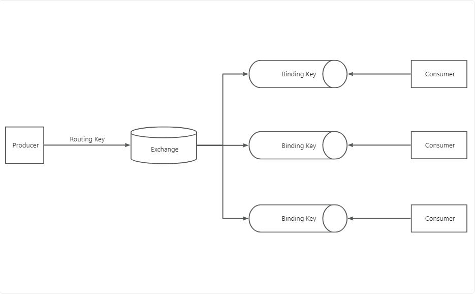

实现步骤

1. 使用`@RabbitListener`声明 exchange、queue 和 bindingKey，并监听相应队列

```java
    // 路由模式监听队列
    @RabbitListener(bindings = @QueueBinding(
            value = @Queue(name = "direct.queue1"),
            exchange = @Exchange(name = "zzy.direct"),
            key = {"3A大作", "荒野大镖客2"}
    ))
    public void listenDirectQueue1(String msg) {
        System.out.println("荒野大镖客2监听到消息：" + msg);
    }

    @RabbitListener(bindings = @QueueBinding(
            value = @Queue(name = "direct.queue2"),
            exchange = @Exchange(name = "zzy.direct"),
            key = {"3A大作", "死亡搁浅"}
    ))
    public void listenDirectQueue2(String msg) {
        System.out.println("死亡搁浅监听到消息：" + msg);
    }
```

2. 消息发布者将消息发送至交换机，并指定`routingKey`

```java
    // 向 Direct 交换机发送消息
    @Test
    public void testDirectExchange() {
        String message = "你的音乐真好听！";
        String exchangeName = "zzy.direct";
        String routingKey = "死亡搁浅";
        rabbitTemplate.convertAndSend(exchangeName, routingKey, message);
    }
```

#### Topic

Topic Exchange 和 Direct Exchange 都有`bindingKey`和`routingKey`的概念，区别在于 Topic Exchange 的 key 具有层级话题属性，使用`.`表示层级。例如：NBA 选秀消息`NBA.draft`，NBA 交易消息`NBA.transaction`。
`bindingKey`可以使用通配符，以达到不同层级话题绑定。

- `#`：代指 0 个或多个单词
- `*`：代指一个单词

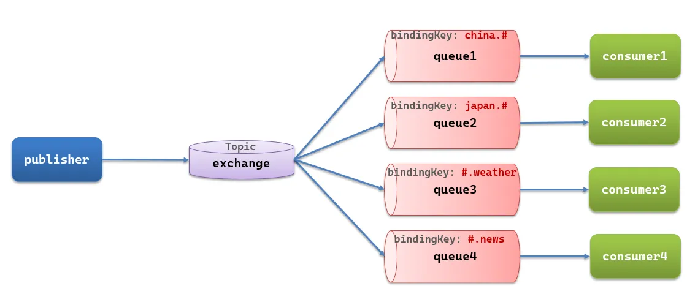
实现步骤

1. 使用`@RabbitListener`注解声明交换机、绑定队列，监听队列

```java
    // Topic 监听队列
    @RabbitListener(bindings = @QueueBinding(
            exchange = @Exchange(name = "zzy.topic", type = ExchangeTypes.TOPIC),
            value = @Queue(name = "topic.queue1"),
            key = "NBA.#"
    ))
    public void listenTopicQueue1(String msg) {
        System.out.println("NBA球迷收到消息：" + msg);
    }

    @RabbitListener(bindings = @QueueBinding(
            exchange = @Exchange(name = "zzy.topic", type = ExchangeTypes.TOPIC),
            value = @Queue(name = "topic.queue2"),
            key = "#.transaction"
    ))
    public void listenTopicQueue2(String msg) {
        System.out.println("NBA经理人收到消息：" + msg);
    }
```

2. 消息发布者发送消息

```java
    // 向 Topic 交换机发送消息
    @Test
    public void testTopicExchange() {
        String message = "骑士球星特里斯坦·汤普森出轨！";
        String exchangeName = "zzy.topic";
        String routingKey = "NBA.news";
        rabbitTemplate.convertAndSend(exchangeName, routingKey, message);
    }
```

### (4) 消息转换器


> **序列化和反序列化**
序列化（Serialization）和反序列化（Deserialization）是指将数据结构或对象转换为可存储或传输的格式，以及将存储或传输的格式重新转换为原始数据结构或对象的过程。
**序列化：** 在计算机科学中，序列化是指将数据结构或对象转换为一种格式，通常是字节流或文本，以便将其存储在文件、数据库或通过网络传输。序列化将数据转换为一种能够被持久化存储或传输的形式，使得数据可以在不同的时间和地点重新还原。
**反序列化：** 反序列化是序列化的逆过程，它将存储或传输的格式重新转换为原始的数据结构或对象。通过反序列化，我们可以从文件、数据库或网络接收的数据中还原出原始的数据对象，以便在程序中进行处理或操作。
常见的用例包括将对象序列化后存储在磁盘上，以便在需要时进行读取和恢复；或者将对象序列化后通过网络传输，以便在不同的系统之间进行数据交换。
在编程中，序列化和反序列化通常涉及将对象的状态转换为字节流或类似的格式。这在各种编程语言和框架中都有相关的支持库，例如在 Java 中有 Java 序列化（Java Serialization）、在 Python 中有pickle 模块等。值得注意的是，不同的序列化方式可能有不同的性能、兼容性和安全性考虑，选择适合场景的序列化方式很重要。

发布者发送消息，类型是`Object`，因此可以发送任意对象类型的消息，Spring AMQP 会帮我们序列化为字节后发送。
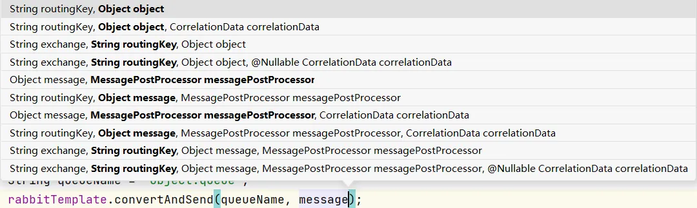
Spring 的对消息对象的处理是由 `org.springframework.amqp.support.converter.MessageConverter`来处理的。而默认实现是`SimpleMessageConverter`，基于 jdk 的`ObjectOutputStream`完成序列化。JSON 序列化是更优选择。
使用步骤

1. 消息发布者配置 JSON 序列化

添加 jackson 依赖：

```xml
<!--jackson 依赖-->
<dependency>
  <groupId>com.fasterxml.jackson.core</groupId>
  <artifactId>jackson-databind</artifactId>
</dependency>
```

注入消息转换器 bean：

```java
@Configuration
public class MessageConverterConfig {
    @Bean
    public MessageConverter jsonMessageConverter() {
        return new Jackson2JsonMessageConverter();
    }
}
```

发布消息：

```java
    // 消息转换测试
    @Test
    public void testMessageConvert() {
        Map<String, String> message = new HashMap<>();
        message.put("name", "文班亚马");
        message.put("age", "19");
        String queueName = "object.queue";
        rabbitTemplate.convertAndSend(queueName, message);
    }
```

2. 消息接受者配置 JSON 反序列化

添加依赖、注入消息转换器 bean。
监听队列：

```java
    // 监听 object.queue
    @RabbitListener(queues = "object.queue")
    public void listenObjectQueue(Map<String, Object> msg) {
        System.out.println("监听到对象：" + msg);
    }
```
