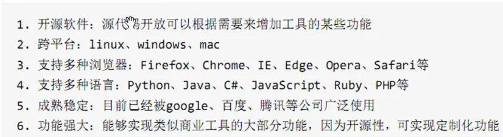
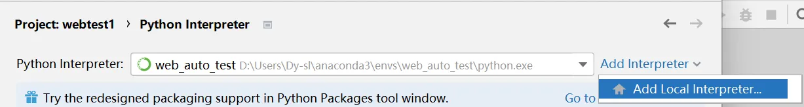

# 二、Selenium 安装

## 1、Selenium 介绍

**特点**



## 2、环境搭建

基于 Python 环境搭建

### (1) Python 开发环境

安装 anaconda，并将如下三个路径添加到环境变量

`D:\Users\Dy-sl\anaconda3\Library\bin`
`D:\development\Python\anaconda3\Scripts`：`conda.exe`所在地。

pycharm 配置 conda 环境：



找到`conda.exe`

### (2) 安装 selenium 包

`conda install selenium`

### (3) 安装浏览器

### (4) 安装浏览器驱动

谷歌浏览器驱动：ChromeDriver
下载地址：[https://sites.google.com/a/chromium.org/chromedriver/downloads](https://sites.google.com/a/chromium.org/chromedriver/downloads)

ChromeDriver 是一个用于自动化控制和操作 Google Chrome 浏览器的开源工具。它是 Chrome 浏览器和 Selenium WebDriver 之间的桥接程序，允许开发人员使用各种编程语言（如 Python、Java、C# 等）与 Chrome 浏览器进行交互。

下载后解压，将驱动的可执行文件所在的目录添加到环境变量 path 中。
测试程序：

```python
from selenium import webdriver
import time


# 创建浏览器对象
browser = webdriver.Chrome()

# 浏览器打开指定 url
browser.get('https://www.baidu.com')

# 休眠
time.sleep(5)

# 关闭浏览器
browser.quit()
```


**出现问题**

描述：ValueError: Timeout value connect was ＜...＞, but it must be an int, float or None.
原因：Selenium版本和 urllib3 版本不兼容问题。
解决：
更换urllib3版本
`pip uninstall urllib3`
`pip install urllib3==1.26.2`

