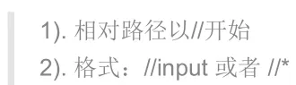

# 三、Selenium-API

## 1、元素定位

元素定位：通过元素的属性信息和元素的层级信息进行定位。
Selenium 提供了八种元素定位方式：

1. id
2. name
3. class_name：类名
4. tag_name：标签名
5. link_text：定位超链接
6. partial_link_text：定位超链接，模糊
7. Xpath：基于元素路径定位
8. css：基于元素选择器定位

### (1) id 定位

使用前提：元素有 id 属性。
语法：`element = browser.find_element_by_id(元素id)`

**使用案例**


```python
import time

from selenium import webdriver

# 获取浏览器对象
browser = webdriver.Chrome()

# 打开所需页面
url = 'file:///D:/%E5%AD%A6%E4%B9%A0/8%E5%A4%A9web%E8%87%AA%E5%8A%A8%E5%8C%96%E5%85%A8%E5%A5%97%E6%B5%8B%E8%AF%95%E2%80%94%E8%B5%84%E6%96%99/web%E8%87%AA%E5%8A%A8%E5%8C%96_day01_%E8%AF%BE%E4%BB%B6+%E7%AC%94%E8%AE%B0+%E8%B5%84%E6%96%99+%E4%BB%A3%E7%A0%81/02_%E5%85%B6%E4%BB%96%E8%B5%84%E6%96%99/%E6%B3%A8%E5%86%8CA.html'
browser.get(url)

# 找到账号和密码输入框
usernameInput = browser.find_element_by_id('userA')
passwordInput = browser.find_element_by_id('passwordA')

# 向账号和密码中填入内容
usernameInput.send_keys('admin')
passwordInput.send_keys('123456')

# 休眠三秒
time.sleep(3)

# 退出页面
browser.quit()
```


在 Selenium 中，`send_keys()`方法用于向输入框或可编辑的元素发送文本，它模拟用户在键盘上输入文本的操作。
使用语法：`element.send_keys(*value)`


### (2) name 定位

使用前提：元素有 name 属性。
注意：HTML 中的 name 属性是可以重复的。
语法：`driver.find_element_by_name(name)`

**使用案例**


```python
from selenium import webdriver
import time

# 创建浏览器对象
driver = webdriver.Chrome()

# 打开指定地址
url = 'file:///D:/%E5%AD%A6%E4%B9%A0/8%E5%A4%A9web%E8%87%AA%E5%8A%A8%E5%8C%96%E5%85%A8%E5%A5%97%E6%B5%8B%E8%AF%95%E2%80%94%E8%B5%84%E6%96%99/web%E8%87%AA%E5%8A%A8%E5%8C%96_day01_%E8%AF%BE%E4%BB%B6+%E7%AC%94%E8%AE%B0+%E8%B5%84%E6%96%99+%E4%BB%A3%E7%A0%81/02_%E5%85%B6%E4%BB%96%E8%B5%84%E6%96%99/%E6%B3%A8%E5%86%8CA.html'
driver.get(url)

# 使用 name 定位元素
username = driver.find_element_by_name('userA')
password = driver.find_element_by_name('passwordA')

# 向输入框填充内容
username.send_keys('admin')
password.send_keys('123456')

# 等待 3 秒
time.sleep(3)

# 退出浏览器
driver.quit()
```

### (3) class_name 定位

说明：使用 HTML 元素类名进行定位。多个 HTML 元素可以有相同的类名。

语法：`browser.find_element_by_class_name(class_name)`

**使用案例**


```python
import time

from selenium import webdriver

# 创建浏览器对象
browser = webdriver.Chrome()

# 访问指定 url
url = 'file:///D:/%E5%AD%A6%E4%B9%A0/8%E5%A4%A9web%E8%87%AA%E5%8A%A8%E5%8C%96%E5%85%A8%E5%A5%97%E6%B5%8B%E8%AF%95%E2%80%94%E8%B5%84%E6%96%99/web%E8%87%AA%E5%8A%A8%E5%8C%96_day01_%E8%AF%BE%E4%BB%B6+%E7%AC%94%E8%AE%B0+%E8%B5%84%E6%96%99+%E4%BB%A3%E7%A0%81/02_%E5%85%B6%E4%BB%96%E8%B5%84%E6%96%99/%E6%B3%A8%E5%86%8CA.html'
browser.get(url)

# 使用类名进行定位
telephone = browser.find_element_by_class_name('telA')
email = browser.find_element_by_id('emailA')

# 向元素填充内容
telephone.send_keys('18611111111')
email.send_keys('123@qq.com')
time.sleep(3)

# 退出
browser.quit()
```

### (4) tag_name 定位

说明：通过元素标签名进行定位，不方便进行精准定位，很少使用。

如果有多个元素，只会定位第一个。

语法：`driver.find_element_by_tag_name(tag_name)`

**使用案例**


```python
import time

from selenium import webdriver


# 创建浏览器对象
browser = webdriver.Chrome()

# 访问指定 url
url = 'file:///D:/%E5%AD%A6%E4%B9%A0/8%E5%A4%A9web%E8%87%AA%E5%8A%A8%E5%8C%96%E5%85%A8%E5%A5%97%E6%B5%8B%E8%AF%95%E2%80%94%E8%B5%84%E6%96%99/web%E8%87%AA%E5%8A%A8%E5%8C%96_day01_%E8%AF%BE%E4%BB%B6+%E7%AC%94%E8%AE%B0+%E8%B5%84%E6%96%99+%E4%BB%A3%E7%A0%81/02_%E5%85%B6%E4%BB%96%E8%B5%84%E6%96%99/%E6%B3%A8%E5%86%8CA.html'
browser.get(url)

# 使用标签定位元素
username = browser.find_element_by_tag_name('input')

# 向元素中填充内容
username.send_keys('admin')
time.sleep(3)

# 退出
browser.quit()
```

### (5) link_text 定位

专门用于定位超链接元素(`<a>`标签)，根据超链接文本内容定位元素。

语法：`element = driver.find_element_by_link_text(link_text)`


- `link_text`为超链接全部文本内容

**使用案例**


```python
import time

from selenium import webdriver

# 创建浏览器对象
browser = webdriver.Chrome()

# 打开指定 url
url = 'file:///D:/%E5%AD%A6%E4%B9%A0/8%E5%A4%A9web%E8%87%AA%E5%8A%A8%E5%8C%96%E5%85%A8%E5%A5%97%E6%B5%8B%E8%AF%95%E2%80%94%E8%B5%84%E6%96%99/web%E8%87%AA%E5%8A%A8%E5%8C%96_day01_%E8%AF%BE%E4%BB%B6+%E7%AC%94%E8%AE%B0+%E8%B5%84%E6%96%99+%E4%BB%A3%E7%A0%81/02_%E5%85%B6%E4%BB%96%E8%B5%84%E6%96%99/%E6%B3%A8%E5%86%8CA.html'
browser.get(url)

# 使用 link_text 定位超链接
element = browser.find_element_by_link_text('访问 新浪 网站')

# 点击超链接
time.sleep(3)
element.click()
time.sleep(3)

# 退出
browser.quit()
```

> `click()`方法会触发元素的单击事件。

### (6) partial_link_text 定位

说明：partial_link_text 定位是对 link_text 定位的补充，模糊匹配。

语法：`element = driver.find_element_by_partial_link_text(partial_link_text)`

**使用案例**


```python
import time

from selenium import webdriver

# 创建浏览器对象
browser = webdriver.Chrome()

# 访问指定 url
url = 'file:///D:/%E5%AD%A6%E4%B9%A0/8%E5%A4%A9web%E8%87%AA%E5%8A%A8%E5%8C%96%E5%85%A8%E5%A5%97%E6%B5%8B%E8%AF%95%E2%80%94%E8%B5%84%E6%96%99/web%E8%87%AA%E5%8A%A8%E5%8C%96_day01_%E8%AF%BE%E4%BB%B6+%E7%AC%94%E8%AE%B0+%E8%B5%84%E6%96%99+%E4%BB%A3%E7%A0%81/02_%E5%85%B6%E4%BB%96%E8%B5%84%E6%96%99/%E6%B3%A8%E5%86%8CA.html'
browser.get(url)

# 使用 partial_link_text 定位超链接
link = browser.find_element_by_partial_link_text('新浪')

# 点击超链接
time.sleep(3)
link.click()
time.sleep(3)

# 退出
browser.quit()
```

### (7) 定位一组元素

返回所有定位到的元素列表。

语法：`find_elements_by_xxx()`

**使用案例**


```python
import time

from selenium import webdriver

# 创建浏览器对象
browser = webdriver.Chrome()

# 访问指定 url
url = 'file:///D:/%E5%AD%A6%E4%B9%A0/8%E5%A4%A9web%E8%87%AA%E5%8A%A8%E5%8C%96%E5%85%A8%E5%A5%97%E6%B5%8B%E8%AF%95%E2%80%94%E8%B5%84%E6%96%99/web%E8%87%AA%E5%8A%A8%E5%8C%96_day01_%E8%AF%BE%E4%BB%B6+%E7%AC%94%E8%AE%B0+%E8%B5%84%E6%96%99+%E4%BB%A3%E7%A0%81/02_%E5%85%B6%E4%BB%96%E8%B5%84%E6%96%99/%E6%B3%A8%E5%86%8CA.html'
browser.get(url)

# 使用标签定位所有输入框
input_list = browser.find_elements_by_tag_name('input')

# 向第二个输入框中填充内容
input_list[1].send_keys('123456')
time.sleep(3)

# 退出
browser.quit()
```

### (8) Xpath 定位

出现原因：很多元素无法通过`id`、`name`或`class_name`定位，如：


语法：`element = driver.find_element_by_xpath(xpath)`

#### 1.何为 Xpath？

Xpath 是 XML path 的简称，HTML 是 XML 的一种实现，Xpath 定位就是通过 XML 语言进行定位。

#### 2.Xpath 定位方法

1. 路径定位（绝对路径、相对路径）

绝对路径：从最外层元素到指定元素之间所有经过元素层级的路径。


相对路径：匹配任意层级的元素，不限制元素的位置。



**使用案例**


```python
import time

from selenium import webdriver

# 创建浏览器对象
browser = webdriver.Chrome()

# 访问指定 url
url = 'file:///D:/%E5%AD%A6%E4%B9%A0/8%E5%A4%A9web%E8%87%AA%E5%8A%A8%E5%8C%96%E5%85%A8%E5%A5%97%E6%B5%8B%E8%AF%95%E2%80%94%E8%B5%84%E6%96%99/web%E8%87%AA%E5%8A%A8%E5%8C%96_day01_%E8%AF%BE%E4%BB%B6+%E7%AC%94%E8%AE%B0+%E8%B5%84%E6%96%99+%E4%BB%A3%E7%A0%81/02_%E5%85%B6%E4%BB%96%E8%B5%84%E6%96%99/%E6%B3%A8%E5%86%8CA.html'
browser.get(url)

# 使用绝对定位定位用户名输入框
Xpath = '/html/body/form/div/fieldset/p[1]/input'
username = browser.find_element_by_xpath(Xpath)

# 向用户名输入框输入 'admin'
username.send_keys('admin')

time.sleep(3)

# 清除输入框内容
username.clear()

# 使用相对定位定位用户名输入框
Xpath = '//*[@id="userA"]'
username = browser.find_element_by_xpath(Xpath)

# 向用户名输入框输入 '123'
username.send_keys('123')

time.sleep(3)

# 退出
browser.quit()
```

> `clear()`方法可以清除元素的内容。

2. 利用元素属性

通过元素的属性信息来定位元素。
格式：`//input[@id='userA']`或`//#[@id='userA']`

**使用案例**


```python
import time

from selenium import webdriver

# 创建浏览器对象
browser = webdriver.Chrome()

# 访问指定 url
url = 'file:///D:/%E5%AD%A6%E4%B9%A0/8%E5%A4%A9web%E8%87%AA%E5%8A%A8%E5%8C%96%E5%85%A8%E5%A5%97%E6%B5%8B%E8%AF%95%E2%80%94%E8%B5%84%E6%96%99/web%E8%87%AA%E5%8A%A8%E5%8C%96_day01_%E8%AF%BE%E4%BB%B6+%E7%AC%94%E8%AE%B0+%E8%B5%84%E6%96%99+%E4%BB%A3%E7%A0%81/02_%E5%85%B6%E4%BB%96%E8%B5%84%E6%96%99/%E6%B3%A8%E5%86%8CA.html'
browser.get(url)

# 使用元素属性定位输入框
xpath = '//*[@id="userA"]'
browser.find_element_by_xpath(xpath).send_keys('admin')

time.sleep(3)

# 退出
browser.quit()
```

3. 属性与逻辑结合

使用多个属性，解决多个元素属性不匹配的问题。
格式：`//*[@name="tel" and @class="tel"]`

**使用案例**


```python
import time

from selenium import webdriver

# 创建浏览器对象
browser = webdriver.Chrome()

# 访问指定 url
url = 'file:///D:/%E5%AD%A6%E4%B9%A0/8%E5%A4%A9web%E8%87%AA%E5%8A%A8%E5%8C%96%E5%85%A8%E5%A5%97%E6%B5%8B%E8%AF%95%E2%80%94%E8%B5%84%E6%96%99/web%E8%87%AA%E5%8A%A8%E5%8C%96_day01_%E8%AF%BE%E4%BB%B6+%E7%AC%94%E8%AE%B0+%E8%B5%84%E6%96%99+%E4%BB%A3%E7%A0%81/02_%E5%85%B6%E4%BB%96%E8%B5%84%E6%96%99/%E6%B3%A8%E5%86%8CA.html'
browser.get(url)

# 使用元素属性和逻辑定位输入框
xpath = '//input[@id="telA" and @class="telA"]'
browser.find_element_by_xpath(xpath).send_keys('admin')

time.sleep(3)

# 退出
browser.quit()
```

4. 层级和属性结合

灵活使用层级、属性进行定位。

语法：`//*[@id='p1']/input`

**使用案例**


```python
import time

from selenium import webdriver

# 创建浏览器对象
browser = webdriver.Chrome()

# 访问指定 url
url = 'file:///D:/%E5%AD%A6%E4%B9%A0/8%E5%A4%A9web%E8%87%AA%E5%8A%A8%E5%8C%96%E5%85%A8%E5%A5%97%E6%B5%8B%E8%AF%95%E2%80%94%E8%B5%84%E6%96%99/web%E8%87%AA%E5%8A%A8%E5%8C%96_day01_%E8%AF%BE%E4%BB%B6+%E7%AC%94%E8%AE%B0+%E8%B5%84%E6%96%99+%E4%BB%A3%E7%A0%81/02_%E5%85%B6%E4%BB%96%E8%B5%84%E6%96%99/%E6%B3%A8%E5%86%8CA.html'
browser.get(url)

# 定位用户名输入框
xpath = '//p[@id="p1"]/input[@name="userA"]'
browser.find_element_by_xpath(xpath).send_keys('admin')

time.sleep(3)

# 退出
browser.quit()

```

**知识拓展：Xpath 定位其他方式**


### (9) css 定位

在 selenium 中推荐使用 css 定位，它比 xpath 定位要快。
语法：`element = driver.find_element_by_css_selector(css_selector)`
css 常用的定位方式：

- id 选择器：`#id`
- class 选择器：`.class`
- 元素选择器：`element`
- 属性选择器：`element[attribute=value]`
- 层级选择器：

直接子元素：`element_father > element_son`

后代元素：`element_ancestor element_descendant`


**使用案例**


```python
import time

from selenium import webdriver

# 创建浏览器对象
browser = webdriver.Chrome()

# 访问指定 url
url = 'file:///D:/%E5%AD%A6%E4%B9%A0/8%E5%A4%A9web%E8%87%AA%E5%8A%A8%E5%8C%96%E5%85%A8%E5%A5%97%E6%B5%8B%E8%AF%95%E2%80%94%E8%B5%84%E6%96%99/web%E8%87%AA%E5%8A%A8%E5%8C%96_day01_%E8%AF%BE%E4%BB%B6+%E7%AC%94%E8%AE%B0+%E8%B5%84%E6%96%99+%E4%BB%A3%E7%A0%81/02_%E5%85%B6%E4%BB%96%E8%B5%84%E6%96%99/%E6%B3%A8%E5%86%8CA.html'
browser.get(url)

# 向用户名输入框输入 admin
browser.find_element_by_css_selector('#userA').send_keys('admin')

# 向密码输入框输入 123456
browser.find_element_by_css_selector('input[type="password"]').send_keys('123456')

# 向电话号码输入框输入 18600000000
browser.find_element_by_css_selector('.telA').send_keys('18600000000')

time.sleep(3)

# 点击注册按钮
browser.find_element_by_css_selector('#zc > fieldset > button').click()

time.sleep(3)

# 退出
browser.quit()
```

> **拓展知识：css 其他定位方式**
> 

## 2、元素操作与浏览器操作

### (1) 元素常用操作方法

```python
# 单击元素
click()

# 模拟输入
send_keys(value)

# 清除文本
clear()
```

**使用案例**


```python
import time

from selenium import webdriver

# 创建浏览器对象
browser = webdriver.Chrome()

# 访问指定 url
url = 'file:///D:/%E5%AD%A6%E4%B9%A0/8%E5%A4%A9web%E8%87%AA%E5%8A%A8%E5%8C%96%E5%85%A8%E5%A5%97%E6%B5%8B%E8%AF%95%E2%80%94%E8%B5%84%E6%96%99/web%E8%87%AA%E5%8A%A8%E5%8C%96_day01_%E8%AF%BE%E4%BB%B6+%E7%AC%94%E8%AE%B0+%E8%B5%84%E6%96%99+%E4%BB%A3%E7%A0%81/02_%E5%85%B6%E4%BB%96%E8%B5%84%E6%96%99/%E6%B3%A8%E5%86%8CA.html'
browser.get(url)

# 输入用户名：admin
browser.find_element_by_css_selector('#userA').send_keys('admin')

# 输入密码：123456
browser.find_element_by_css_selector('#passwordA').send_keys('123456')

# 电话号码：18611111111
telephone = browser.find_element_by_css_selector('#telA')
telephone.send_keys('18611111111')

# 电子邮箱：123@qq.com
browser.find_element_by_css_selector('#emailA').send_keys('123@qq.com')

time.sleep(3)

# 修改电话号码为：18600000000
telephone.clear()
telephone.send_keys('18600000000')

time.sleep(3)

# 点击注册
browser.find_element_by_css_selector('#zc > fieldset > button').click()

time.sleep(3)

# 退出
browser.quit()
```

### (2) 浏览器操作

```python
# 最大化浏览器
maximize_window()

# 设置浏览器窗口大小
set_window_size(width, height)

# 设置浏览器窗口位置
set_window_position(x, y)

# 后退
back()

# 前进
forward()

# 刷新
refresh()

# 关闭当前窗口
close()

# 关闭浏览器驱动对象
quit()

# 获取页面标题
title

# 获取当前页面的 url 地址
current_url
```

### (3) 获取元素信息


**使用案例**


```python
import time

from selenium import webdriver

# 创建浏览器对象
browser = webdriver.Chrome()

# 访问指定 url
url = 'file:///D:/%E5%AD%A6%E4%B9%A0/8%E5%A4%A9web%E8%87%AA%E5%8A%A8%E5%8C%96%E5%85%A8%E5%A5%97%E6%B5%8B%E8%AF%95%E2%80%94%E8%B5%84%E6%96%99/web%E8%87%AA%E5%8A%A8%E5%8C%96_day01_%E8%AF%BE%E4%BB%B6+%E7%AC%94%E8%AE%B0+%E8%B5%84%E6%96%99+%E4%BB%A3%E7%A0%81/02_%E5%85%B6%E4%BB%96%E8%B5%84%E6%96%99/%E6%B3%A8%E5%86%8CA.html'
browser.get(url)

# 获取用户名输入框的大小
username = browser.find_element_by_css_selector('#userA')
print(username.size)

# 获取页面上第一个超链接的文本内容
first_link = browser.find_elements_by_tag_name('a')[0]
print('超链接文本内容为：' + first_link.text)

# 获取页面上第一个超链接的地址
print('第一个超链接地址：' + first_link.get_attribute('href'))

# 判断页面中的 span 标签是否可见
span_tag = browser.find_element_by_tag_name('span')
print(span_tag.is_displayed())

# 判断页面上的取消按钮是否可用
cancelBtn = browser.find_element_by_css_selector('#cancelA')
print(cancelBtn.is_enabled())

# 判断页面中 “旅游” 对应的复选框是否选中
lyCheckbox = browser.find_element_by_css_selector('#lyA')
print(lyCheckbox.is_selected())

time.sleep(3)

# 退出
browser.quit()
```

## 3、鼠标和键盘操作

### (1) 鼠标操作

在 Selenium 中，将操作鼠标的方法封装在`ActionChains`（动作链）类中。
实例化对象：`action = ActionChains(driver)`
使用到的方法：

```python
# 右击
context_click(element)

# 双击
double_click(element)

# 拖动
drag_and_drop(source, target)

# 悬停
move_to_element(element)

# 执行
perform()
```

1. `perform()`

上述四个方法调用时，动作按顺序存储到了`ActionChains`实例对象中，调用`perform()`方法后，才会真正执行动作。

2. `context_click()`

鼠标右击后，如果弹出浏览器默认菜单，selenium 未提供操作默认菜单的方法；如果弹出自定义菜单，则可根据元素定位操作自定义菜单。

**使用案例**


```python
import time

from selenium import webdriver
from selenium.webdriver import ActionChains

# 创建浏览器对象
browser = webdriver.Chrome()

# 访问指定 url
url = 'file:///D:/%E5%AD%A6%E4%B9%A0/8%E5%A4%A9web%E8%87%AA%E5%8A%A8%E5%8C%96%E5%85%A8%E5%A5%97%E6%B5%8B%E8%AF%95%E2%80%94%E8%B5%84%E6%96%99/web%E8%87%AA%E5%8A%A8%E5%8C%96_day01_%E8%AF%BE%E4%BB%B6+%E7%AC%94%E8%AE%B0+%E8%B5%84%E6%96%99+%E4%BB%A3%E7%A0%81/02_%E5%85%B6%E4%BB%96%E8%B5%84%E6%96%99/%E6%B3%A8%E5%86%8CA.html'
browser.get(url)

# 右击账号输入框
action = ActionChains(browser)
username = browser.find_element_by_css_selector('#userA')
action.context_click(username)
action.perform()

time.sleep(3)

# 退出
browser.quit()
```

3. `double_click()`

**使用案例**


```python
import time

from selenium import webdriver
from selenium.webdriver import ActionChains

# 创建浏览器对象
browser = webdriver.Chrome()

# 访问指定 url
url = 'file:///D:/%E5%AD%A6%E4%B9%A0/8%E5%A4%A9web%E8%87%AA%E5%8A%A8%E5%8C%96%E5%85%A8%E5%A5%97%E6%B5%8B%E8%AF%95%E2%80%94%E8%B5%84%E6%96%99/web%E8%87%AA%E5%8A%A8%E5%8C%96_day01_%E8%AF%BE%E4%BB%B6+%E7%AC%94%E8%AE%B0+%E8%B5%84%E6%96%99+%E4%BB%A3%E7%A0%81/02_%E5%85%B6%E4%BB%96%E8%B5%84%E6%96%99/%E6%B3%A8%E5%86%8CA.html'
browser.get(url)

# 输入账号：admin
usernameInput = browser.find_element_by_css_selector('#userA')
usernameInput.send_keys('admin')

time.sleep(3)

# 双击账号输入框
action = ActionChains(browser)
action.double_click(usernameInput)
action.perform()

time.sleep(3)

# 退出
browser.quit()
```

4. `drag_and_drop()`

**使用案例**


```python
import time

from selenium import webdriver
from selenium.webdriver import ActionChains

# 创建浏览器对象
browser = webdriver.Chrome()

# 访问指定 url
url = 'file:///D:/%E5%AD%A6%E4%B9%A0/8%E5%A4%A9web%E8%87%AA%E5%8A%A8%E5%8C%96%E5%85%A8%E5%A5%97%E6%B5%8B%E8%AF%95%E2%80%94%E8%B5%84%E6%96%99/web%E8%87%AA%E5%8A%A8%E5%8C%96_day01_%E8%AF%BE%E4%BB%B6+%E7%AC%94%E8%AE%B0+%E8%B5%84%E6%96%99+%E4%BB%A3%E7%A0%81/02_%E5%85%B6%E4%BB%96%E8%B5%84%E6%96%99/drop.html'
browser.get(url)

time.sleep(3)

# 将红色方框拖拽到蓝色方框
source = browser.find_element_by_css_selector('#div1')
target = browser.find_element_by_css_selector('#div2')
action = ActionChains(browser)
action.drag_and_drop(source, target)
action.perform()

time.sleep(3)

# 退出
browser.quit()
```

5. `move_to_element()`


```python
import time

from selenium import webdriver
from selenium.webdriver import ActionChains

# 创建浏览器对象
browser = webdriver.Chrome()

# 访问指定 url
url = 'file:///D:/%E5%AD%A6%E4%B9%A0/8%E5%A4%A9web%E8%87%AA%E5%8A%A8%E5%8C%96%E5%85%A8%E5%A5%97%E6%B5%8B%E8%AF%95%E2%80%94%E8%B5%84%E6%96%99/web%E8%87%AA%E5%8A%A8%E5%8C%96_day01_%E8%AF%BE%E4%BB%B6+%E7%AC%94%E8%AE%B0+%E8%B5%84%E6%96%99+%E4%BB%A3%E7%A0%81/02_%E5%85%B6%E4%BB%96%E8%B5%84%E6%96%99/%E6%B3%A8%E5%86%8CA.html'
browser.get(url)
browser.maximize_window()

time.sleep(3)

# 将鼠标悬停在注册按钮上
registerBtn = browser.find_element_by_css_selector('#zc > fieldset > button')
action = ActionChains(browser).move_to_element(registerBtn)
action.move_to_element(registerBtn)
action.perform()

time.sleep(3)

# 退出
browser.quit()
```

### (2) 键盘操作

Selenium 将键盘按键封装在`Keys`中。

常用键盘操作：


**使用案例**


```python
import time

from selenium import webdriver
from selenium.webdriver import ActionChains
from selenium.webdriver.common.keys import Keys

# 创建浏览器对象
browser = webdriver.Chrome()

# 访问指定 url
url = 'file:///D:/%E5%AD%A6%E4%B9%A0/8%E5%A4%A9web%E8%87%AA%E5%8A%A8%E5%8C%96%E5%85%A8%E5%A5%97%E6%B5%8B%E8%AF%95%E2%80%94%E8%B5%84%E6%96%99/web%E8%87%AA%E5%8A%A8%E5%8C%96_day01_%E8%AF%BE%E4%BB%B6+%E7%AC%94%E8%AE%B0+%E8%B5%84%E6%96%99+%E4%BB%A3%E7%A0%81/02_%E5%85%B6%E4%BB%96%E8%B5%84%E6%96%99/%E6%B3%A8%E5%86%8CA.html'
browser.get(url)
browser.maximize_window()

# 输入用户名 admin1
usernameInput = browser.find_element_by_css_selector('#userA')
usernameInput.send_keys('admin1')

time.sleep(2)

# 删除1
usernameInput.send_keys(Keys.BACK_SPACE)

time.sleep(2)

# 全选用户名
usernameInput.send_keys(Keys.CONTROL, 'a')

time.sleep(3)

# 复制用户名
usernameInput.send_keys(Keys.CONTROL + 'c')

# 粘贴到密码
password = browser.find_element_by_css_selector('#passwordA')
password.send_keys(Keys.CONTROL + 'v')

time.sleep(2)

# 退出
browser.quit()
```

## 4、元素等待

元素等待：定位元素时未找到，在指定时间内一直等待。

设置元素等待的原因：


selenium 有两种元素等待类型：

- 显式等待
- 隐式等待

### (1) 隐式等待


隐式等待将为 driver 配置了最大等待时间，没有明显地设置了某个元素的最大等待时间。

语法：`driver.implicitly_wait(timeout)`

- `timeout`为等待最大时长，单位：秒

隐式等待为全局配置，作用于驱动。

**使用案例**


```python
import time

from selenium import webdriver
from selenium.webdriver import ActionChains

# 创建浏览器对象
browser = webdriver.Chrome()

# 配置隐式等待时长：3秒
browser.implicitly_wait(3)

# 访问指定 url
url = 'file:///D:/%E5%AD%A6%E4%B9%A0/8%E5%A4%A9web%E8%87%AA%E5%8A%A8%E5%8C%96%E5%85%A8%E5%A5%97%E6%B5%8B%E8%AF%95%E2%80%94%E8%B5%84%E6%96%99/web%E8%87%AA%E5%8A%A8%E5%8C%96_day01_%E8%AF%BE%E4%BB%B6+%E7%AC%94%E8%AE%B0+%E8%B5%84%E6%96%99+%E4%BB%A3%E7%A0%81/02_%E5%85%B6%E4%BB%96%E8%B5%84%E6%96%99/%E6%B3%A8%E5%86%8CA.html'
browser.get(url)
browser.maximize_window()

# 输入用户名：admin
usernameInput = browser.find_element_by_css_selector('#userA')
usernameInput.send_keys('admin')

time.sleep(3)

# 退出
browser.quit()
```

### (2) 显式等待


显式等待很明显可以看出等待找寻某个特定元素。

Selenium 中将显示等待的相关方法封装在`WebDriverWait`类中。


**使用案例**


```python
import time

from selenium import webdriver
from selenium.webdriver.support.wait import WebDriverWait

# 创建浏览器对象
browser = webdriver.Chrome()

# 访问指定 url
url = 'file:///D:/%E5%AD%A6%E4%B9%A0/8%E5%A4%A9web%E8%87%AA%E5%8A%A8%E5%8C%96%E5%85%A8%E5%A5%97%E6%B5%8B%E8%AF%95%E2%80%94%E8%B5%84%E6%96%99/web%E8%87%AA%E5%8A%A8%E5%8C%96_day01_%E8%AF%BE%E4%BB%B6+%E7%AC%94%E8%AE%B0+%E8%B5%84%E6%96%99+%E4%BB%A3%E7%A0%81/02_%E5%85%B6%E4%BB%96%E8%B5%84%E6%96%99/%E6%B3%A8%E5%86%8CA.html'
browser.get(url)
browser.maximize_window()

# 输入用户名：admin
usernameInput = WebDriverWait(browser, 10, 1).until(lambda x: x.find_element_by_css_selector('#userA'))
usernameInput.send_keys('admin')

time.sleep(3)

# 退出
browser.quit()
```

### (3) 显式等待和隐式等待区别


## 5、下拉选择框、弹出框和滚动条操作

### (1) 下拉选择框

下拉选择框就是 HTML 中的`<select>`元素。

selenium 为操作`<select>`标签封装了`Select`类。


**使用案例**


```python
import time

from selenium.webdriver.support.select import Select
from selenium import webdriver
from selenium.webdriver.support.wait import WebDriverWait

# 创建浏览器对象
browser = webdriver.Chrome()

# 访问指定 url
url = 'file:///D:/%E5%AD%A6%E4%B9%A0/8%E5%A4%A9web%E8%87%AA%E5%8A%A8%E5%8C%96%E5%85%A8%E5%A5%97%E6%B5%8B%E8%AF%95%E2%80%94%E8%B5%84%E6%96%99/web%E8%87%AA%E5%8A%A8%E5%8C%96_day01_%E8%AF%BE%E4%BB%B6+%E7%AC%94%E8%AE%B0+%E8%B5%84%E6%96%99+%E4%BB%A3%E7%A0%81/02_%E5%85%B6%E4%BB%96%E8%B5%84%E6%96%99/%E6%B3%A8%E5%86%8CA.html'
browser.get(url)
browser.maximize_window()

# 选择"广州"
selectElement = browser.find_element_by_css_selector('#selectA')
selectTag = Select(selectElement)
selectTag.select_by_value('gz')
time.sleep(2)

# 选择“上海”
selectTag.select_by_value('sh')
time.sleep(2)

# 选择“北京”
selectTag.select_by_value('bj')
time.sleep(2)

# 退出
browser.quit()
```

### (2) 弹出框处理


selenium 中的弹出框处理方法：


**使用案例**


```python
import time

from selenium import webdriver

# 创建浏览器对象
browser = webdriver.Chrome()

# 访问指定 url
url = 'file:///D:/%E5%AD%A6%E4%B9%A0/8%E5%A4%A9web%E8%87%AA%E5%8A%A8%E5%8C%96%E5%85%A8%E5%A5%97%E6%B5%8B%E8%AF%95%E2%80%94%E8%B5%84%E6%96%99/web%E8%87%AA%E5%8A%A8%E5%8C%96_day01_%E8%AF%BE%E4%BB%B6+%E7%AC%94%E8%AE%B0+%E8%B5%84%E6%96%99+%E4%BB%A3%E7%A0%81/02_%E5%85%B6%E4%BB%96%E8%B5%84%E6%96%99/%E6%B3%A8%E5%86%8CA.html'
browser.get(url)
browser.maximize_window()
time.sleep(2)

# 点击 alert 按钮
alertBtn = browser.find_element_by_css_selector('#alerta')
alertBtn.click()
time.sleep(2)

# 关闭警告框
alert = browser.switch_to.alert
alert.accept()
time.sleep(2)

# 输入用户名：admin
usernameInput = browser.find_element_by_css_selector('#userA')
usernameInput.send_keys('admin')
time.sleep(2)

# 退出
browser.quit()
```

### (3) 滚动条操作

Selenium 中并无直接操作滚动条方法，其操作滚动条的实现是通过执行 js 脚本。


**使用案例**


```python
import time

from selenium import webdriver

# 创建浏览器对象
browser = webdriver.Chrome()

# 访问指定 url
url = 'file:///D:/%E5%AD%A6%E4%B9%A0/8%E5%A4%A9web%E8%87%AA%E5%8A%A8%E5%8C%96%E5%85%A8%E5%A5%97%E6%B5%8B%E8%AF%95%E2%80%94%E8%B5%84%E6%96%99/web%E8%87%AA%E5%8A%A8%E5%8C%96_day01_%E8%AF%BE%E4%BB%B6+%E7%AC%94%E8%AE%B0+%E8%B5%84%E6%96%99+%E4%BB%A3%E7%A0%81/02_%E5%85%B6%E4%BB%96%E8%B5%84%E6%96%99/%E6%B3%A8%E5%86%8CA.html'
browser.get(url)
browser.maximize_window()
time.sleep(2)

# 将滚动条划至底部的 js 脚本
scrollToBottom_js = 'window.scrollTo(0,10000)'
browser.execute_script(scrollToBottom_js)
time.sleep(2)

# 退出
browser.quit()
```

## 6、frame 切换、多窗口切换

### (1) frame 切换

frame 简介：


Selenium 对 frame 切换的封装：


**使用案例**


```python
import time

from selenium import webdriver

# 创建浏览器对象
browser = webdriver.Chrome()

# 访问指定 url
url = 'file:///D:/%E5%AD%A6%E4%B9%A0/8%E5%A4%A9web%E8%87%AA%E5%8A%A8%E5%8C%96%E5%85%A8%E5%A5%97%E6%B5%8B%E8%AF%95%E2%80%94%E8%B5%84%E6%96%99/web%E8%87%AA%E5%8A%A8%E5%8C%96_day01_%E8%AF%BE%E4%BB%B6+%E7%AC%94%E8%AE%B0+%E8%B5%84%E6%96%99+%E4%BB%A3%E7%A0%81/02_%E5%85%B6%E4%BB%96%E8%B5%84%E6%96%99/%E6%B3%A8%E5%86%8C%E5%AE%9E%E4%BE%8B.html'
browser.get(url)
browser.maximize_window()
time.sleep(2)

# 填写主页面用户名
browser.find_element_by_css_selector('#user').send_keys('admin')
time.sleep(2)

# 填写注册页面 A 的用户名
browser.switch_to.frame('idframe1')
browser.find_element_by_css_selector('#userA').send_keys('adminA')
time.sleep(2)

browser.switch_to.default_content()

# 填写注册页面 B 的用户名
browser.switch_to.frame('myframe2')
browser.find_element_by_css_selector('#userB').send_keys('adminB')
time.sleep(2)

# 退出
browser.quit()
```

### (2) 多窗口切换


**使用案例**


```python
import time

from selenium import webdriver

# 创建浏览器对象
browser = webdriver.Chrome()

# 访问指定 url
url = 'file:///D:/%E5%AD%A6%E4%B9%A0/8%E5%A4%A9web%E8%87%AA%E5%8A%A8%E5%8C%96%E5%85%A8%E5%A5%97%E6%B5%8B%E8%AF%95%E2%80%94%E8%B5%84%E6%96%99/web%E8%87%AA%E5%8A%A8%E5%8C%96_day01_%E8%AF%BE%E4%BB%B6+%E7%AC%94%E8%AE%B0+%E8%B5%84%E6%96%99+%E4%BB%A3%E7%A0%81/02_%E5%85%B6%E4%BB%96%E8%B5%84%E6%96%99/%E6%B3%A8%E5%86%8C%E5%AE%9E%E4%BE%8B.html'
browser.get(url)
browser.maximize_window()
time.sleep(2)

# 获取“注册实例.html”当前窗口句柄
print(browser.current_window_handle)

# 点击“注册A网页”
browser.find_element_by_css_selector('#ZCA').click()
time.sleep(2)

# 获取所有窗口句柄
handleList = browser.window_handles

# 切换到注册 A 网页窗口
browser.switch_to.window(handleList[-1])
time.sleep(2)

# 注册 A 网页中用户名填 admin
browser.find_element_by_css_selector('#userA').send_keys('admin')
time.sleep(2)

# 退出
browser.quit()
```

## 7、窗口截图、验证码处理

### (1) 窗口截图


**使用案例**


```python
import time

from selenium import webdriver

# 创建浏览器对象
browser = webdriver.Chrome()

# 访问指定 url
url = 'file:///D:/%E5%AD%A6%E4%B9%A0/8%E5%A4%A9web%E8%87%AA%E5%8A%A8%E5%8C%96%E5%85%A8%E5%A5%97%E6%B5%8B%E8%AF%95%E2%80%94%E8%B5%84%E6%96%99/web%E8%87%AA%E5%8A%A8%E5%8C%96_day01_%E8%AF%BE%E4%BB%B6+%E7%AC%94%E8%AE%B0+%E8%B5%84%E6%96%99+%E4%BB%A3%E7%A0%81/02_%E5%85%B6%E4%BB%96%E8%B5%84%E6%96%99/%E6%B3%A8%E5%86%8CA.html'
browser.get(url)
browser.maximize_window()

# 填写注册信息
browser.find_element_by_css_selector('#userA').send_keys('admin')
browser.find_element_by_css_selector('#passwordA').send_keys('123456')
browser.find_element_by_css_selector('#telA').send_keys('13511111111')
browser.find_element_by_css_selector('#emailA').send_keys('123@qq.com')

# 截图保存
browser.get_screenshot_as_file('D:\\learning\\softwareTest\\img\\test01.png')

# 退出
browser.quit()
```

### (2) 验证码处理

#### 1.验证码的处理方式


#### 2.Cookie 介绍


总结：Cookie 是 Web 服务器颁发的，存储在客户端浏览器中的，用于标识用户状态的小文本文件。
应用场景：

- 实现会话跟踪，记录用户登录状态
- 实现记住密码和自动登录功能
- 用户未登录情况下，记录购物车中的商品

#### 3.Selenium 操作 cookie


**使用案例**


```python
import time

from selenium import webdriver

# 创建浏览器对象
browser = webdriver.Chrome()

# 访问指定 url
url = 'https://www.baidu.com'
browser.get(url)
browser.maximize_window()
time.sleep(2)

# 添加 cookie
cookie_dict = {
    'name': 'BDUSS',
    'value': '5sUHJScEg1YjMtTjByUWhSWVJWazBGQmE4OWNXSGxlYmVEZFJBeDFwRmgtTTFrSVFBQUFBJCQAAAAAAAAAAAEAAACon6vpVG9tQmx1ZXMxAAAAAAAAAAAAAAAAAAAAAAAAAAAAAAAAAAAAAAAAAAAAAAAAAAAAAAAAAAAAAAAAAAAAAAAAAGFrpmRha6ZkZ0',
}
browser.add_cookie(cookie_dict)

# 刷新页面
browser.refresh()
time.sleep(3)

# 退出
browser.quit()
```
