# 四、UnitTest 框架

## 1、UnitTest 基本使用

UnitTest 是 python 自带的测试框架，用于单元测试。
UnitTest 核心要素：

- TestCase：测试用例
- TestSuite：测试套件
- TextTestRunner：测试用例与测试套件执行器
- TestLoader：测试套件加载器

### (1) TestCase

继承`unittest.TestCase`的类为测试类，测试类中以`test`开头的方法为测试方法，调用`unittest.main()`执行测试类中的所有方法。
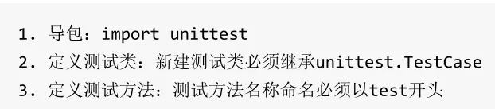

```python
import unittest


# 求和函数
def add(x, y):
    return x + y


# 定义测试类：继承 unittest.TestCase
class Test02(unittest.TestCase):
    # 定义测试方法
    def test_add(self):
        print(add(1, 2))

    def test_add01(self):
        print(add(2, 3))

    # 定义非测试方法
    def idiot_add(self):
        print(add(3, 3))


if __name__ == '__main__':
    unittest.main()

```

### (2) TestSuite

多个测试用例(`TestCase`)集合在一起组成`TestSuite`。

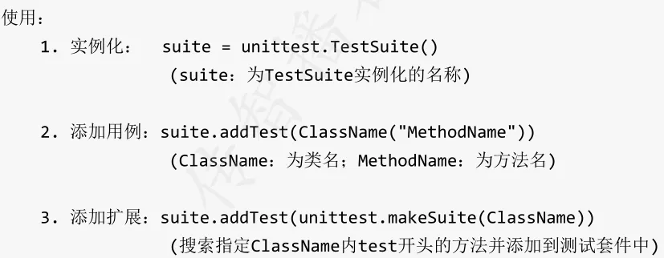

`TestSuite`需要配合`TestRunner`才能被执行。

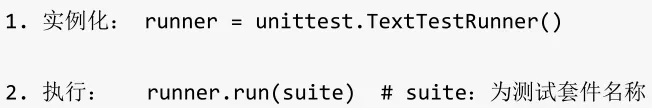

```python
# 导入单元测试
import unittest
# 导入测试用例
from demo02 import Test02

if __name__ == '__main__':
    # 创建测试套件实例
    suite = unittest.TestSuite()

    # 向测试套件中添加测试用例
    # suite.addTest(Test02("test_add"))

    # 向测试套件中添加所有测试方法
    suite.addTest(unittest.makeSuite(Test02))

    # 执行测试套件
    runner = unittest.TextTestRunner()
    runner.run(suite)
```

### (3) `TestLoader`

批量将`TestCase`加载到`TestSuite`，加载符合条件的测试用例，封装成为测试套件。

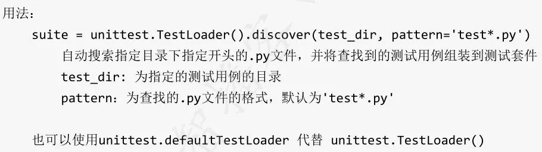

```python
import unittest

if __name__ == '__main__':
    # 将目录下所有测试用例封装到测试套件中
    suite = unittest.defaultTestLoader.discover('../testIdiot', pattern='*Test.py')

    # 执行测试套件
    runner = unittest.TextTestRunner()
    runner.run(suite)
```


**`TestSuite**`与`TestLoader`**

`TestSuite`是手动封装测试套件，可以指定封某个测试用例的某个测试方法；`TestLoader`可以批量封装测试套件，但只能封装`test`开头的测试方法。


## 2、`Fixture`

`Fixture`：对一个测试环境的初始化和销毁就是一个`Fixture`。
`Fixture`控制级别：

- 方法
- 类
- 模块

### (1) 方法级别

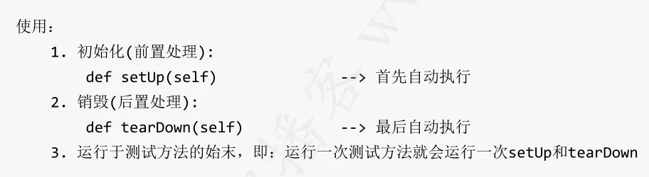

```python
import unittest
import time


def add(x, y):
    return x + y


# 定义测试用例
class FixtureTest01(unittest.TestCase):
    # 前置处理
    def setUp(self) -> None:
        self.start_time = time.time()

    # 后置处理
    def tearDown(self) -> None:
        execution_time = time.time() - self.start_time
        print(f"Execution time: {execution_time} seconds")

    # 测试方法
    def test_add(self):
        print(add(1, 1))

    def test_add01(self):
        print(add(2, 3))


if __name__ == '__main__':
    # 封装测试套件
    suite = unittest.TestSuite(unittest.makeSuite(FixtureTest01))
    # 执行测试套件
    runner = unittest.TextTestRunner()
    runner.run(suite)
```

### (2) 类级别

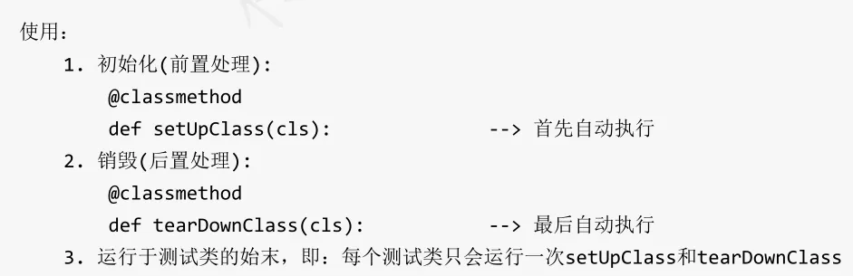

**使用案例**

```python
import unittest


# 测试用例
class FixtureTest01(unittest.TestCase):
    # 前置方法：类级别
    @classmethod
    def setUpClass(cls) -> None:
        print('测试类创建！')

    # 后置方法：类级别
    @classmethod
    def tearDownClass(cls) -> None:
        print('测试类销毁！')

    def test_idiot1(self):
        print('测试方法1执行！')

    def test_idiot2(self):
        print('测试方法2执行！')


if __name__ == '__main__':
    # 创建测试套件
    suite = unittest.TestSuite(unittest.makeSuite(FixtureTest01))
    # 执行测试套件
    runner = unittest.TextTestRunner()
    runner.run(suite)

```


在 Python 的`unittest`模块中，`@classmethod`是一个装饰器，用于声明类方法。类方法是定义在类上而不是实例上的方法，可以通过类本身直接调用，而无需创建类的实例。
在`unittest`中，`@classmethod`装饰器通常用于定义测试类中的类方法，即针对整个测试类而不是特定实例的方法。这些类方法常用于执行一些在整个测试类生命周期中只需要执行一次的操作，例如设置和清理测试环境。


> 总结：
> `setUp()`一般做初始化工作，如实例化浏览器驱动对象、最大化浏览器、设置隐式等待等
> `tearDown()`一般做结束工作，如关闭浏览器驱动对象、退出登录等

## 3、断言

断言：让程序判断执行结果是否符合预期。

`unittest`常用的断言方法：

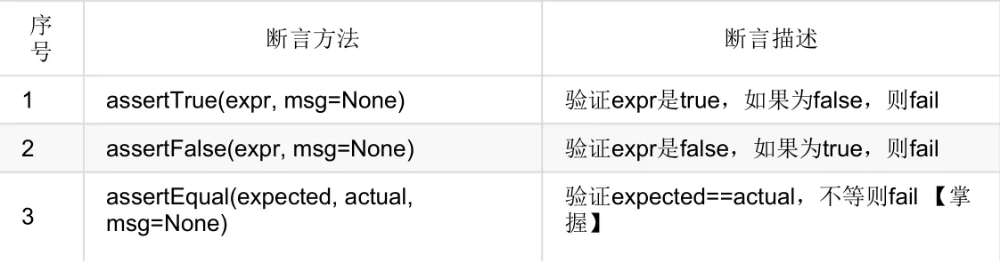

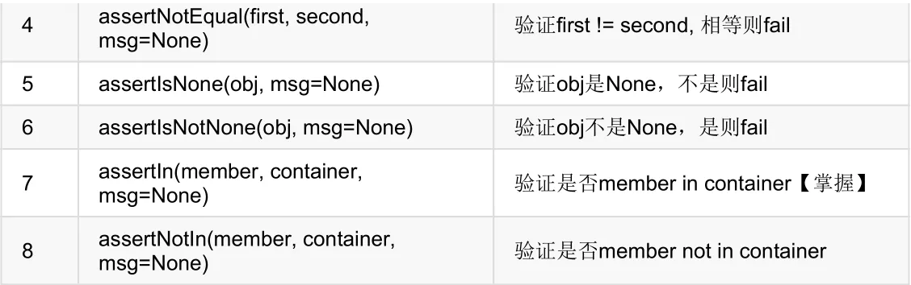

断言方法已经在`unittest.TestCase`类中定义好了，而且我们自定义的测试类已经继承了`TestCase`，所以在测试方法中直接调用即可。

## 4、综合案例

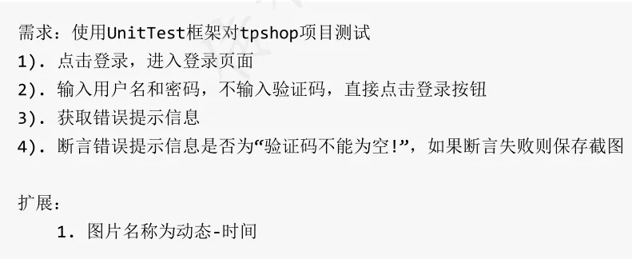

```python
import time
import unittest
from selenium import webdriver
from datetime import datetime


class TestLogin(unittest.TestCase):
    # 前置操作
    def setUp(self) -> None:
        # 创建浏览器驱动对象
        self.browser = webdriver.Chrome()
        # 打开指定 url
        self.browser.get('https://www.tp-shop.cn/')
        # 最大化窗口
        self.browser.maximize_window()
        time.sleep(2)

    # 后置操作
    def tearDown(self) -> None:
        time.sleep(2)
        self.browser.quit()

    def testLogin(self):
        # 点击登录
        login_btn = self.browser.find_element_by_css_selector('body > div.header.wi100 > div.nav > div > div.nav-list > ul > div > a:nth-child(1)')
        login_btn.click()

        # 输入账号
        self.browser.find_element_by_css_selector('#loginform > div.login-name > input[type=text]').send_keys('zhangsan')

        # 输入密码
        self.browser.find_element_by_css_selector('#loginform > div.login-password > input[type=password]').send_keys('123456')
        time.sleep(2)

        # 直接点击登录
        self.browser.find_element_by_css_selector('#loginform > div.login-btn > input[type=submit]').click()

        # 获取提示信息
        prompt = self.browser\
            .find_element_by_css_selector('#layui-layer1 > div.layui-layer-content.layui-layer-padding').text

        # 断言：提示信息是否为“验证码不能为空”
        try:
            self.assertEqual(prompt, "验证码不能为空!")
        except AssertionError as e:
            # 出现错误保存截图
            self.browser.get_screenshot_as_file('D:\\learning\\softwareTest\\img\\test02.png')
            # 显式引发异常
            raise e


if __name__ == '__main__':
    # 封装测试套件
    suite = unittest.TestSuite(unittest.makeSuite(TestLogin))
    # 执行测试套件
    runner = unittest.TextTestRunner()
    runner.run(suite)

```

## 5、参数化

通过参数化可以给同一测试方法传递不同测试数据，不同测试数据将分别用于测试。`unittest`测试框架，本身不支持参数化，但是可以通过安装`unittest`扩展插件`parameterized`来实现。

**使用方式**
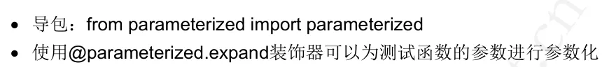
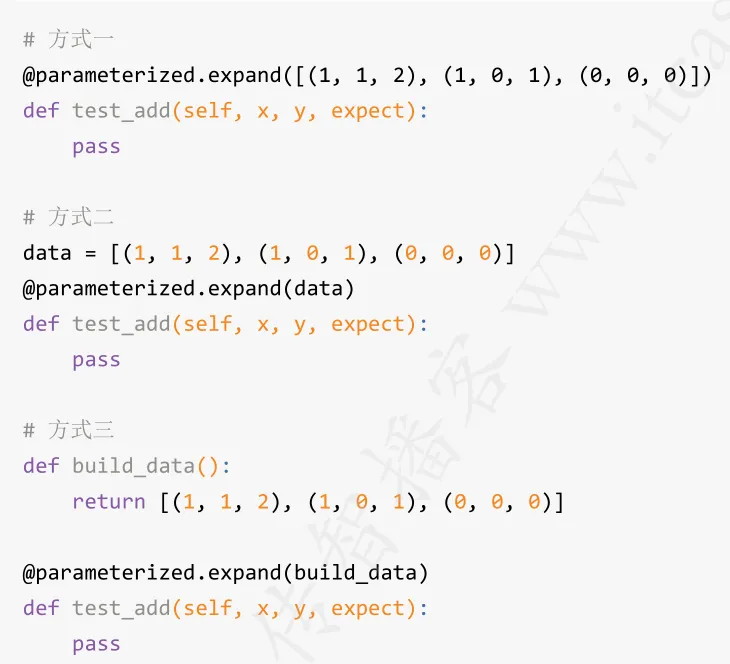

**使用案例**

```python
import unittest
from parameterized import parameterized


def add(x, y):
    return x+y


# 测试用例
class ParamTest(unittest.TestCase):
    data = [(1, 1, 2), (1, 1, 0), (0, 0, 0)]

    @parameterized.expand(data)
    def test_add(self, x, y, expect):
        result = add(x, y)
        self.assertEqual(result, expect)


if __name__ == '__main__':
    # 创建测试套件
    suite = unittest.TestSuite(unittest.makeSuite(ParamTest))
    # 执行测试套件
    runner = unittest.TextTestRunner()
    runner.run(suite)
```

## 6、跳过

跳过某些测试类和测试函数。

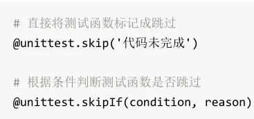

**使用案例**

```python
import unittest

version = 30


def add(x, y):
    return x+y


def sub(x, y):
    return x-y


# 测试用例
class ParamTest(unittest.TestCase):
    @unittest.skip('代码未完成')
    def test_add(self):
        result = add(1, 2)
        self.assertEqual(result, 3)

    @unittest.skipIf(version > 35, '版本过高，无法测试！')
    def test_sub(self):
        result = sub(1, 1)
        self.assertEqual(result, 0)


if __name__ == '__main__':
    # 创建测试套件
    suite = unittest.TestSuite(unittest.makeSuite(ParamTest))
    # 执行测试套件
    runner = unittest.TextTestRunner()
    runner.run(suite)
```
