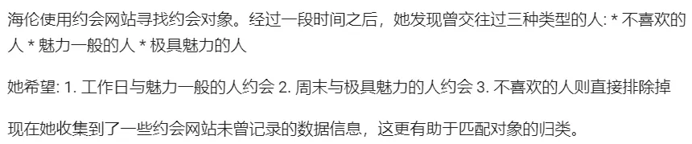
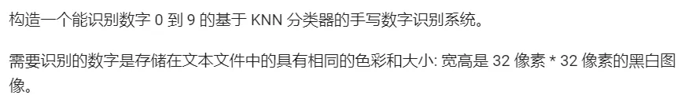

# 一、K 近邻算法

KNN（K-Nearest Neighbors）算法是一种常见的监督学习算法，主要用于分类和回归问题。它的思想是基于相似性度量，将未知样本的类别或属性值，赋值为其最近邻居的类别或属性值。

在 KNN 算法中，K 表示最近邻的个数。在分类问题中，KNN 算法会统计与待分类样本最近的K 个样本的类别，通过多数投票的方式来判断待分类样本的类别。在回归问题中，KNN 算法会统计与待预测样本最近的 K 个样本的属性值，通过取平均值的方式来预测待预测样本的属性值。

KNN 算法需要预先确定距离度量方法，常用的距离度量方法包括欧氏距离、曼哈顿距离和余弦相似度等。KNN 算法的优点包括简单易懂，无需训练，适用于多分类和高维数据，但是它也存在一些缺点，如对异常值敏感，需要存储所有训练样本等。

KNN 算法是一种懒惰学习（lazy learning）算法，它不需要训练阶段，只需要存储训练集中的样本和对应的类别（或属性值）。当需要对未知样本进行分类或回归时，KNN算法才进行计算。

## 1、算法原理

KNN（K-Nearest Neighbors）算法的原理是基于样本之间的相似性度量来进行分类或回归。其基本思想是：如果一个样本在特征空间中的K个最相似的样本中，大多数属于某个类别，则该样本也属于这个类别。因此，KNN算法的关键就是如何度量样本之间的相似性。

## 2、算法步骤

1. 计算未知样本与训练集中所有样本之间的距离（或相似度），并选取距离最近的K个样本。

2. 根据K个最近邻样本的类别（或属性值），通过投票的方式来预测未知样本的类别（或属性值）。如果是分类问题，则未知样本的类别为K个最近邻样本中出现次数最多的类别；如果是回归问题，则未知样本的属性值为K个最近邻样本属性值的平均值。

## 3、算法特点

1. 简单易懂：KNN算法的思想简单易懂，容易理解和实现。

2. 无需训练：KNN算法是一种懒惰学习（lazy learning）算法，不需要训练阶段，只需要存储训练集中的样本和对应的类别（或属性值），因此可以快速进行预测。

3. 适用于多分类问题：KNN算法适用于多分类问题，可以将样本分为多个类别。

4. 适用于高维数据：KNN算法适用于高维数据，不需要对数据进行降维处理。

5. 对异常值敏感：KNN算法对异常值敏感，因为它是基于距离度量的，如果某个样本距离待分类样本很近，但是它的类别与待分类样本差异较大，就会影响预测结果。

6. 存储空间大：KNN算法需要存储所有训练样本，因此存储空间较大。

7. 计算复杂度高：KNN算法需要计算待分类样本和所有训练样本之间的距离，计算复杂度较高，尤其是当训练集较大时。

## 4、代码实战

### (1) 双特征二分类模拟数据集

```python
def createDataSet():
    """
    创建数据集和标签

     调用方式
     import kNN
     group, labels = kNN.createDataSet()
    """
    group = array([[1.0, 1.1], 
                   [1.0, 1.0], 
                   [0, 0], 
                   [0, 0.1]])
    labels = ['A', 'A', 'B', 'B']
    return group, labels
```

```python
# knn分类器
def knn_classifier(input_vector, data_set, labels, k):
    """
    :param input_vector: 输入特征向量
    :param data_set: 数据集
    :param labels: 标签
    :param k: KNN 算法参数 k
    :return: 输入特征向量所属标签
    """

    # 1.计算距离
    # 数据集记录条数
    data_set_size = data_set.shape[0]
    # tile生成和训练样本对应的矩阵，并与训练样本求差
    diff_mat = tile(input_vector, (data_set_size, 1)) - data_set
    # 取平方
    sq_diff_mat = diff_mat ** 2
    # 将矩阵的每一行相加(按列压缩)
    sq_distances = sq_diff_mat.sum(axis=1)
    # 开方
    distances = sq_distances ** 0.5
    # 根据距离排序从小到大的排序，返回对应的索引位置
    # argsort() 是将x中的元素从小到大排列，提取其对应的index（索引），然后输出到y。
    # 例如: y=array([3,0,2,1,4,5]) 则，x[3]=-1最小，所以y[0]=3;x[5]=9最大，所以y[5]=5。
    sorted_dist_index = distances.argsort()

    # 2. 选择距离最小的k个点
    class_count = {}
    for i in range(k):
        # 找到该样本的类型
        voteIlabel = labels[sorted_dist_index[i]]
        # 在字典中将该类型加一
        # 字典的get方法
        # 如: list.get(k,d) 其中 get相当于一条if...else...语句,参数k在字典中，字典将返回list[k];如果参数k不在字典中则返回参数d,如果K在字典中则返回k对应的value值
        # l = {5:2,3:4}
        # print l.get(3,0)返回的值是4；
        # Print l.get（1,0）返回值是0；
        class_count[voteIlabel] = class_count.get(voteIlabel, 0) + 1
    # 3.利用max函数直接返回字典中value最大的key
    max_class_count = max(class_count, key=class_count.get)
    return max_class_count
```

```python
def test1():
    """
    第一个例子演示：使用生成的测试数据集
    """
    group, labels = create_data_set()
    print(str(group))
    print(str(labels))
    print(knn_classifier([0.1, 0.1], group, labels, 3))
```

```python
if __name__ == '__main__':
    test1()
    # datingClassTest()
    # handwritingClassTest()
```

### (2) 三特征三分类——约会对象

#### 1. 项目概述与数据集概述




#### 2. 具体代码

**导入数据**
将 txt 中的数据导入，生成数据矩阵和标签向量

```python
def file2matrix(filename):
    """
    导入训练数据
    :param filename: 数据文件路径
    :return: 数据矩阵returnMat和对应的类别classLabelVector
    """
    fr = open(filename)
    # 获得文件中的数据行的行数
    numberOfLines = len(fr.readlines())
    # 生成对应的空矩阵
    # 例如: zeros(2，3)就是生成一个 2*3的矩阵，各个位置上全是 0
    returnMat = zeros((numberOfLines, 3))  # prepare matrix to return
    classLabelVector = []  # prepare labels return
    fr = open(filename)
    index = 0
    for line in fr.readlines():
        # str.strip([chars]) --返回移除字符串头尾指定的字符生成的新字符串
        # 删除字符串开头和结尾的空白符
        line = line.strip()
        # 以 '\t' 切割字符串
        listFromLine = line.split('\t')
        # 每列的属性数据
        returnMat[index, :] = listFromLine[0:3]
        # 每列的类别数据，就是 label 标签数据
        classLabelVector.append(int(listFromLine[-1]))
        index += 1
    # 返回数据矩阵returnMat和对应的类别classLabelVector
    return returnMat, classLabelVector
```

**数据归一化**

数据归一化是指将数据按照一定的比例缩放，使其落在一个特定的区间内，常用的区间为[0,1]或[-1,1]。归一化的目的是消除不同特征之间的量纲影响，将其转化为同一标准下的数值，以便进行比较和分析。这样可以提高机器学习算法的精度和效率，避免某些特征因数值过大而对算法产生较大影响的情况。数据归一化通常可以使用简单的线性变换方法实现，例如最小-最大缩放方法和z-score标准化方法。

```python
def autoNorm(dataSet):
    """
    归一化特征值，消除属性之间量级不同导致的影响
    :param dataSet: 数据集
    :return: 归一化后的数据集normDataSet,ranges和minVals即最小值与范围，并没有用到

    归一化公式:
        Y = (X-Xmin)/(Xmax-Xmin)
        其中的 min 和 max 分别是数据集中的最小特征值和最大特征值。该函数可以自动将数字特征值转化为0到1的区间。
    """
    # 计算每种属性的最大值、最小值、范围
    minVals = dataSet.min(0)
    maxVals = dataSet.max(0)
    # 极差
    ranges = maxVals - minVals
    # -------第一种实现方式---start-------------------------
    normDataSet = zeros(shape(dataSet))
    m = dataSet.shape[0]
    # 生成与最小值之差组成的矩阵
    normDataSet = dataSet - tile(minVals, (m, 1))
    # 将最小值之差除以范围组成矩阵
    normDataSet = normDataSet / tile(ranges, (m, 1))  # element wise divide
    # -------第一种实现方式---end---------------------------------------------

    # # -------第二种实现方式---start---------------------------------------
    # norm_dataset = (dataset - minvalue) / ranges
    # # -------第二种实现方式---end---------------------------------------------
    return normDataSet, ranges, minVals
```

**测试**

```python
def datingClassTest():
    """
    对约会网站的测试方法
    :return: 错误数
    """
    # 设置测试数据的的一个比例（训练数据集比例=1-hoRatio）
    hoRatio = 0.1  # 测试范围,一部分测试一部分作为样本
    # 从文件中加载数据
    datingDataMat, datingLabels = file2matrix('./data/datingTestSet2.txt')  # load data setfrom file
    # 归一化数据
    normMat, ranges, minVals = autoNorm(datingDataMat)
    # m 表示数据的行数，即矩阵的第一维
    m = normMat.shape[0]
    # 设置测试的样本数量， numTestVecs:m表示训练样本的数量
    numTestVecs = int(m * hoRatio)
    print('numTestVecs=', numTestVecs)
    errorCount = 0.0
    for i in range(numTestVecs):
        # 对数据测试
        classifierResult = knn_classifier(normMat[i, :], normMat[numTestVecs:m, :], datingLabels[numTestVecs:m], 3)
        print("the classifier came back with: %d, the real answer is: %d" % (classifierResult, datingLabels[i]))
        if (classifierResult != datingLabels[i]): errorCount += 1.0
    print("the total error rate is: %f" % (errorCount / float(numTestVecs)))
    print(errorCount)
```

### (3) 1024 特征 10 分类——手写字体

#### 1. 项目概述和数据集概述



#### 2. 具体代码

**图像转向量**

首先需要将 32*32 的黑白图像转换为 1*1024 的特征向量。

```python
def img2vector(filename):
    """
    将图像数据转换为向量
    :param filename: 图片文件 因为我们的输入数据的图片格式是 32 * 32的
    :return: 一维矩阵
    该函数将图像转换为向量: 该函数创建 1 * 1024 的NumPy数组，然后打开给定的文件，
    循环读出文件的前32行，并将每行的头32个字符值存储在NumPy数组中，最后返回数组。
    """
    returnVect = zeros((1, 1024))
    fr = open(filename)
    for i in range(32):
        lineStr = fr.readline()
        for j in range(32):
            returnVect[0, 32 * i + j] = int(lineStr[j])
    return returnVect
```

**测试代码**

```python
def handwritingClassTest():
    # 1. 导入数据
    hwLabels = []
    trainingFileList = listdir('./data/trainingDigits')  # load the training set
    m = len(trainingFileList)
    trainingMat = zeros((m, 1024))
    # hwLabels存储0～9对应的index位置， trainingMat存放的每个位置对应的图片向量
    for i in range(m):
        fileNameStr = trainingFileList[i]
        fileStr = fileNameStr.split('.')[0]  # take off .txt
        classNumStr = int(fileStr.split('_')[0])
        hwLabels.append(classNumStr)
        # 将 32*32的矩阵->1*1024的矩阵
        trainingMat[i, :] = img2vector('./data/trainingDigits/%s' % fileNameStr)

    # 2. 导入测试数据
    testFileList = listdir('./data/testDigits')  # iterate through the test set
    errorCount = 0.0
    mTest = len(testFileList)
    for i in range(mTest):
        fileNameStr = testFileList[i]
        fileStr = fileNameStr.split('.')[0]  # take off .txt
        classNumStr = int(fileStr.split('_')[0])
        vectorUnderTest = img2vector('./data/testDigits/%s' % fileNameStr)
        classifierResult = knn_classifier(vectorUnderTest, trainingMat, hwLabels, 3)
        print("the classifier came back with: %d, the real answer is: %d" % (classifierResult, classNumStr))
        if (classifierResult != classNumStr): errorCount += 1.0
    print("\nthe total number of errors is: %d" % errorCount)
    print("\nthe total error rate is: %f" % (errorCount / float(mTest)))
```

## 5、sklearn 中的 knn

### (1) 使用案例：鸢尾花

```python
from sklearn.neighbors import KNeighborsClassifier
from sklearn.datasets import load_iris
from sklearn.model_selection import train_test_split
from sklearn.metrics import accuracy_score


# 导入 iris 数据集
iris = load_iris()
X = iris.data  # 数据
y = iris.target  # 标签

# 划分测试集和训练集
X_train, X_test, y_train, y_test = train_test_split(X, y, test_size=0.2, random_state=42)

# 定义并训练模型
knn = KNeighborsClassifier(n_neighbors=3)
knn.fit(X_train, y_train)

# 预测测试集结果
y_pred = knn.predict(X_test)

# 性能评估
accuracy = accuracy_score(y_test, y_pred)
print('Accuracy:', accuracy)
```

### (2) 约会对象

```python
from sklearn.neighbors import KNeighborsClassifier
from myKNN import file2matrix, autoNorm
from sklearn.model_selection import train_test_split
from sklearn.metrics import accuracy_score


# 导入数据集并进行归一化
X, y = file2matrix("./data/datingTestSet2.txt")
X, ranges, minVals = autoNorm(X)

# 划分测试集和训练集
X_train, X_test, y_train, y_test = train_test_split(X, y, test_size=0.2, random_state=42)

# 定义并训练模型
knn = KNeighborsClassifier(n_neighbors=3)
knn.fit(X_train, y_train)

# 预测测试集结果
y_pred = knn.predict(X_test)

# 性能评估
accuracy = accuracy_score(y_test, y_pred)
print('Accuracy:', accuracy)
```

### (3) 手写字体识别

```python
from sklearn.neighbors import KNeighborsClassifier
from myKNN import img2vector
from sklearn.metrics import accuracy_score
from os import listdir
from numpy import *


def generate_dataset_and_labels(filename):
    """
    生成手写字体数据集和标签
    :param filename: 文件路径
    :return: 数据集 data_set 和 标签 labels
    """
    labels = []  # 标签
    file_list = listdir(filename)  # 文件名列表
    data_length = len(file_list)  # 数据集记录条数
    data_set = zeros((data_length, 1024))  # 数据集
    for i in range(data_length):
        fileNameStr = file_list[i]
        fileStr = fileNameStr.split('.')[0]  # take off .txt
        classNumStr = int(fileStr.split('_')[0])
        labels.append(classNumStr)
        # 将 32*32的矩阵->1*1024的矩阵
        data_set[i, :] = img2vector('./data/trainingDigits/%s' % fileNameStr)
    return data_set, labels


# 生成训练集
trainingMat, trainingLabels = generate_dataset_and_labels('./data/trainingDigits')

# 导入测试集
testMat, testLabels = generate_dataset_and_labels('./data/testDigits')

# 定义并训练模型
knn = KNeighborsClassifier(n_neighbors=3)
knn.fit(trainingMat, trainingLabels)

# 预测测试集结果
y_pred = knn.predict(testMat)

# 性能评估
accuracy = accuracy_score(testLabels, y_pred)
print('Accuracy:', accuracy)
```
