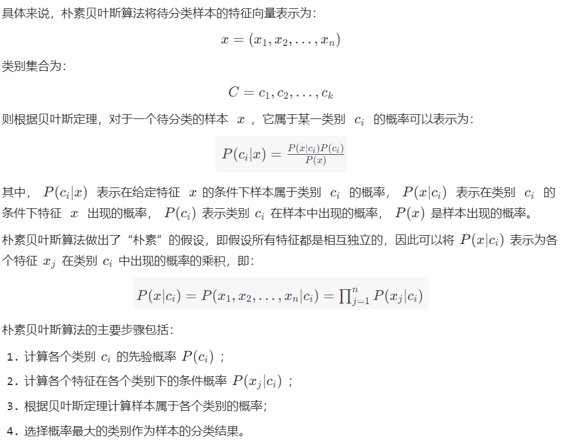

# 三、朴素贝叶斯

## 1、算法简介

朴素贝叶斯算法是一种基于贝叶斯定理的分类算法。它假设特征之间是**相互独立**的（朴素假设），并且通过统计样本中特征与类别之间的关系，来计算一个样本属于每个类别的概率，选择概率最大的类别作为样本所属的类别。

推导：



## 2、代码实战

### (1) 屏蔽社区留言板中的侮辱性言论

#### 1. 项目概述和数据集概述

数据集和标签创建如下：

```python
def loadDataSet():
    """
    创建数据集
    :return: 单词列表postingList, 所属类别classVec
    """
    postingList = [['my', 'dog', 'has', 'flea', 'problems', 'help', 'please'], #[0,0,1,1,1......]
                   ['maybe', 'not', 'take', 'him', 'to', 'dog', 'park', 'stupid'],
                   ['my', 'dalmation', 'is', 'so', 'cute', 'I', 'love', 'him'],
                   ['stop', 'posting', 'stupid', 'worthless', 'garbage'],
                   ['mr', 'licks', 'ate', 'my', 'steak', 'how', 'to', 'stop', 'him'],
                   ['quit', 'buying', 'worthless', 'dog', 'food', 'stupid']]
    classVec = [0, 1, 0, 1, 0, 1]  # 1 is abusive, 0 not
    return postingList, classVec
```

#### 2. 具体代码

```python
def testingNB():
    """
    测试朴素贝叶斯算法
    """
    # 1. 加载数据集
    listOPosts, listClasses = loadDataSet()
    # 2. 创建单词集合
    myVocabList = createVocabList(listOPosts)
    # 3. 计算单词是否出现并创建数据矩阵
    trainMat = []
    for postinDoc in listOPosts:
        # 返回m*len(myVocabList)的矩阵， 记录的都是0，1信息
        trainMat.append(setOfWords2Vec(myVocabList, postinDoc))
    # 4. 训练数据
    p0V, p1V, pAb = trainNB0(array(trainMat), array(listClasses))
    # 5. 测试数据
    testEntry = ['love', 'my', 'dalmation']
    thisDoc = array(setOfWords2Vec(myVocabList, testEntry))
    print(testEntry, 'classified as: ', classifyNB(thisDoc, p0V, p1V, pAb))
    testEntry = ['stupid', 'garbage']
    thisDoc = array(setOfWords2Vec(myVocabList, testEntry))
    print(testEntry, 'classified as: ', classifyNB(thisDoc, p0V, p1V, pAb))
```

获取数据集中出现的所有单词，形成一个集合。

```python
def createVocabList(dataSet):
    """
    获取所有单词的集合
    :param dataSet: 数据集
    :return: 所有单词的集合(即不含重复元素的单词列表)
    """
    vocabSet = set([])  # create empty set
    for document in dataSet:
        # 操作符 | 用于求两个集合的并集
        vocabSet = vocabSet | set(document)  # union of the two sets
    return list(vocabSet)
```

形成每条留言的特征向量。

```python
def setOfWords2Vec(vocabList, inputSet):
    """
    遍历查看该单词是否出现，出现该单词则将该单词置1
    :param vocabList: 所有单词集合列表
    :param inputSet: 输入数据集
    :return: 匹配列表[0,1,0,1...]，其中 1与0 表示词汇表中的单词是否出现在输入的数据集中
    """
    # 创建一个和词汇表等长的向量，并将其元素都设置为0
    returnVec = [0] * len(vocabList)# [0,0......]
    # 遍历文档中的所有单词，如果出现了词汇表中的单词，则将输出的文档向量中的对应值设为1
    for word in inputSet:
        if word in vocabList:
            returnVec[vocabList.index(word)] = 1
        else:
            print("the word: %s is not in my Vocabulary!" % word)
    return returnVec
```

计算相关概率

```python
def _trainNB0(trainMatrix, trainCategory):
    """
    训练数据原版
    :param trainMatrix: 文件单词矩阵 [[1,0,1,1,1....],[],[]...]
    :param trainCategory: 文件对应的类别[0,1,1,0....]，列表长度等于单词矩阵数，其中的1代表对应的文件是侮辱性文件，0代表不是侮辱性矩阵
    :return:
    """
    # 文件数
    numTrainDocs = len(trainMatrix)
    # 单词数
    numWords = len(trainMatrix[0])
    # 侮辱性文件的出现概率，即trainCategory中所有的1的个数，
    # 代表的就是多少个侮辱性文件，与文件的总数相除就得到了侮辱性文件的出现概率
    pAbusive = sum(trainCategory) / float(numTrainDocs)
    # 构造单词出现次数列表
    p0Num = zeros(numWords) # [0,0,0,.....]
    p1Num = zeros(numWords) # [0,0,0,.....]

    # 整个数据集单词出现总数
    p0Denom = 0.0
    p1Denom = 0.0
    for i in range(numTrainDocs):
        # 遍历所有的文件，如果是侮辱性文件，就计算此侮辱性文件中出现的侮辱性单词的个数
        if trainCategory[i] == 1:
            p1Num += trainMatrix[i] #[0,1,1,....]->[0,1,1,...]
            p1Denom += sum(trainMatrix[i])
        else:
            # 如果不是侮辱性文件，则计算非侮辱性文件中出现的侮辱性单词的个数
            p0Num += trainMatrix[i]
            p0Denom += sum(trainMatrix[i])
    # 类别1，即侮辱性文档的[P(F1|C1),P(F2|C1),P(F3|C1),P(F4|C1),P(F5|C1)....]列表
    # 即 在1类别下，每个单词出现次数的占比
    p1Vect = p1Num / p1Denom# [1,2,3,5]/90->[1/90,...]
    # 类别0，即正常文档的[P(F1|C0),P(F2|C0),P(F3|C0),P(F4|C0),P(F5|C0)....]列表
    # 即 在0类别下，每个单词出现次数的占比
    p0Vect = p0Num / p0Denom
    return p0Vect, p1Vect, pAbusive
```

根据概率结果分类

```python
def classifyNB(vec2Classify, p0Vec, p1Vec, pClass1):
    """
    使用算法:
        # 将乘法转换为加法
        乘法: P(C|F1F2...Fn) = P(F1F2...Fn|C)P(C)/P(F1F2...Fn)
        加法: P(F1|C)*P(F2|C)....P(Fn|C)P(C) -> log(P(F1|C))+log(P(F2|C))+....+log(P(Fn|C))+log(P(C))
    :param vec2Classify: 待测数据[0,1,1,1,1...]，即要分类的向量
    :param p0Vec: 类别0，即正常文档的[log(P(F1|C0)),log(P(F2|C0)),log(P(F3|C0)),log(P(F4|C0)),log(P(F5|C0))....]列表
    :param p1Vec: 类别1，即侮辱性文档的[log(P(F1|C1)),log(P(F2|C1)),log(P(F3|C1)),log(P(F4|C1)),log(P(F5|C1))....]列表
    :param pClass1: 类别1，侮辱性文件的出现概率
    :return: 类别1 or 0
    """
    # 计算公式  log(P(F1|C))+log(P(F2|C))+....+log(P(Fn|C))+log(P(C))
    # 使用 NumPy 数组来计算两个向量相乘的结果，这里的相乘是指对应元素相乘，即先将两个向量中的第一个元素相乘，然后将第2个元素相乘，以此类推。
    # 我的理解是: 这里的 vec2Classify * p1Vec 的意思就是将每个词与其对应的概率相关联起来
    # 可以理解为 1.单词在词汇表中的条件下，文件是good 类别的概率 也可以理解为 2.在整个空间下，文件既在词汇表中又是good类别的概率
    p1 = sum(vec2Classify * p1Vec) + log(pClass1)
    p0 = sum(vec2Classify * p0Vec) + log(1.0 - pClass1)
    if p1 > p0:
        return 1
    else:
        return 0
```

## 3、sklearn 中的朴素贝叶斯分类器

**词袋向量/词频向量**
词袋向量是一种文本表示方法，它将文本中的每个单词都看作一个特征，并根据单词在文本中出现的频率来构造一个向量。它不考虑单词出现的顺序和上下文，只关注每个单词出现的次数或者频率，因此也被称为“词频向量”。

词袋向量的构造过程可以分为两个步骤：

1. 词汇表构建：遍历文本数据集，统计出现的所有单词，构建一个词汇表。在 Scikit-learn 中，可以使用`CountVectorizer`类来实现词汇表构建和词袋向量化的过程。

2. 向量化：将每篇文本表示成一个向量，向量的长度等于词汇表的大小，每个维度表示词汇表中的一个单词在该文本中出现的次数或者频率。在 Scikit-learn 中，可以使用`transform()`方法将文本数据集转换为词袋向量表示。

词袋向量是一种简单有效的文本表示方法，广泛应用于文本分类、信息检索、自然语言处理等领域。但是，它也存在一些缺点，比如无法处理词序信息和语义信息，容易受到停用词、词形变化和拼写错误的影响等。因此，在实际应用中需要根据具体任务和数据集选择适合的文本表示方法。

**sklearn 中朴素贝叶斯分类器的种类**

在 Scikit-learn 中，朴素贝叶斯分类器包括高斯朴素贝叶斯分类器（GaussianNB）、多项式朴素贝叶斯分类器（MultinomialNB）和伯努利朴素贝叶斯分类器（BernoulliNB），它们的主要区别在于假设的概率分布不同。

1. 高斯朴素贝叶斯分类器（GaussianNB）假设特征的概率分布为高斯分布（正态分布）。
2. 多项式朴素贝叶斯分类器（MultinomialNB）假设特征的概率分布为多项式分布，常用于文本分类任务中。
3. 伯努利朴素贝叶斯分类器（BernoulliNB）假设特征的概率分布为伯努利分布，即特征只有两种取值（例如文本分类任务中，每个词要么出现要么不出现）。

因此，在选择朴素贝叶斯分类器时，需要根据具体的问题和数据特点选择适当的分类器。例如，在文本分类问题中，通常使用多项式朴素贝叶斯分类器或伯努利朴素贝叶斯分类器，而在连续特征的分类问题中，通常使用高斯朴素贝叶斯分类器。

### (1) 示例代码

```python
from sklearn.naive_bayes import MultinomialNB
from sklearn.feature_extraction.text import CountVectorizer

# 创建文本数据
corpus = ['This is the first document.',
          'This is the second second document.',
          'And the third one.',
          'Is this the first document?']

# 将文本数据转化为数值特征
vectorizer = CountVectorizer()
X = vectorizer.fit_transform(corpus)

# 创建标签
y = [1, 1, 0, 0]

# 创建朴素贝叶斯分类器
clf = MultinomialNB()

# 训练分类器
clf.fit(X, y)

# 预测新的文本
new_doc = ['This is the fourth document.']
X_new = vectorizer.transform(new_doc)
predicted = clf.predict(X_new)

print(predicted)
```
