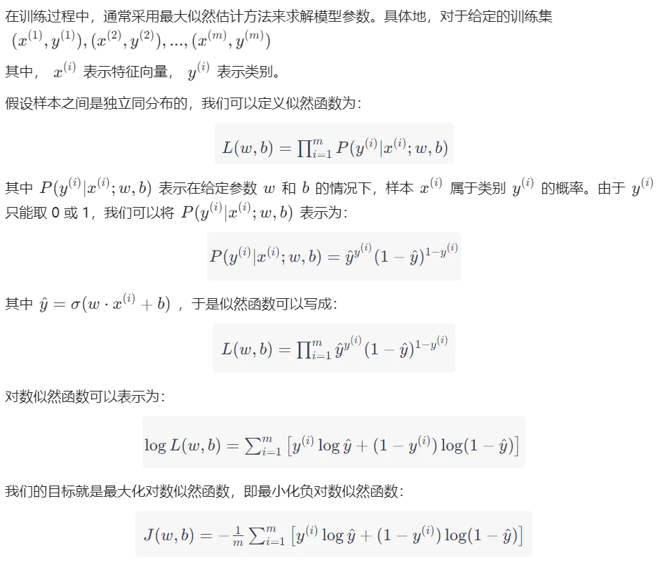

# 四、逻辑回归

**Numpy 矩阵和 Python 二维列表区别**
NumPy 矩阵和 Python 二维列表在很多方面都有所不同，其中一些区别如下：

1. 数据类型

NumPy 矩阵是同质的，即矩阵中的所有元素必须具有相同的数据类型。例如，一个NumPy矩阵可以只包含整数或只包含浮点数。而 Python 二维列表可以包含不同类型的元素。

2. 内存管理

NumPy 矩阵被设计成更高效地使用内存。它们被存储为连续的内存块，并且不需要在每个元素之间存储额外的指针。相比之下，Python 二维列表可能会使用不连续的内存块来存储数据，因此可能会占用更多的内存。

3. 数学操作

NumPy矩阵提供了一些高级的数学操作，例如矩阵乘法、逆矩阵和行列式。相比之下，对于 Python 二维列表，必须手动编写代码来执行这些操作。

4. 编程语言

NumPy 是一个 Python 扩展库，它使用 C 语言编写了一些底层操作，因此 NumPy 矩阵比 Python 二维列表更快。但是，这也意味着使用 NumPy 需要安装 NumPy 库，而 Python 二维列表不需要。
总之，NumPy 矩阵和 Python 二维列表都有其优点和缺点，具体取决于应用程序的要求和使用场景。

## 1、算法简介

逻辑回归是一种经典的分类算法，常用于预测二元分类问题（即输出为0或1）。其基本思想是将输入特征线性组合后通过一个特殊的函数（称为sigmoid函数）映射到[0,1]区间内，然后根据映射值来判断样本属于哪个类别。




## 2、代码实战

### (1) sklearn 逻辑回归分类器示例代码

```python
from sklearn.linear_model import LogisticRegression
from sklearn.datasets import load_breast_cancer
from sklearn.model_selection import train_test_split
from sklearn.metrics import accuracy_score

# 加载数据集
data = load_breast_cancer()
X = data.data
y = data.target

# 将数据集划分为训练集和测试集
X_train, X_test, y_train, y_test = train_test_split(X, y, test_size=0.3, random_state=42)

# 创建逻辑回归分类器对象
clf = LogisticRegression()

# 训练分类器
clf.fit(X_train, y_train)

# 在测试集上评估分类器性能
y_pred = clf.predict(X_test)
accuracy = accuracy_score(y_test, y_pred)
print("Accuracy:", accuracy)
```
