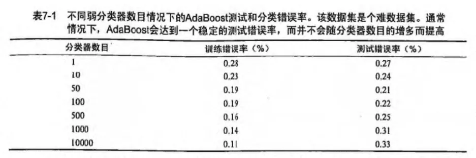
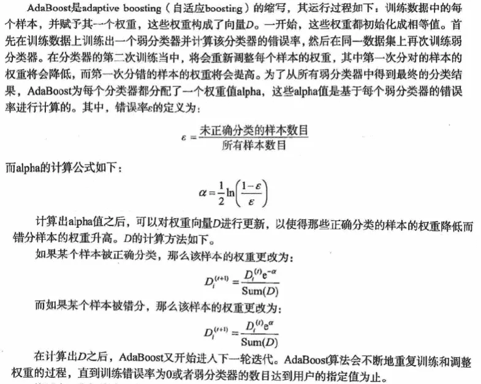

# 六、集成学习

集成学习(Ensemble Learning)是一种通过将多个分类或回归模型组合在一起来提高预测性能的机器学习技术。它的基本思想是将多个不同的模型结合在一起，以获得比单个模型更好的预测精度。

在集成学习中，每个模型都会独立地学习训练数据，然后将它们的结果进行组合。常见的集成学习方法包括投票法(Voting)，平均法(Averaging)，Bagging和Boosting等。

- 投票法：在投票法中，每个模型都对测试样本进行预测，然后将它们的预测结果进行投票。最终的预测结果是获得票数最多的类别或平均预测概率最高的类别。
- 平均法：在平均法中，每个模型对测试样本进行预测，并将它们的预测结果进行平均。最终的预测结果是平均预测结果。
- Bagging：在Bagging中，每个模型都是基于随机抽样的子集数据集进行训练的。最终的预测结果是通过投票法或平均法组合所有模型的预测结果。
- Boosting：在Boosting中，每个模型都是基于先前模型的错误进行训练的。最终的预测结果是通过加权投票或加权平均法组合所有模型的预测结果。

集成学习可以提高模型的泛化能力，降低过拟合的风险，提高模型的稳定性和准确性，被广泛应用于各种机器学习问题，如图像识别、语音识别、自然语言处理、推荐系统等。

## 1、随机森林

### (1) 简介

随机森林(Random Forest)是一种集成学习(Ensemble Learning)方法，通常用于分类和回归问题。它是由多个决策树(Decision Trees)组成的模型，每个决策树都是一个分类器，对输入数据进行分类，然后通过对每个决策树的结果进行投票或平均值计算来确定最终的输出结果。

随机森林的关键特点在于随机性，它在建立每个决策树时使用随机子集的特征和训练样本，以减少模型的方差，防止过拟合(Overfitting)。在每个决策树的训练过程中，随机森林通过使用随机选择的特征来分割节点，以确保每个决策树的差异性。此外，随机森林还可以通过平均每个决策树的结果来降低预测误差，并且在处理高维数据和大规模数据集时表现出色。

随机森林可以应用于许多实际问题，如医学诊断、金融风险管理、图像识别、自然语言处理等领域。它是一种广泛使用的机器学习算法，对于处理复杂的分类和回归问题具有很好的性能和鲁棒性。


**机器学习中的交叉验证**
交叉验证是一种常用的机器学习技术，它用于评估和选择模型的性能。

在交叉验证中，将数据集分成训练集和测试集两部分。然后使用训练集训练模型，并使用测试集来评估模型的性能。这种方法有一个缺点，就是测试集的性能受到训练集的选择的影响，因此可能不太准确。

为了解决这个问题，可以使用交叉验证。在交叉验证中，将数据集分成 k 个部分，每次选择其中一个部分作为测试集，其他部分作为训练集。然后用训练集训练模型，并用测试集来评估模型的性能。这个过程重复k次，每次选择不同的测试集。最后将 k 次评估的结果求平均值，作为模型性能的估计值。

交叉验证的好处是，可以使用全部数据进行模型训练和评估，并且避免了测试集的选择对模型评估的影响。同时，可以更准确地评估模型的性能。

**基尼系数**

机器学习中的基尼系数（Gini coefficient）是用来衡量数据集的纯度的一种指标。在分类问题中，基尼系数常常用来衡量一个特征的重要性，因为一个特征的基尼系数越大，表示使用该特征进行分类的效果越好。

在二分类问题中，假设数据集D中有两个类别，记为正类和负类，分别占比为p和1-p。则数据集 D 的基尼系数定义为：

Gini(D) = 2 * p * (1 - p)

例如，当p=0.5时，D的基尼系数最大，为 0.5，表示此时正类和负类的数量相等，数据集最不确定；当p=0或p=1时，D的基尼系数最小，为0，表示此时数据集中只有一种类别，数据集最纯。

对于一个特征A，假设它有V个取值，将数据集D根据A划分为V个子集，记第i个子集中的样本集合为Di，则可以计算出使用特征A进行划分的基尼系数：

Gini_index(D, A) = sum(|Di| / |D| * Gini(Di))

其中，|Di|表示Di中的样本数量，|D|表示整个数据集D中的样本数量。

特征A的基尼系数越大，表示使用特征A进行分类的效果越好。因此，在决策树算法中，通常会选择基尼系数最大的特征进行划分。

总结：二分类数据集有基尼系数，其基尼系数有公式。二分类数据集的特征也有基尼系数，使用特征将数据集做划分后，特征的基尼系数 = sum(子集的权重 * 子集的基尼系数)。


### (2) 源码分析

#### 1. 数据集概述

文本文件中的每一行记录了声呐信号的 60 个特征值和其所属分类。

```python
0.02,0.0371,0.0428,0.0207,0.0954,0.0986,0.1539,0.1601,0.3109,0.2111,0.1609,0.1582,0.2238,0.0645,0.066,0.2273,0.31,0.2999,0.5078,0.4797,0.5783,0.5071,0.4328,0.555,0.6711,0.6415,0.7104,0.808,0.6791,0.3857,0.1307,0.2604,0.5121,0.7547,0.8537,0.8507,0.6692,0.6097,0.4943,0.2744,0.051,0.2834,0.2825,0.4256,0.2641,0.1386,0.1051,0.1343,0.0383,0.0324,0.0232,0.0027,0.0065,0.0159,0.0072,0.0167,0.018,0.0084,0.009,0.0032,R
0.0453,0.0523,0.0843,0.0689,0.1183,0.2583,0.2156,0.3481,0.3337,0.2872,0.4918,0.6552,0.6919,0.7797,0.7464,0.9444,1,0.8874,0.8024,0.7818,0.5212,0.4052,0.3957,0.3914,0.325,0.32,0.3271,0.2767,0.4423,0.2028,0.3788,0.2947,0.1984,0.2341,0.1306,0.4182,0.3835,0.1057,0.184,0.197,0.1674,0.0583,0.1401,0.1628,0.0621,0.0203,0.053,0.0742,0.0409,0.0061,0.0125,0.0084,0.0089,0.0048,0.0094,0.0191,0.014,0.0049,0.0052,0.0044,R
0.0262,0.0582,0.1099,0.1083,0.0974,0.228,0.2431,0.3771,0.5598,0.6194,0.6333,0.706,0.5544,0.532,0.6479,0.6931,0.6759,0.7551,0.8929,0.8619,0.7974,0.6737,0.4293,0.3648,0.5331,0.2413,0.507,0.8533,0.6036,0.8514,0.8512,0.5045,0.1862,0.2709,0.4232,0.3043,0.6116,0.6756,0.5375,0.4719,0.4647,0.2587,0.2129,0.2222,0.2111,0.0176,0.1348,0.0744,0.013,0.0106,0.0033,0.0232,0.0166,0.0095,0.018,0.0244,0.0316,0.0164,0.0095,0.0078,R
```

#### 2. 具体代码

**主程序**

```python
if __name__ == '__main__':

    # 加载数据
    dataset = loadDataSet('../data/sonar-all-data.txt')
    # n_folds = 5
    # sub_dataset = cross_validation_split(dataset, 5)
    # best_split = get_split(sub_dataset[0], 15)
    # print(n_folds)

    n_folds = 5        # 分成5份数据，进行交叉验证
    max_depth = 20     # 调参（自己修改） #决策树深度不能太深，不然容易导致过拟合
    min_size = 1       # 决策树的叶子节点最少的元素数量
    sample_size = 1.0  # 做决策树时候的样本的比例
    # n_features = int((len(dataset[0])-1))
    n_features = 15     # 调参（自己修改） #准确性与多样性之间的权衡
    for n_trees in [1, 10, 20]:  # 理论上树是越多越好
        scores = evaluate_algorithm(dataset, random_forest, n_folds, max_depth, min_size, sample_size, n_trees, n_features)
        # 每一次执行本文件时都能产生同一个随机数
        seed(1)
        print('random=', random())
        print('Trees: %d' % n_trees)
        print('Scores: %s' % scores)
        print('Mean Accuracy: %.3f%%' % (sum(scores)/float(len(scores))))
```

**加载数据**

将文本数据转换为 list 存储。

```python
def loadDataSet(filename):
    dataset = []
    with open(filename, 'r') as fr:
        for line in fr.readlines():
            if not line:
                continue
            lineArr = []
            for featrue in line.split(','):
                # strip()返回移除字符串头尾指定的字符生成的新字符串
                str_f = featrue.strip()

                # isdigit 如果是浮点型数值，就是 false，所以换成 isalpha() 函数
                # if str_f.isdigit():   # 判断是否是数字
                if str_f.isalpha():     # 如果是字母，说明是标签
                    # 添加分类标签
                    lineArr.append(str_f)
                else:
                    # 将数据集的第column列转换成float形式
                    lineArr.append(float(str_f))
            dataset.append(lineArr)
    return dataset
```

**可调节的参数**

**决策树分类器可调节的参数**

1. criterion：划分时使用的评估准则，可以选择“gini”或“entropy”。
2. splitter：划分节点时使用的策略，可以选择“best”或“random”。其中，“best”表示选择最好的划分策略，“random”表示随机选择一个划分策略。
3. max_depth：决策树的最大深度。如果不指定，则表示无限制。
4. min_samples_split：拆分内部节点所需的最小样本数。可以是整数或浮点数。如果是整数，则表示最小样本数；如果是浮点数，则表示最小样本分数。例如，如果样本总数为1000，min_samples_split=2，则表示内部节点至少需要2个样本才能进行拆分；如果min_samples_split=0.5，则表示内部节点至少需要500个样本才能进行拆分。
5. min_samples_leaf：叶子节点所需的最小样本数。与min_samples_split类似，可以是整数或浮点数。
6. max_features：在寻找最佳分割时考虑的特征数。可以是整数或浮点数。如果是整数，则表示考虑的特征数量；如果是浮点数，则表示考虑特征数量的百分比。
7. max_leaf_nodes：最大叶节点数。如果不指定，则表示无限制。
8. class_weight：用于对不同类别的样本赋予不同的权重。可以是“balanced”（自动平衡类别权重）或自定义字典（类别作为键，权重作为值）。

```python
n_folds = 5        # 分成5份数据，进行交叉验证
max_depth = 20     # 调参（自己修改） #决策树深度不能太深，不然容易导致过拟合
min_size = 1       # 决策树的叶子节点最少的元素数量
sample_size = 1.0  # 做决策树时候的样本的比例
# n_features = int((len(dataset[0])-1))
n_features = 15     # 调参（自己修改） #准确性与多样性之间的权衡
```

**生成随机森林**

随机森林就是决策树的集合，生成多颗决策树，并利用各个决策树的结果的投票、平均等产生最终结果。

```python
# Random Forest Algorithm
def random_forest(train, test, max_depth, min_size, sample_size, n_trees, n_features):
    """random_forest(评估算法性能，返回模型得分)

    Args:
        train           训练数据集
        test            测试数据集
        max_depth       决策树深度不能太深，不然容易导致过拟合
        min_size        叶子节点的大小
        sample_size     训练数据集的样本比例
        n_trees         决策树的个数
        n_features      选取的特征的个数
    Returns:
        predictions     每一行的预测结果，bagging 预测最后的分类结果
    """

    trees = list()
    # n_trees 表示决策树的数量
    for i in range(n_trees):
        # 随机抽样的训练样本， 随机采样保证了每棵决策树训练集的差异性
        sample = subsample(train, sample_size)
        # 创建一个决策树
        tree = build_tree(sample, max_depth, min_size, n_features)
        trees.append(tree)

    # 每一行的预测结果，bagging 预测最后的分类结果
    predictions = [bagging_predict(trees, row) for row in test]
    return predictions
```

**决策树的生成**

首先需要寻找特征列表中最优的分类特征，最优分类特征即基尼系数最小的特征，最优特征将作为决策树的根结点。

```python
# Build a decision tree
def build_tree(train, max_depth, min_size, n_features):
    """build_tree(创建一个决策树)

    Args:
        train           训练数据集
        max_depth       决策树深度不能太深，不然容易导致过拟合
        min_size        叶子节点的大小
        n_features      选取的特征的个数
    Returns:
        root            返回决策树
    """

    # 返回最优列和相关的信息
    root = get_split(train, n_features)

    # 对左右2边的数据 进行递归的调用，由于最优特征使用过，所以在后面进行使用的时候，就没有意义了
    # 例如:  性别-男女，对男使用这一特征就没任何意义了
    split(root, max_depth, min_size, n_features, 1)
    return root
```

使用特征划分数据时涉及到找到最优的特征值，文中代码使用遍历每个取值测试基尼系数的方式。

```python
# 找出分割数据集的最优特征，得到最优的特征 index，特征值 row[index]，以及分割完的数据 groups（left, right）
def get_split(dataset, n_features):
    # 类集合
    class_set = set()
    for row in dataset:
        class_set.add(row[-1])
    class_values = list(class_set)  # class_values =[0, 1]
    b_index, b_value, b_score, b_groups = 999, 999, 999, None
    features = list()
    while len(features) < n_features:
        index = randrange(len(dataset[0])-1)  # 往 features 添加 n_features 个特征（ n_feature 等于特征数的根号），特征索引从 dataset 中随机取
        if index not in features:
            features.append(index)
    for index in features:                    # 在 n_features 个特征中选出最优的特征索引，并没有遍历所有特征，从而保证了每课决策树的差异性
        for row in dataset:
            groups = test_split(index, row[index], dataset)  # groups=(left, right), row[index] 遍历每一行 index 索引下的特征值作为分类值 value, 找出最优的分类特征和特征值
            gini = gini_index(groups, class_values)
            # 左右两边的数量越一样，说明数据区分度不高，gini系数越大
            if gini < b_score:
                b_index, b_value, b_score, b_groups = index, row[index], gini, groups  # 最后得到最优的分类特征 b_index,分类特征值 b_value,分类结果 b_groups。b_value 为分错的代价成本
    # print b_score
    return {'index': b_index, 'value': b_value, 'groups': b_groups}
```

```python
# Split a dataset based on an attribute and an attribute value # 根据特征和特征值分割数据集
def test_split(index, value, dataset):
    left, right = list(), list()
    for row in dataset:
        if row[index] < value:
            left.append(row)
        else:
            right.append(row)
    return left, right
```

```python
# Create child splits for a node or make terminal  # 创建子分割器，递归分类，直到分类结束
def split(node, max_depth, min_size, n_features, depth):  # max_depth = 10, min_size = 1, n_features=int(sqrt((len(dataset[0])-1)
    left, right = node['groups']
    del(node['groups'])
# check for a no split
    if not left or not right:
        node['left'] = node['right'] = to_terminal(left + right)
        return
# check for max depth
    if depth >= max_depth:   # max_depth=10 表示递归十次，若分类还未结束，则选取数据中分类标签较多的作为结果，使分类提前结束，防止过拟合
        node['left'], node['right'] = to_terminal(left), to_terminal(right)
        return
# process left child
    if len(left) <= min_size:
        node['left'] = to_terminal(left)
    else:
        node['left'] = get_split(left, n_features)  # node['left']是一个字典，形式为{'index':b_index, 'value':b_value, 'groups':b_groups}，所以node是一个多层字典
        split(node['left'], max_depth, min_size, n_features, depth+1)  # 递归，depth+1计算递归层数
# process right child
    if len(right) <= min_size:
        node['right'] = to_terminal(right)
    else:
        node['right'] = get_split(right, n_features)
        split(node['right'], max_depth, min_size, n_features, depth+1)
```

### (3) sklearn 随机森林示例代码

```python
from sklearn.ensemble import RandomForestClassifier
from sklearn.datasets import make_classification
from sklearn.model_selection import train_test_split

# 生成随机数据集
# 1000 个样本、10 个特征、5 个有效特征和 2 个类别
X, y = make_classification(n_samples=1000, n_features=10, n_informative=5, n_classes=2, random_state=42)

# 将数据集划分为训练集和测试集
X_train, X_test, y_train, y_test = train_test_split(X, y, random_state=42)

# 创建随机森林分类器对象
# 100 棵树
clf = RandomForestClassifier(n_estimators=100, random_state=42)

# 训练随机森林分类器
clf.fit(X_train, y_train)

# 使用训练好的分类器对测试集进行预测
y_pred = clf.predict(X_test)

# 输出模型在测试集上的准确率
print("Accuracy:", clf.score(X_test, y_test))
```

## 2、AdaBoost

### (1) 算法简介

AdaBoost (Adaptive Boosting) 是一种用于二分类和多分类的集成学习算法，它可以将多个弱分类器组合成一个强分类器。AdaBoost 通过反复迭代调整样本的权重来构建分类器，使得分类器在每次迭代中都能够更好地预测训练样本的标签。在每次迭代中，AdaBoost 都会选取一个最佳分类器，该分类器能够使得当前样本的加权分类误差最小化。同时，AdaBoost 会根据分类器的准确度来调整样本的权重，使得分类器在下一次迭代中更加关注分类错误的样本，从而提高分类器的准确度。最终，AdaBoost 通过将多个弱分类器的预测结果进行加权组合，生成一个更加准确的分类结果。

AdaBoost 是一种非常强大的分类算法，它能够在处理高维数据和大规模数据时表现良好，并且对于一些复杂的分类问题，AdaBoost 也能够获得非常好的分类效果。AdaBoost 的一个重要特点是它不需要对数据进行任何预处理或者特征工程，因此它能够快速地实现和部署。此外，AdaBoost 还有一个非常重要的优点，即它不容易过拟合，因此在很多实际应用中都被广泛使用。


**过拟合的准确定义**




### (2) 算法过程




ROC 曲线（Receiver Operating Characteristic Curve）是用于评估二元分类器性能的一种工具。它通过将分类器的真阳性率（true positive rate，即分类器正确预测为正例的样本数除以实际正例总数）绘制在 y 轴上，将假阳性率（false positive rate，即分类器错误预测为正例的样本数除以实际负例总数）绘制在 x 轴上，来展示分类器在不同阈值下的性能。

ROC 曲线上的每个点对应于一个分类器在不同阈值下的真阳性率和假阳性率。ROC 曲线越靠近左上角，表示分类器性能越好，因为此时分类器的真阳性率高、假阳性率低。另外，ROC 曲线下的面积（AUC，Area Under the Curve）也是一个常用的评估指标，AUC 越大，表示分类器性能越好。

ROC 曲线可以帮助我们在选择分类器时作出合理的决策，尤其是在面对不平衡数据集（即正负样本比例差异很大）的情况下，它可以更好地展示分类器的性能。


### (3) sklearn adaboost 示例代码

```python
from sklearn.ensemble import AdaBoostClassifier
from sklearn.datasets import make_classification
from sklearn.model_selection import train_test_split

# 生成示例数据集
X, y = make_classification(n_samples=1000, n_features=4, n_informative=2,
                           n_redundant=0, random_state=0, shuffle=False)

# 将数据集拆分为训练和测试集
X_train, X_test, y_train, y_test = train_test_split(X, y, test_size=0.3, random_state=0)

# 初始化 AdaBoost 分类器
clf = AdaBoostClassifier(n_estimators=100, random_state=0)

# 训练分类器
clf.fit(X_train, y_train)

# 预测测试数据集
y_pred = clf.predict(X_test)

# 输出分类器准确率
print("Accuracy:", clf.score(X_test, y_test))
```

> 可以调整的参数如下：
>
> 1. `base_estimator`：基础分类器，默认为决策树分类器 `DecisionTreeClassifier(max_depth=1)`。
> 2. `n_estimators`：弱分类器数量，默认为 50。
> 3. `learning_rate`：每个弱分类器的权重缩减系数，默认为 1。
> 4. `algorithm`：SAMME 或 SAMME.R，默认为 SAMME.R。
> 5. `random_state`：随机种子值，以保证可重复性。
>
> 其中，`SAMME` 和 `SAMME.R` 是两种不同的 boosting 算法，区别在于 `SAMME.R` 在计算分类器权重时使用了概率估计。`learning_rate` 参数用于控制弱分类器的权重缩减程度，较小的 `learning_rate` 可以使模型更加稳定，但需要增加 `n_estimators` 的数量以维持模型的性能。
