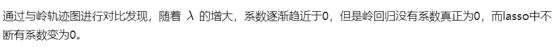

# 七、线性回归

## 1、基本线性回归(LR)

### (1) 算法介绍

线性回归是一种广泛使用的统计学习方法，旨在建立输入变量和输出变量之间的线性关系。它是一种监督学习算法，通常用于预测数值型输出变量。


### (2) 源码分析——线性回归与可视化

使用的数据集格式如下：

```python
1.000000	0.067732	3.176513
1.000000	0.427810	3.816464
1.000000	0.995731	4.550095
1.000000	0.738336	4.256571
1.000000	0.981083	4.560815
1.000000	0.526171	3.929515
1.000000	0.378887	3.526170
```

有两个特征，但第一个特征全为 1，标签为连续型数值。

**程序入口**

```python
# test for standRegression
def regression1():
    xArr, yArr = loadDataSet("./data/data.txt")
    xMat = mat(xArr)
    yMat = mat(yArr)
    ws = standRegres(xArr, yArr)
    fig = plt.figure()
    ax = fig.add_subplot(
        111)  # add_subplot(349)函数的参数的意思是，将画布分成3行4列图像画在从左到右从上到下第9块
    ax.scatter(
        [xMat[:, 1].flatten()],
        [yMat.T[:, 0].flatten().A[0]])  # scatter 的x是xMat中的第二列，y是yMat的第一列
    xCopy = xMat.copy()
    xCopy.sort(0)
    yHat = xCopy * ws
    ax.plot(xCopy[:, 1], yHat)
    plt.show()


if __name__ == "__main__":
    regression1()
```

**加载数据集**

```python
def loadDataSet(fileName):
    """ 加载数据
        解析以tab键分隔的文件中的浮点数
    Returns:
        dataMat :   feature 对应的数据集
        labelMat :  feature 对应的分类标签，即类别标签
    """
    # 获取样本特征的总数，不算最后的目标变量
    numFeat = len(open(fileName).readline().split('\t')) - 1
    dataMat = []
    labelMat = []
    fr = open(fileName)
    for line in fr.readlines():
        # 读取每一行
        lineArr = []
        # 删除一行中以tab分隔的数据前后的空白符号
        curLine = line.strip().split('\t')
        # i 从0到2，不包括2
        for i in range(numFeat):
            # 将数据添加到lineArr List中，每一行数据测试数据组成一个行向量
            lineArr.append(float(curLine[i]))
            # 将测试数据的输入数据部分存储到dataMat 的List中
        dataMat.append(lineArr)
        # 将每一行的最后一个数据，即类别，或者叫目标变量存储到labelMat List中
        labelMat.append(float(curLine[-1]))
    return dataMat, labelMat
```

**线性回归**

```python
def standRegres(xArr, yArr):
    '''
    Description:
        线性回归
    Args:
        xArr : 输入的样本数据，包含每个样本数据的 feature
        yArr : 对应于输入数据的类别标签，也就是每个样本对应的目标变量
    Returns:
        ws: 回归系数
    '''

    # mat()函数将xArr，yArr转换为矩阵 mat().T 代表的是对矩阵进行转置操作
    xMat = mat(xArr)
    yMat = mat(yArr).T
    # 矩阵乘法的条件是左矩阵的列数等于右矩阵的行数
    xTx = xMat.T * xMat
    # 因为要用到xTx的逆矩阵，所以事先需要确定计算得到的xTx是否可逆，条件是矩阵的行列式不为0
    # linalg.det() 函数是用来求得矩阵的行列式的，如果矩阵的行列式为0，则这个矩阵是不可逆的，就无法进行接下来的运算
    if linalg.det(xTx) == 0.0:
        print("This matrix is singular, cannot do inverse")
        return
    # 最小二乘法
    # http://cwiki.apachecn.org/pages/viewpage.action?pageId=5505133
    # 书中的公式，求得w的最优解
    ws = xTx.I * (xMat.T * yMat)
    return ws
```

### (3) sklearn 示例代码

```python
from sklearn.linear_model import LinearRegression
import numpy as np

# 构造数据
X = np.array([[1, 1], [1, 2], [2, 2], [2, 3]])
y = np.dot(X, np.array([1, 2])) + 3

# 初始化线性回归模型
model = LinearRegression()

# 训练模型
model.fit(X, y)

# 预测新的数据
X_test = np.array([[3, 5], [4, 6]])
y_pred = model.predict(X_test)

print(y_pred)  # 输出预测结果
```

## 2、局部加权线性回归(LWLR)

### (1) 算法介绍


### (2) 源码分析

仍然采用和基本线性回归一样的数据集。

**程序入口**

```python
if __name__ == "__main__":
    regression2()
```

```python
def regression2():
    xArr, yArr = loadDataSet("./data/data.txt")
    yHat = lwlrTest(xArr, xArr, yArr, 0.01)
    xMat = mat(xArr)
    srtInd = xMat[:, 1].argsort(
        0)  #argsort()函数是将x中的元素从小到大排列，提取其对应的index(索引)，然后输出
    xSort = xMat[srtInd][:, 0, :]
    fig = plt.figure()
    ax = fig.add_subplot(111)
    ax.plot(xSort[:, 1], yHat[srtInd])
    ax.scatter(
        [xMat[:, 1].flatten().A[0]], [mat(yArr).T.flatten().A[0]],
        s=2,
        c='red')
    plt.show()
```

**局部加权线性回归**

对数据集中的每个点进行预测

```python
def lwlrTest(testArr, xArr, yArr, k=1.0):
    '''
        Description:
            测试局部加权线性回归，对数据集中每个点调用 lwlr() 函数
        Args:
            testArr: 测试所用的所有样本点
            xArr: 样本的特征数据，即 feature
            yArr: 每个样本对应的类别标签，即目标变量
            k: 控制核函数的衰减速率
        Returns:
            yHat: 预测点的估计值
    '''
    # 得到样本点的总数
    m = shape(testArr)[0]
    # 构建一个全部都是 0 的 1 * m 的矩阵
    yHat = zeros(m)
    # 循环所有的数据点，并将lwlr运用于所有的数据点
    for i in range(m):
        yHat[i] = lwlr(testArr[i], xArr, yArr, k)
    # 返回估计值
    return yHat
```

```python
# 局部加权线性回归
def lwlr(testPoint, xArr, yArr, k=1.0):
    '''
        Description:
            局部加权线性回归，在待预测点附近的每个点赋予一定的权重，在子集上基于最小均方差来进行普通的回归。
        Args:
            testPoint: 样本点
            xArr: 样本的特征数据，即 feature
            yArr: 每个样本对应的类别标签，即目标变量
            k:关于赋予权重矩阵的核的一个参数，与权重的衰减速率有关
        Returns:
            testPoint * ws: 数据点与具有权重的系数相乘得到的预测点
        Notes:
            这其中会用到计算权重的公式，w = e^((x^((i))-x) / -2k^2)
            理解: x为某个预测点，x^((i))为样本点，样本点距离预测点越近，贡献的误差越大（权值越大），越远则贡献的误差越小（权值越小）。
            关于预测点的选取，在我的代码中取的是样本点。其中k是带宽参数，控制w（钟形函数）的宽窄程度，类似于高斯函数的标准差。
            算法思路: 假设预测点取样本点中的第i个样本点（共m个样本点），遍历1到m个样本点（含第i个），算出每一个样本点与预测点的距离，
            也就可以计算出每个样本贡献误差的权值，可以看出w是一个有m个元素的向量（写成对角阵形式）。
    '''
    # mat() 函数是将array转换为矩阵的函数， mat().T 是转换为矩阵之后，再进行转置操作
    xMat = mat(xArr)
    yMat = mat(yArr).T
    # 获得xMat矩阵的行数
    m = shape(xMat)[0]
    # eye()返回一个对角线元素为1，其他元素为0的二维数组，创建权重矩阵weights，该矩阵为每个样本点初始化了一个权重
    weights = mat(eye((m)))
    for j in range(m):
        # testPoint 的形式是 一个行向量的形式
        # 计算 testPoint 与输入样本点之间的距离，然后下面计算出每个样本贡献误差的权值
        diffMat = testPoint - xMat[j, :]
        # k控制衰减的速度
        weights[j, j] = exp(diffMat * diffMat.T / (-2.0 * k**2))
    # 根据矩阵乘法计算 xTx ，其中的 weights 矩阵是样本点对应的权重矩阵
    xTx = xMat.T * (weights * xMat)
    if linalg.det(xTx) == 0.0:
        print("This matrix is singular, cannot do inverse")
        return
    # 计算出回归系数的一个估计
    ws = xTx.I * (xMat.T * (weights * yMat))
    return testPoint * ws
```

### (3) 存在问题

对每条记录进行预测时，需要使用数据集中的全部数据，计算量极大。

## 3、岭回归(**Ridge Regression**)


**中心化和标准化**

在回归问题和一些机器学习算法中，通常要对原始数据进行中心化和标准化处理，也就是需要将数据的均值调整到0，标准差调整为1, 计算过程很简单就是将所有数据减去平均值后再除以标准差：


中心化其实就是个平移过程，将所有数据的中心平移到原点。而标准化则是使得所有数据的不同特征都有相同的尺度 Scale, 这样在使用梯度下降法以及其他方法优化的时候不同特征参数的影响程度就会一致了。


### (1) 基本介绍

#### 1. 原理


#### 2. 性质


#### 3. 岭迹图


### (2) 源码分析

**数据集概述**

使用 8 个特征预测鲍鱼年龄，数据集中共 4000 多条数据。


**程序入口**

```python
# test for ridgeRegression
def regression3():
    abX, abY = loadDataSet("./data/abalone.txt")
    ridgeWeights = ridgeTest(abX, abY)
    fig = plt.figure()
    ax = fig.add_subplot(111)
    ax.plot(ridgeWeights)
    plt.show()

if __name__ == "__main__":
    regression3()
```

**岭回归**

选定，分别计算岭回归系数。

```python
def ridgeRegres(xMat, yMat, lam=0.2):
    '''
        Desc:
            这个函数实现了给定 lambda 下的岭回归求解。
            如果数据的特征比样本点还多，就不能再使用上面介绍的的线性回归和局部线性回归了，因为计算 (xTx)^(-1)会出现错误。
            如果特征比样本点还多（n > m），也就是说，输入数据的矩阵x不是满秩矩阵。非满秩矩阵在求逆时会出现问题。
            为了解决这个问题，我们下边讲一下: 岭回归，这是我们要讲的第一种缩减方法。
        Args:
            xMat: 样本的特征数据，即 feature
            yMat: 每个样本对应的类别标签，即目标变量，实际值
            lam: 引入的一个λ值，使得矩阵非奇异
        Returns:
            经过岭回归公式计算得到的回归系数
    '''

    xTx = xMat.T * xMat
    # 岭回归就是在矩阵 xTx 上加一个 λI 从而使得矩阵非奇异，进而能对 xTx + λI 求逆
    denom = xTx + eye(shape(xMat)[1]) * lam
    # 检查行列式是否为零，即矩阵是否可逆，行列式为0的话就不可逆，不为0的话就是可逆。
    if linalg.det(denom) == 0.0:
        print("This matrix is singular, cannot do inverse")
        return
    ws = denom.I * (xMat.T * yMat)
    return ws

def ridgeTest(xArr, yArr):
    '''
        Desc:
            函数 ridgeTest() 用于在一组 λ 上测试结果
        Args:
            xArr: 样本数据的特征，即 feature
            yArr: 样本数据的类别标签，即真实数据
        Returns:
            wMat: 将所有的回归系数输出到一个矩阵并返回
    '''

    xMat = mat(xArr)
    yMat = mat(yArr).T
    # 计算Y的均值
    yMean = mean(yMat, 0)
    # Y的所有的特征减去均值
    yMat = yMat - yMean
    # 标准化 x，计算 xMat 平均值
    xMeans = mean(xMat, 0)
    # 然后计算 X的方差
    xVar = var(xMat, 0)
    # 所有特征都减去各自的均值并除以方差
    xMat = (xMat - xMeans) / xVar
    # 可以在 30 个不同的 lambda 下调用 ridgeRegres() 函数。
    numTestPts = 30
    # 创建30 * m 的全部数据为0 的矩阵
    wMat = zeros((numTestPts, shape(xMat)[1]))
    for i in range(numTestPts):
        # exp() 返回 e^x
        ws = ridgeRegres(xMat, yMat, exp(i - 10))
        wMat[i, :] = ws.T
    return wMat
```

### (3) sklearn 中的岭回归


```python
from sklearn.linear_model import Ridge
from sklearn.model_selection import train_test_split
from sklearn.metrics import mean_squared_error
from sklearn.datasets import load_boston
import numpy as np

# 加载波士顿房价数据集
boston = load_boston()

# 将数据集分为训练集和测试集
X_train, X_test, y_train, y_test = train_test_split(boston.data, boston.target, test_size=0.2, random_state=0)

# 创建一个岭回归模型
ridge = Ridge(alpha=1.0)

# 在训练数据上拟合模型
ridge.fit(X_train, y_train)

# 在测试数据上预测
y_pred = ridge.predict(X_test)

# 计算均方误差
mse = mean_squared_error(y_test, y_pred)
print("Mean squared error: ", mse)
```

## 4、LASSO 方法

### (1) 基本介绍




### (2) sklearn lasso 回归示例代码

```python
from sklearn.linear_model import Lasso
from sklearn.datasets import load_boston
from sklearn.model_selection import train_test_split
from sklearn.metrics import mean_squared_error

# 加载波士顿房价数据集
boston = load_boston()
X, y = boston.data, boston.target

# 将数据集分成训练集和测试集
X_train, X_test, y_train, y_test = train_test_split(X, y, test_size=0.2, random_state=42)

# 创建Lasso回归模型
lasso = Lasso(alpha=0.1)

# 训练模型
lasso.fit(X_train, y_train)

# 对测试集进行预测
y_pred = lasso.predict(X_test)

# 计算均方误差（Mean Squared Error, MSE）
mse = mean_squared_error(y_test, y_pred)
print("均方误差（MSE）：", mse)
```
