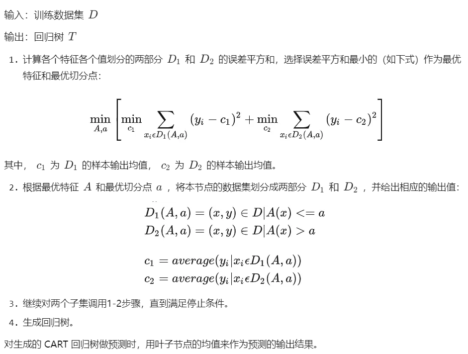
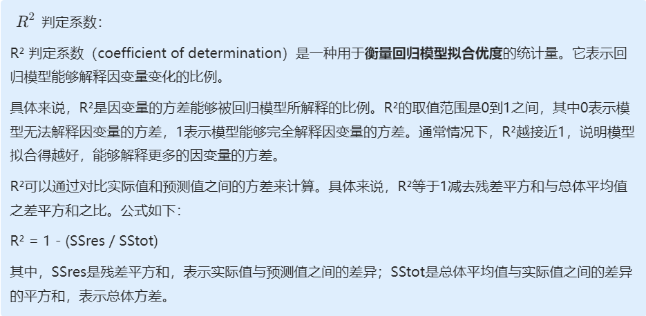

# 八、树回归

## 1、Cart 树

### (1) 算法介绍

树回归是一种机器学习算法，它通过构建决策树来预测连续型变量的值。与分类树不同，树回归的目标是预测一个连续型的输出变量而不是离散型变量。树回归算法通过将特征空间分成若干个子区域，每个子区域拥有不同的输出值，从而构建一个决策树。

树回归算法通常采用递归二分法，将数据集切分成两个子集，在每个子集上递归地建立决策树，直到满足预设的停止条件。每次切分数据集时，树回归算法通过计算每个切分点的**误差平方和**来选择最佳的切分点。

在预测时，树回归算法从根节点开始遍历决策树，根据特征值和切分点的大小关系来选择左子树或右子树，直到到达叶子节点，叶子节点的预测值就是对应子区域的**平均值**。

树回归算法具有良好的可解释性和高效性，同时也能够处理缺失数据和离群点等问题。树回归在许多实际问题中都有很好的应用，比如金融预测、医学诊断和工业质量控制等。

### (2) 算法步骤



### (3) 源码分析

**数据集概述**

只有一个特征，共 200 条数据。

```
0.036098	0.155096
0.993349	1.077553
0.530897	0.893462
0.712386	0.564858
0.343554	-0.371700
0.098016	-0.332760
0.691115	0.834391
```

**程序入口**

```python
if __name__ == "__main__":
    # 回归树
    myDat = loadDataSet('./data/data1.txt')
    myMat = mat(myDat)
    myTree = createTree(myMat)
    print(myTree)
```

**加载数据集**

```python
# 默认解析的数据是用tab分隔，并且是数值类型
def loadDataSet(fileName):
    """loadDataSet(解析每一行，并转化为float类型)
        Desc: 该函数读取一个以 tab 键为分隔符的文件，然后将每行的内容保存成一组浮点数
    Args:
        fileName 文件名
    Returns:
        dataMat 每一行的数据集array类型
    Raises:
    """
    # 假定最后一列是结果值
    # assume last column is target value
    dataMat = []
    fr = open(fileName)
    for line in fr.readlines():
        curLine = line.strip().split('\t')
        # 将所有的元素转化为float类型
        # map all elements to float()
        # map() 函数具体的含义，可见 https://my.oschina.net/zyzzy/blog/115096
        fltLine = list(map(float, curLine))
        # fltLine = map(float, curLine)
        dataMat.append(fltLine)
    return dataMat
```

**创建回归树**

选择一种最好的切分方式，切分完毕后，再分别以左右子树为根创建回归树。

```python
# 假设 dataSet 是 NumPy Mat 类型的，那么我们可以进行 array 过滤
def createTree(dataSet, leafType=regLeaf, errType=regErr, ops=(1, 4)):
    """createTree(获取回归树)
        Description: 递归函数: 如果构建的是回归树，该模型是一个常数，如果是模型树，其模型师一个线性方程。
    Args:
        dataSet      加载的原始数据集
        leafType     建立叶子点的函数
        errType      误差计算函数
        ops=(1, 4)   [容许误差下降值，切分的最少样本数]
    Returns:
        retTree    决策树最后的结果
    """
    # 选择最好的切分方式:  feature索引值，最优切分值
    # choose the best split
    feat, val = chooseBestSplit(dataSet, leafType, errType, ops)
    # if the splitting hit a stop condition return val
    # 如果 splitting 达到一个停止条件，那么返回 val
    '''
    *** 最后的返回结果是最后剩下的 val，也就是len小于topN的集合
    '''
    if feat is None:
        return val
    retTree = {}
    retTree['spInd'] = feat
    retTree['spVal'] = val
    # 大于在右边，小于在左边，分为2个数据集
    lSet, rSet = binSplitDataSet(dataSet, feat, val)
    # 递归的进行调用，在左右子树中继续递归生成树
    retTree['left'] = createTree(lSet, leafType, errType, ops)
    retTree['right'] = createTree(rSet, leafType, errType, ops)
    return retTree
```

**选择最优的切分方式**

参数中的`ops=(1, 4)`是预剪枝的参数，规定了停止划分子树的条件，分别表示**容许误差下降值**和**切分的最少样本数**。叶子结点样本数小于**切分的最少样本数**或误差平方和小于数据集误差平方和-**容许误差下降值**，都无需再进行划分。

以每个特征的所有值为基准划分数据集D，两个子数据集D1,D2误差平方和最小时变为最佳切分方式。

```python
# 1.用最佳方式切分数据集
# 2.生成相应的叶节点
def chooseBestSplit(dataSet, leafType=regLeaf, errType=regErr, ops=(1, 4)):
    """chooseBestSplit(用最佳方式切分数据集 和 生成相应的叶节点)

    Args:
        dataSet   加载的原始数据集
        leafType  建立叶子点的函数
        errType   误差计算函数(求总方差)
        ops       [容许误差下降值，切分的最少样本数]。
    Returns:
        bestIndex feature的index坐标
        bestValue 切分的最优值
    Raises:
    """

    # ops=(1,4)，非常重要，因为它决定了决策树划分停止的threshold值，被称为预剪枝（prepruning），其实也就是用于控制函数的停止时机。
    # 之所以这样说，是因为它防止决策树的过拟合，所以当误差的下降值小于tolS，或划分后的集合size小于tolN时，选择停止继续划分。
    # 最小误差下降值，划分后的误差减小小于这个差值，就不用继续划分
    tolS = ops[0]
    # 划分最小 size 小于，就不继续划分了
    tolN = ops[1]
    # 如果结果集(最后一列为1个变量)，就返回退出
    # .T 对数据集进行转置
    # .tolist()[0] 转化为数组并取第0列
    if len(set(dataSet[:, -1].T.tolist()[0])) == 1: # 如果集合size为1，也就是说全部的数据都是同一个类别，不用继续划分。
        #  exit cond 1
        return None, leafType(dataSet)
    # 计算行列值
    m, n = shape(dataSet)
    # 无分类误差的总方差和
    # the choice of the best feature is driven by Reduction in RSS error from mean
    S = errType(dataSet)
    # inf 正无穷大
    bestS, bestIndex, bestValue = inf, 0, 0
    # 循环处理每一列对应的feature值
    for featIndex in range(n-1): # 对于每个特征
        # [0]表示这一列的[所有行]，不要[0]就是一个array[[所有行]]，下面的一行表示的是将某一列全部的数据转换为行，然后设置为list形式
        for splitVal in set(dataSet[:, featIndex].T.tolist()[0]):
            # 对该列进行分组，然后组内的成员的val值进行 二元切分
            mat0, mat1 = binSplitDataSet(dataSet, featIndex, splitVal)
            # 判断二元切分的方式的元素数量是否符合预期
            if (shape(mat0)[0] < tolN) or (shape(mat1)[0] < tolN):
                continue
            newS = errType(mat0) + errType(mat1)
            # 如果二元切分，算出来的误差在可接受范围内，那么就记录切分点，并记录最小误差
            # 如果划分后误差小于 bestS，则说明找到了新的bestS
            if newS < bestS:
                bestIndex = featIndex
                bestValue = splitVal
                bestS = newS
    # 判断二元切分的方式的元素误差是否符合预期
    # if the decrease (S-bestS) is less than a threshold don't do the split
    if (S - bestS) < tolS:
        return None, leafType(dataSet)
    mat0, mat1 = binSplitDataSet(dataSet, bestIndex, bestValue)
    # 对整体的成员进行判断，是否符合预期
    # 如果集合的 size 小于 tolN
    if (shape(mat0)[0] < tolN) or (shape(mat1)[0] < tolN): # 当最佳划分后，集合过小，也不划分，产生叶节点
        return None, leafType(dataSet)
    return bestIndex, bestValue
```

**数据集误差平方和计算**

方差=误差平方和/样本数

```python
def regErr(dataSet):
    # shape(dataSet)[0] 表示行数
    return var(dataSet[:, -1]) * shape(dataSet)[0]
```

**返回叶子结点的值**

```python
# 返回每一个叶子结点的均值
# returns the value used for each leaf
# 我的理解是: regLeaf 是产生叶节点的函数，就是求均值，即用聚类中心点来代表这类数据
def regLeaf(dataSet):
    return mean(dataSet[:, -1])
```

### (4) sklearn cart 树示例代码

在 scikit-learn 中使用 CART 回归树模型，可以调整的参数包括：

1. **criterion**：衡量分裂质量的评价标准，可选的值有"gini"和"entropy"，默认值是"gini"。
2. **splitter**：决定分裂节点的策略，可选的值有"best"和"random"，默认值是"best"。
3. **max_depth**：决策树的最大深度，如果不设置则不限制深度。
4. **min_samples_split**：分裂一个内部节点需要的最小样本数，如果某个节点的样本数少于这个值，则不会再分裂。
5. **min_samples_leaf**：一个叶子节点所需的最小样本数，如果某个叶子节点的样本数少于这个值，则会和兄弟节点一起被剪枝。
6. **min_weight_fraction_leaf**：一个叶子节点所需的最小加权样本数的总和的比例。
7. **max_features**：在分裂节点时考虑的特征数量，可选的值有"auto"、"sqrt"、"log2"和None，可以设置为整数来表示考虑的特征数量。
8. **random_state**：控制随机性的种子值，用于重现结果。

```python
from sklearn.datasets import load_diabetes
from sklearn.tree import DecisionTreeRegressor
from sklearn.model_selection import train_test_split
from sklearn.metrics import mean_squared_error

# 加载糖尿病数据集
diabetes = load_diabetes()
X, y = diabetes.data, diabetes.target

# 划分训练集和测试集
X_train, X_test, y_train, y_test = train_test_split(X, y, test_size=0.2, random_state=42)

# 训练CART回归树模型
model = DecisionTreeRegressor(random_state=42)
model.fit(X_train, y_train)

# 在测试集上进行预测并评估模型性能
y_pred = model.predict(X_test)
mse = mean_squared_error(y_test, y_pred)
print("Mean Squared Error: {:.2f}".format(mse))
```

## 2、树剪枝

### (1) 基本介绍

树剪枝是一种用于决策树模型的优化技术，旨在减少模型的复杂度并提高模型的泛化能力。在决策树模型中，剪枝是通过去除树的一部分（即分支或叶子节点）来实现的，以达到减少模型复杂度的目的。

决策树模型在拟合训练数据时容易出现过拟合的情况，这时候模型可能过于复杂，过多地捕捉到噪声和随机性，并且不能很好地推广到新的数据集上。树剪枝的目的是缓解过拟合，以提高模型的泛化能力。

树剪枝可以分为预剪枝和后剪枝两种类型：

1. 预剪枝：在决策树的生长过程中，在某些条件满足时提前停止树的分裂，从而避免过拟合。这些条件可能包括节点的深度、最小样本数、最小信息增益等。上述源码中根据**容许误差下降值**和**切分的最少样本数**停止分裂就是预剪枝。
2. 后剪枝：在决策树生成完毕之后，通过从树的叶子节点开始删除一些节点（即子树），并将其父节点转换为叶子节点来缩小树的规模，从而提高模型泛化能力。具体来说，后剪枝是在验证集上评估子树的泛化性能，选择最佳子树并将其剪枝。

树剪枝是一种很有用的技术，可以在一定程度上避免决策树模型的过拟合问题，提高模型的泛化能力。但是，树剪枝需要调整一些参数，比如最小样本数、最小信息增益等，因此需要对数据集和模型进行细致的调试和优化。

### (2) 后剪枝

后剪枝技术是树剪枝的一种类型，它是一种减少决策树复杂度的优化方法，能够提高决策树的泛化性能。与预剪枝不同，后剪枝是在决策树生成完毕之后进行的。

后剪枝的基本思想是先构建一颗完整的决策树，然后利用验证集数据对树进行剪枝。剪枝的过程是从叶子节点开始，不断地将某个子树替换为一个叶子节点，直到剪枝后的树在验证集上的泛化误差不再提高。在剪枝过程中，通过对比剪枝前后的验证集误差来确定哪些子树应该被剪掉，剩下的子树形成最终的简化决策树。

后剪枝过程的具体步骤如下：

1. 从叶子节点开始向上回缩，对每个节点进行以下操作：

- 将该节点及其所有子节点作为一颗子树，计算这个子树在验证集上的误差。
- 计算将该节点替换为叶子节点后在验证集上的误差。
- 如果替换后的误差比原来的误差更小，则将该节点替换为叶子节点。

2. 不断重复步骤1，直到无法再进行剪枝为止，形成最终的简化决策树。

后剪枝技术可以有效地避免过拟合问题，提高决策树模型的泛化性能。它的优点在于生成的树可以完全利用训练集数据，并且不需要提前设置参数，但是需要独立的验证集数据用于剪枝。需要注意的是，在决策树剪枝时，应该避免将过多的子树剪掉，否则可能会导致欠拟合问题。

### (3) 源码分析

**程序入口**

```python
if __name__ == "__main__":
	# 回归树
    myDat = loadDataSet('./data/data1.txt')
    # myDat = loadDataSet('data/9.RegTrees/data2.txt')
    # print 'myDat=', myDat
    myMat = mat(myDat)
    # print 'myMat=',  myMat
    myTree = createTree(myMat)
    print(myTree)

    # # 2. 后剪枝就是: 通过测试数据，对预测模型进行合并判断
    myDatTest = loadDataSet('./data/data3test.txt')
    myMat2Test = mat(myDatTest)
    myFinalTree = prune(myTree, myMat2Test)
    print('\n\n\n-------------------')
    print(myFinalTree)
```

**剪枝**

按照回归树划分测试数据集，若两个叶子结点误差平方和 > 合并为一个叶子结点的误差平方和，就进行合并(剪枝)。

```python
# 检查是否适合合并分枝
def prune(tree, testData):
    """
    Desc:
        从上而下找到叶节点，用测试数据集来判断将这些叶节点合并是否能降低测试误差
    Args:
        tree -- 待剪枝的树
        testData -- 剪枝所需要的测试数据 testData
    Returns:
        tree -- 剪枝完成的树
    """
    # 判断是否测试数据集没有数据，如果没有，就直接返回tree本身的均值
    if shape(testData)[0] == 0:
        return getMean(tree)

    # 判断分枝是否是dict字典，如果是就将测试数据集进行切分
    if (isTree(tree['right']) or isTree(tree['left'])):
        lSet, rSet = binSplitDataSet(testData, tree['spInd'], tree['spVal'])
    # 如果是左边分枝是字典，就传入左边的数据集和左边的分枝，进行递归
    if isTree(tree['left']):
        tree['left'] = prune(tree['left'], lSet)
    # 如果是右边分枝是字典，就传入左边的数据集和左边的分枝，进行递归
    if isTree(tree['right']):
        tree['right'] = prune(tree['right'], rSet)

    # 上面的一系列操作本质上就是将测试数据集按照训练完成的树拆分好，对应的值放到对应的节点

    # 如果左右两边同时都不是dict字典，也就是左右两边都是叶节点，而不是子树了，那么分割测试数据集。
    # 1. 如果正确
    #   * 那么计算一下总方差 和 该结果集的本身不分枝的总方差比较
    #   * 如果 合并的总方差 < 不合并的总方差，那么就进行合并
    # 注意返回的结果:  如果可以合并，原来的dict就变为了 数值
    if not isTree(tree['left']) and not isTree(tree['right']):
        lSet, rSet = binSplitDataSet(testData, tree['spInd'], tree['spVal'])
        # power(x, y)表示x的y次方；这时tree['left']和tree['right']都是具体数值
        errorNoMerge = sum(power(lSet[:, -1] - tree['left'], 2)) + sum(power(rSet[:, -1] - tree['right'], 2))
        treeMean = (tree['left'] + tree['right'])/2.0
        errorMerge = sum(power(testData[:, -1] - treeMean, 2))
        # 如果 合并的总方差 < 不合并的总方差，那么就进行合并
        if errorMerge < errorNoMerge:
            print("merging")
            return treeMean
        # 两个return可以简化成一个
        else:
            return tree
    else:
        return tree
```

## 3、模型树

### (1) 基本介绍

模型树是一种集成学习方法，它结合了决策树和线性回归模型。在模型树中，每个叶节点都对应一个线性回归模型，而每个非叶节点都对应一个特征和阈值，用于将样本划分到子树中。

模型树可以看作是一种特殊的回归树，其中每个叶节点都包含一个线性回归模型。与普通的回归树相比，模型树可以更好地拟合非线性关系，并且具有更好的可解释性。由于模型树可以自动选择特征并且使用线性回归模型进行预测，因此它可以处理具有大量特征的数据集，并且可以在不需要特征选择的情况下进行预测。

在构建模型树时，通常使用递归二分法对数据集进行划分，并在每个叶节点上训练一个线性回归模型。预测时，输入数据被传递到根节点，然后根据特征和阈值将数据划分到子树中，并在叶节点上应用相应的线性回归模型进行预测。

总之，模型树是一种强大的集成学习方法，它可以更好地拟合非线性关系，并且具有更好的可解释性和灵活性。

### (2) 源码分析

模型树代码和上述 Cart 树代码几乎完全相同，不同点在于**误差的计算方式**和**叶节点值预测方式**。

**误差计算**

对数据集进行线性拟合，误差值是预测值与实际值差值的平方和。

```python
# 计算线性模型的误差值
def modelErr(dataSet):
    """
    Desc:
        在给定数据集上计算误差。
    Args:
        dataSet -- 输入数据集
    Returns:
        调用 linearSolve 函数，返回 yHat 和 Y 之间的平方误差。
    """
    ws, X, Y = linearSolve(dataSet)
    yHat = X * ws
    # print corrcoef(yHat, Y, rowvar=0)
    return sum(power(Y - yHat, 2))
```

```python
 # helper function used in two places
def linearSolve(dataSet):
    """
    Desc:
        将数据集格式化成目标变量Y和自变量X，执行简单的线性回归，得到ws
    Args:
        dataSet -- 输入数据
    Returns:
        ws -- 执行线性回归的回归系数
        X -- 格式化自变量X
        Y -- 格式化目标变量Y
    """
    m, n = shape(dataSet)
    # 产生一个关于1的矩阵
    X = mat(ones((m, n)))
    Y = mat(ones((m, 1)))
    # X的0列为1，常数项，用于计算平衡误差
    X[:, 1: n] = dataSet[:, 0: n-1]
    Y = dataSet[:, -1]

    # 转置矩阵*矩阵
    xTx = X.T * X
    # 如果矩阵的逆不存在，会造成程序异常
    if linalg.det(xTx) == 0.0:
        raise NameError('This matrix is singular, cannot do inverse,\ntry increasing the second value of ops')
    # 最小二乘法求最优解:  w0*1+w1*x1=y
    ws = xTx.I * (X.T * Y)
    return ws, X, Y
```

**叶节点值预测方式**

拟合叶节点数据称为线性模型进行预测。

```python
def modelLeaf(dataSet):
    """
    Desc:
        当数据不再需要切分的时候，生成叶节点的模型。
    Args:
        dataSet -- 输入数据集
    Returns:
        调用 linearSolve 函数，返回得到的 回归系数ws
    """
    ws, X, Y = linearSolve(dataSet)
    return ws
```


